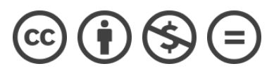

# コードで学ぶAWS入門 (Learn AWS by Coding)

🚀🚀AWS の入門者向けの教科書を公開しています🚀🚀

- テキスト(HTML版)は [こちら](https://tomomano.gitlab.io/intro-aws/)
- テキスト(PDF版)は [こちら](https://tomomano.gitlab.io/intro-aws/main.pdf)
- ハンズオンで使用するプログラム => [handson/](handson/)

2020年に公開した最初のバージョンは [こちら](https://tomomano.gitlab.io/intro-aws/)
([GitLab source](https://gitlab.com/tomomano/intro-aws))

## 更新履歴

## ライセンス

本教科書およびハンズオンのソースコードは [CC BY-NC-ND 4.0](https://creativecommons.org/licenses/by-nc-nd/4.0/) に従うライセンスで公開しています．

教育など非商用の目的での本教科書の使用や再配布は自由に行うことが可能です．
商用目的で本書の全体またはその一部を無断で転載・販売する行為は，これを固く禁じます．

