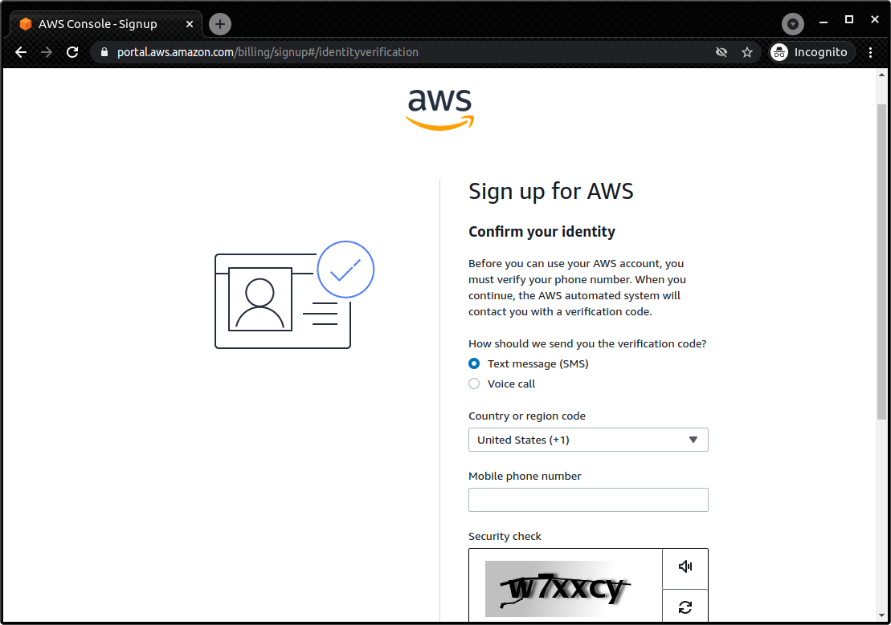
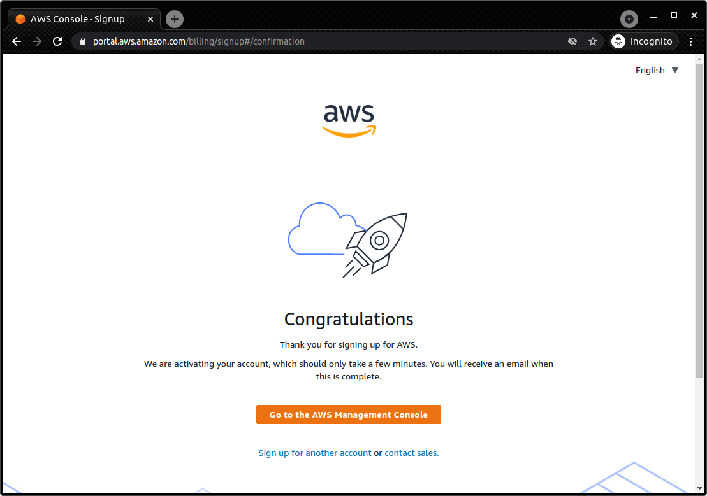

[[sec:appendix_settingup]]
== Appendix: Environment setup

To read through this book, you need to set up an environment on your local machine to run the hands-on programs.
Assuming that you are a beginner in AWS and the command line, this chapter will briefly explain how to install the necessary software and libraries.
A brief table of contents is shown below.
If you have already built your environment, you need to read through only the relevant parts.

* Creating an AWS account (<<sec:create_aws_account>>)
* Creating AWS access key (<<aws_secrets>>)
* Installing AWS CLI (<<aws_cli_install>>)
* Installing AWS CDK (<<aws_cdk_install>>)
* Installing WSL (<<sec:install_wsl>>)
* Installing Docker (<<sec:install_docker>>)
* Quick tutorial on Python venv (<<venv_quick_guide>>)
* Working with Docker image for the hands-on exercises (<<sec_handson_docker>>)

The OS can be Linux, Mac, or Windows.
Windows users are assumed to use Windows Subsytem for Linux (WSL) (<<sec:install_wsl>>).

You can also use the
https://hub.docker.com/repository/docker/tomomano/labc[Docker image]
to run the hands-on programs in this book.
This will be useful for readers who know how to use Docker, as it allows them to skip AWS CLI/CDK and Python installation.

[[sec:create_aws_account]]
=== Creating an AWS account

In order to try the hands-on exercises provided in this book, you need to create your own AWS account.
Detailed instructions for creating an account can be found at
https://aws.amazon.com/premiumsupport/knowledge-center/create-and-activate-aws-account/[official documentation],
so please refer to that as well.
Follow the steps below to create an account.

First, access https://aws.amazon.com/console/[AWS Management Console] from your web browser, and click `Create an AWS Account` in the upper right corner.
(<<fig:aws-signup-1>>, boxed with a solid line).

[[fig:aws-signup-1]]
.Sign up (1) - Accessing AWS Management Console
image::imgs/signup-1.png[signup-1, 500, align="center"]

Then, you will be taken to a page where you register your email address and password (<<fig:aws-signup-3>>).

[[fig:aws-signup-3]]
.Sign up (2): Register email and password
image::imgs/signup-3.png[signup-3, 500, align="center"]

Next, you will be asked to enter your address, phone number, and other information (<<fig:aws-signup-4>>).

[[fig:aws-signup-4]]
.Sign up (3): Entering address and phone number
image::imgs/signup-4.png[signup-4, 500, align="center"]

Next, you will be asked to register your credit card information (<<fig:aws-signup-5>>).
If you are using AWS as an individual, you will be billed for your usage via your credit card.
Note that you cannot start using AWS without registering your credit card information.

[[fig:aws-signup-5]]
.Sign up (4): Registering a credit card
image::imgs/signup-5.png[signup-5, 500, align="center"]

On the next page, you will be asked to verify your identity using SMS or voice message on your cell phone (<<fig:aws-signup-6>>).
Select your preferred authentication method and enter your cell phone number.

[[fig:aws-signup-6]]
.Sign up (5): Identify verification by cell phone

After successfully verifying your identity, you will be asked to select a support plan (<<fig:aws-signup-8>>).
You can just select the Basic support plan, which is free.

[[fig:aws-signup-8]]
.Sign up (6): Selecting a support plan
image::imgs/signup-8.png[signup-8, 500, align="center"]

These steps will complete the creation of your account (<<fig:aws-signup-9>>).
Let's log in and see if we can access the AWS console.

[[fig:aws-signup-9]]
.Sign up (7): Sign up is complete!

[[aws_secrets]]
=== Creating AWS access key

AWS access key is a key used for user authentication when operating the AWS API from the AWS CLI or AWS CDK.
To use the AWS CLI/CDK, you need to issue a secret key first.
For more information on AWS secret keys, please refer to
https://docs.aws.amazon.com/general/latest/gr/aws-sec-cred-types.html[the official documentation "Understanding and getting your AWS credentials"].

. First, log in to your AWS console
. Then, click on your account name in the upper right corner of the screen, and select "My Security Credentials" from the pull-down menu (<<fig:aws_secret_key_1>>)
. Under "Access keys for CLI, SDK, & API access", find the button that says "Create accesss key" and click it (<<fig:aws_secret_key_2>>)
. Record the displayed access key ID and secret access key (if you close the window, they will not be displayed again)
. If you forget your key, you can reissue it by the same procedure
. Use the issued secret key by writing it to the file `~/.aws/credentials` or by setting it to an environment variable (also see <<aws_cli_install>>)

[[fig:aws_secret_key_1]]
.Creating an AWS secret key (1)
image::imgs/aws_secret_key_1.png[aws_secret_key_1, 400, align="center"]

[[fig:aws_secret_key_2]]
.Creating an AWS secret key (2)
image::imgs/aws_secret_key_2.png[aws_secret_key_2, 700, align="center"]

[[aws_cli_install]]
=== Installing AWS CLI

This is a brief description of the installation procedure for Linux at the time of writing.
Please remember to always check
https://docs.aws.amazon.com/cli/latest/userguide/install-cliv2.html[official documentation]
for the latest information, as it may change in future versions.

Installation of AWS CLI version 2 can be done by downloading and executing the installation script:

[source, bash]
----
$ curl "https://awscli.amazonaws.com/awscli-exe-linux-x86_64.zip" -o "awscliv2.zip"
$ unzip awscliv2.zip
$ sudo ./aws/install
----

To confirm that the installation is successful, type the following command to see if the version information is displayed.

[source, bash]
----
$ aws --version
----

Once the installation is complete, run the following command to finish the initial set up (also see https://docs.aws.amazon.com/cli/latest/userguide/cli-chap-configure.html[official documentation "Configuring the AWS CLI"]).

[source, bash]
----
$ aws configure
----

When you execute this command, you will be prompted to enter the `AWS Access Key ID` and `AWS Secret Access Key`.
See <<aws_secrets>> for issuing access keys.
The command also asks for the `Default region name`.
You can specify your favorite region (e.g. `ap-northeast-1` = Tokyo) here.
The last entry, `Default output format`, should be `json`.

After completing this command, you should see files named `~/.aws/credentials` and `~/.aws/config`, where the relevant information is stored.
To be sure, you can use the `cat` command to check the contents.

[source, bash]
----
$ cat ~/.aws/credentials
[default]
aws_access_key_id = XXXXXXXXXXXXXXXXXX
aws_secret_access_key = YYYYYYYYYYYYYYYYYYY

$ cat ~/.aws/config
[profile default]
region = ap-northeast-1
output = json
----

Authentication key information is stored in `~/.aws/credentials`, and AWS CLI settings are stored in `~/.aws/config`.

By default, a profile is saved with the name `[default]`.
If you want to use several different profiles, follow the default example and add a profile with your favorite name.

In order to swtich your profile when executing AWS CLI commands, add `--profile` parameter:

[source, bash]
----
$ aws s3 ls --profile myprofile
----

If you find that adding `--profile` each time you run a command is tedious, you can set the environemntal variable named `AWS_PROFILE`.

[source, bash]
----
$ export AWS_PROFILE=myprofile
----

Or, you can set the access key information in the environmental variables.

[source, bash]
----
export AWS_ACCESS_KEY_ID=XXXXXX
export AWS_SECRET_ACCESS_KEY=YYYYYY
export AWS_DEFAULT_REGION=ap-northeast-1
----

These environmental variables have higher priority than the profiles defined in `~/.aws/credentials`, so the profie defined by environemtal variables are used (see also
https://docs.aws.amazon.com/cli/latest/userguide/cli-chap-configure.html[official documentation "Configuring the AWS CLI"]).

[[aws_cdk_install]]
=== Installing AWS CDK

This is a brief description of the installation procedure for Linux at the time of writing.
Please remember to always check
https://docs.aws.amazon.com/cdk/latest/guide/getting_started.html[official documentation]
for the latest information, as it may change in future versions.

If you have Node.js installed, you can install AWS CDK by the following command:

[source, bash]
----
$ sudo npm install -g aws-cdk
----

[NOTE]
====
The hands-on exercises were developed with AWS CDK version 1.100.
Since CDK is a library under active development, the API may change in the future.
If errors occur due to API changes, it is recommended to use version 1.100.0.

[source, bash]
----
$ npm install -g aws-cdk@1.100
----
====

To confirm that the installation is successful, type the following command to see if the version information is displayed.

[source, bash]
----
$ cdk --version
----

Once the installation is complete, run the following command to finish the initial set up:

[source, bash]
----
$ cdk bootstrap
----

[NOTE]
====
When you run `cdk bootstrap`, make sure that your AWS credentials and region are set correctly.
By default, the default profile in `~/.aws/config` is used.
If you want to use a profile other than the default, use the technique described in <<aws_cli_install>> to switch profiles.
====

[NOTE]
====
The configuration of AWS credentials for CDK is basically the same as that of AWS CLI.
See <<aws_cli_install>> for details.
====

[[sec:install_wsl]]
=== Installing WSL

In this book, the commands are basically written with a UNIX terminal in mind.
Linux and Mac users can use the terminal that comes standard with their OS.
If you are using Windows, we recommend that you use
https://docs.microsoft.com/en-us/windows/wsl/[Windows Subsystem for Linux (WSL)]
to create a virtual Linux environment.
Other tools that emulate the Linux environment, such as
https://www.cygwin.com/[Cygwin],
are also acceptable, but the programs in this book have been tested only on WSL.

WSL is software officially provided by Microsoft to run a Linux virtual environment on a Windows OS.
You can select the Linux distribution you want, such as Ubuntu, and use basically all programs and software made for Linux.

At the time of writing,
https://docs.microsoft.com/en-us/windows/wsl/compare-versions#whats-new-in-wsl-2[WSL 2]
is the latest release.
In the following, we will explain the steps to install WSL 2.
For more details, also refer to the
https://docs.microsoft.com/en-us/windows/wsl/install-win10[official documentation].

As a prerequisite, the OS must be Windows 10 (Pro or Home edition).
Furthermore, make sure that the version of Windows 10 you are using supports WSL.
For X64 systems, it must be Version 1903, Build 18362 or higher.
If the version does not support WSL, update Windows first.

First, start PowerShell with administrator privileges (<<fig:powershell>>).
To do this, type `powershell` in the search bar of the Windows menu in the lower left corner, and you should find the PowerShell program.
Then, right-click on it, and select `Run as administrator` to launch.

[[fig:powershell]]
.Starting PowerShell with administrator privileges
image::imgs/wsl/powershell.png[powershell, 500, align="center"]

Once the PowerShell is ready, execute the following command:

[source, bash]
----
dism.exe /online /enable-feature /featurename:Microsoft-Windows-Subsystem-Linux /all /norestart
----

After the execution, make sure that the command outputs the line `“The operation completed successfully”`.
Now WSL is enabled on your Windows.

Next, using the same PowerShell started with administrator privileges, execute the following command:

[source, bash]
----
dism.exe /online /enable-feature /featurename:VirtualMachinePlatform /all /norestart
----

After the execution, make sure that the command outputs the line `“The operation completed successfully”`.
Once this is done, restart your computer.

Next, download **Linux kernel update package** from the following link:
https://wslstorestorage.blob.core.windows.net/wslblob/wsl_update_x64.msi

Double-click on the downloaded file to run it.
Follow the dialog to complete the installation.

After that, come back to PowerShell and run the following command:

[source, bash]
----
wsl --set-default-version 2
----

Lastly, install the Linux distribution of your choice.
In this tutorial, let's install **Ubuntu 20.04**.

Launch the Microsoft Store app and type `Ubuntu` in the search bar.
Open Ubuntu 20.04 LTS and click the "Get" button (<<fig:microsoft_store>>).
Wait for a while, and the installation of Ubuntu 20.04 will be completed.

[[fig:microsoft_store]]
.Installing Ubuntu 20.04 from Microsoft Store
image::imgs/wsl/microsoft_store.png[microsoft_store, 500, align="center"]

The first time you start Ubuntu 20.04, the initial setup will start automatically and you will have to wait for a few minutes.
After the initial setup, you will be prompted to enter your user name and password.

This completes the installation of WSL2.
Let's launch WSL2!
Type `Ubuntu` in the search bar of the Windows menu in the lower left corner, and you should find Ubuntu 20.04 (<<fig:ubuntu>>).
Click on it to start it.

[[fig:ubuntu]]
.Launching Ubuntu 20.04
image::imgs/wsl/ubuntu2004.png[ubuntu2004, 500, align="center"]

This should bring up a black terminal screen (<<fig:wsl_window>>).
Try typing `ls`, `top`, etc. to confirm that WSL is working properly.

[[fig:wsl_window]]
.WSL terminal
image::imgs/wsl/wsl_window.png[wsl_window, 500, align="center"]

Optionally, you can install
https://docs.microsoft.com/en-us/windows/terminal/get-started[Windows Terminal].
Windows Terminal is a tool provided by Microsoft, which gives you more functional and comfortable interface to work with WSL.
We recommend that you to install this tool.

[[sec:install_docker]]
=== Installing Docker

The installation method of Docker varies depending on the OS.

Mac users should install Docker Desktop.
All you need do is to download Docker Desktop for Mac from
https://docs.docker.com/docker-for-mac/install/[Docker's website],
double-click the downloaded file, and then drag it to the `Applications` folder.
For more information, see
https://docs.docker.com/docker-for-mac/install/[official documentation].

Windows users should install Docker Desktop.
WSL 2 must be installed in your machine prior to installing Docker Desktop.
See
https://docs.docker.com/desktop/windows/install/[official documentation]
for more information.
After installing Docker Desktop, you can use the `docker` command from WSL.

For Linux users (especially Ubuntu users), there are several approaches to installation.
For more information, please refer to
https://docs.docker.com/engine/install/ubuntu/[official documentation].
The simplest approach is to use the official Docker installation script.
In this case, the following command will install Docker.

[source, bash]
----
$ curl -fsSL https://get.docker.com -o get-docker.sh
$ sudo sh get-docker.sh
----

In the default installation, only the root user is allowed to use the `docker` command.
Therefore, you need to add `sudo` to the command every time.
If you find this cumbersome, follow these steps to add the user you are working with to the `docker` group
(For more information see 
https://docs.docker.com/engine/install/linux-postinstall/#manage-docker-as-a-non-root-user[official documentation "Post-installation steps for Linux"]).

The first step is to add a group named `docker`.
Depending on your installation, the `docker` group may already be created.

[source, bash]
----
$ sudo groupadd docker
----

Next, add the user you are currently using to the `docker` group.

[source, bash]
----
$ sudo usermod -aG docker $USER
----

Once this is done, log out and log back in.
The changes to the group will be reflected in your terminal session.

To check if the settings are correct, run the following command.

[source, bash]
----
$ docker run hello-world
----

If you can run the container withoug adding `sudo`, the setting is complete.

[[venv_quick_guide]]
=== Quick tutorial on Python `venv`

Many of you may have experienced a situation where a program given to you by someone else does not work because of the library version mismatch.
If you have only one Python environment in your machine, you will have to re-install the correct version every time you switch projects.
This is a lot of work!

To make code sharing smoother, library versions should be managed on a project-by-project basis.
This is made possible by tools called **Python virtual environments**.
Programs such as
https://docs.python.org/3/tutorial/venv.html[venv],
https://github.com/pyenv/pyenv[pyenv],
and
https://docs.conda.io/en/latest/[conda]
are often used for this purpose.

Among them,  `venv` is very useful because it is included in Python as a standard feature.
Tools like `pyenv` and `conda` require separate installation, but they have their own advantages.

To create a new virtual environment using `venv`, you run the following command.

[source, bash]
----
$ python -m venv .env
----

This command will create a directory `.env/` in which the libraries for this virtual environment will be saved.

To activate this new virtual environment, you run the following command.

[source, bash]
----
$ source .env/bin/activate
----

Notice that the shell prompt starts with `(.env)` (<<fig_venv_prompt>>).
This is a sign that signifies, "You are now in a venv".

[[fig_venv_prompt]]
.Shell prompt after activating venv
image::imgs/venv_shell.png[venv shell, 500, align="center"]

When the virtual Python environment is activated, all subsequent `pip` commands will install libraries under `.env/` directory.
In this way, you can separate the version of the library used for each project.

In Python, it is common practice to describe the dependent libraries in a file called `requirements.txt`.
If a project you are workin on has a `requirements.txt` file defined, you can use the following command to install dependent libraries and reproduce the Python environment.

[source, bash]
----
$ pip install -r requirements.txt
----

[NOTE]
====
You can give arbitrary name to the directory where the virtual environment is saved by `venv`, but the name `.env` is commonly used.
====

[[sec_handson_docker]]
=== Working with Docker image for the hands-on exercise

We prepared a Docker image with Node.js, Python, AWS CDK, etc. installed, which is necessary to run the hands-on exercises.
Using this image, you can run the hands-on code immediately without having to install anything on your local machine.

[WARNING]
====
Some of the commands in the hands-on must be executed outside of Docker (i.e. in the real environment on your local machine).
These are described as notes in the corresponding part of the hands-on.
====

Docker image is provided at
https://hub.docker.com/repository/docker/tomomano/labc[the author's Docker Hub repository]．
The build file for the Docker image is available at
https://github.com/tomomano/learn-aws-by-coding-source-code/blob/main/docker/Dockerfile[GitHub].

Use the following command to launch the container.

[source, bash]
----
$ docker run -it tomomano/labc:latest
----

The first time you run the command, the image will be downloaded (pulled) from Docker Hub.
From the second time onward, the locally downloaded image will be used.

When the container is started, you should see an interactive shell like the following (note the `-it` option at startup).

[source]
----
root@aws-handson:~$
----

In the container shell, if you type the `ls` command, you should find a directory `handson/`.
Now you move to this directory.

[souce, bash]
----
$ cd handson
----

You will find a directory for each hands-on.
Then, you can move the directory for each exercise, create a Python virtual environment, and deploy the stack (see <<sec_handson_ec2_run>>, etc.).
Since each hands-on uses different dependent libraries, the design is to create a virtualenv for each hands-on.

Don't forget to set your AWS credentials.
An easy way to do this is to set environment variables such as `AWS_ACCESS_KEY_ID` as described in <<aws_cli_install>>.
Alternatively, if your credentials are stored in local machine's `~/.aws/credentials`, you can **mount** this directory in the container and refer to the same credentials file from inside the container.
If you take this option, start the container with the following command.

[source, bash]
----
$ docker run -it -v ~/.aws:/root/.aws:ro tomomano/labc:latest
----

This allows you to mount `~/.aws` on the local machine to `/root/.aws` in the container.
The `:ro` at the end means read-only.
It is recommended to add the read-only flag to prevent accidental rewriting of important authentication files.

[TIP]
====
`/root/` is the home directory in the container environment.
The technique of mounting the authentication file described here can also be used when passing SSH keys to the container.
====

