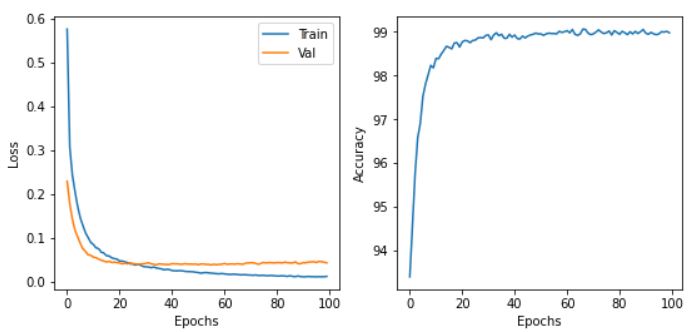
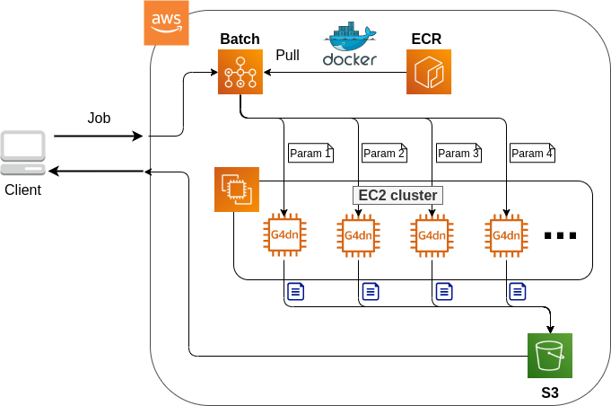
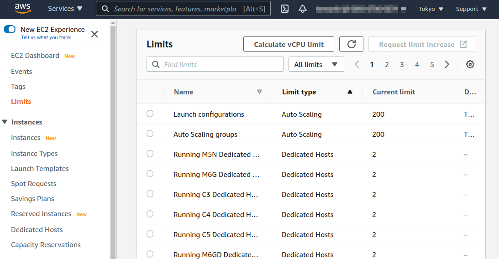
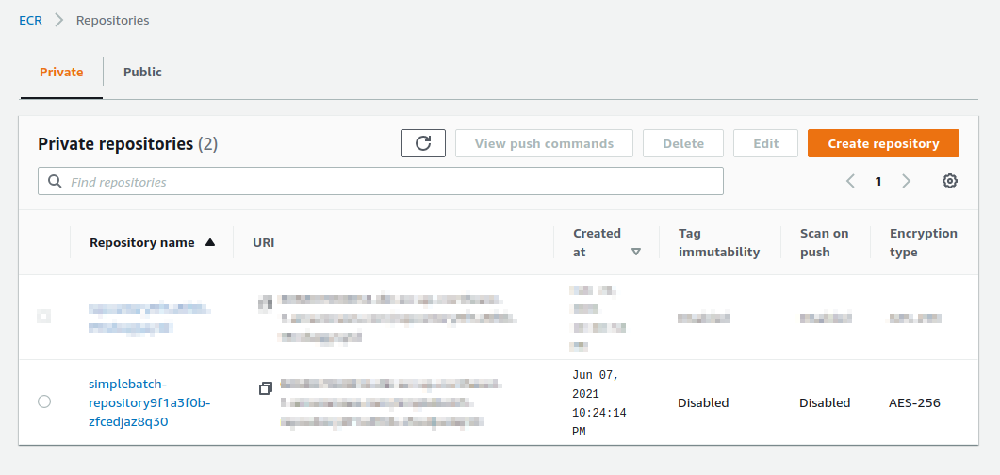
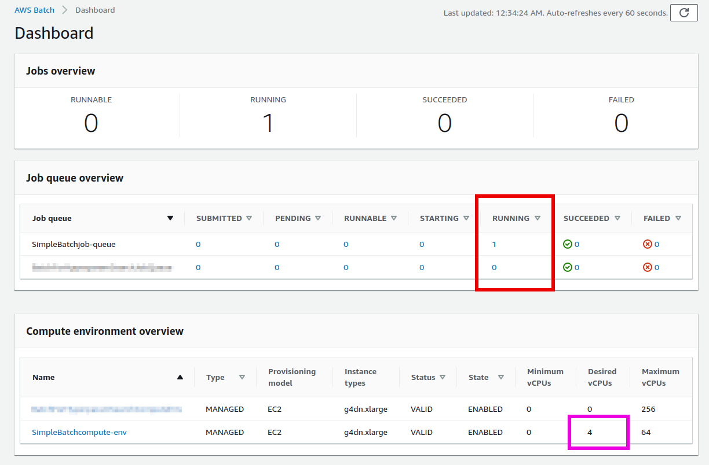
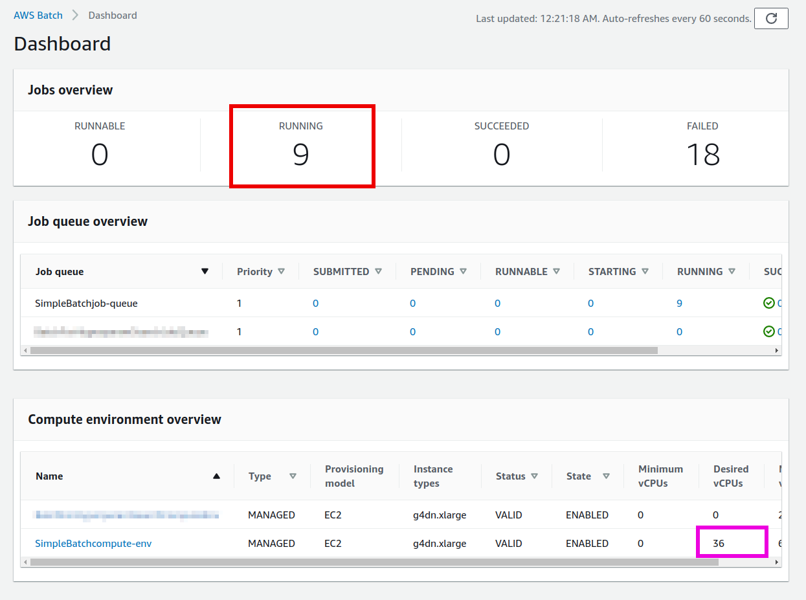

[[sec_aws_batch]]
== Hands-on #4: Using AWS Batch to Parallelize Hyperparameter Search for Machine Learning

In the third hands-on session, we built an automatic question answering system using ECS and Fargate.
Despite its simplicity, we were able to build a system where jobs are executed in parallel when multiple questions are sent.
There, we built the application using a pre-tained language model.
Generally speaking, however, the first step in a machine learning workflow should be to train your own models.
Therefore, in the fourth hands-on session, we will consider parallelizing and accelerating the training of machine learning models using the cloud.

In particular, we will focus on hyperparameter optimization in deep learning.
Hyperparameters are parameters outside the weights of the neural network that are optimized by gradient descent, including those related to the architecture of the network such as the width and depth of the layers of the model, and those related to the parameter optimization method such as the learning rate and momentum.
Tuning the hyperparameters is a very important task in deep learning.
However, it requires a lot of computation time because the neural network needs to be trained many times while changing the conditions little by little.
In research and development, exploring a large number of possible models is an important factor in determining productivity, and the problem of solving hyperparameter search quickly is of great interest.
In this hands-on, you will learn how to solve this problem by training neural networks in parallel using the powerful computing resources of the cloud.

=== Auto scaling groups (ASG)

Before we get into the hands-on, you need to be familiar with the technique of EC2, called **Auto scaling groups (ASG)**.

Please take a look back at <<ecs_overview>>, which gives an overview of ECS.
As explained in the previous chapter (<<sec_fargate_qabot>>), EC2 and Fargate can be selected as the computational resource in ECS clusters.
Fargate was described in the previous chapter.
Using Fargate, we were able to build a highly scalable computing environment with a very simple setup.
However, there were some limitations, such as not being able to use GPUs.
By defining a computing environment that is based on EC2, although the programming complexity increases, we can build clusters with GPUs and other more advanced and complex configurations.

A service called **ASG** is deployed in an EC2 cluster.
An ASG constitutes a cluster by grouping multiple EC2 instances into logical units.
ASGs are responsible for scaling, such as launching new instances in the cluster or stopping instances that are no longer needed.
An important concept in ASG is the parameters callled **desired capacity**, **minimum capacity**, and **maximum capacity**.
The **minimum capacity** and **maximum capacity** are parameters that specify the minimum and maximum number of instances that can be placed in a cluster, respectively.
The former keeps the instances idle even when the cluster is not under load, so it can act as a buffer when the load suddenly increases.
The latter prevents an excessive number of instances from being launched when the load increases unexpectedly, and serves to set an upper limit on the economic cost.

The desired capacity specifies the number of instances required by the system at a given time.
The desired capacity can be set based on a fixed schedule, such as increasing or decreasing the number of instances according to a 24-hour rhythm (e.g., more during the day and less at night).
Alternatively, the desired capacity can be dynamically controlled according to the load on the entire cluster.
The rules that define the criteria for scaling the cluster are called **scaling policies**.
For example, we can assume a scaling policy such as maintaining the utilization (load) of the entire cluster at 80% at all times.
In this case, the ASG automatically removes instances from the cluster when the load of the entire cluster falls below 80%, and adds instances when the load exceeds 80%s.

After considering the above parameters, the user creates an ASG.
Once ASG is created, one needs to write a program to link ASG with the ECS, which defines EC2-based ECS cluster.

=== AWS Batch

.AWS Batch icon
image::imgs/aws_logos/Batch.png[Batch, 100]

As explained earlier, it is possible to construct a desired computation cluster by combining ECS and ASG.
However, ECS and ASG require complicated settings, which makes programming quite tedious for both beginners and experienced users.
To solve this problem, there is a service that automates the design of clusters using ECS and ASG.
That service is **AWS Batch**.

AWS Batch, as the name implies, is designed for batch jobs (i.e., independent operations with different input data that are executed repeatedly).
Many scientific calculations and machine learning can be applied to batch calculations.
For example, you can run multiple simulations with different initial parameters.
The advantage of using AWS Batch is that the scaling of the cluster and the allocation of jobs are all done automatically, giving the user a system that can submit a large number of jobs without having to worry about the implementation details of the cloud.
However, it is important to know that the ECS/ASG/EC2 triad is working in concert behind the scenes.

In AWS Batch, the following concept is defined to facilitate job submission and management (<<fig_batch_concept>>).
First, a **Job** is a unit of computation executed by AWS Batch.
**Job definitions** define the specification of a job, including the address of the Docker image to be executed, the amount of CPU and RAM to be allocated, and environment variables.
Each job is executed based on the job definition.
When a job is executed, it is placed in **Job queues**.
Job queues are a queue of jobs waiting to be executed, and the first job in the queue is executed first.
In addition, multiple queues can be arranged, and each queue can be assigned a priority value, so that jobs in the queue with the highest priority are executed first.
**Compute environment** is a concept that is almost synonymous with the cluster, and refers to the location where computations are executed (i.e. group of EC2 or Fargate instances).
In the compute environment, one needs to specify the EC2 instance types to use, and a simple scaling policy, such as the upper and lower limit on the number of instances.
Job queues monitor the availability of the compute environment and place jobs to the compute environment according to the availability.

These are the concepts that you need to understand when using AWS Batch.
To make a better sense of these concepts, let us actually construct an application using AWS Batch.

[[fig_batch_concept]]
.AWS Batch concepts
image::imgs/aws_batch/batch_concepts.png[batch concepts, 700, align="center"]

[TIP]
====
**EC2 or Fargate?**

When configuring a cluster in ECS, we explained that there are two options for performing calculations: EC2 and Fargate.
Each has its own advantages and disadvantages, but which one should be used in which case?
To examine this, let's first look at <<tab:ec2_vs_fargate>>.
This is a summary of the characteristics of EC2 and Fargate.
Please note that it is heavily coarse-grained for the sake of explanation.

[[tab:ec2_vs_fargate]]
[cols="1,1,1", options="header"]
.EC2 vs Fargate
|===
|
|EC2
|Fargate

|Compute capacity
|Medium to large
|Small to medium

|GPU
|Yes
|No

|Launch speed
|Slow
|Fast

|Task placement flexibility
|Low
|High

|Programming complexity
|High
|Low
|===

As we have seen so far, EC2 has high computing power in a single instance, with a large maximum number of CPUs and memory size, and the ability to use a GPU.
In contrast, the maximum number of CPUs for a single instance of Fargate is capped at four cores.
On the other hand, the time required to launch an instance is much faster in Fargate, which allows for more agile scaling of the cluster.
Fargate also has higher flexibility when submitting tasks to the cluster.
Flexibility refers to the situation where, for example, two or more containers can be run on a single instance.
Such a design is often used to maximize the number of tasks per unit CPU.
In terms of programming complexity, Fargate is generally simpler to implement.

As described above, EC2 and Fargate have complementary characteristics, and the optimal computing environment must be considered carefully depending on the use cases.
It is also possible to define a hybrid cluster that uses both EC2 and Fargate, and such an option is often used.
====

=== Preparations

The hands-on source code is available on GitHub at
https://github.com/tomomano/learn-aws-by-coding/tree/main/handson/aws-batch[handson/aws-batch].

To run this hands-on, it is assumed that the preparations described in the first hands-on (<<handson_01_prep>>) have been completed.
It is also assumed that Docker is already installed on your local machine.

[WARNING]
====
Since this hands-on uses `g4dn.xlarge` EC2 instance, it will cost 0.526 $/hour in Virginia (`us-east-1`) region.
If you choose Tokyo (`ap-northeast-1`), the cost will be 0.71 $/hour.
====

[WARNING]
====
As noted in <<sec:jupyter_and_deep_learning_setup>>, before starting this hands-on, check the launch limit of G-type instances from the EC2 dashboard of the AWS console.
If the limit is 0, you need to apply for increase of the limit.
Also refer to <<sec:aws_batch_code>> for related information.
====

=== Revisiting MNIST handwritten digit recognition task

At the beginning of this hands-on, we mentioned that we would be covering hyperparameter tuning in machine learning.
As the simplest example, let's take the MNIST digit recognition problem again, which was covered in <<sec_mnist_using_jupyter>>.
In <<sec_mnist_using_jupyter>>, we trained the model using arbitrarily chosen hyperparameters.
The hyperparameters used in the program include learning rate and momentum in stochastic gradient descent (SGD) algorithm.
In the code, the following lines correspond to them.

[source, python]
----
optimizer = optim.SGD(model.parameters(), lr=0.01, momentum=0.5)
----

The learning rate (`lr=0.01`) and momentum (`momentum=0.5`) used here are arbitrarily chosen values, and we do not know if these are the best values.
This choice may happen to be the best, or there may be other hyperparameter pairs that give higher accuracy.
To answer this question, let's perform a hyperparameter search.
In this article, we will take the simplest approach: hyperparameter search by **grid search**.

.On the hyperparameter tuning
****
There are mainly three approaches to optimize hyperparameters in machine learning.
These are grid search, random search, and Bayesian optimization.

Grid search is a method to find the optimal set of parameters by computing all possible combinations of hyperparameters within a certain range.
It is the simplest and most reliable method, but the computational cost is high because all possible combinations are computed.

The random search method is a method that randomly extracts pairs of hyperparameters within a certain range, and finds the optimal pair of parameters among a large number of random pairs that have been tested.
Although it does not exhaustively search all possibilities, it can cover a large search space more efficiently than grid search when there are a large number of parameters to be adjusted.

In the method using Bayesian optimization, the parameters to be searched next are determined by calculating an index based on past search results.
The index essentially points the most uncertain area within the parameter space.
This method can theoretically reach the optimal parameters in a smaller number of trials than the grid search or random search methods.

In terms of parallelization, grid search and random search can be easily parallelized because the computation of each hyperparameter pair can be performed independently.
Such problems that can be divided and parallelized as independent jobs are called embarrassingly parallel problems.
Embarrassingly parallel problems can be solved with a very simple implementation by using the powerful computing resources of the cloud.
In this chapter, we will focus on this type of parallel computation.

On the other hand, Bayesian optimization methods are not so simple to parallelize because the next search is determined based on past results.
Recently, libraries for hyperparameter search, such as https://optuna.org/[optuna], have been developed, and they are useful because they automatically perform the mathematical process of Bayesian optimization.
Using these libraries, if there are multiple GPUs in a single computer (node), the computations can be performed in parallel.
However, parallelization across multiple nodes not only requires advanced programming techniques, but is also heavily dependent on the architecture of the cloud, such as the network connection between nodes.
In this book, we will not go into the usage of cloud computing at this level of sophistication.
****

First, let's run the Docker image used in this hands-on session locally.

The source code of the Docker image can be found on GitHub at
https://github.com/tomomano/learn-aws-by-coding/blob/main/handson/aws-batch/docker[handson/aws-batch/docker].
It is based on the program we introduced in <<sec_mnist_using_jupyter>>, with some minor changes for this handson.
Interested readers are encouraged to read the source code as well.

As an exercise, let's start by building this Docker image on your local machine.
Go to the directory where the `Dockerfile` is stored, and build the image with the tag `mymnist`.

[source, bash]
----
$ cd handson/aws-batch/docker
$ docker build -t mymnist .
----

[WARNING]
====
If you get an error with `docker build` command, please suspect the following possibility.
In the build process, the MNIST image dataset is downloaded from http://yann.lecun.com/exdb/mnist/, and this server is sometimes down due to the heavy access from machine learning users.
When the server is down, the build also fails.
If you see something like this in the error message, suspect this possibility.
====

[NOTE]
====
Instead of building the image yourself, you can pull it from Docker Hub.
In this case, execute the following command.

[source, bash]
----
$ docker pull tomomano/mymnist:latest
----
====

When the image is ready, start the container with the following command and run MNIST training.

[source, bash]
----
$ docker run mymnist --lr 0.1 --momentum 0.5 --epochs 10
----

This command will start optimizing the neural network using the specified hyperparameters (learning rate given by `--lr` and momentum given by `--momentum`).
The maximum number of epochs to train is specified by `--epochs` parameter.
You will see decrease of loss values on the command line, just as we saw in <<sec_jupyter_and_deep_learning>> (<<fig_mnist_log_output>>).

[[fig_mnist_log_output]]
.Output of Docker container
image::imgs/aws_batch/mnist_log_output.png[mnist log, 600, align="center"]

If you use the above command, the computation will be performed using the CPU.
If your local computer is equipped with a GPU and you have configured https://github.com/NVIDIA/nvidia-docker[nvidia-docker], you can use the following command to run the computation using the GPU.

[source, bash]
----
$ docker run --gpus all mymnist --lr 0.1 --momentum 0.5 --epochs 10
----

In this command, the parameter `--gpus all` has been added.

You can see that the loss of the training data monotonically decreases as the number of epochs increases, regardless of whether it is run on CPU or GPU.
On the other hand, you will notice that **loss and accuracy of the validation data do not improve further** after decreasing to a certain level.
The actual plot of this behaviour should look like <<fig_loss_epoch_profile>>.

[[fig_loss_epoch_profile]]
.(Left) Change in loss for each epoch of train and validation data. (Right) Epoch-by-epoch change in accuracy of validation data.

This is a phenomenon called **overfitting**, which indicates that the neural net is over-fitted for the training data and the accuracy (generalization performance) for data outside the training data is not improved.
To deal with such cases, a technique called **early stopping** is known.
In early stopping, we track the loss of the validation data, and stop learning at the epoch when it turns from decreasing to increasing.
Then we adopt the weight parameters at that epoch.
In this hands-on session, we will use early stopping technique to determine the end of training and evaluate the performance of the model.

[TIP]
====
In the MNIST handwriting dataset, 60,000 images are given as training data and 10,000 images as test data.
In the code used in this hands-on session, 48,000 images (80% of the training data) are used as training data, and the remaining 12,000 images are used as validation data.
For details, please refer to the source code.
====

[[sec:aws_batch_code]]
=== Reading the application source code

<<fig_batch_architecture>> shows an overview of the application we are creating in this hands-on.

[[fig_batch_architecture]]
.Application architecture

The summary of the system design is as follows:

* The client submits a job to AWS Batch with a given set of hyperparameters.
* When Batch receives the job, it performs the computation on a cluster consisting of EC2
* A `g4dn.xlarge` instance is launched in the cluster.
* Docker images are retrieved from the Elastic Container Registry (ECR) in AWS.
* When multiple jobs are submitted, enough number of instances are launched and jobs are executed in parallel.
* The results of the computation by each job are stored in S3.
* Finally, the client downloads the results from S3 and decides the best set of hyperparameters.

Let us take a look at the application source code
(https://github.com/tomomano/learn-aws-by-coding/blob/main/handson/aws-batch/app.py[handson/aws-batch/app.py]).

[source, python, linenums]
----
class SimpleBatch(core.Stack):

    def __init__(self, scope: core.App, name: str, **kwargs) -> None:
        super().__init__(scope, name, **kwargs)

        # <1>
        bucket = s3.Bucket(
            self, "bucket",
            removal_policy=core.RemovalPolicy.DESTROY,
            auto_delete_objects=True,
        )

        vpc = ec2.Vpc(
            self, "vpc",
            # other parameters...
        )

        # <2>
        managed_env = batch.ComputeEnvironment(
            self, "managed-env",
            compute_resources=batch.ComputeResources(
                vpc=vpc,
                allocation_strategy=batch.AllocationStrategy.BEST_FIT,
                desiredv_cpus=0,
                maxv_cpus=64,
                minv_cpus=0,
                instance_types=[
                    ec2.InstanceType("g4dn.xlarge")
                ],
            ),
            managed=True,
            compute_environment_name=self.stack_name + "compute-env"
        )

        # <3>
        job_queue = batch.JobQueue(
            self, "job-queue",
            compute_environments=[
                batch.JobQueueComputeEnvironment(
                    compute_environment=managed_env,
                    order=100
                )
            ],
            job_queue_name=self.stack_name + "job-queue"
        )

        # <4>
        job_role = iam.Role(
            self, "job-role",
            assumed_by=iam.CompositePrincipal(
                iam.ServicePrincipal("ecs-tasks.amazonaws.com")
            )
        )
        # allow read and write access to S3 bucket
        bucket.grant_read_write(job_role)

        # <5>
        repo = ecr.Repository(
            self, "repository",
            removal_policy=core.RemovalPolicy.DESTROY,
        )

        # <6>
        job_def = batch.JobDefinition(
            self, "job-definition",
            container=batch.JobDefinitionContainer(
                image=ecs.ContainerImage.from_ecr_repository(repo),
                command=["python3", "main.py"],
                vcpus=4,
                gpu_count=1,
                memory_limit_mib=12000,
                job_role=job_role,
                environment={
                    "BUCKET_NAME": bucket.bucket_name
                }
            ),
            job_definition_name=self.stack_name + "job-definition",
            timeout=core.Duration.hours(2),
        )
----

<1> Here, we prepare an S3 bucket to store the computation results.
<2> Here, we define the compute environment.
The `g4dn.xlarge` instance is used, and the maximum number of vCPU usage is specified as 64.
The minimum vCPU is 0.
<3> This part defines the Job queue associated with the compute environment created in <2>.
<4> Here we define the IAM role so that the job can write results to S3
(IAM is a mechanism to manage the permissions of resources. See <<sec:bashoutter_iam>> for details).
<5> This line defines the ECR for deploying the Docker image.
<6> Here we create the job definition.
In the code, we specify each job to consume 4 vCPU and 12000 MB (=12GB).
It also sets the environment variables (`BUCKET_NAME`) that will be used by the Docker container.
In addition, the IAM created in <4> has been added.

[TIP]
====
Each `g4dn.xlarge` instance is allocated 4 vCPUs.
In the above code, the maximum vCPUs of the compute environment is set to 64, which means that a maximum of 16 instances can be launched simultaneously.
The reason for limiting the maximum vCPUs to 64 is to avoid incurring high AWS usage fees in the event that a large number of unintended jobs are submitted to the cluster due to some mistake.
You can set the number of maximum vCPUs larger than 64 at your own risk if you judge that it is necessary for your application.

There is one point to note here.
AWS sets an upper limit for the number of instances that can be launched in EC2 for each account.
You can check this limit by logging into the AWS console and clicking `Limits` on the left side menu bar of the EC2 console (<<fig_ec2_limits>>).
To check the limits for `g4dn.xlarge` (which belongs to the G family in the EC2 classification), look at the item named `Running On-Demand All G instances`.
The number here is the account limit imposed by AWS, and you cannot run instances that exceed this limit.
If the limit is too low for your purpose, you can request to increase the limit.
For more information, please refer to https://docs.aws.amazon.com/AWSEC2/latest/UserGuide/ec2-resource-limits.html[Official documentation "Amazon EC2 service quotas"].

[[fig_ec2_limits]]
.Checking the limits from EC2 console

====

=== Deploying the stack

Now that we understand the application source code, let's deploy it.

The deployment procedure is almost the same as the previous hands-on.
Here, only the commands are listed (lines starting with `#` are comments).
If you have forgotten the meaning of each command, review the first hands-on.
You should not forget to set the access key (<<aws_cli_install>>).

[source, bash]
----
# move to the project directory
$ cd handson/aws-batch

# create venv and install dependent libraries
$ python3 -m venv .env
$ source .env/bin/activate
$ pip install -r requirements.txt

# Deploy!
$ cdk deploy
----

After confirming that the deployment has been done successfully, let's log in to the AWS console and check the deployed stack.
Type `batch` in the search bar to open the AWS Batch management console (<<fig_batch_console>>).

[[fig_batch_console]]
.AWS Batch management console
image::imgs/aws_batch/batch_console.png[batch console, 700, align="center"]

The first thing you should look at is the item named `SimpleBatchcompute-env` in the "compute environment overview" at the bottom of the screen.
Compute environment is the environment (or cluster) in which computations will be executed, as described earlier.
As specified in the program, `g4dn.xlarge` is shown as the instance type to be used.
You can also see that `Minimum vCPUs` is set to 0 and `Maximum vCPUs` is set to 64.
In addition, `Desired vCPUs` is set to 0 because no job is running at this time.
If you want to see more detailed information about the compute environment, click on the name to open the detail screen.

Next, pay attention to the item `SimpleBatch-queue` in the "job queue overview".
Here, you can see a list of jobs waiting for execution, jobs in progress, and jobs that have completed execution.
You can see that there are columns such as `PENDING`, `RUNNING`, `SUCCEEDED`, `FAILED` and so on.
As the job progresses, the state of the job transitions according to these columns.
We'll come back to this later when we actually submit the job.

Finally, let's check the job definition.
Select `Job definitions` from the menu on the left side of the screen, and find and open the `SimpleBatchjob-definition` on the next screen.
From here, you can see the details of the job definition (<<fig:batch_job_definition>>).
Among the most important information, `vCPUs`, `Memory`, and `CPU` define the amount of vCPU, memory, and GPU allocated to Docker, respectively.
In addition, `Image` specifies the Docker image to be used for the job.
Here, it refers to the ECR repository.
Currently, this ECR is empty.
The next step is to deploy the image to this ECR.

[[fig:batch_job_definition]]
.Viewing the job definition from AWS Batch console
image::imgs/aws_batch/batch_job_definition.png[batch_job_definition, 700, align="center"]

[[sec:aws_batch_deploy_docker_on_ecr]]
=== Deploying Docker image on ECR

In order for Batch to execute a job, it needs to download (pull) a Docker image from a specified location.
In the previous hands-on (<<sec_fargate_qabot>>), we pulled the image from Docker Hub, which is set to public.
In this hands-on, we will adopt the design of deploying images in **ECR (Elastic Container Registry)**, a image registry provided by AWS.
The advantage of using ECR is that you can prepare a private space for images that only you can access.
Batch executes its tasks by pulling images from the ECR (<<fig_batch_architecture>>).

In the source code, the following part defines the ECR.

[source, python]
----
# <1>
repo = ecr.Repository(
    self, "repository",
    removal_policy=core.RemovalPolicy.DESTROY,
)

job_def = batch.JobDefinition(
    self, "job-definition",
    container=batch.JobDefinitionContainer(
        image=ecs.ContainerImage.from_ecr_repository(repo), # <2>
        ...
    ),
    ...
)
----
<1> This creates a new ECR.
<2> In the job definition, we specify that the image should be retrieved from the ECR created in <1>.
At the same time, the job definition is automatically granted access rights to the ECR through IAM.

After the first deployment, the ECR is empty.
You need to push the Docker image that you use for your application to ECR.

To do so, first open the ECR screen from the AWS console (type `Elastic Container Registry` in the search bar).
Select the `Private` tab and you will find a repository named `simplebatch-repositoryXXXXXXXX` (<<fig_ecr_console1>>).

[[fig_ecr_console1]]
.ECR console

Next, click on the name of the repository to go to the repository details page.
Then, click the `View push commands` button on the upper right corner of the screen.
This will bring up a pop-up window like <<fig_ecr_push_command>>.

[[fig_ecr_push_command]]
.Command to push images to ECR
image::imgs/aws_batch/ecr_push_command.png[ecr push command, 700, align="center"]

You can push your Docker image to ECR by executing the four commands shown in this pop-up window in order.
**Before pushing, make sure your AWS credentials are set**.
Then, navigate to the directory **named `docker/` in the hands-on source code**.
Then, execute the commands displayed in the pop-up window in order from the top.

[NOTE]
====
If you look at the second command that pops up, you will see `docker build -t XXXXX .`.
The last `.` is important, because it means __build the image using the Dockerfile in the current directory__.
For this reason, you need to move to the directory where the `Dockerfile` is located.
====

The fourth command may take a few minutes as it uploads several gigabytes of images to ECR, but when it completes, the image has been successfully placed in ECR.
If you look at the ECR console again, you can see that the image has indeed been placed (<<fig_ecr_console2>>).
This completes the final preparations for executing a job using AWS Batch.

[[fig_ecr_console2]]
.Docker image has been placed in ECR
image::imgs/aws_batch/ecr_console2.png[ecr console 2, 700, align="center"]

=== Submitting a single job

Now, we demonstrate how to submit a job to AWS Batch.

In the `notebook/` directory of the hands-on directory, there is a file named
https://github.com/tomomano/learn-aws-by-coding/blob/main/handson/aws-batch/notebook/run_single.ipynb[run_single.ipynb]
(`.ipynb` is the file format of Jupyter notebook).
We will open this file from Jupyter notebook.

In this hands-on, Jupyter Notebook server is already installed in the virtual environment by `venv`.
We can launch Jupyter Notebook server from the local machine by the following command.

[source, bash]
----
# Make sure that you are in a virtual environment
(.env) $ cd notebook
(.env) $ jupyter notebook
----

After Jupyter Notebook server is started, open `run_single.ipynb`.

The first cell [1], [2], [3] defines a function to submit a job to AWS Batch (`submit_job()`).

[source, python, linenums]
----
# [1]
import boto3
import argparse

# [2]
# AWS 認証ヘルパー ...省略...

# [3]
def submit_job(lr:float, momentum:float, epochs:int, profile_name="default"):
    if profile_name is None:
        session = boto3.Session()
    else:
        session = boto3.Session(profile_name=profile_name)
    client = session.client("batch")

    title = "lr" + str(lr).replace(".", "") + "_m" + str(momentum).replace(".", "")
    resp = client.submit_job(
        jobName=title,
        jobQueue="SimpleBatchjob-queue",
        jobDefinition="SimpleBatchjob-definition",
        containerOverrides={
            "command": ["--lr", str(lr),
                        "--momentum", str(momentum),
                        "--epochs", str(epochs),
                        "--uploadS3", "true"]
        }
    )
    print("Job submitted!")
    print("job name", resp["jobName"], "job ID", resp["jobId"])
----

Let us briefly explain the `submit_job()` function.
In <<sec_run_mnist_docker_local>>, when we ran the MNIST Docker container locally, we used the following command.

[source, bash]
----
$ docker run -it mymnist --lr 0.1 --momentum 0.5 --epochs 10
----

Here, `--lr 0.1 --momentum 0.5 --epochs 10` is the command to be passed to the container.

When you run a job with AWS Batch, you can also specify the command to be passed to the container by using the argument `ContainerOverrides` within `commands` parameter.
The following part of the code corresponds to this parameter.

[source, python, linenums]
----
containerOverrides={
    "command": ["--lr", str(lr),
                "--momentum", str(momentum),
                "--epochs", str(epochs),
                "--uploadS3", "true"]
}
----

Next, let's move to cell [4].
Here, we submit a job with learning rate = 0.01, momentum = 0.1, and epochs = 100 using the `submit_job()` function.

[source, python]
----
# [4]
submit_job(0.01, 0.1, 100)
----

[WARNING]
====
The AWS credentials need to be redefined from within the Jupyter Notebook.
To help with this, we have prepared cell [2] of the notebook (which is all commented out by default).
To use it, simply uncomment it.
When you run this cell, you will be prompted to enter your AWS credentials interactively.
By following the prompts and entering the aws secret key, the AWS credentials will be recorded in the environment variables (specific to the Jupyter session).

As another authentication method, the `profile_name` parameter is provided to the `submit_job()` function.
If your credentials are stored in `~/.aws/credentials` (see <<aws_cli_install>> for details), you can authenticate by simply passing the name of the profile you want to use to `profile_name`.
Familiar readers may find the latter approach more convenient.
====

After executing the cell [4], let's check whether the job is actually submitted from the AWS console.
If you open the AWS Batch management console, you will see a screen like <<fig_batch_running_job>>.

[[fig_batch_running_job]]
.Monitoring the jobs in AWS Batch console

Pay attention to the part circled in red in <<fig_batch_running_job>>.
When a job is submitted, it goes through the state of `SUBMITTED` and then to the state of `RUNNABLE`.
`RUNNABLE` corresponds to the state of waiting for a new instance to be launched because there is not available instances in the compute environment to run the job.
When the instance is ready, the status of the job goes through `STARTING` to `RUNNING`.

Next, let's look at the `Desired vCPU` of the compute environment when the status of the job is `RUNNING` (the part circled in purple in <<fig_batch_running_job>>).
The number 4 is the number of vCPU for one instance of `g4dn.xlarge`.
You can see that the minimum number of EC2 instances required to run the job has been launched in response to the job submission.
(If you are interested, you can also take a look at the EC2 console at the same time).

After a while, the status of the job will change from `RUNNING` to `SUCCEEDED` (or `FAILED` if an error occurs for some reason).
The training of MNIST used in this hands-on should take about 10 minutes.
Let's wait until the job status becomes `SUCCEEDED`.

When the job completes, the training results (a CSV file containing the loss and accuracy for each epoch) will be saved in S3.
You can check this from the AWS console.

If you go to the S3 console, you should find a bucket named `simplebatch-bucketXXXX` (the XXXX part depends on the user).
If you click on it and look at the contents, you will find a CSV file named `metrics_lr0.0100_m0.1000.csv` (<<fig_s3_saved_file>>).
This is the result of training with learning rate = 0.01 and momentum = 0.1.

[[fig_s3_saved_file]]
.Viewing the job output saved in S3
image::imgs/aws_batch/s3_saved_file.png[s3 saved file, 700, align="center"]

Now, let's come back to `run_single.ipynb`.
In cells [5] through [7], we are downloading the CSV file of the training results.

[source, python, linenums]
----
# [5]
import pandas as pd
import io
from matplotlib import pyplot as plt

# [6]
def read_table_from_s3(bucket_name, key, profile_name=None):
    if profile_name is None:
        session = boto3.Session()
    else:
        session = boto3.Session(profile_name=profile_name)
    s3 = session.resource("s3")
    bucket = s3.Bucket(bucket_name)
    
    obj = bucket.Object(key).get().get("Body")
    df = pd.read_csv(obj)
    
    return df

# [7]
bucket_name = "simplebatch-bucket43879c71-mbqaltx441fu"
df = read_table_from_s3(
    bucket_name,
    "metrics_lr0.0100_m0.1000.csv"
)
----

In [6], we define a function to download CSV data from S3 and load it as a pandas `DataFrame` object.
Note that when you run [7], you should replace the value of the `bucket_name` variable with **the name of your own bucket**.
(This is the `simplebatch-bucketXXXX` that we just checked from the S3 console).

Next, in cell [9], we plot the CSV data (<<fig_loss_epoch_profile2>>).
We have successfully trained the MNIST model using AWS Batch, just as we did when we ran it locally!

[source, python, linenums]
----
# [9]
fig, (ax1, ax2) = plt.subplots(1,2, figsize=(9,4))
x = [i for i in range(df.shape[0])]
ax1.plot(x, df["train_loss"], label="Train")
ax1.plot(x, df["val_loss"], label="Val")
ax2.plot(x, df["val_accuracy"])

ax1.set_xlabel("Epochs")
ax1.set_ylabel("Loss")
ax1.legend()

ax2.set_xlabel("Epochs")
ax2.set_ylabel("Accuracy")

print("Best loss:", df["val_loss"].min())
print("Best loss epoch:", df["val_loss"].argmin())
print("Best accuracy:", df["val_accuracy"].max())
print("Best accuracy epoch:", df["val_accuracy"].argmax())
----

[[fig_loss_epoch_profile2]]
.The result of the MNIST model training performed on AWS Batch
image::imgs/aws_batch/loss_epoch_profile2.png[loss_epoch_profile2, 600, align="center"]

[[sec:batch_parallel_jobs]]
=== Submitting parallel jobs

Now, here comes the final part.
Let's use the AWS Batch system that we have built to perform real hyperparameter search.

Open the file `run_sweep.ipynb` in the same directory as `run_single.ipynb` that we just ran.

Cells [1], [2] and [3] are identical to `run_single.ipynb`.

[source, python, linenums]
----
# [1]
import boto3
import argparse

# [2]
# AWS authentication helper. Skipping...

# [3]
def submit_job(lr:float, momentum:float, epochs:int, profile_name=None):
    # ...skip...
----

A for loop in cell [4] is used to prepare a grid of hyperparameter combinations and submit the jobs to the batch.
In this case, 3x3=9 jobs are created.

[source, python, linenums]
----
# [4]
for lr in [0.1, 0.01, 0.001]:
    for m in [0.5, 0.1, 0.05]:
        submit_job(lr, m, 100)
----

After executing the cell [4], open the Batch console.
As before, you will see that the status of the jobs changes from `SUBMITTED` > `RUNNABLE` > `STARTING` > `RUNNING`.
Finally, make sure that all 9 jobs are in the `RUNNING` state (<<fig_batch_many_parallel_jobs>>).
Also, make sure that the `Desired vCPUs` of the compute environment is 4x9=36 (<<fig_batch_many_parallel_jobs>>).

[[fig_batch_many_parallel_jobs]]
.Bacth console when multiple jobs were submitted

Next, let's click `Jobs` from the left menu of the Batch console.
Here, you can see the list of running jobs (<<fig_batch_parallel_job_list>>).
It is also possible to filter jobs by their status.
You can see that all 9 jobs are in the `RUNNING` status.

[[fig_batch_parallel_job_list]]
.The list of jobs
image::imgs/aws_batch/batch_parallel_job_list.png[batch many parallel jobs, 700, align="center"]

Now let's take a look at the EC2 console.
Select `Instances` from the menu on the left, and you will see a list of running instances as shown in <<fig_ec2_instances_list>>.
You can see that 9 instances of `g4dn.xlarge` are running.
Batch has launched the necessary number of instances according to the job submission!

[[fig_ec2_instances_list]]
.List of EC2 instances when multiple jobs were submitted
image::imgs/aws_batch/ec2_instances_list.png[ec2 instances list, 700, align="center"]

Once you have confirmed this, wait for a while until all jobs are finished (it takes about 10-15 minutes).
When all the jobs are finished, you should see the number of `SUCCEEDED` jobs on the dashboard is 9.
Also, make sure that the `Desired vCPUs` in the Compute environment has dropped to 0.
Finally, go to the EC2 console and check that all GPU instances are stopped.

In summary, by using AWS Batch, we were able to observe a sequence of events in which EC2 instances are automatically launched in response to job submissions, and the instances are immediately stopped upon completion of the job.
Since it takes about 10 minutes to complete a single job, it would take 90 minutes if 9 hyperparameter pairs were calculated sequentially.
By using AWS Batch to run these computations in parallel, we were able to complete all the computations in 10 minutes!

Let's come back to `run_sweep.ipynb`.
In the cells after [5], the results of grid search are visualized.

[source, python, linenums]
----
# [5]
import pandas as pd
import numpy as np
import io
from matplotlib import pyplot as plt

# [6]
def read_table_from_s3(bucket_name, key, profile_name=None):
    if profile_name is None:
        session = boto3.Session()
    else:
        session = boto3.Session(profile_name=profile_name)
    s3 = session.resource("s3")
    bucket = s3.Bucket(bucket_name)
    
    obj = bucket.Object(key).get().get("Body")
    df = pd.read_csv(obj)
    
    return df

# [7]
grid = np.zeros((3,3))
for (i, lr) in enumerate([0.1, 0.01, 0.001]):
    for (j, m) in enumerate([0.5, 0.1, 0.05]):
        key = f"metrics_lr{lr:0.4f}_m{m:0.4f}.csv"
        df = read_table_from_s3("simplebatch-bucket43879c71-mbqaltx441fu", key)
        grid[i,j] = df["val_accuracy"].max()

# [8]
fig, ax = plt.subplots(figsize=(6,6))
ax.set_aspect('equal')

c = ax.pcolor(grid, edgecolors='w', linewidths=2)

for i in range(3):
    for j in range(3):
        text = ax.text(j+0.5, i+0.5, f"{grid[i, j]:0.1f}",
                       ha="center", va="center", color="w")
----

The resulting plot is <<fig_grid_search_result>>.

[[fig_grid_search_result]]
.Result of the hyper parameter grid search
image::imgs/aws_batch/grid_search_result.png[grid_search_result, 400, align="center"]

From this plot, we can see that the accuracy is maximum when the learning rate is 0.1, although the difference is small.
It can also be seen that when the learning rate is 0.1, there is no significant performance gains between different momentum values.

[TIP]
====
It should be noted that this parameter search is extremely simplified for learning purposes.

For example, in the experiment here the best learning rate turned out to be 0.1.
However, this may be because the number of training epochs is limited to 100.
The lower the learning rate, the more epochs are needed for training.
If the number of training epochs is increased, different results may be observed.

In this study, we used 48,000 of the 60,000 training data from MNIST as training data and the remaining 12,000 as validation data.
However, if you are concerned about the bias of the data due to the split, you may want to evaluate the model multiple times by changing the split (**k-fold cross-validation**) as a more sophisticated approach.
====

In this hands-on session, we experienced the steps to optimize the hyperparameters of the MNIST classification model.
By using AWS Batch, we were able to build a system that can dynamically control EC2 clusters and process jobs in parallel.
If you can master EC2 to this level, you will be able to solve many problems on our own!

[[sec:batch_destroy_app]]
=== Deleting the stack

This concludes the hands-on session.
Finally, let's delete the stack.
In order to delete the stack for this hands-on, the Docker images placed in the ECR must be deleted manually.
If you don't do this, you'll get an error when you run `cdk destroy`.
This is a CloudFormation specification that you have to follow.

To delete a Docker image in ECR, go to the ECR console and open the repository where the image is located.
Then, click the `DELETE` button on the upper right corner of the screen to delete it (<<fig_delete_ecr>>).

[[fig_delete_ecr]]
.Deleting Docker image from ECR
image::imgs/aws_batch/delete_ecr.png[delete_ecr, 700, align="center"]

Alternatively, to perform the same operation from the AWS CLI, use the following command (replace `XXXX` with the name of your ECR repository).

[source, bash]
----
$ aws ecr batch-delete-image --repository-name XXXX --image-ids imageTag=latest
----

After the image has been deleted, use the following command to delete the stack.

[source, bash]
----
$ cdk destroy
----

<<sec:batch_development_and_debug>>
=== Development and debugging of machine learning applications using the cloud

In the hands-on session described in this chapter, we used AWS Batch to run parallel neural network trainings to accelerate the model development.
As the last topic in this chapter, we will discuss how to develop and debug machine learning applications using the cloud.

If you don't have a powerful local machine with GPUs, and you have the budget to use the cloud, then a development scheme like <<fig:cloud_development>> would be ideal.
In the first stage, create an EC2 instance with GPUa using the method described in <<sec_jupyter_and_deep_learning>>, and experiment with various models in an interactive environment such as Jupyter Notebook.
When the application is completed to some extent with Jupyter, package the application into a Docker image.
Then, run `docker run` on EC2 to check if the created image works without errors.
Next, we will perform tuning, such as hyperparameter optimization, using a computational system such as AWS Batch, which we learned in the <<sec_aws_batch>>.
Once we have a good deep learning model, we will build a system to perform inference on large-scale data, using <<sec_fargate_qabot>> as a reference.

In fact, the exercises in this book have been carried out along this workflow.
We first experimented with a model for solving the MNIST task using Jupyter Notebook, then packaged the code into Docker, and used AWS Batch to perform a hyperparameter search.
By repeating this cycle, we can proceed with the development of machine learning applications that take full advantage of the cloud.

[[fig:cloud_development]]
.Development workflow of cloud-based machine learning applications
image::imgs/aws_batch/cloud_development.png[cloud_development, 700, align="center"]

=== Short summary

This concludes Part II of this book.
We hope you enjoyed the journey exploring the cloud technology.

In Part II, we first explained how to launch an EC2 instance with GPUs in order to run deep learning calculations in the cloud.
In the hands-on session, we trained a neural network to solve the MNIST digit recognition task using a virtual server launched in the cloud (<<sec_jupyter_and_deep_learning>>).

We also explained the steps to create a cluster using Docker and ECS as a means to build large scale machine learning applications (<<sec_docker_introduction>>).
As an exercise, we deployed a bot in the cloud that automatically generates answers to text questions given in English (<<sec_fargate_qabot>>).
You should have been able to get some experience how computational resources are created and deleted dynamically in response to the submission of tasks.

Furthermore, in <<sec_aws_batch>>, we introduced a method to train neural networks in parallel using AWS Batch.
Although the methods introduced here are minimal, they cover the essence of how to scale up a computer system.
We hope that these hands-on experiences have given you some idea of how to apply cloud technology to solve real-world problems.

In the third part of this book, we take it a step further and explain the latest cloud design method called serverless architecture.
In the hands-on session, we will implement a simple SNS service from scratch.
Let's continue our journey to enjoy the cutting-edge frontiers of cloud computing!

