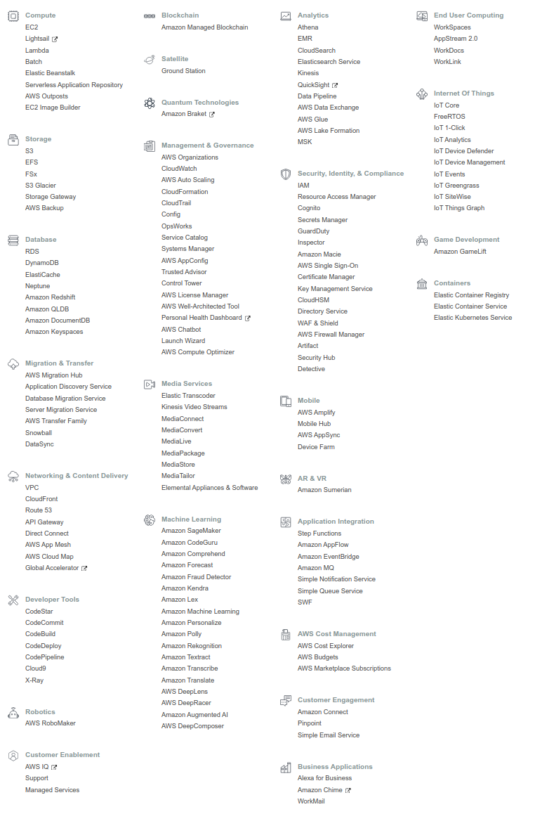
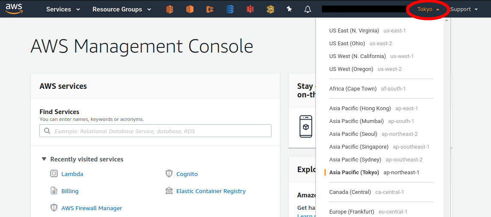
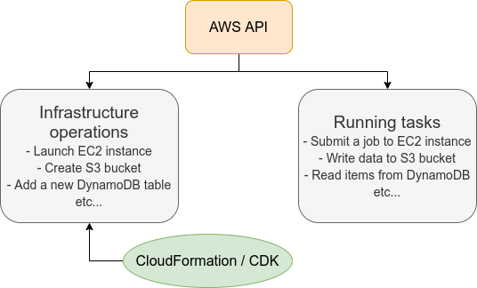

[[sec_aws_general_introduction]]
== Introduction to AWS

=== What is AWS?

In this book, AWS is used as the platform for implementing cloud applications.
In this chapter, we will explain the essential knowledge of AWS that is required for hands-on tutorials.

https://aws.amazon.com[AWS (Amazon Web Services)]
is a general cloud platform provided by Amazon.
AWS was born in 2006 as a cloud service that leases vast computing resources that Amazon owns.
In 2021, AWS holds the largest market share (about 32%) as a cloud provider
(https://www.canalys.com/newsroom/global-cloud-market-Q121[Ref]).
Many web-related services, including Netflix and Slack, have some or all of their server resources provided by AWS.
Therefore, most of the readers would be benefiting from AWS without knowing it.

Because it has the largest market share, it offers a wider range of functions and services than any other cloud platforms.
In addition, reflecting the large number of users, there are many official and third-party technical articles on the web, which is helpful in learning and debugging.
In the early days, most of the users were companies engaged in web business, but recently, there is a growing number of users embracing AWS for scientific and engineering research.

=== Functions and services provided by AWS

<<fig_aws_services>> shows a list of the major services provided by AWS at the time of writing.

[[fig_aws_services]]
.List of major services provided by AWS

The various elements required to compose a cloud, such as computation, storage, database, network, and security, are provided as **independent components**.
Essentially, a cloud system is created by combining these components.
There are also pre-packaged services for specific applications, such as machine learning, speech recognition, and augmented reality (AR) and virtual reality (VR).
In total, there are more than 170 services provided.

AWS beginners often fall into a situation where they are overwhelmed by the large number of services and left at a loss.
It's not even clear what concepts to learn and in what order, and this is undoubtedly a major barrier to entry.
However, the truth is that the essential components of AWS are limited to just a couple.
If you know how to use the essential components, you are almost ready to start developing on AWS.
Many of the other services are combinations of the basic elements that AWS has prepared as specialized packages for specific applications.
Recognizing this point is the first step in learning AWS.

Here, we list the essential components for building a cloud system on AWS.
You will experience them while writing programs in the hands-on sessions in later chapters.
At this point, it is enough if you could just memorize the names in a corner of your mind.

==== computation

image:imgs/aws_logos/EC2.png[S3, 40, role="left"]
**EC2 (Elastic Compute Cloud)**
Virtual machines with various specifications can be created and used to perform calculations.
This is the most basic component of AWS.
We will explore more on EC2 in later chapters (<<sec_first_ec2>>, <<sec_jupyter_and_deep_learning>>, <<sec_aws_batch>>).

image:imgs/aws_logos/Lambda.png[S3, 40, role="left"]
**Lambda**
Lambda is a part of the cloud called Function as a Service (FaaS), a service for performing small computations without a server.
It will be described in detail in the chapter on serverless architecture (<<sec_serverless>>).

==== Storage

image:imgs/aws_logos/EBS.png[S3, 40, role="left"]
**EBS (Elastic Block Store)**
A virtual data drive that can be assigned to EC2.
Think of a "conventional" file system as used in common operating systems.

image:imgs/aws_logos/S3.png[S3, 40, role="left"]
**S3 (Simple Storage Service)**
S3 is a "cloud-bative" data storage system called Object Storage, which uses APIs to read and write data.
It will be described in detail in the chapter on serverless architecture (<<sec_serverless>>).

==== Database

image:imgs/aws_logos/DynamoDB.png[S3, 40, role="left"]
**DynamoDB**
DynamoDB is a NoSQL type database service (think of `mongoDB` if you know it).
It will be described in detail in the chapter on serverless architecture (<<sec_serverless>>).

==== Networking

image:imgs/aws_logos/VPC.png[S3, 40, role="left"]
**VPC(Virtual Private Cloud)**
With VPC, one can create a virtual network environment on AWS, define connections between virtual servers, and manage external access.
EC2 must be placed inside a VPC.

**API Gateway**
image:imgs/aws_logos/APIGateway.png[S3, 40, role="left"]
API Gateway acts as a reverse proxy to connect API endpoints to backend services (such as Lambda).
It will be described in detail in <<sec_bashoutter>>.

=== Regions and Availability Zones

One of the most important concepts you need to know when using AWS is **Region** and **Availability Zone (AZ)** (<<fig_aws_regions_and_azs>>).
In the following, we will briefly describe these concepts.
For more detailed information, also see
https://docs.aws.amazon.com/AWSEC2/latest/UserGuide/using-regions-availability-zones.html[official documentation "Regions, Availability Zones, and Local Zones"].

[[fig_aws_regions_and_azs]]
.Regions and availability zones in AWS
image::imgs/aws_region_and_az.png[AWS regions and azs, 500, align="center"]

A **region** roughly means the location of a data center.
At the time of writing, AWS has data centers in 25 geographical locations around the world, as shown in <<fig_aws_regions>>.
In Japan, there are data centers in Tokyo and Osaka.
Each region has a unique ID, for example, Tokyo is defined as `ap-northeast-1`, Ohio as `us-east-2`, and so on.

[[fig_aws_regions]]
.Regions in AWS (Source: https://aws.amazon.com/about-aws/global-infrastructure/)
image::imgs/aws_regions.png[AWS regions, 600, align="center"]

When you log in to the AWS console, you can select a region from the menu bar at the top right of the screen (<<fig_aws_console_regions>>, circled in red).
AWS resources such as EC2 are completely independent for each region.
Therefore, when deploying new resources or viewing deployed resources, you need to **make sure that the console region is set correctly**.
If you are developing a web business, you will need to deploy the cloud in various parts of the world.
However, if you are using it for personal research, you are most likely fine just using the nearest region (e.g. Tokyo).

[[fig_aws_console_regions]]
.Selecting a region in AWS console

An **Avaialibity Zone (AZ)** is a data center that is geographically isolated within a region.
Each region has two or more AZs, so that if a fire or power failure occurs in one AZ, the other AZs can cover the failure.
In addition, the AZs are connected to each other by high-speed dedicated network lines, so data transfer between AZs is extremely fast.
AZ is a concept that should be taken into account when server downtime is unacceptable, such as in web businesses.
For personal use, there is no need to be concerned much about it.
It is sufficient to know the meaning of the term.

[TIP]
====
When using AWS, which region should you select?
In terms of Internet connection speed, it is generally best to use the region that is geographically closest to you.
On the other hand, EC2 usage fees, etc., are priced slightly differently for each region.
Therefore, it is also important to choose the region with the lowest price for the services that you use most frequently.
In addition, some services may not be available in a particular region.
It is best to make an overall judgment based on these points.
====

=== Cloud development in AWS

Now that you have a general understanding of the AWS cloud, the next topic will be an overview of how to develop and deploy a cloud system on AWS.

There are two ways to perform AWS operations such as adding, editing, and deleting resources: **using the console** and **using the API**.

==== Operating the resources through the console

When you log in to your AWS account, the first thing you will see is the **AWS Management Console** (<<aws_console_window>>).

[[aws_console_window]]
.AWS Management Console
image::imgs/aws_console.png[AWS console, 600, align="center"]

[NOTE]
====
In this book we will often call AWS Management Console AWS console or just a console.
====

Using the console, you can peform any operations on AWS resources through a GUI (Graphical User Interface), such as launching EC2 instances, adding and deleting data in S3, viewing logs, and so on.
**AWS console is very useful when you are trying out a new function for the first time or debugging the system**.

The console is useful for quickly testing functions and debugging the cloud under development, but it is rarely used directly in actual cloud development.
Rather, it is more common to use the APIs to describe cloud resources programmatically.
For this reason, this book does not cover how to use AWS console.
The AWS documentation includes many
https://aws.amazon.com/getting-started/hands-on/[tutorials]
which describe how to perform various operations from the AWS console.
They are valuable resources for learning.

==== Operating the resources through the APIs

By using **API (Application Programming Interface)**, you can send commands to AWS and manipulate cloud resources.
APIs are simply a list of commands exposed by AWS, and consisted of **REST APIs** (REST APIs are explained in <<sec_rest_api>>).
However, directly entering the REST APIs can be tedious, so various tools are provided to interact with AWS APIs more conveniently.

For example, 
https://docs.aws.amazon.com/cli/latest/index.html[AWS CLI]
is a command line interface (CLI) to execute AWS APIs through UNIX console.
In addition to the CLI, SDKs (Software Development Kits) are available in a variety of programming languages.
Some examples are listed below.

* Python => https://boto3.amazonaws.com/v1/documentation/api/latest/index.html[boto3]
* Ruby => https://aws.amazon.com/sdk-for-ruby/[AWS SDK for Ruby]
* Node.js => https://aws.amazon.com/sdk-for-node-js/[AWS SDK for Node.js]

Let's look at a some of the API examples.

Let's assume that you want to add a new storage space (called a `Bucket`) to S3.
If you use the AWS CLI, you can type a command like the following.

[source,bash]
----
$ aws s3 mb s3://my-bucket --region ap-northeast-1
----

The above command will create a bucket named `my-bucket` in the `ap-northeast-1` region.

To perform the same operation from Python, use the `boto3` library and run a script like the following.

[source, python, linenums]
----
import boto3

s3_client = boto3.client("s3", region_name="ap-northeast-1")
s3_client.create_bucket(Bucket="my-bucket")
----

Let's look at another example.

To start a new EC2 instance (an instance is a virtual server that is in the running state), use the following command.

[source, bash]
----
$ aws ec2 run-instances --image-id ami-xxxxxxxx --count 1 --instance-type t2.micro --key-name MyKeyPair --security-group-ids sg-903004f8 --subnet-id subnet-6e7f829e
----

This command will launch a
https://aws.amazon.com/ec2/instance-types/t2/[t2.micro]
instance with 1 vCPU and 1.0 GB RAM.
We'll explain more about this command in later chapter (<<sec_first_ec2>>).

To perform the same operation from Python, use a script like the following.

[source, python, linenums]
----
import boto3

ec2_client = boto3.client("ec2")
ec2_client.run_instances(
    ImageId="ami-xxxxxxxxx",
    MinCount=1, 
    MaxCount=1,
    KeyName="MyKeyPair",
    InstanceType="t2.micro",
    SecurityGroupIds=["sg-903004f8"],
    SubnetId="subnet-6e7f829e",
)
----

Through the above examples, we hope you are starting to get an idea of how APIs can be used to manipulate cloud resources.
With a single command, you can start a new virtual server, add a data storage area, or perform any other operation you want.
By combining multiple commands like this, you can build a computing environment with the desired CPU, RAM, network, and storage.
Of course, the delete operation can also be performed using the API.

==== Mini hands-on: Using AWS CLI

In this mini hands-on, we will learn how to use AWS CLI.
As mentioned earlier, AWS CLI can be used to manipulate any resource on AWS, but here we will practice the simplest case, **reading and writing files using S3**.
(EC2 operations are a bit more complicated, so we will cover them in <<sec_first_ec2>>).
For detailed usage of the `aws s3` command, please refer to https://docs.aws.amazon.com/cli/latest/reference/s3/index.html#cli-aws-s3[official documentation].

[NOTE]
====
For information on installing the AWS CLI, see <<aws_cli_install>>.
====

[WARNING]
====
The hands-on exercise described below can be performed within the
https://aws.amazon.com/free/?all-free-tier.sort-by=item.additionalFields.SortRank&all-free-tier.sort-order=asc[free S3 tier].
====

[WARNING]
====
Before executing the following commands, make sure that your AWS credentials are set correctly.
This requires that the settings are written to the file `~/.aws/credentials` or that the environment variables (`AWS_ACCESS_KEY_ID`, `AWS_SECRET_ACCESS_KEY`, and `AWS_DEFAULT_REGION`) are defined.
See <<aws_cli_install>> for details.
====

To begin with, let's create a data storage space (called a `Bucket`) in S3.

[source, bash]
----
$ bucketName="mybucket-$(openssl rand -hex 12)"
$ echo $bucketName
$ aws s3 mb "s3://${bucketName}"
----

Since the name of an S3 bucket must be unique across AWS, the above command generates a bucket name that contains a random string and stores it in a variable called `bucketName`.
Then, a new bucket is created by `aws s3 mb` command (`mb` stands for make bucket).

Next, let's obtain a list of the buckets.

[source, bash]
----
$ aws s3 ls

2020-06-07 23:45:44 mybucket-c6f93855550a72b5b66f5efe
----

We can see that the bucket we just created is in the list.

[NOTE]
====
As a notation in this book, terminal commands are prefixed with `$` to indicate that they are commands.
The `$` must be removed when copying and pasting commands.
Conversely, the output of a command is shown without `$`.
====

Next, we upload the files to the bucket.

[source, bash]
----
$ echo "Hello world!" > hello_world.txt
$ aws s3 cp hello_world.txt "s3://${bucketName}/hello_world.txt"
----

Here, we generated a dummy file `hello_world.txt` and uploaded it to the bucket.

Now, let's obtain a list of the files in teh bucket.

[source, bash]
----
$ aws s3 ls "s3://${bucketName}" --human-readable

2020-06-07 23:54:19   13 Bytes hello_world.txt
----

We can see that the file we just uploaded is in the list.

Lastly, we delete the bucket we no longer use.

[source, bash]
----
$ aws s3 rb "s3://${bucketName}" --force
----

`rb` stands for remove bucket.
By default, you cannot delete a bucket if there are files in it.
By adding the `--force` option, a non-empty bucket are forced to be deleted.

As we just saw, we were able to perform a series of operations on S3 buckets using the AWS CLI.
In the same manner, you can use the AWS CLI to perform operation on EC2, Lambda, DynamoDB, and any other resources.

[NOTE]
====
**Amazon Resource Name (ARN)**.

Every resource on AWS is assigned a unique ID called Amazon Resource Name (ARN).
ARNs are written in a format like `arn:aws:s3:::my_bucket/`, and ARNs can be used to uniquely refer to a specific AWS resource.

In addition to ARNs, it is also possible to define human-readable names for S3 buckets and EC2 instances.
In this case, either the ARN or the name can be used to refer to the same resource.
====

[[sec:intro_cloudformation]]
=== CloudFormation and AWS CDK

As mentioned in the previous section, AWS APIs can be used to create and manage **any** resources in the cloud.
Therefore, in principle, you can construct cloud systems by combining API commands.

However, there is one practical point that needs to be considered here.
The AWS API can be broadly divided into **commands to manipulate resources** and **commands to execute tasks** (<<fig_aws_iac>>).

[[fig_aws_iac]]
.AWS APIs can be roughly divided into commands for manipulating resources and commands for executing tasks.

**Manipulating resources** refers to **preparing static resources**, such as launching an EC2 instance, creating an S3 bucket, or adding a new table to a database.
Such commands need to be executed only once, when the cloud is deployed.

**Commands to execute tasks** refer to operations such as submitting a job to an EC2 instance or writing data to an S3 bucket.
It describes the computation that should be performed within the premise of a static resource such as EC2 instance or S3 bucket.
Compared to the former, the latter can be regarded as being in charge of **dynamic operations**.

From this point of view, it would be clever to manage **programs describing the infrastructure** and **programs executing tasks** separately.
Therefore, the development of a cloud can be divided into two steps: one is to create programs that describe the static resources of the cloud, and the other is to create programs that perform dynamic operations.

CloudFormation is a mechanism for managing static resources in AWS.
CloudFormation defines the blueprint of the cloud infrastructure using text files that follow the CloudFormation syntax.
CloudFormation can be used to describe resource requirements, such as how many EC2 instances to launch, with what CPU power and networks configuration, and what access permissions to grant.
Once a CloudFormation file has been crafted, a cloud system can be deployed on AWS with a single command.
In addition, by exchanging CloudFormation files, it is possible for others to easily reproduce an identical cloud system.
This concept of describing and managing cloud infrastructure programmatically is called **Infrastructure as Code (IaC)**.

CloudFormation usually use a format called **JSON** (JavaScript Object Notation).
The following code is an example excerpt of a CloudFormation file written in JSON.

[source, json, linenums]
----
"Resources" : {
  ...    
  "WebServer": {
    "Type" : "AWS::EC2::Instance",
    "Properties": {
      "ImageId" : { "Fn::FindInMap" : [ "AWSRegionArch2AMI", { "Ref" : "AWS::Region" },
                        { "Fn::FindInMap" : [ "AWSInstanceType2Arch", { "Ref" : "InstanceType" }, "Arch" ] } ] },
      "InstanceType"   : { "Ref" : "InstanceType" },
      "SecurityGroups" : [ {"Ref" : "WebServerSecurityGroup"} ],
      "KeyName"        : { "Ref" : "KeyName" },
      "UserData" : { "Fn::Base64" : { "Fn::Join" : ["", [
                     "#!/bin/bash -xe\n",
                     "yum update -y aws-cfn-bootstrap\n",

                     "/opt/aws/bin/cfn-init -v ",
                     "         --stack ", { "Ref" : "AWS::StackName" },
                     "         --resource WebServer ",
                     "         --configsets wordpress_install ",
                     "         --region ", { "Ref" : "AWS::Region" }, "\n",

                     "/opt/aws/bin/cfn-signal -e $? ",
                     "         --stack ", { "Ref" : "AWS::StackName" },
                     "         --resource WebServer ",
                     "         --region ", { "Ref" : "AWS::Region" }, "\n"
      ]]}}
    },
    ...
  },
  ...    
},
----

Here, we have defined an EC2 instance named "WebServer".
This is a rather long and complex description, but it specifies all necessary information to create an EC2 instance.

==== AWS CDK

As we saw in the previous section, CloudFormation is very complex to write, and there must not be any errors in any lines.
Further, since CloudFormation is written with JSON, we cannot use useful concepts such as variables and classes as we do in modern programming languages (strictly speaking, CloudFormation has functions that are equivalent to variables).
In addition, many parts of the CloudFormation files are repetitive, and many parts can be automated.

To solve this programmer's pain, 
https://aws.amazon.com/cdk/[AWS Cloud Development Kit (CDK)]
is offered by AWS.
**CDK is a tool that automatically generates CloudFormations using a programming language such as Python.**
CDK is a relatively new tool, released in 2019, and is being actively developed (check the releases at https://github.com/aws/aws-cdk/releases[GitHub repository] to see how fast this library is being improved).
CDK is supported by several languages including TypeScript (JavaScript), Python, and Java.

With CDK, programmers can use a familiar programming language to describe the deisred cloud resources and synthesize the CloudFormation files.
In addition, CDK determines many of the common parameters automatically, which reduces the amount of coding.

The following is an example excerpt of CDK code using Python.

[source, python, linenums]
----
import aws_cdk as cdk
from aws_cdk import (
    Stack,
    aws_ec2 as ec2,
)

class MyFirstEc2(Stack):

    def __init__(self, scope, construct_id, **kwargs):
        super().__init__(scope, construct_id, **kwargs)

        vpc = ec2.Vpc(
            ... # some parameters
        )

        sg = ec2.SecurityGroup(
            ... # some parameters
        )

        host = ec2.Instance(
            self, "MyGreatEc2",
            instance_type=ec2.InstanceType("t2.micro"),
            machine_image=ec2.MachineImage.latest_amazon_linux(),
            vpc=vpc,
            ...
        )
----

This code describes essentially the same thing as the JSON-based CloudFormation shown in the previous section.
You can see that CDK code is much shorter and easier to understand than the very complicated CloudFormation file.

**The focus of this book is to help you learn AWS concepts and techniques while writing code using CDK**.
In the later chapters, we will provide various hands-on exercises using CDK.
To kick start, in the first hands-on, we will learn how to launch a simple EC2 instance using CDK.

.Further reading
****
* https://github.com/aws-samples/aws-cdk-examples[AWS CDK Examples]:
Many example projects using the CDK are published here.
You can use the examples here as a template to develop your own applications.
****

