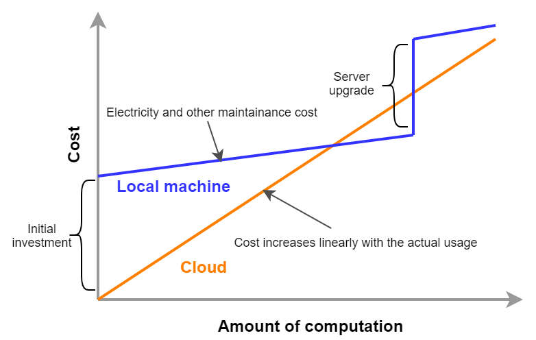

[[chap_cloud_basics]]
== Cloud Computing Basics

=== What is the cloud?

image::imgs/cloud_word_art.png[Cloud, 400, align="center"]

What is the cloud?
The term "cloud" has a very broad meaning in itself, so it is difficult to give a strict definition.
In academic context,
https://csrc.nist.gov/publications/detail/sp/800-145/final[The NIST Definition of Cloud Computing],
published by National Institute of Standards and Technology (NIST), is often cited to define cloud computing.
The definition and model of cloud described here is illustrated in <<fig:nist_cloud_definition>>.

[[fig:nist_cloud_definition]]
.The NIST Definition of Cloud Computing
image::imgs/nist_cloud_definition.png[Cost, 700, align="center"]

According to this, a cloud is a collection of hardware and software that meets the following requirements.

* **On-demand self-service**:
Computational resources are automatically allocated according to the user's request.
* **Broad network access**:
Users can access the cloud through the network.
* **Resource pooling**:
The cloud provider allocates computational resources to multiple users by dividing the owned computational resources.
* **Rapid elasticity**:
To be able to quickly expand or reduce computational resources according to the user's request.
* **Measured service**:
To be able to measure and monitor the amount of computing resources used.

This may sound too abstract for you to understand.
Let's talk about it in more concrete terms.

If you wanted to upgrade the CPU on your personal computer, you would have to physically open the chassis, expose the CPU socket, and replace it with a new CPU.
Or, if the storage is full, you will need to remove the old disk and insert a new one.
When the computer is moved to a new location, it will not be able to connect to the network until the LAN cable of the new room is plugged in.

In the cloud, these operations can be **performed by commands from a program**.
If you want 1000 CPUs, you can send a request to the cloud provider.
Within a few minutes, you will be allocated 1000 CPUs.
If you want to expand your storage from 1TB to 10TB, you can send such command (you may be familiar with this from services such as Google Drive or Dropbox).
When you are done using the compute resources, you can tell the provider about it, and the allocation will be deleted immediately.
The cloud provider accurately monitors the amount of computing resources used, and calculates the usage fee based on that amount.

Namely, the essence of the cloud is the virtualization and abstraction of physical hardware, and **users can manage and operate physical hardware through commands as if it were a part of software**.
Of course, behind the scenes, a huge number of computers in data centers are running, consuming a lot of power.
The cloud provider achieves this virtualization and abstraction by cleverly managing the computational resources in the data center and providing the user with a software interface.
From the cloud provider's point of view, they are able to maximize their profit margin by renting out computers to a large number of users and keeping the data center utilization rate close to 100% at all times.

In the author's words, the key characteristics of the cloud can be defined as follows:

[quote]
The cloud is an abstraction of computing hardware.
In other words, it is a technology that makes it possible to manipulate, expand, and connect physical hardware as if it were part of software.

Coming back to The NIST Definition of Cloud Computing mentioned above, the following three forms of cloud services are defined (<<fig:nist_cloud_definition>>).

* **Software as a Service (SaaS)**
+
A form of service that provides users with application running in the cloud.
Examples include Google Drive and Slack.
The user does not directly touch the underlying cloud infrastructure (network, servers, etc.), but use the cloud services provided as applications.
* **Platform as a Service (PaaS)**
+
A form of service that provides users with an environment for deploying customer-created applications (which in most cases consist of a database and server code for processing API requests).
In PaaS, the user does not have direct access to the cloud infrastructure, and the scaling of the server is handled by the cloud provider.
Examples include Google App Engine and Heroku.
* **Infrastructure as a Service (IaaS)**
+
A form of service that provides users with actual cloud computing infrastructure on a pay-as-you-go basis.
The users rent the necessary network, servers, and storage from the provider, and deploy and operate their own applications on it.
An example of IaaS is AWS EC2.

This book mainly deals with cloud development in IaaS.
In other words, it is cloud development in which the developer directly manipulates the cloud infrastructure, configures the desired network, server, and storage from scratch, and deploys the application on it.
In this sense, cloud development can be divided into two steps: **the step of building a program that defines the cloud infrastructure** and **the step of crafting an application that actually runs on the infrastructure**.
These two steps can be separated to some extent as a programmer's skill set, but an understanding of both is essential to build the most efficient and optimized cloud system.
This book primarily focuses on the former (operating the cloud infrastructure), but also covers the application layer.
PaaS is a concept where the developer focuses on the application layer development and relies on the cloud provider for the cloud infrastructure.
PaaS reduces development time by eliminating the need to develop the cloud infrastructure, but has the limitation of not being able to control the detailed behavior of the infrastructure.
This book does not cover PaaS techniques and concepts.

SaaS can be considered a development "product" in the context of this book.
In other words, the final goal of development is to provide a computational service or database on the available to the general public by deploying the programs on IaaS platform.
As a practical demonstration, we will provide hands-on exercises such as creating a simple SNS (<<sec_bashoutter>>).

Recently, Function as a Service (FaaS) and serverless computing have been recognized as new cloud categories.
These concepts will be discussed in detail in later chapters (<<sec_intro_serverless>>).
As will become clear as you read through this book, cloud technology is constantly and rapidly evolving.
This book first touches on traditional cloud design concepts from a practical and educational point of view, and then covers the latest technologies such as serverless.

Finally, according to The NIST Definition of Cloud Computing, the following four types of cloud deployment model are defined (<<fig:nist_cloud_definition>>).
**Private cloud** is a cloud used only within a specific organization, group, or company.
For example, universities and research institutes often operate large-scale computer servers for their members.
In a private cloud, any member of the organization can run computations for free or at a very low cost.
However, the upper limit of available computing resources is often limited, and there may be a lack of flexibility when expanding.

**Pubclic cloud** is a cloud that is offered as a commercial service to general customers.
Examples of famous public cloud platforms include
https://cloud.google.com/[Google Cloud Platform (GCP)] provided by Google,
https://azure.microsoft[Azure] provided by Microsoft,
and https://aws.amazon.com[Amazon Web Services (AWS)] provided by Amazon.
When you use a public cloud, you pay the usage cost set by the provider.
In return, you get access to the computational resources of the company operating the huge data center, so it is not an exaggeration to say that the computational capacity is inexhaustible.

The third type of cloud operation is called **community cloud**.
This refers to a cloud that is shared and operated by groups and organizations that share the same objectives and roles, such as government agencies.
Finally, there is the **hybrid cloud**, which is a cloud composed of a combination of private, public, and community clouds.
An example of hybrid cloud would be a case where some sensitive and privacy-related information is kept in the private cloud, while the rest of the system depends on the public cloud.

This book is basically about cloud development using public clouds.
In particular, we will use Amazon Web Services (AWS) to learn specific techniques and concepts.
Note, however, that techniques such as server scaling and virtual computing environments are common to all clouds, so you should be able to acquire knowledge that is generally applicable regardless of the cloud platform.

=== Why use the cloud?

As mentioned above, the cloud is a computational environment where computational resources can be flexibly manipulated through programs.
In this section, we would like to discuss why using the cloud is better than using a real local computing environment.

1. **Scalable server size**
+
When you start a new project, it's hard to know in advance how much compute capacity you'll ever need.
Buying a large server is risky.
On the other hand, a server that is too small can be troublesome to upgrade later on.
By using the cloud, you can secure the right amount of computing resources you need as you proceed with your project.
2. **Free from hardware maintainance**
+
Sadly, computers do get old.
With the rate at which technology is advancing these days, after five years, even the newest computers of the day are no more than fossils.
Replacing the server every five years would be a considerable hassle.
It is also necessary to deal with unexpected failures such as power outages and breakdowns of servers.
With cloud computing, there is no need for the user to worry about such things, as the provider automatically takes care of the infrastructure maintenance.
3. **Zero initial cost**
+
<<cloud_economic_curve>> shows the economic cost of using your own computing environment versus the cloud.
The initial cost of using the cloud is basically zero.
After that, the cost increases according to the amount 
of usage.
On the other hand, a large initial cost is incurred when using your own computing environment.
After the initial investment, the increase in cost is limited to electricity and server maintenance costs, so the slope is smaller than in the case of using the cloud.
Then, after a certain period of time, there may be step-like expenditures for server upgrades.
The cloud, on the other hand, incur no such discontinuous increase in cost.
In the areas where cost curve of the cloud is below that of local computing environment, using the cloud will lead to economic cost savings.

[[cloud_economic_curve]]
.Cost curve for cloud and local server

In particular, point 1 is important in research situations.
In research, there are few cases in which one must keep running computations all the time.
Rather, the computational load is likely to increase intensively and unexpectedly when a new algorithm is conceived, or when new data arrives.
In such cases, the ability to flexibly increase computing power is a major advantage of using the cloud.

So far, we have discussed the advantages of using the cloud, but there are also some disadvantages.

1. **The cloud must be used wisely**
+
As shown in the cost curve in <<cloud_economic_curve>>, depending on your use case, there may be situations where it is more cost effective to use local computing environment.
When using the cloud, users are required to manage their computing resources wisely, such as deleting intances immediately after use.
2. **Security**
+
The cloud is accessible from anywhere in the world via the Internet, and can be easily hacked if security management is neglected.
If the cloud is hacked, not only will information be leaked, but there is also the possibility of financial loss.
3. **Learning Curve**
+
As described above, there are many points to keep in mind when using the cloud, such as cost and security.
In order to use the cloud wisely, it is indispensable to have a good understanding of the cloud and to overcome the learning curve.

.Column: Origin of the word "Terminal"
****
The black screen that you use to enter commands on Mac or Linux is called a terminal.
Do you know the origin of this word?

image::imgs/terminal.png[Terminal, 400, align="center"]

The origin of this word goes back to the early days of computers.
At that time, a computer was a machine the size of a conference room, with thousands of vacuum tubes connected together.
Since it was such an expensive and complex piece of equipment, it was natural that it would be shared by many people.
In order for users to access the computer, there were several cables running from the machine, each with a keyboard and screen attached to it...
This was called a **Terminal**.
People took turns sitting in front of the terminal and interacting with the computer.

Times change, and with the advent of personal computers such as Windows and Mac, computers have become something that is owned by individuals rather than shared by everyone.

The recent rise of cloud computing can be seen as a return to the original usage of computers, where everyone shared a large computer.
At the same time, edge devices such as smartphones and wearables are becoming more and more popular, and the trend of individuals owning multiple "small" computers is progressing at the same time.
****

