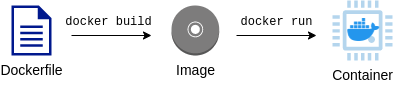
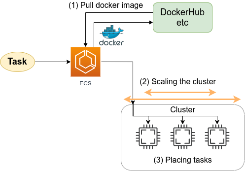

[[sec_docker_introduction]]
== Introduction to Docker

In the hands-on exercises described in the previous chapters, we have set up __a single server__, logged in to it via SSH, and performed calculations by typing commands.
In other words, we have been using the cloud as __an extension of our personal computers__.
This kind of use of the cloud as a personal computer is, of course, convenient and has many potential applications.
However, the true value of the cloud is not fully demonstrated by this alone.
As described in <<chap_cloud_basics>>, the greatest strength of the modern cloud is the ability to freely expand the scale of computing.
That is to say, the true potential of the cloud can only be demonstrated by processing large amounts of data by running many servers simultaneously and executing multiple jobs in a distributed parallel fashion.

Using the three sections starting from this chapter (<<sec_docker_introduction>>, <<sec_fargate_qabot>>, <<sec_aws_batch>>), we would like to show you a glimpse of how to build a large-scale computing system using the cloud to tackle challenges like the big data analysis.
In particular, we would like to focus our discussion on how to apply the deep learning to big data.
As a prelude to this, this chapter introduces a virtualization software called https://www.docker.com/[Docker].
It would not be an exaggeration to say that modern cloud computing would not be possible without Docker.
Docker is very useful not only for cloud computing, but also for local computation.
This is a bit of a departure from AWS, but it's important to understand Docker well enough to move forward.

=== Scaling up machine learning

We have been repeatedly calling for "large-scale computing systems," but what exactly does that mean?
Let's take machine learning as an example, and talk about a computer system for processing large data.

Suppose we want to train a deep learning model with a very large number of parameters, such as https://github.com/openai/gpt-3[GPT-3] introduced in <<sec_scientific_computing>>.
If you want to perform such a computation, a single server will not have enough computing power.
Therefore, the typical design of a computing system would be a model shown in <<big_dnn_training>>.
Namely, a large amount of training data is distributed in small chunks across multiple machines, and the parameters of the neural network are optimized in parallel.

[[big_dnn_training]]
.Training large-scale deep learning models using multiple computers.
image::imgs/big_dnn_training.png[big_dnn_training, 700, align="center"]

Or, let's say you want to apply a trained model to a large amount of data for analysis.
For example, you have a SNS platform and you are given a large number of images, and you want to label what is in each photo.
In such a case, an architecture such as the one shown in <<big_dnn_inference>> can be considered, in which a large amount of data is divided among multiple machines, and each machine performs inference computation.

[[big_dnn_inference]]
.Parallel inference using deep learning models
image::imgs/big_dnn_inference.png[big_dnn_inference, 700, align="center"]

How can such applications that run multiple computers simultaneously be implemented in the cloud?

One important point is that the multiple machines running <<big_dnn_training>> and <<big_dnn_inference>> have **basically the same OS and computing environment**.
Here, it is possible to perform the same installation operations on each machine as one would do on an individual computer, but this would be very time-consuming and cumbersome to maintain.
In other words, in order to build a large-scale computing system, it is necessary to have a **mechanism that allows to easily replicate the computing environment**.

To achieve this goal, a software called https://www.docker.com/[Docker] is used.

=== What is Docker?

[[fig:docker_logo]]
.Docker のアイコン
image::imgs/docker_log.png[docker, 500, align="center"]

Docker is software for running a separate computing environment independent of the host OS in a virtual environment called a **container**.
Docker makes it possible to package all programs, including the OS, in a compact package (a packaged computing environment is called an **image**).
Docker makes it possible to instantly replicate a computing environment on a cloud server, and to create a system for running multiple computers simultaneously, as seen in <<big_dnn_inference>>.

Docker was developed by Solomon Hykes and his fellows in 2013, and since then it has exploded in popularity, becoming core software not only for cloud computing but also in the context of machine learning and scientific computing.
Docker is available free of charge, except for enterprise products, and its core is available as an 
https://github.com/moby/moby[open source]
project.
Docker is available for Linux, Windows, and Mac operating systems.
Conceptually, Docker is very similar to a virtual machine (VM).
Comparing Docker with VM is a very useful way to understand what Docker is, so here we take this approach.

A virtual machine (VM) is a technology that allows to run virtualized operating systems on top of a host machine (<<docker_vs_vm>>).
A VM has a layer called a **hypervisor**.
The hypervisor first divides the physical computing resources (CPU, RAM, network, etc.) and virtualizes them.
For example, if the host machine has four physical CPU cores, the hypervisor can virtually divide them into (2,2) pairs.
The OS running on the VM is allocated virtualized hardware by the hypervisor.
OSes running on VM are completely independent.
For example, OS-A cannot access the CPU or memory space allocated to OS-B (this is called **isolation**).
Famous software for creating VMs includes
https://www.vmware.com/[VMware],
https://www.virtualbox.org/[VirtualBox],
and
https://xenproject.org/[Xen].
EC2, which we have used earlier, basically uses VM technology to present the user with a virtual machine with the desired specifications.

Docker, like VM, is a technology for running a virtualized OS on a host OS.
In contrast to VMs, Docker does not rely on hardware-level virtualization; all virtualization is done at the **software level** (<<docker_vs_vm>>).
The virtual OS running on Docker relies on the host OS for much of its functionality, and as a result is very compact.
Consequently, the time required to boot a virtual OS with Docker is much faster than with a VM.
It is also important to note that the size of the packaged environment (i.e., image) is much smaller than that of a full OS, which greatly speeds up communication over the network.
In addition, some implementations of VMs are known to have lower performance than metal (metal means OS running directly on physical hardware) due to the overhead at the hypervisor layer.
Docker is designed to be able to achieve almost the same performance as metal.

There are many other differences between Docker and VM, but we will not go into details here.
The important point is that **Docker is a tool for creating a very compact and high-performance virtual computing environment**.
Because of its ease of use and lightness, Docker has been adopted in many cloud systems since its introduction in 2013, and it has become an essential core technology in the modern cloud.

[[docker_vs_vm]]
.Comparison of Docker (left) and VM (right) (image source: https://www.docker.com/blog/containers-replacing-virtual-machines/)
image::imgs/docker_vs_vm.png[docker_vs_vm, 700, align="center"]

.Column: The three sacred treasures of programmers
****
What are the "three sacred treasures" for professional programmers?
There should be many different opinions, but I would like to mention **Git**, **Vim**, and **Docker**.

Git, as many of you know, is a system for tracking code changes.
It was created in 2005 by Linus Torvalds, the creator of Linux.
It is an indispensable tool for team development.

Vim is a text editor that has been a favorite of programmers for more than 30 years.
According to
https://insights.stackoverflow.com/survey/2019#technology-development-environments-and-tools-all-respondents[2019 survey conducted by Stackoverflow],
it is the fifth most popular development environment.
It provides a lot of shortcuts and a variety of custom settings.
Vim can be quite challenging for beginners, but once mastered, it can provide a development experience that is as good as or better than other modern editors and integrated development environments.

Along with these decade-old tools, I would like to mention Docker as the third of the big three.
Docker has revolutionized the development workflow of programmers.
For example, by creating a Docker image for each project, you can now develop and test on the exact same environment on any OS and any computer.
In addition, the modern concepts like
https://en.wikipedia.org/wiki/DevOps[DevOps]
and
https://en.wikipedia.org/wiki/Continuous_integration[CI] / https://en.wikipedia.org/wiki/Continuous_delivery[CD]
(Continuous Integration / Continuous Deployment)
are based on the existence of container technologies such as Docker.

What are the three sacred treasures for you?
And what new tools will revolutionize programmers' workflows in the future?
****

=== Docker tutorial

The most effective way to understand what Docker is is to actually try it out.
In this section, I will give a brief tutorial on Docker.

For Docker installation, please refer to <<sec:install_docker>> and https://docs.docker.com/engine/install/[official documentation].
The following assumes that you have already installed Docker.

==== Docker terminology

To get you started with Docker, let us first define some key terms.

<<fig:docker_image_container>> shows the general steps to start Docker.
A packaged computing environment is called an **image**.
Images can be downloaded from repositories such as Docker Hub, or you can create your own custom images.
The file that describes the "recipe" for creating an image is called **Dockerfile**.
The operation to create an image from a Dockerfile is called **build**.
When an image is loaded in to the host machine's memory, the virtual environment is ready, which is called a **container**.
The command used to start the container is **run**.

[[fig:docker_image_container]]
.Docker image and container

==== Downloading an image

The packaged Docker virtual environment (=**image**) can be downloaded from https://hub.docker.com/[Docker Hub].
Docker Hub hosts Docker images created by individuals, companies, and organizations, and is open to the public just like GitHub.

For example, Ubuntu images are available at
https://hub.docker.com/_/ubuntu [the official Ubuntu repository],
and can be downloaded to the local machine by using the `pull` command.

[source, bash]
----
$ docker pull ubuntu:18.04
----

Here, the string following the `:` (colon) in the image name is called a **tag** and is mainly used to specify the version.

[TIP]
====
The `pull` command by default searches for images on Docker Hub.
On the other hand, there are many other databases to host Docker images (called registries).
For example, GitLab and GitHub provide their own image registries, and it is also possible to set up a registry on your own server.
To pull from a registry other than Docker Hub, specify the address (and optionally the port number) of the registry by prefixing the image name with the registry address.
For instance, `myregistry.local:5000/testing/test-image`.
====

==== Launching a container

To launch a container from the image, use the `run` command.

[source, bash]
----
$ docker run -it ubuntu:18.04
----

Here, `-it` is an option required to start an interactive shell session.

When this command is executed, the virtualized Ubuntu will be launched and commands can be typed from the command line (<<docker_shell>>).
A computational environment (runtime) in running state is called a **container**.

[[docker_shell]]
.Launching ubuntu:18.04 container
image::imgs/docker_shell.png[docker_shell, 600, align="center"]

The `ubuntu:18.04` image used here is an empty Ubuntu OS, but there are other images available with some programs already installed.
This is similar to the concept of DLAMI as we saw in <<sec_jupyter_and_deep_learning>>.
For example, an image with PyTorch already installed is available at
https://hub.docker.com/r/pytorch/pytorch[PyTorch's official Docker Hub repository].

Let's launch this image.

[source. bash]
----
$ docker run -it pytorch/pytorch
----

[NOTE]
====
When you run `docker run`, if the corresponding image is not found locally, it will be downloaded from Docker Hub automatically.
====

Once the PyTorch container is up and running, lanch a Python shell and test importing pytorch.

[source, bash]
----
$ python3
Python 3.7.7 (default, May  7 2020, 21:25:33)
[GCC 7.3.0] :: Anaconda, Inc. on linux
Type "help", "copyright", "credits" or "license" for more information.
>>> import torch
>>> torch.cuda.is_available()
False
----

As we saw in these examples, Docker makes it possible to easily reproduce a computing environment with a specific OS and program.

==== Making your own image

It is also possible to create your own image which includes any softwares your application may require.

For example,
https://hub.docker.com/repository/docker/tomomano/labc[the docker image provided for the hands-on exercises in this book]
comes with Python, Node.js, AWS CLI, and AWS CDK already installed, so you can run the hands-on program immediately after pulling the image.

To create a custom docker image, all you need to do is to prepare a file named `Dockerfile` and describe what programs you want to install in it.

As an example, let's take a look at the Docker image recipe provided in this book
(https://github.com/tomomano/learn-aws-by-coding/blob/main/docker/Dockerfile[docker/Dockerfile]).

[source, docker]
----
FROM node:12
LABEL maintainer="Tomoyuki Mano"

RUN apt-get update \
    && apt-get install nano

# <1>
RUN cd /opt \
    && curl -q "https://www.python.org/ftp/python/3.7.6/Python-3.7.6.tgz" -o Python-3.7.6.tgz \
    && tar -xzf Python-3.7.6.tgz \
    && cd Python-3.7.6 \
    && ./configure --enable-optimizations \
    && make install

RUN cd /opt \
    && curl "https://awscli.amazonaws.com/awscli-exe-linux-x86_64.zip" -o "awscliv2.zip" \
    && unzip awscliv2.zip \
    && ./aws/install

# <2>
RUN npm install -g aws-cdk@1.100

# clean up unnecessary files
RUN rm -rf /opt/*

# copy hands-on source code in /root/
COPY handson/ /root/handson
----

We won't go into detail about `Dockerfile`.
But, for example, in the code above, <1> installs Python 3.7, and <2> installs the AWS CDK.
You can create your own Docker image by describing the installation commands one by one in the same way as you would do for a real OS.
Once the image is created, it can be distributed to others so that they can easily reproduce the same computing environment.

"That program runs in my computer..." is a common phrase among novice programmers.
With Docker, you say goodbye to those concerns.
In this sense, Docker's usefulness and versatility is extremely high even in the contexts other than cloud computing.

.Column: Is Docker alone?
****
We introduced Docker as a virtual computing tool using containers, but are there any other options?
Well, you asked me!
Since Docker's inception several container-based virtual environment tools have been developed, all of which share many of the same concepts and APIs as Docker, but offer unique features not found in Docker.
Here, I will introduce some of the most famous ones.

https://github.com/hpcng/singularity[Singularity]
is a popular container platform in scientific computing and HPC (High Performance Computing) community.
Singularity is designed to work well in HPC clusters at universities and research institutions.
For example, while Docker is basically run with root privileges, Singularity is run with user privileges.
The root privilege is not a problem for servers operated by individuals or companies for specific services such as web servers, but it is a problem for HPC clusters where many users execute computations for various purposes.
Singularity has its own image creation method and ecosystem, but it also offers a function to convert Docker images into Singularity images.

https://github.com/containers/podman[podman]
is another container platform developed by Red Hat.
podman uses basically the same commands as Docker, but the implementation was done from scratch by Red Hat.
Like Singularity, podman allows programs to be executed with user privileges, and was designed to be a container platform for both cloud and HPC environments.
As its name suggests, it introduces a unique concept called pod.

The author's personal opinion is that mastering Docker is sufficient for the time being, but readers who are interested should definitely try these tools as well.
****

=== Elastic Container Service (ECS)

[[fig:logo_ecs]]
.ECS icon
image::imgs/aws_logos/ECS.png[ECS, 100]

As we have explained so far, Docker is a highly versatile and powerful tool to replicate and launch a virtual computing environment.
As the last topic of this section, we will talk about how to build a computing system using Docker on AWS.

**Elastic Container Service (ECS)** is a tool for creating Docker-based compute clusters on AWS (<<fig:logo_ecs>>).
Using ECS, you can define tasks using Docker images, create a compute cluster, and add or remove instances in the compute cluster.

<<ecs_overview>> shows an overview of ECS.
The ECS accepts computation jobs managed in units called **tasks**.
When a task is submitted to the system, ECS first downloads the Docker image specified by the task from an external registry.
The external registry can be Docker Hub or AWS' own image registry, **ECR (Elastic Container Registry)**.

The next important role of ECS is task placement.
By selecting a virtual instance with low computational load in a predefined cluster, ECS places a Docker image on it, and the task is started.
When we say "select a virtual instance with low computational load," the specific strategy and policy for this selection depends on the parameters specified by the user.

Scaling of clusters is another important role of ECS.
Scaling refers to the operation of monitoring the computational load of the instances in a cluster, and starting and stopping the instances according to the total load on the cluster.
When the computational load of the entire cluster exceeds a specified threshold (e.g., 80% utilization), a new virtual instance is launched (an operation called scale-out).
When the computational load is below a certain threshold, unnecessary instances are stoped (an operation called scale-in).
The scaling of a cluster is achieved by the ECS cooperating with other AWS services.
Specifically, ECS is most commonly paired with **Auto scaling group (ASG)** or **Fargate**.
ASG and Fargate, respectively will be covered in <<sec_aws_batch>> and <<sec_fargate_qabot>>.

ECS automatically manages the above explained operations for you.
Once the parameters for cluster scaling and task placement are specified, the user can submit a large number of tasks, almost without thinking about behind the scenes.
ECS will launch just enough instances for the amount of tasks, and after the tasks are completed, all unnecessary instances will be stopped, eliminating idling instances completely.

The theory and knowledge stuffs are over now!
From the next section, let's start building a large-scale parallel computing system using Docker and ECS!

[[ecs_overview]]
.ECS overview

