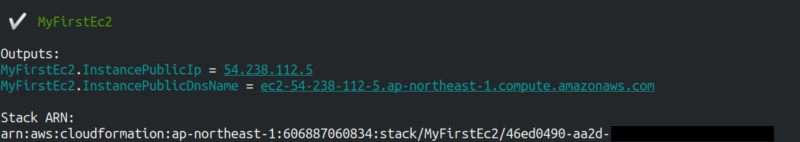
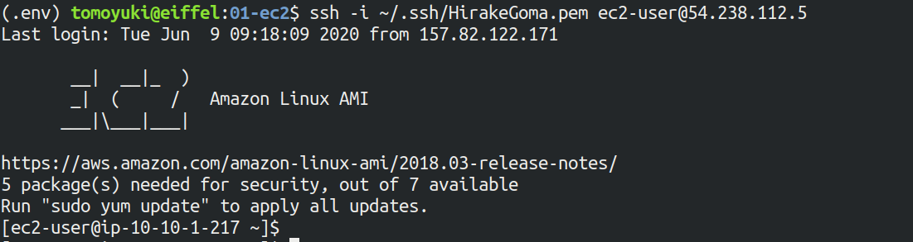
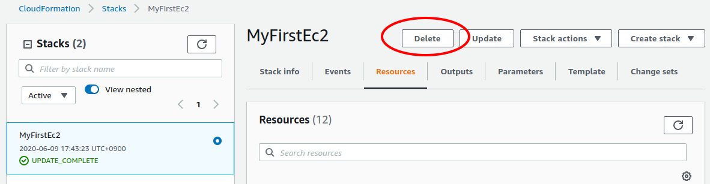

[[sec_first_ec2]]
== Hands-on #1: Launching an EC2 instance

In the first hands-on session, we will create an EC2 instance (virtual server) using CDK, and log in to the server using SSH.
After this hands-on, you will be able to set up your own server on AWS and run calculations as you wish!

[[handson_01_prep]]
=== Preparation

The source code for the hands-on is available on GitHub at
https://github.com/tomomano/learn-aws-by-coding/tree/main/handson/ec2-get-started[handson/ec2-get-started].

[WARNING]
====
This hands-on exercise can be performed within the
https://aws.amazon.com/free/?all-free-tier.sort-by=item.additionalFields.SortRank&all-free-tier.sort-order=asc[free EC2 tier].
====

First, we set up the environment for the exercise.
This is a prerequisite for the hands-on sessions in later chapters as well, so make sure to do it now without mistakes.

* **AWS account**:
You will need a personal AWS account to run the hands-on.
See <<sec:create_aws_account>> for obtaining an AWS account.
* **Python and Node.js**:
Python (3.6 or higher) and Node.js (12.0 or higher) must be installed in order to run this hands-on.
* **AWS CLI**:
For information on installing the AWS CLI, see <<aws_cli_install>>.
Be sure to set up the authentication key described here.
* **AWS CDK**:
For information on installing the AWS CDK, see <<aws_cdk_install>>.
* **Downloading the source code**:
Download the source code of the hands-on program from GitHub using the following command.
+
[source, bash]
----
$ git clone https://github.com/tomomano/learn-aws-by-coding.git
----
+
Alternatively, you can go to https://github.com/tomomano/learn-aws-by-coding and click on the download button in the upper right corner.

**Using Docker image for the hands-on exercises**

We provide a Docker image with the required programs installed, such as Python, Node.js, and AWS CDK.
The source code of the hands-on program has also been included in the image.
If you already know how to use Docker, then you can use this image to immediately start the hands-on tutorials without having to install anything else.

See <<sec_handson_docker>> for more instructions.

=== SSH

**SSH (secure shell)** is a tool to securely access Unix-like remote servers.
In this hands-on, we will use SSH to access a virtual server.
For readers who are not familiar with SSH, here we give a brief guidance.

All SSH communication is encrypted, so confidential information can be sent and received securely over the Internet.
For this hands-on, you need to have an SSH client installed on your local machine to access the remote server.
SSH clients come standard on Linux and Mac.
For Windows, it is recommended to install WSL to use an SSH client (see <<environments>>).

The basic usage of the SSH command is shown below.
`<host name>` is the IP address or DNS hostname of the server to be accessed.
The `<user name>` is the user name of the server to be connected to.

[source, bash]
----
$ ssh <user name>@<host name>
----

SSH can be authenticated using plain text passwords, but for stronger security, it is strongly recommended that you use **Public Key Cryptography** authentication, and EC2 only allows access in this way.
We do not explain the theory of public key cryptography here.
The important point in this hands-on is that the EC2 instance holds the public key, and the client computer (the reader's local machine) holds the private key.
Only the computer with the private key can access the EC2 instance.
Conversely, if the private key is leaked, a third party will be able to access the server, so **manage the private key with care to ensure that it is never leaked**.

The SSH command allows you to specify the private key file to use for login with the `-i` or `--identity_file` option.
For example, use the following command.

[source, bash]
----
$ ssh -i Ec2SecretKey.pem <user name>@<host name>
----

=== Reading the application source code

<<handson_01_architecture>> shows an overview of the application we will be deploying in this hands-on.

[[handson_01_architecture]]
.Application architecture
image::imgs/handson-01/app_architecture.png[hands-on 01 architecture, 600, align="center"]

In this application, we first set up a private virtual network environment using **VPC (Virtual Private Cloud)**.
The virtual servers of **EC2 (Elastic Compute Cloud)** are placed inside the public subnet of the VPC.
For security purposes, access to the EC2 instance is restricted by the **Security Group (SG)**.
We will use SSH to access the virtual server and perform a simple calculation.
We use AWS CDK to construct this application.

Let's take a look at the source code of the CDK app
(https://github.com/tomomano/learn-aws-by-coding/blob/main/handson/ec2-get-started/app.py[handson/ec2-get-started/app.py]).

[source, python, linenums]
----
class MyFirstEc2(core.Stack):

    def __init__(self, scope: core.App, name: str, key_name: str, **kwargs) -> None:
        super().__init__(scope, name, **kwargs)

        # <1>
        vpc = ec2.Vpc(
            self, "MyFirstEc2-Vpc",
            max_azs=1,
            cidr="10.10.0.0/23",
            subnet_configuration=[
                ec2.SubnetConfiguration(
                    name="public",
                    subnet_type=ec2.SubnetType.PUBLIC,
                )
            ],
            nat_gateways=0,
        )

        # <2>
        sg = ec2.SecurityGroup(
            self, "MyFirstEc2Vpc-Sg",
            vpc=vpc,
            allow_all_outbound=True,
        )
        sg.add_ingress_rule(
            peer=ec2.Peer.any_ipv4(),
            connection=ec2.Port.tcp(22),
        )

        # <3>
        host = ec2.Instance(
            self, "MyFirstEc2Instance",
            instance_type=ec2.InstanceType("t2.micro"),
            machine_image=ec2.MachineImage.latest_amazon_linux(),
            vpc=vpc,
            vpc_subnets=ec2.SubnetSelection(subnet_type=ec2.SubnetType.PUBLIC),
            security_group=sg,
            key_name=key_name
        )
----
<1> First, we define the VPC.
<2> Next, we define the security group.
Here, connections from any IPv4 address to port 22 (used for SSH connections) are allowed.
All other connections are rejected.
<3> Finally, an EC2 instance is created with the VPC and SG created above.
The instance type is selected as `t2.micro`, and Amazon Linux is used as the OS.

Let us explain each of these points in more detail.

==== VPC (Virtual Private Cloud)

[[fig::vpc_logo]]
.VPC icon
image:imgs/aws_logos/VPC.png[VPC, 100]

VPC is a tool for building a private virtual network environment on AWS.
In order to build advanced computing systems, it is necessary to connect multiple servers, which requires management of the network addresses.
VPC is useful for such purposes.

In this hands-on, only one server is launched, so the benefits of VPC may not be clear to you.
However, since AWS specification require that EC2 instances must be placed inside a VPC, we have configured a minimal VPC in this application.

[TIP]
====
For those who are interested, here is a more advanced explanation of the VPC code.

[source, python, linenums]
----
vpc = ec2.Vpc(
    self, "MyFirstEc2-Vpc",
    max_azs=1,
    cidr="10.10.0.0/23",
    subnet_configuration=[
        ec2.SubnetConfiguration(
            name="public",
            subnet_type=ec2.SubnetType.PUBLIC,
        )
    ],
    nat_gateways=0,
)
----

* `max_azs=1`: This parameter sets the number of avaialability zones (AZs).
In this hands-on, it is set to `1` because we don't need to worry about the failure of the data center.
* `cidr="10.10.0.0/23"`: This parameter specifies the range of IPv4 address in the VPC.
For more information about CIDR notation, see
https://en.wikipedia.org/wiki/Classless_Inter-Domain_Routing[Wikipedia article].
`10.10.0.0/23` refers to a range of 512 consecutive addresses from `10.10.0.0` to `10.10.1.255`.
In other words, a maximum of 512 unique IPv4 addresses can be used in this VPC.
In this application, 512 is obviously too many since there is only one server, but since VPCs are free of charge no matter how many addresses are created, we created a big one.
* `subnet_configuration=...` : This parameter determines what kind of subnet is created in VPC.
There are two types of subnets: **private subnet** and **public subnet**.
A private subnet is basically a subnet environment that is disconnected from the Internet.
Because it is not connected to the Internet, it is extremely secure, and EC2 instances that only need to communicate with servers inside the VPC should be placed here.
The public subnet is a subnet connected to the Internet.
Since we want to use SSH to log in to the server in this hands-on, we will place the EC2 instance in the public subnet.
For more information, refer to
https://docs.aws.amazon.com/vpc/latest/userguide/VPC_Subnets.html#vpc-subnet-basics[official documentation "VPC and subnet basics"].
* `natgateways=0`: This is a bit advanced parameter, so interested readers are referred to https://docs.aws.amazon.com/vpc/latest/userguide/vpc-nat-gateway.html[official documentation "NAT gateways"].
Anyhow, **if you don't set this to 0, you will be charged for using the NAT Gateway**.
====

==== Security Group

A security group (SG) is a virtual firewall that can be assigned to an EC2 instance.
For example, you can allow or deny connections coming from a specific IP address (inbound traffic restriction), and prohibit access to a specific IP address (outbound traffic restriction).

Let's look at the corresponding part of the code.

[source, python, linenums]
----
sg = ec2.SecurityGroup(
    self, "MyFirstEc2Vpc-Sg",
    vpc=vpc,
    allow_all_outbound=True,
)
sg.add_ingress_rule(
    peer=ec2.Peer.any_ipv4(),
    connection=ec2.Port.tcp(22),
)
----

Here, in order to allow SSH connections from the outside, we specified `sg.add_ingress_rule(peer=ec2.Peer.any_ipv4(), connection=ec2.Port.tcp(22))`, which means that access to port 22 is allowed from all IPv4 addresses.
In addition, the parameter `allow_all_outbound=True` is set so that the instance can access the Internet freely to download resources.

[NOTE]
====
SSH by default uses port 22 for remote access.
====

[TIP]
====
From a security purpose, it is preferable to allow SSH connections only from specific locations such as home, university, or workplace.
====

==== EC2 (Elastic Compute Cloud)

[[fig::ec2_handson_ec2_logo]]
.EC2 icon
image:imgs/aws_logos/EC2.png[EC2, 100]

EC2 is a service for setting up virtual servers on AWS.
Each virtual server in a running state is called an **instance**.
(However, in colloquial communication, the terms server and instance are often used interchangeably.)

EC2 provides a variety of instance types to suit many use cases.
<<ec2_instance_types>> lists some representative instance types.
A complete list of EC2 instance types can be found at
https://aws.amazon.com/ec2/instance-types/[Official Documentation "Amazon EC2 Instance Types"].

[[ec2_instance_types]]
[cols="1,1,1,1,1", options="header"] 
.EC2 instance types
|===
|Instance
|vCPU
|Memory (GiB)
|Network bandwidth (Gbps)
|Price per hour ($)

|t2.micro
|1
|1
|-
|0.0116

|t2.small
|1
|2
|-
|0.023

|t2.medium
|2
|4
|-
|0.0464

|c5.24xlarge
|96
|192
|25
|4.08

|c5n.18xlarge
|72
|192
|100
|3.888

|x1e.16xlarge
|64
|1952
|10
|13.344
|===

As can be seen in <<ec2_instance_types>>, the virtual CPUs (vCPUs) can be configured from 1 to 96 cores, memory from 1GB to over 2TB, and network bandwidth up to 100Gbps.
The price per hour increases approximately linearly with the number of vCPUs and memories allocated.
EC2 keeps track of the server running time in seconds, and the usage fee is determined in proportion to the usage time.
For example, if an instance of `t2.medium` is launched for 10 hours, a fee of 0.0464 * 10 = $0.464 will be charged.

[NOTE]
====
AWS has a
https://aws.amazon.com/free/?all-free-tier.sort-by=item.additionalFields.SortRank&all-free-tier.sort-order=asc[free EC2 tier].
With this, `t2.micro` can be used up to 750 hours per month for free.
====

[NOTE]
====
The price listed in <<ec2_instance_types>> is for the `us-east-1` region.
Pricing varies slightly by region.
====

[TIP]
====
The above price of $0.0116 / hour for t2.micro is for the **on-demand instance** type.
In addition to on-demand instance type, there is another type of instance called
**https://docs.aws.amazon.com/AWSEC2/latest/UserGuide/using-spot-instances.html[spot instance]**.
The idea of spot instances is to rent out the excess free CPUs temporarily available at AWS data center to users at a discount.
Therefore, spot instances are offered at a much lower price, but the instance may be forcibly shut down when the load on the AWS data center increases, even if the user's program is still running.
There have been many reports of spot instance being used to reduce costs in applications such as scientific computing and web servers.
====

Let's take a look at the part of the code that defines the EC2 instance.

[source, python, linenums]
----
host = ec2.Instance(
    self, "MyFirstEc2Instance",
    instance_type=ec2.InstanceType("t2.micro"),
    machine_image=ec2.MachineImage.latest_amazon_linux(),
    vpc=vpc,
    vpc_subnets=ec2.SubnetSelection(subnet_type=ec2.SubnetType.PUBLIC),
    security_group=sg,
    key_name=key_name
)
----

Here, we have selected the instance type `t2.micro`.
In addition, the `machine_image` is set to
https://aws.amazon.com/amazon-linux-ami/[Amazon Linux]
(Machine image is a concept similar to OS.
We will discuss machine image in more detail in <<sec_jupyter_and_deep_learning>>.)
In addition, the VPC and SG defined above are assigned to this instance.

This is a brief explanation of the program we will be using.
Although it is a minimalist program, we hope it has given you an idea of the steps required to create a virtual server.

[[sec_handson_ec2_run]]
=== Deploying the application

Now that we understand the source code, let's deploy the application on AWS.
Again, it is assumed that you have finished the preparations described in<<handson_01_prep>>.

==== Installing Python dependencies

The first step is to install the Python dependency libraries.
In the following, we use
https://docs.python.org/3/library/venv.html[venv]
as a tool to manage Python libraries.

First, let's move to the directory `handson/ec2-get-started`.

[source, bash]
----
$ cd handson/ec2-get-started
----

After moving the directory, create a new virtual environment with `venv` and run the installation with `pip`.

[source, bash]
----
$ python3 -m venv .env
$ source .env/bin/activate
$ pip install -r requirements.txt
----

This completes the Python environment setup.

[NOTE]
====
A quick tutorial on `venv` is provided in <<venv_quick_guide>>.
====

==== Setting AWS access key

To use the AWS CLI and AWS CDK, you need to have an AWS access key set up.
Refer to <<aws_secrets>> for issuing a access key.
After issuing the access key, refer to <<aws_cli_install>> to configure the command line settings.

To summarize the procedure shortly, the first method is to set environment variables such as `AWS_ACCESS_KEY_ID`.
The second method is to store the authentication information in `~/.aws/credentials`.
Setting an access key is a common step in using the AWS CLI/CDK, so make sure you understand it well.

==== Generating a SSH key pair

We login to the EC2 instance using SSH.
Before creating an EC2 instance, you need to prepare an SSH public/private key pair to be used exclusively in this hands-on exercise.

Using the following AWS CLI command, let's generate a key named `OpenSesame`.

[source, bash]
----
$ export KEY_NAME="OpenSesame"
$ aws ec2 create-key-pair --key-name ${KEY_NAME} --query 'KeyMaterial' --output text > ${KEY_NAME}.pem
----

When you execute this command, a file named `OpenSesame.pem` will be created in the current directory.
This is the private key to access the server.
To use this key with SSH, move the key to the directory `~/.ssh/`.
To prevent the private key from being overwritten or viewed by a third party, you must set the access permission of the file to `400`.

[source, bash]
----
$ mv OpenSesame.pem ~/.ssh/
$ chmod 400 ~/.ssh/OpenSesame.pem
----

==== Deploy

We are now ready to deploy our EC2 instance!
Use the following command to deploy the application on AWS.
The option `-c key_name="OpenSesame"` specifies to use the key named `OpenSesame` that we generated earlier.

[source, bash]
----
$ cdk deploy -c key_name="OpenSesame"
----

When this command is executed, the VPC, EC2, and other resources will be deployed on AWS.
At the end of the command output, you should get an output like <<handson_01_cdk_output>>.
**In the output, the digits following `InstancePublicIp` is the public IP address of the launched instance**.
The IP address is randomly assigned for each deployment.

[[handson_01_cdk_output]]
.Output of CDK deploy

==== Log in with SSH

Let us log in to the instance using SSH.

[source, bash]
----
$ ssh -i ~/.ssh/OpenSesame.pem ec2-user@<IP address>
----

Note that the `-i` option specifies the private key that was generated earlier.
Since the EC2 instance by default has a user named `ec2-user`, use this as a login user name.
Lastly, replace `<IP address>` with the IP address of the EC2 instance you created (e.g., `12.345.678.9`).

If the login is successful, you will be taken to a terminal window like <<fig_handson_01_ssh_login>>.
Since you are logging in to a remote server, make sure the prompt looks like `[ec2-user@ip-10-10-1-217 ~]$`.

[[fig_handson_01_ssh_login]]
.Log in to the EC2 instance using SSH

**Congratulations!
You have successfully launched an EC2 virtual instance on AWS, and you can access it remotely!**

==== Exploring the launched EC2 instance

Now that we have a new instance up and running, let's play with it.

Inside the EC2 instance you logged into, run the following command.
The command will output the CPU information.

[source, bash]
----
$ cat /proc/cpuinfo

processor	: 0
vendor_id	: GenuineIntel
cpu family	: 6
model		: 63
model name	: Intel(R) Xeon(R) CPU E5-2676 v3 @ 2.40GHz
stepping	: 2
microcode	: 0x43
cpu MHz		: 2400.096
cache size	: 30720 KB
----

Next, let's use `top` command and show the running processes and memory usage.

[source, bash]
----
$  top -n 1

top - 09:29:19 up 43 min,  1 user,  load average: 0.00, 0.00, 0.00
Tasks:  76 total,   1 running,  51 sleeping,   0 stopped,   0 zombie
Cpu(s):  0.3%us,  0.3%sy,  0.1%ni, 98.9%id,  0.2%wa,  0.0%hi,  0.0%si,  0.2%st
Mem:   1009140k total,   270760k used,   738380k free,    14340k buffers
Swap:        0k total,        0k used,        0k free,   185856k cached

  PID USER      PR  NI  VIRT  RES  SHR S %CPU %MEM    TIME+  COMMAND
    1 root      20   0 19696 2596 2268 S  0.0  0.3   0:01.21 init
    2 root      20   0     0    0    0 S  0.0  0.0   0:00.00 kthreadd
    3 root      20   0     0    0    0 I  0.0  0.0   0:00.00 kworker/0:0
----

Since we are using `t2.micro` instance, we have 1009140k = 1GB memory in the virtual instance.

The instance we started has Python 2 installed, but not Python 3.
Let's install Python 3.6.
The installation is easy.

[source, bash]
----
$ sudo yum update -y
$ sudo yum install -y python36
----

Let's start Python 3 interpreter.

[source, bash]
----
$ python3
Python 3.6.10 (default, Feb 10 2020, 19:55:14)
[GCC 4.8.5 20150623 (Red Hat 4.8.5-28)] on linux
Type "help", "copyright", "credits" or "license" for more information.
>>>
----

To exit from the interpreter, use `Ctrl + D` or type `exit()`.

So, that's it for playing around on the server (if you're interested, you can try different things!).
Log out from the instance with the following command.

[source, bash]
----
$ exit
----

==== Observing the resources from AWS console

So far we have performed all EC2-related operations from the command line.
Operations such as checking the status of an EC2 instance or shutting down a server can also be performed from the AWS console.
Let's take a quick look at this.

First, open a web browser and log in to the AWS console.
Once you are logged in, search `EC2` from `Services` and go to the EC2 dashboard.
Next, navigate to `Instances` in the left sidebar.
You should get a screen like <<aws_ec2_console>>.
On this screen, you can check the instances under your account.
Similarly, you can also check the VPC and SG from the console.

[[aws_ec2_console]]
.EC2 dashboard
image::imgs/handson-01/ec2_console.png[ec2_console, 700, align="center"]

[WARNING]
====
Make sure that the correct region (in this case, `ap-northeast-1`) is selected in the AWS console!
====

As mentioned in the previous chapter, the application deployed here is managed as a CloudFormation stack.
A **stack** refers to a group of AWS resources.
In this case, VPC, SG, and EC2 are included in the same stack.
From the AWS console, let's go to the `CloudFormation` dashboard (<<aws_cloudformation_console>>).

[[aws_cloudformation_console]]
.CloudFormation dashboard
image::imgs/handson-01/cloudformation_console.png[cloudformation console, 700, align="center"]

You should be able find a stack named "MyFirstEc2".
If you click on it and look at the contents, you will see that EC2, VPC, and other resources are associated to this stack.

[[handson_01_delete_stack]]
==== Deleting the stack

We have explained everything that was to be covered in the first hands-on session.
Finally, we must delete the stack that is no longer in use.
There are two ways to delete a stack.

The first method is to press the "Delete" button on the Cloudformation dashboard (<<cloudformation_delete>>).
Then, the status of the stack will change to `"DELETE_IN_PROGRESS"`, and when the deletion is completed, the stack will disappear from the list of CloudFormation stacks.

[[cloudformation_delete]]
.Deleting a stack from CloudFormation dashboard

The second method is to use the command line.
Let's go back to the command line where we ran the deployment.
Then, execute the following command.

[source, bash]
----
$ cdk destroy
----

When you execute this command, the stack will be deleted.
After deleting the stack, make sure for yourself that all the VPCs, EC2s, etc. have disappeared without a trace.
Using CloudFormation is very convenient because it allows you to manage and delete all related AWS resources at once.

[IMPORTANT]
====
**Make sure you delete your own stack!**
If you do not do so, you will continue to be charged for the EC2 instance!
====

Also, delete the SSH key pair created for this hands-on, as it is no longer needed.
First, delete the public key registered on the EC2 side.
This can be done in two ways: from the console or from the command line.

To do this from the console, go to the `EC2` dashboard and select `Key Pairs` from the left sidebar.
When a list of keys is displayed, check the key labeled `OpenSesame` and execute `Delete` from `Actions` in the upper right corner of the screen (<<delete_ec2_key_pair>>).

[[delete_ec2_key_pair]]
.Deleting a SSH key pair on EC2 dashboard
image::imgs/handson-01/ec2_keypair_console.png[ec2_keypair_console, 700, align="center"]

To do the same operation from the command line, use the following command:

[source, bash]
----
$ aws ec2 delete-key-pair --key-name "OpenSesame"
----

Lastly, delete the key from your local machine.

[source, bash]
----
$ rm -f ~/.ssh/OpenSesame.pem
----

Now, we're all done cleaning up the cloud.

[NOTE]
====
If you frequently start EC2 instances, you do not need to delete the SSH key every time.
====

=== Summary

This is the end of the first part of the book.
We hope you have been able to follow the contents without much trouble.

In <<chap_cloud_basics>>, the definition of cloud and important terminology were explained, and then the reasons for using cloud were discussed.
Then, in <<sec_aws_general_introduction>>, AWS was introduced as a platform to learn about cloud computing, and the minimum knowledge and terminology required to use AWS were explained.
In the hands-on session in <<sec_first_ec2>>, we used AWS CLI and AWS CDK to set up our own private server on AWS.

You can now experience how easy it is to start up and remove virtual servers (with just a few commands!).
We mentioned in <<chap_cloud_basics>> that the most important aspect of the cloud is the ability to dynamically expand and shrink computational resources.
We hope that the meaning of this phrase has become clearer through the hands-on experience.
Using this simple tutorial as a template, you can customize the code for your own appplications, such as creating a virtual server to host your web pages, prepare an EC2 instance with a large number of cores to run scientific computations, and many more.

In the next chapter, you will experience solving more realistic problems based on the cloud technology you have learned.
Stay tuned!

