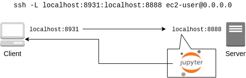
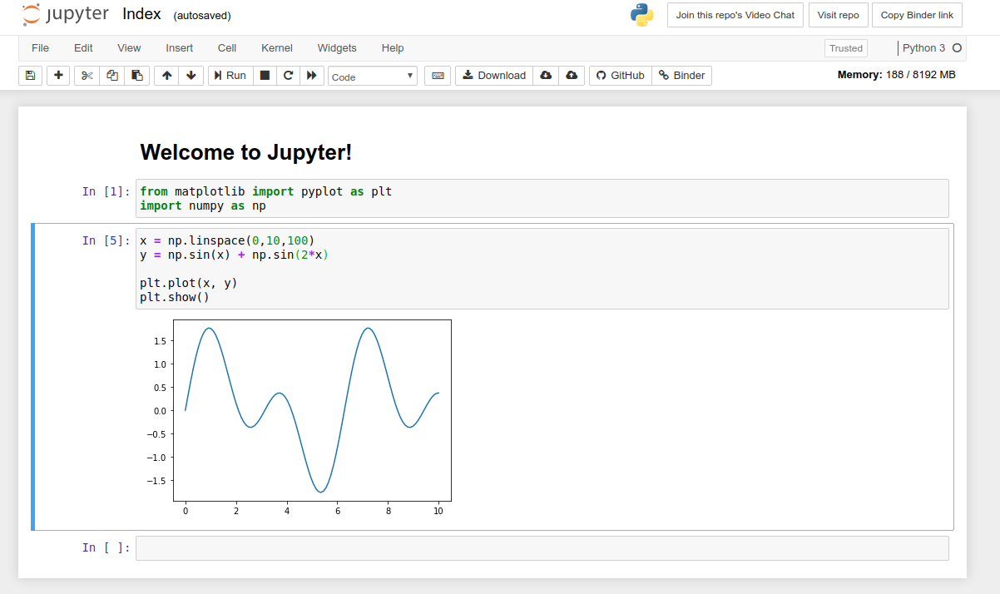
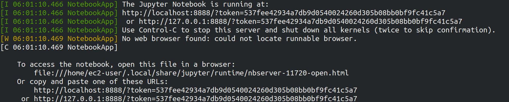

[[sec_jupyter_and_deep_learning]]
== Hands-on #2: Running Deep Learning on AWS

[[sec:jupyter_and_deep_learning_setup]]
=== Preparation

In the second hands-on session, we will launch an EC2 instance equipped with a GPU and practice training and inference of a deep learning model.

The source code for the hands-on is available on GitHub at
https://github.com/tomomano/learn-aws-by-coding/tree/main/handson/mnist[handson/mnist].

To run this hands-on, it is assumed that the preparations described in the first hands-on (<<handson_01_prep>>) have been completed.
There are no other preparations required.

[WARNING]
====
In the initial state of your AWS account, the launch limit for G-type instances may be set to 0.
To check this, open the EC2 dashbord from the AWS console, and select `Limits` from the menu on the left.
The number `Running On-Demand All G instances` in the list indicates the maximum number of G instances that can be started.

If it is set to 0, you need to send a request to increase the limit via the request form.
For details, see
https://docs.aws.amazon.com/AWSEC2/latest/UserGuide/ec2-resource-limits.html[official documentation "Amazon EC2 service quotas"].
====

[WARNING]
====
This hands-on uses a `g4dn.xlarge` type EC2 instance, so it costs 0.71 $/hour in the Tokyo (`ap-northeast-1`) region.
====

=== Reading the application source code

<<handson_02_architecture>> shows an overview of the application we will be deploying in this hands-on.

[[handson_02_architecture]]
.Application architecture
image::imgs/handson-jupyter/handson-02-architecture.png[hands-on 01 architecture, 600, align="center"]

You will notice that many parts of the figure are the same as the application we created in the first hands-on session (<<handson_01_architecture>>).
With a few changes, we can easily build an environment to run deep learning!
The three main changes are as follows.

* Use a `g4dn.xlarge` instance type equipped with a GPU.
* Use a DLAMI (see below) with the programs for deep learning pre-installed.
* Connect to the server using SSH with port forwarding option, and write and execute codes using Jupyter Notebook (see below) running on the server.

Let's have a look at the source code
(https://github.com/tomomano/learn-aws-by-coding/tree/main/handson/mnist/app.py[handson/mnist/app.py]).
The code is almost the same as in the first hands-on.
We will explain only the parts where changes were made.

[source, python, linenums]
----
class Ec2ForDl(core.Stack):

    def __init__(self, scope: core.App, name: str, key_name: str, **kwargs) -> None:
        super().__init__(scope, name, **kwargs)

        vpc = ec2.Vpc(
            self, "Ec2ForDl-Vpc",
            max_azs=1,
            cidr="10.10.0.0/23",
            subnet_configuration=[
                ec2.SubnetConfiguration(
                    name="public",
                    subnet_type=ec2.SubnetType.PUBLIC,
                )
            ],
            nat_gateways=0,
        )

        sg = ec2.SecurityGroup(
            self, "Ec2ForDl-Sg",
            vpc=vpc,
            allow_all_outbound=True,
        )
        sg.add_ingress_rule(
            peer=ec2.Peer.any_ipv4(),
            connection=ec2.Port.tcp(22),
        )

        host = ec2.Instance(
            self, "Ec2ForDl-Instance",
            instance_type=ec2.InstanceType("g4dn.xlarge"), # <1>
            machine_image=ec2.MachineImage.generic_linux({
                "us-east-1": "ami-060f07284bb6f9faf",
                "ap-northeast-1": "ami-09c0c16fc46a29ed9"
            }), # <2>
            vpc=vpc,
            vpc_subnets=ec2.SubnetSelection(subnet_type=ec2.SubnetType.PUBLIC),
            security_group=sg,
            key_name=key_name
        )
----

<1> Here, we have selected the `g4dn.xlarge` instance type (in the first hands-on, it was `t2.micro`).
As already mentioned in <<sec_scientific_computing>>, the `g4dn.xlarge` is an instance with a low-cost model GPU called `NVIDIA T4`.
It has 4 CPU cores and 16GB of main memory.
<2> Here, we are using
https://docs.aws.amazon.com/dlami/latest/devguide/what-is-dlami.html[Deep Learning Amazon Machine Image; DLAMI],
an AMI with varisous programs for deep learning pre-installed.
Note that in the first hands-on, we used an AMI called Amazon Linux.
The ID of the AMI must be specified for each region, and here we are supplying IDs for `us-east-1` and `ap-northeast-1`.

[WARNING]
====
In the code above, the AMI IDs are only defined in `us-east-1` and `ap-northeast-1`.
If you want to use other regions, you need to search for the AMI ID yourself and write it in the code.
====

==== DLAMI (Deep Learning Amazon Machine Image)

**AMI (Amazon Machine Image)** is a concept that roughly corresponds to an OS (Operating System).
Naturally, a computer cannot do anything without an OS, so it is necessary to "install" some kind of OS whenever you start an EC2 instance.
The equivalent of the OS that is loaded in EC2 instance is the AMI.
For example, you can choose https://ubuntu.com/[Ubuntu] AMI to launch your EC2 instance.
As alternative options, you can select Windows Server AMI or
https://aws.amazon.com/amazon-linux-ami/[Amazon Linux] AMI,
which is optimized for use with EC2.

However, it is an oversimplification to understand AMI as just an OS.
AMI can be the base (empty) OS, but AMI can also be an OS with custom programs already installed.
If you can find an AMI that has the necessary programs installed, you can save a lot of time and effort in installing and configuring the environment yourself.
To give a concrete example, in the first hands-on session, we showed an example of installing Python 3.6 on an EC2 instance, but doing such an operation every time the instance is launched is tedious!

In addition to the official AWS AMIs, there are also AMIs provided by third parties.
It is also possible to create and register your own AMI
(see https://docs.aws.amazon.com/AWSEC2/latest/UserGuide/creating-an-ami-instance-store.html[official documentation]).
You can search for AMIs from the EC2 dashboard.
Alternatively, you can use the AWS CLI to obtain a list with the following command (also see https://docs.aws.amazon.com/AWSEC2/latest/UserGuide/finding-an-ami.html[official documentation]).

[source, bash]
----
$ aws ec2 describe-images --owners amazon
----

https://docs.aws.amazon.com/dlami/latest/devguide/what-is-dlami.html[DLAMI (Deep Learning AMI)]
is an AMI pre-packaged with deep learning tools and programs.
DLAMI comes with popular deep learning frameworks and libraries such as `TensorFlow` and `PyTorch`, so you can run deep learning applications immediately after launching an EC2 instance.

In this hands-on, we will use a DLAMI based on Amazon Linux 2 (AMI ID = ami-09c0c16fc46a29ed9).
Let's use the AWS CLI to get the details of this AMI.

[source, bash]
----
$ aws ec2 describe-images --owners amazon --image-ids "ami-09c0c16fc46a29ed9"
----

[[handson_02_ami-info]]
.Details of the AMI (ID = ami-09c0c16fc46a29ed9)
image::imgs/handson-jupyter/ami-info.png[ami-info, 700, align="center"]

You should get an output like <<handson_02_ami-info>>.
From the output, we can see that the DLAMI has PyTorch versions 1.4.0 and 1.5.0 installed.

[TIP]
====
What exactly is installed in DLAMI?
For the interested readers, here is a brief explanation
(Reference: https://docs.aws.amazon.com/dlami/latest/devguide/what-is-dlami.html[official documentation "What Is the AWS Deep Learning AMI?"]).

At the lowest level, the GPU driver is installed.
Without the GPU driver, the OS cannot exchange commands with the GPU.
The next layer is
https://developer.nvidia.com/about-cuda[CUDA]
and
https://developer.nvidia.com/cudnn[cuDNN].
CUDA is a language developed by NVIDIA for general-purpose computing on GPUs, and has a syntax that extends the C++ language.
cuDNN is a deep learning library written in CUDA, which implements operations such as n-dimensional convolution.
This is the content of the "Base" DLAMI.

The "Conda" DLAMI has libraries such as `TensorFlow` and `PyTorch` installed on top of the "Base" environment.
In addition, by using the virtual Python environment tool called
https://docs.conda.io/projects/conda/en/latest/index.html[Anaconda],
users can easily switch between the environments for `TensorFlow`, `PyTorch`, `MxNet`, and so on
(we will use this feature later in the hands-on session).
Jupyter Notebook is also already installed.
====

=== Deploying the application

Now that we understand the application source code, let's deploy it.

The deployment procedure is almost the same as the first hands-on.
Here, only the commands are listed (lines starting with `#` are comments).
If you have forgotten the meaning of each command, review the first hands-on.
You should not forget to set the access key (<<aws_cli_install>>).

[source, bash]
----
# move to the project directory
$ cd handson/mnist

# create venv and install dependent libraries
$ python3 -m venv .env
$ source .env/bin/activate
$ pip install -r requirements.txt

# Generate SSH key
$ export KEY_NAME="OpenSesame"
$ aws ec2 create-key-pair --key-name ${KEY_NAME} --query 'KeyMaterial' --output text > ${KEY_NAME}.pem
$ mv OpenSesame.pem ~/.ssh/
$ chmod 400 ~/.ssh/OpenSesame.pem

# Deploy!
$ cdk deploy -c key_name="OpenSesame"
----

[WARNING]
====
If you did not delete the SSH key you created in the first hands-on, you do not need to create another SSH key.
Conversely, if an SSH with the same name already exists, the key generation command will output an error.
====

If the deployment is executed successfully, you should get an output like <<handson_02_cdk_output>>.
Note the IP address of your instance (the string following `InstancePublicIp`).

[[handson_02_cdk_output]]
.Output of `cdk deploy`
image::imgs/handson-jupyter/cdk_output.png[cdk output, 700, align="center"]

=== Log in to the instance

Let's log in to the deployed instance using SSH.
To connect to Jupyter Notebook, which we will be using later, we must log in with the **port forwarding** option (`-L`).

[source, bash]
----
$ ssh -i ~/.ssh/OpenSesame.pem -L localhost:8931:localhost:8888 ec2-user@<IP address>
----

Port forwarding means that the connection to a specific address on the client machine is forwarded to a specific address on the remote machine via SSH encrypted communication.
The option `-L localhost:8931:localhost:8888` means to forward the access to `localhost:8931` of your local machine to the address of `localhost:8888` of the remote server
(The number following `:` specifies the TCP/IP port number).
On port 8888 of the remote server, Jupyter Notebook (described below) is running.
Therefore, you can access Jupyter Notebook on the remote server by accessing `localhost:8931` on the local machine (<<fig:ssh_port_forwarding>>).
This type of SSH connection is called a **tunnel connection**.

[[fig:ssh_port_forwarding]]
.Accessing Jupyter Notebook with SSH port forwarding

[NOTE]
====
In the port forwarding options, the port number (`:8931`, `:8888`, etc.) can be any integer between 1 and 65535.
Note, however, that some port numbers are already in use, such as port 22 (SSH) and port 80 (HTTP).

Jupyter Notebook uses port 8888 by default.
Therefore, it is recommended to use port 8888 for the remote side.
====

[WARNING]
====
Don't forget to assign the IP address of your instance to the `<IP address>` part of the SSH login command.
====

[WARNING]
====
**For those who have done deployment using Docker:**

SSH login must be done from **outside of Docker**.
This is because the web browser that opens Jupyter is outside of Docker.
====

After logging in via SSH, let's check the status of the GPU.
Run the following command.

[source, bash]
----
$ nvidia-smi
----

You should get output like <<handson_02_nvidia-smi>>.
The output shows that one Tesla T4 GPU is installed.
Other information such as the GPU driver, CUDA version, GPU load, and memory usage can be checked.

[[handson_02_nvidia-smi]]
.Output of `nvidia-smi`
image::imgs/handson-jupyter/nvidia-smi.png[nvidia-smi, 700, align="center"]

=== Launching Jupyter Notebook

https://jupyter.org/[Jupyter Notebook]
is a tool for writing and running Python programs interactively.
Jupyter is accessed via a web browser, and can display plots and table data beautifully as if you were writing a notebook (<<handson_02_welcome_jupyter>>).
If you are familiar with Python, you have probably used it at least once.

[[handson_02_welcome_jupyter]]
.Jupyter Notebook GUI

In this hands-on session, we will run a deep learning program interactively using Jupyter Notebook.
Jupyter is already installed on DLAMI, so you can start using it without any configuration.

Now, let's start Jupyter Notebook server.
On the EC2 instance where you logged in via SSH, run the following command.

[source, bash]
----
$ cd ~ # go to home directory
$ jupyter notebook
----

When you run this command, you will see output like <<handson_02_jupyter_launch>>.
From this output, we can see that the Jupyter server is launched at the address `localhost:8888` of the EC2 instance.
The string `?token=XXXX` following `localhost:8888` is a temporary token used for accessing Jupyter.

[[handson_02_jupyter_launch]]
.Launching Jupyter Notebook server

[NOTE]
====
When you start Jupyter Notebook for the first time, it may take a few minutes to start up.
Other operations are also slow immediately after startup, but after running a few commands, the system becomes agile and responsive.
This phenomenon is thought to be caused by the way the AWS operates the virtual machines with GPUs.
====

Since the port forwarding option was added to the SSH connection, you can access `localhost:8888`, where Jupyter is running, from `localhost:8931` on your local machine.
Therefore, to access Jupyter from the local machine, you can access the following address from a web browser (Chrome, FireFox, etc.).

[source]
----
http://localhost:8931/?token=XXXX
----

Remember to replace `?token=XXXX` with the actual token that was issued when Jupyter server was started above.

If you access the above address, the Jupyter home screen should be loaded (<<handson_02_jupyter_home>>).
Now, Jupyter is ready!

[[handson_02_jupyter_home]]
.Jupyter home screen
image::imgs/handson-jupyter/jupyter_home.png[jupyter home, 700, align="center"]

[NOTE]
====
Minimalistic guide to Jupyter Notebook

* `Shift` + `Enter`: execute a cell
* `Esc`: Switch to **Command mode**.
* Click "+" button on the menu bar or press `A` while in command mode => Add a new cell
* Click "Scissors" button on the menu bar or press `X` while in command mode => delete a cell

For a list of shortcuts, see the
https://towardsdatascience.com/jypyter-notebook-shortcuts-bf0101a98330[blog by Ventsislav Yordanov].
====

=== Introduction to PyTorch

https://pytorch.org/[PyTorch] is an open source deep learning library that is being developed by the Facebook AI Research LAB (FAIR).
PyTorch is one of the most popular deep learning libraries at the time of writing, and is being used by Tesla in their self-driving project, to name a few.
In this hands-on session, we will use PyTorch to practice deep learning.

[TIP]
====
A Brief History of PyTorch

In addition to PyTorch, Facebook has been developing a deep learning framework called Caffe2
(The original Caffe was created by Yangqing Jia, a PhD student at UC Berkley).
Caffe2 was merged into the PyTorch project in 2018.

In December 2019, it was also announced that https://chainer.org/[Chainer], which was developed by Preferred Networks in Japan, will also end its development and collaborate with the PyTorch development team.
(For more information, see https://chainer.org/announcement/2019/12/05/released-v7-ja.html[press release]).
PyTorch has a number of APIs that were inspired by Chainer even before the integration, and the DNA of Chainer is still being carried over to PyTorch...!
====

Before we move on to some serious deep learning calculations, let's use the PyTorch library to get a feel for what it is like to run computations on the GPU.

First, we'll create a new notebook.
Click "New" in the upper right corner of the Jupyter home screen, select the environment "conda_pytorch_p36", and create a new notebook (<<handson_02_jupyeter_new>>).
In the "conda_pytorch_p36" virtual environment, PyTorch is already installed.

[[handson_02_jupyeter_new]]
.Creating a new notebook. Be sure to select "conda_pytorch_p36" environment.
image::imgs/handson-jupyter/jupyter_new.png[jupyter_new, 700, align="center"]

Here, we will write and execute the following program (<<handson_02_jupyeter_pytorch>>).

[[handson_02_jupyeter_pytorch]]
.Introduction to PyTorch
image::imgs/handson-jupyter/jupyter_pytorch.png[jupyter_pytorch, 700, align="center"]

First, we import PyTorch.
In addition, we check that the GPU is available.

[source, python, linenums]
----
import torch
print("Is CUDA ready?", torch.cuda.is_available())
----

Output:
[source]
----
Is CUDA ready? True
----

Next, let's create a random 3x3 matrix `x` on **CPU**.

[source, python, linenums]
----
x = torch.rand(3,3)
print(x)
----

Output:
[source]
----
tensor([[0.6896, 0.2428, 0.3269],
        [0.0533, 0.3594, 0.9499],
        [0.9764, 0.5881, 0.0203]])
----

Next, we create another matrix `y` on **GPU**.
We also move the matrix `x` on **GPU**.

[source, python, linenums]
----
y = torch.ones_like(x, device="cuda")
x = x.to("cuda")
----

Then, we perform the addition of the matrix `x` and `y` on **GPU**.

[source, python, linenums]
----
z = x + y
print(z)
----

Output:
[source]
----
tensor([[1.6896, 1.2428, 1.3269],
        [1.0533, 1.3594, 1.9499],
        [1.9764, 1.5881, 1.0203]], device='cuda:0')
----

Lastly, we bring the matrix on GPU back on CPU.

[source, python, linenums]
----
z = z.to("cpu")
print(z)
----

Output:
[source]
----
tensor([[1.6896, 1.2428, 1.3269],
        [1.0533, 1.3594, 1.9499],
        [1.9764, 1.5881, 1.0203]])
----

The above examples are just the rudiments of GPU-based computation, but we hope you get the idea.
The key is to explicitly exchange data between the CPU and GPU.
This example demonstrated an operation on 3x3 matrix, so the benefit of using GPU is almost negligible.
However, when the size of the matrix is in the thousands or tens of thousands, the GPU becomes much more powerful.

[NOTE]
====
The finished Jupyter Notebook is available at
https://github.com/tomomano/learn-aws-by-coding/blob/main/handson/mnist/pytorch/pytorch_get_started.ipynb[/handson/mnist/pytorch/ pytorch_get_started.ipynb].
You can upload this file by clicking "Upload" in the upper right corner of the Jupyter window, and run the code.

However, it is more effective to write all the code by yourself when you study.
That way the code and concepts will stick in your memory better.
====

Let's benchmark the speed of the GPU and the CPU and compare the performance.
We will use Jupyter's
https://ipython.readthedocs.io/en/stable/interactive/magics.html[%time]
magic command to measure the execution time.

First, using the CPU, let's measure the speed of computing the matrix product of a 10000x10000 matrix.
Continuing from the notebook we were just workin with, paste the following code and run it.

[source, python, linenums]
----
s = 10000
device = "cpu"
x = torch.rand(s, s, device=device, dtype=torch.float32)
y = torch.rand(s, s, device=device, dtype=torch.float32)

%time z = torch.matmul(x,y)
----

The output should look something like shown below.
This means that it took 5.8 seconds to compute the matrix product (note that the measured time varies with each run).

[source]
----
CPU times: user 11.5 s, sys: 140 ms, total: 11.6 s
Wall time: 5.8 s
----

Next, let's measure the speed of the same operation performed on the GPU.

[source, python, linenums]
----
s = 10000
device = "cuda"
x = torch.rand(s, s, device=device, dtype=torch.float32)
y = torch.rand(s, s, device=device, dtype=torch.float32)
torch.cuda.synchronize()

%time z = torch.matmul(x,y); torch.cuda.synchronize()
----

The output should look something like shown below.
This time, the computation was completed in 553 milliseconds!

[source]
----
CPU times: user 334 ms, sys: 220 ms, total: 554 ms
Wall time: 553 ms
----

[TIP]
====
In PyTorch, operations on the GPU are performed **asynchronously**.
For this reason, the benchmark code above embeds the statement `torch.cuda.synchronize()`.
====

From this benchmark, we were able to observe **about 10 times speedup** by using the GPU.
The speed-up performance depends on the type of operation and the size of the matrix.
The matrix product is one of the operations where the speedup is expected to be highest.

[[sec_mnist_using_jupyter]]
=== MNIST Handwritten Digit Recognition Task

Now that we have covered the concepts and prerequisites for deep learning computations on AWS, it's time to run a real deep learning application.

In this section, we will deal with one of the most elementary and famous machine learning tasks, **handwritten digit recognition using the MNIST dataset** (<<handson_02_mnist_examples>>).
This is a simple task where we are given images of handwritten numbers from 0 to 9 and try to guess what the numbers are.

[[handson_02_mnist_examples]]
.MNIST handwritten digit dataset
image::imgs/handson-jupyter/mnist_examples.png[mnist_examples, 400, align="center"]

Here, we will use **Convolutional Neural Network (CNN)** to solve the MNIST task.
The source code is available on GitHub at
https://github.com/tomomano/learn-aws-by-coding-source-code/tree/main/handson/mnist/pytorch[/handson/minist/pytorch/].
The relevant files are `mnist.ipynb` and `simple_mnist.py` in this directory.
This program is based on
https://github.com/pytorch/examples/tree/master/mnist[PyTorch's official example project collection],
with some modifications.

First, let's upload `simple_mnist.py`, which contains custom classes and functions (<<handson_02_jupyter_upload>>).
Go to the home of the Jupyter, click on the "Upload" button in the upper right corner of the screen, and select the file to upload.
Inside this Python program, we defined the CNN model and the parameter optimization method.
We won't explain the contents of the program, but readers interested in the subject can read the source code and learn for themselves.

[[handson_02_jupyter_upload]]
.Uploading `simple_mnist.py`
image::imgs/handson-jupyter/jupyter_upload.png[jupyter upload, 600, align="center"]

Once you have uploaded `simple_mnist.py`, you can create a new notebook.
Be sure to select the "conda_pytorch_p36" environment.

Once the new notebook is up and running, let's import the necessary libraries first.

[source, python, linenums]
----
import torch
import torch.optim as optim
import torchvision
from torchvision import datasets, transforms
from matplotlib import pyplot as plt

# custom functions and classes
from simple_mnist import Model, train, evaluate
----

The
https://pytorch.org/docs/stable/torchvision/index.html[torchvision]
package contains some useful functions, such as loading MNIST datasets.
The above code also imports custom classes and functions (`Model`, `train`, `evaluate`) from `simple_mnist.py` that we will use later.

Next, we download the MNIST dataset.
At the same time, we are normalizing the intensity of the images.

[source, python, linenums]
----
transf = transforms.Compose([transforms.ToTensor(),
                             transforms.Normalize((0.1307,), (0.3081,))])

trainset = datasets.MNIST(root='./data', train=True, download=True, transform=transf)
trainloader = torch.utils.data.DataLoader(trainset, batch_size=64, shuffle=True)

testset = datasets.MNIST(root='./data', train=False, download=True, transform=transf)
testloader = torch.utils.data.DataLoader(testset, batch_size=1000, shuffle=True)
----

The MNIST dataset consists of 28x28 pixel monochrome square images and corresponding labels (numbers 0-9).
Let's extract some of the data and visualize them.
You should get an output like <<handson_02_mnist_ground_truth>>.

[source, python, linenums]
----
examples = iter(testloader)
example_data, example_targets = examples.next()

print("Example data size:", example_data.shape)

fig = plt.figure(figsize=(10,4))
for i in range(10):
    plt.subplot(2,5,i+1)
    plt.tight_layout()
    plt.imshow(example_data[i][0], cmap='gray', interpolation='none')
    plt.title("Ground Truth: {}".format(example_targets[i]))
    plt.xticks([])
    plt.yticks([])
plt.show()
----

[[handson_02_mnist_ground_truth]]
.Examples of MNIST dataset
image::imgs/handson-jupyter/mnist_ground_truth.png[mnist_ground_truth, 700, align="center"]

Next, we define the CNN model.

[source, python, linenums]
----
model = Model()
model.to("cuda") # load to GPU
----

The `Model` class is defined in `simple_mnist.py`.
We will use a network with two convolutional layers and two fully connected layers, as shown in <<handson_02_cnn_architecture>>.
The output layer is the Softmax function, and the loss function is the negative log likelihood function (NLL).

[[handson_02_cnn_architecture]]
.Architecture of the CNN we will be using in this hands-on
image::imgs/handson-jupyter/cnn_architecture.png[cnn architecture, 700, align="center"]

Next, we define an optimization algorithm to update the parameters of the CNN.
We use the **Stochastic Gradient Descent (SGD)** method.

[source, python, linenums]
----
optimizer = optim.SGD(model.parameters(), lr=0.01, momentum=0.5)
----

Now, we are ready to go.
Let's start the CNN training loop!

[source, python, linenums]
----
train_losses = []
for epoch in range(5):
    losses = train(model, trainloader, optimizer, epoch)
    train_losses = train_losses + losses
    test_loss, test_accuracy = evaluate(model, testloader)
    print(f"\nTest set: Average loss: {test_loss:.4f}, Accuracy: {test_accuracy:.1f}%\n")

plt.figure(figsize=(7,5))
plt.plot(train_losses)
plt.xlabel("Iterations")
plt.ylabel("Train loss")
plt.show()
----

In this example, we are training for 5 epochs.
Using a GPU, computation like this can be completed in about a minute.

The output should be a plot similar to <<handson_02_train_loss>>.
You can see that the value of the loss function is decreasing (i.e. the accuracy is improving) as the iteration proceeds.

[[handson_02_train_loss]]
.Change of the train loss as learning proceeds
image::imgs/handson-jupyter/train_loss.png[train_loss, 500, align="center"]

Let's visualize the inference results of the learned CNN.
By running the following code, you should get an output like <<handson_02_mnist_mnist_prediction>>.
If you closely look at this figure, the second one from the right in the bottom row looks almost like a "1", but it is correctly inferred as a "9".
It looks like we have managed to create a pretty smart CNN!

[source, python, linenums]
----
model.eval()

with torch.no_grad():
    output = model(example_data.to("cuda"))

fig = plt.figure(figsize=(10,4))
for i in range(10):
    plt.subplot(2,5,i+1)
    plt.tight_layout()
    plt.imshow(example_data[i][0], cmap='gray', interpolation='none')
    plt.title("Prediction: {}".format(output.data.max(1, keepdim=True)[1][i].item()))
    plt.xticks([])
    plt.yticks([])
plt.show()
----

[[handson_02_mnist_mnist_prediction]]
.Inference results of the learned CNN
image::imgs/handson-jupyter/mnist_prediction.png[mnist_prediction, 700, align="center"]

Finally, we save the parameters of the trained neural network as a file named `mnist_cnn.pt`.
This way, you can reproduce the learned model and use it for another experiment anytime in the future.

[source, python, linenums]
----
torch.save(model.state_dict(), "mnist_cnn.pt")
----

That's it!
We have experienced all the steps to set up a virtual server in the AWS cloud and perform the deep learning computation.
Using the GPU instance in the cloud, we were able to train a neural network to solve the MNIST digit recognition task.
Interested readers can use this hands-on as a template to run their own deep learning applications.

=== Deleting the stack

Now we are done with the GPU instance.
Before the EC2 cost builds up, we should delete the instance we no longer use.

As in the first hands-on session, we can delete the instance using the AWS CloudFormation console, or using the AWS CLI (see <<handson_01_delete_stack>>).

[source, bash]
----
$ cdk destroy
----

[IMPORTANT]
====
**Make sure you delete your stack after the exercise!**
If you do not do so, you will continue to be charged for the EC2 instance!
`g4dn.xlarge` is priced at $0.71 / hour, so if you keep it running for a day, you'll be charged about $17!
====

****
**AWS budget alert**

One of the most common mistakes that AWS beginners (and even experienced users) make is to forget to stop an instance, leaving unattended resources in the cloud, and receiving a huge bill at the end of the month.
Especially during development, these error often occur and you should be prepared for this kind of situation to happen.
In order to prevent such a situation, a function called **AWS Budgets** is provided free of charge.
By using AWS Budgets, you can set up alerts such as sending an email to users when their monthly usage exceeds a certain threshold.
For detailed instructions, please refer to the
https://aws.amazon.com/blogs/aws-cost-management/getting-started-with-aws-budgets/[official AWS blog "Getting Started with AWS Budgets"].
Now is a good oportunity for you to set up alerts on your account.
****

