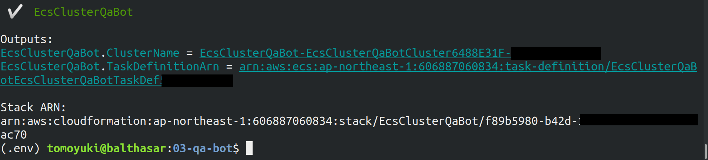
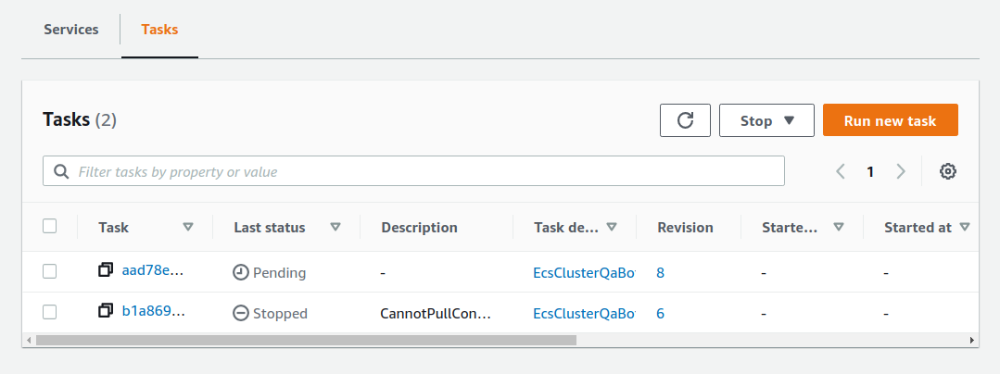
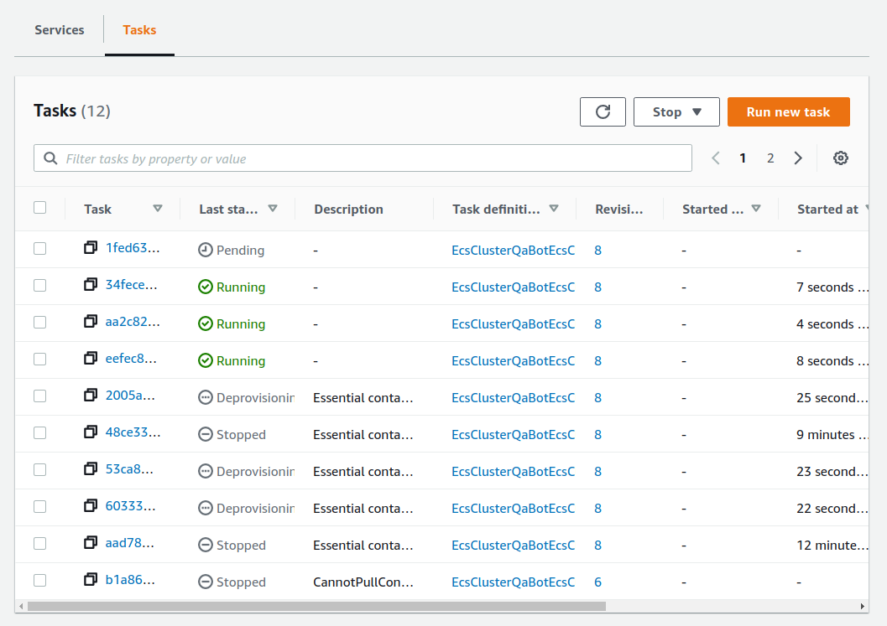

[[sec_fargate_qabot]]
== Hands-on #3: Deploying a question-answering bot on AWS

In the third hands-on session, we will implement a machine learning application using Docker and ECS.
Specifically, we will create an automatic question-answering bot that generates answers to questions given by the client by performing natural language processing.
By using ECS, we will build a system that dynamically controls the number of instances according to the number of jobs, and executes tasks in parallel.

[NOTE]
====
In a typical machine learning workflow, the normal workflow is model training followed by inference (application to data).
However, training models using EC2 clusters with GPUs is a little advanced, so it will be covered in the next sectopm (<<sec_aws_batch>>).
This section introduces the parallelization of the inference using Fargate clusters, which can be implemented in a simpler program.
This way you can familiarize yourself with the concepts of building clusters and managing tasks in the cloud.
====

=== Fargate

Before getting into the hands-on exercuse, we need to learn about **Fargate**(<<fig:fargate_logo>>).

[[fig:fargate_logo]]
.Fargate icon
image::imgs/aws_logos/Fargate.png[Fargate, 100]

Let's look again at <<ecs_overview>>, which gives an overview of ECS.
This figure shows a cluster under the control of ECS, and there are two choices which carry out the computation in the cluster: either EC2 or Fargate.
In the case of using EC2, the instance is launched in the same way as described in the previous sections (<<sec_first_ec2>>, <<sec_jupyter_and_deep_learning>>).
However, the technical difficulty of creating and managing a compute cluster using EC2 is rather high, so we will explain it in the next section (<<sec_aws_batch>>).

Fargate is a mechanism for running **container-based computational tasks**, designed specifically for use in **ECS**.
In terms of running computation, its role is similar to that of EC2, but Fargate does not have a physical entity like an EC2 instance.
It means that, for example, logging in via SSH is basically not expected in Fargate, and there is no operations like "installing software".
In Fargate, all computation is executed via Docker containers.
Namely, to use Fargate, the user first prepares the Docker image, and then Fargate executes the computational task by using the `docker run` command.
When Fargate is specified as an ECS cluster, operations such as scaling can be built with a simple configuration and program.

Similar to EC2, Fargate allows you to specify the size of the CPU and memory as needed.
At the time of writing, you can choose between 0.25 and 4 cores for vCPU power, and 0.5 and 30 GB for RAM (for details, see
https://docs.aws.amazon.com/AmazonECS/latest/developerguide/AWS_Fargate.html[Official Documentation "Amazon ECS on AWS Fargate"]]).
Despite the ease of scaling clusters, Fargate does not allow for a large vCPU counts or RAM capacity, nor does it allow for the use of GPUs.  as in EC2 instances.

So that was an overview of Fargate, but it may not be easy to understand it all in words.
From here on, let us learn how to work with ECS and Fargate by writing a real program to deploy parallel computing system.

[TIP]
====
Strictly speaking, it is also possible to use a hybrid of EC2 and Fargate for the clusters attached to the ECS.
====

=== Preparations

The source code of the hands-on is available on GitHub at
https://github.com/tomomano/learn-aws-by-coding/tree/main/handson/qa-bot[handson/qa-bot].

To run this hands-on, it is assumed that the preparations described in the first hands-on (<<handson_01_prep>>) have been completed.
It is also assumed that Docker is already installed on your local machine.

[WARNING]
====
For this hands-on, we will use a 1CPU/4GB RAM Fargate instance.
Note that this will cost 0.025 $/hour to run the computation.
====

=== A question-answering bot using Transformer

Let's define more concretely the automatic question answering system that we will develop in this hands-on session.
Assume that we are given the following context and question.

----
context: Albert Einstein (14 March 1879 – 18 April 1955) was a German-born theoretical physicist who developed the theory of relativity, one of the two pillars of modern physics (alongside quantum mechanics). His work is also known for its influence on the philosophy of science. He is best known to the general public for his mass–energy equivalence formula E = mc2, which has been dubbed \"the world's most famous equation\". He received the 1921 Nobel Prize in Physics \"for his services to theoretical physics, and especially for his discovery of the law of the photoelectric effect\", a pivotal step in the development of quantum theory.

question: In what year did Einstein win the Nobel prize?
----

The automatic answering system we are going to create will be able to find the correct answer to such a question, given the context.
To make the problem a bit easier, the answer is selected from the string contained in the context.
For example, for the above question, the system should return the following answer.

----
answer: 1921
----

While it is trivial for humans to understand such sentences, it is easy to imagine how difficult it would be for a computer to solve them.
However, recent progress in natural language processing using deep learning has made remarkable progress, and it is possible to create models that can solve this problem with an extremely high accuracy.

In this hands-on, we will use the pre-trained language model provided by
https://github.com/huggingface/transformers[huggingface/transformers].
This model is supported by a natural language processing model called
https://en.wikipedia.org/wiki/Transformer_(machine_learning_model)[Transformer]
We packaged this model in a Docker image, and the image is available at the author's
https://hub.docker.com/repository/docker/tomomano/qabot[Docker Hub repository].
Before we start designing the cloud system, let's test this Docker image on the local machine.

[[transformer_architecture]]
.Transformer (image source: https://arxiv.org/abs/1706.03762[Vaswani+ 2017])
image::imgs/transformer.png[transformer, 400, align="center"]

[NOTE]
====
Since we are using a pre-trained model, all we need to do is to feed the given input into the model and make a prediction (inference).
Since the inference operations can be done quickly enough on a CPU alone, we will not use a GPU in this hands-on session to reduce the cost and simplify the implementation.
In general, training is much more computationally expensive for neural nets, and the GPU is more powerful in such cases.
====

Use the following command to download (pull) the Docker image to your local machine.

[source, bash]
----
$ docker pull tomomano/qabot:latest
----

Now, let's submit a question to this Docker image.
First, define the context and question as command line variables.

[source, bash]
----
$ context="Albert Einstein (14 March 1879 – 18 April 1955) was a German-born theoretical physicist who developed the theory of relativity, one of the two pillars of modern physics (alongside quantum mechanics). His work is also known for its influence on the philosophy of science. He is best known to the general public for his mass–energy equivalence formula E = mc2, which has been dubbed the world's most famous equation. He received the 1921 Nobel Prize in Physics for his services to theoretical physics, and especially for his discovery of the law of the photoelectric effect, a pivotal step in the development of quantum theory."
$ question="In what year did Einstein win the Nobel prize ?"
----

Then, use the following command to run the container.

[source, bash]
----
$ docker run tomomano/qabot "${context}" "${question}" foo --no_save
----

The Docker image we prepared accepts the context as the first argument and the question as the second argument.
The third and fourth arguments are for implementation purposes when deploying to the cloud, so don't worry about them for now.

When you execute this command, you should get the following output.

----
{'score': 0.9881729286683587, 'start': 437, 'end': 441, 'answer': '1921'}
----

"score" is a number that indicates the confidence level of the answer, in the range [0,1].
"start" and "end" indicate the starting and ending position in the context where the answer is, and "answer" is the string predicted as the answer.
Notice that the correct answer, "1921", was returned.

Let us ask a more difficult question.

[source, bash]
----
$ question="Why did Einstein win the Nobel prize ?"
$ docker run tomomano/qabot "${context}" "${question}" foo --no_save
----

Output:

----
{'score': 0.5235594527494207, 'start': 470, 'end': 506, 'answer': 'his services to theoretical physics,'}
----

This time, the score is 0.52, indicating that the bot is a little unsure of the answer, but it still got the right answer.

As you can see, by using a language model supported by deep learning, we have been able to create a Q&A bot that can be useful in practical applications.
In the following sections, we will design a system that can automatically respond to a large number of questions by deploying this program in the cloud.

[TIP]
====
The question & answering system used in this project uses a Transformer-based language model called DistilBERT.
Interested readers can refer to
https://arxiv.org/abs/1910.01108[original paper].
For documentation of the DistilBert implementation by huggingface/transformers, see
https://huggingface.co/transformers/model_doc/distilbert.html[official documentation].
====

[TIP]
====
The source code for the Q-A bot Docker image is available at
https://github.com/tomomano/learn-aws-by-coding/blob/main/handson/qa-bot/docker/Dockerfile[GitHub].
====

=== Reading the application source code

<<handson_03_architecture>> shows an overview of the application we are creating in this hands-on.

[[handson_03_architecture]]
.Application architecture
image::imgs/handson-03/handson-03-architecture.png[hands-on 03 architecture, 600, align="center"]

The summary of the system design is as follows:

* The client sends a question to the application on AWS.
* The task to solve the submitted question is handled by ECS.
* ECS downloads an image from Docker Hub.
* ECS then launches a new Fargate instance in the cluster and places the downloaded Docker image in this new instance
** One Fargate instance is launched for each question so that multiple questions can be processed in parallel.
* The job is executed. The results of the job (the answers to the questions) are written to the DynamoDB database.
* Finally, the client reads the answers to the questions from DynamoDB.

Now let us take a look at the main application code
(https://github.com/tomomano/learn-aws-by-coding/blob/main/handson/qa-bot/app.py[handson/qa-bot/app.py]).

[source, python, linenums]
----
class EcsClusterQaBot(Stack):

    def __init__(self, scope: Construct, construct_id: str, **kwargs) -> None:
        super().__init__(scope, construct_id, **kwargs)

        # <1>
        # dynamoDB table to store questions and answers
        table = dynamodb.Table(
            self, "EcsClusterQaBot-Table",
            partition_key=dynamodb.Attribute(
                name="item_id", type=dynamodb.AttributeType.STRING
            ),
            billing_mode=dynamodb.BillingMode.PAY_PER_REQUEST,
            removal_policy=cdk.RemovalPolicy.DESTROY
        )

        # <2>
        vpc = ec2.Vpc(
            self, "EcsClusterQaBot-Vpc",
            max_azs=1,
        )

        # <3>
        cluster = ecs.Cluster(
            self, "EcsClusterQaBot-Cluster",
            vpc=vpc,
        )

        # <4>
        taskdef = ecs.FargateTaskDefinition(
            self, "EcsClusterQaBot-TaskDef",
            cpu=1024, # 1 CPU
            memory_limit_mib=4096, # 4GB RAM
        )

        # grant permissions
        table.grant_read_write_data(taskdef.task_role)
        taskdef.add_to_task_role_policy(
            iam.PolicyStatement(
                effect=iam.Effect.ALLOW,
                resources=["*"],
                actions=["ssm:GetParameter"]
            )
        )

        # <5>
        container = taskdef.add_container(
            "EcsClusterQaBot-Container",
            image=ecs.ContainerImage.from_registry(
                "tomomano/qabot:latest"
            ),
        )
----

<1> Here, we are preparing a database to write the results of the answers.
DynamoDB will be covered in the sections on the serverless architecture (<<sec_serverless>> and <<sec_intro_serverless>>), so don't worry about it for now.
<2> Here, we define a VPC, as we did in Hands-on #1 and #2.
<3> Here, we define ECS clusters.
A cluster is a pool of virtual servers, and multiple virtual instances are placed in a cluster.
<4> Here, we define the tasks to be executed (**task definition**).
<5> Here, we define the Docker image to be used for executing the task.

==== ECS and Fargate

Let's take a closer look at the code for ECS and Fargate.

[source, python, linenums]
----
cluster = ecs.Cluster(
    self, "EcsClusterQaBot-Cluster",
    vpc=vpc,
)

taskdef = ecs.FargateTaskDefinition(
    self, "EcsClusterQaBot-TaskDef",
    cpu=1024, # 1 CPU
    memory_limit_mib=4096, # 4GB RAM
)

container = taskdef.add_container(
    "EcsClusterQaBot-Container",
    image=ecs.ContainerImage.from_registry(
        "tomomano/qabot:latest"
    ),
)
----

In the line starting with `cluster =`, a empty ECS cluster is created.
Then, `taskdef=ecs.FargateTaskDefinition` creates a new task definition.
Task definition specifies all necessary information to run the task, including the CPU and RAM size.
Here, we will use 1 CPU and 4GB RAM to execute the task.
Also, note that the task defined this way uses one instance per task.

Lastly, in the line starting with `container =`, we are supplying the link to the Docker image to the task definition.
Here, we specify to download an image called `tomomano/qabot` from Docker Hub.

With this just a few lines of code, we can create an ECS cluster which automatically executes the task scheduling and cluster scaling.

[TIP]
====
In the above code, notice the line which says `cpu=1024`.
This number is called CPU units, to which a virtual CPU (vCPU) is assigned according to the conversion table (<<tab:cpu_unit>>).
1024 CPU unit is equivalent to 1 CPU.
Numbers such as 0.25 and 0.5 vCPU mean that 1/4 and 1/2 of the CPU time is effectively allocated, respectively.
The amount of memory that can be used also depends on the CPU unit.
For example, if you select 1024 CPU units, you can only specify the amount of memory in the range of 2 to 8 GB.
For the latest information, see
https://docs.aws.amazon.com/AmazonECS/latest/developerguide/AWS_Fargate.html[official documentation "Amazon ECS on AWS Fargate"].

[[tab:cpu_unit]]
.CPU　unit conversion table
[cols="1,1"]
|===
|CPU unit
|Available memory size

|256 (.25 vCPU)
|0.5 GB, 1 GB, 2 GB

|512 (.5 vCPU)
|1 GB, 2 GB, 3 GB, 4 GB

|1024 (1 vCPU)
|2 GB, 3 GB, 4 GB, 5 GB, 6 GB, 7 GB, 8 GB

|2048 (2 vCPU)
|Between 4 GB and 16 GB in 1-GB increments

|4096 (4 vCPU)
|Between 8 GB and 30 GB in 1-GB increments
|===
====

=== Deploying the application

Now that we understand the application source code, let's deploy it.

The deployment procedure is almost the same as the previous hands-on.
Here, only the commands are listed (lines starting with `#` are comments).
If you have forgotten the meaning of each command, review the first hands-on.
You should not forget to set the access key (<<aws_cli_install>>).

[source, bash]
----
# move to the project directory
$ cd handson/qa-bot

# create venv and install dependent libraries
$ python3 -m venv .env
$ source .env/bin/activate
$ pip install -r requirements.txt

# Deploy!
$ cdk deploy
----

If the deployment is successful, you should see an output like <<handson_03_cdk_output>>.

[[handson_03_cdk_output]]
.Output of `cdk deploy`

Let's log in to the AWS console and check the contents of the deployed stack.
From the console, go to the ECS page, and you should see a screen like <<handson_03_ecs_console>>.
Find the cluster named `EcsClusterQaBot-XXXX`.

Cluster is a unit that binds multiple virtual instances together, as explained earlier.
In the <<handson_03_ecs_console>>, check that under the word FARGATE it says `0 Running tasks` and `0 Pending tasks`.
At this point, no tasks were submitted, so the numbers are all zero.

[[handson_03_ecs_console]]
.ECS console
image::imgs/handson-03/ecs_console.png[ecs_console, 700, align="center"]

Next, find the item `Task Definitions` in the menu bar on the left of this screen, and click on it.
On the destination page, find the item `EcsClusterQaBotEcsClusterQaBotTaskDefXXXX` and open it.
Scroll down the page, and you will find the information shown in <<handson_03_ecs_task_definition>>.
You can check the amount of CPU and memory used, as well as the settings related to the execution of the Docker container.

[[handson_03_ecs_task_definition]]
.Viewing the task definition
image::imgs/handson-03/ecs_task_definition.png[task_definition, 700, align="center"]

=== Executing a task

Now, let's submit a question to the cloud!

Submitting a task to ECS is rather complicated, so I prepared a program (`run_task.py`) to simplify the task submission.
(https://github.com/tomomano/learn-aws-by-coding/blob/main/handson/qa-bot/run_task.py[handson/qa-bot/run_task.py]).

With the following command, you can submit a new question to the ECS cluster.

[source, bash]
----
$ python run_task.py ask "A giant peach was flowing in the river. She picked it up and brought it home. Later, a healthy baby was born from the peach. She named the baby Momotaro." "What is the name of the baby?"
----

[WARNING]
====
In order to run `run_task.py`, make sure that your AWS credentials have been set on the command line.
====

Following "ask" parameter, we supply context and questsions, in this order, as the arguments.

When you run this command, you will see the output "Waiting for the task to finish...", and you will have to wait for a while to get an answer.
During this time, ECS accepts the task, launches a new Fargate instance, and places the Docker image on the instance.
Let's monitor this sequence of events from the AWS console.

Go back to the ECS console screen, and click on the name of the cluster (`EcsClusterQaBot-XXXX`).
Next, open the tab named "Tasks" (<<ecs_task_monitoring>>).
You will see a list of running tasks.

[[ecs_task_monitoring]]
.Monitor the execution status of ECS tasks

As you can see in <<ecs_task_monitoring>>, the "Last status = Pending" indicates that the task is being prepared for execution at this point.
It takes about 1-2 minutes to launch the Fargate instance and deploy the Docker image.

After waiting for a while, the status will change to "RUNNING" and the computation will start.
When the computation is finished, the status changes to "STOPPED" and the Fargate instance is automatically shut down by ECS.

From the <<ecs_task_monitoring>> screen, click on the task ID in the "Task" column to open the task detail screen (<<ecs_task_detail>>).
The task information such as "Last status" and "Platform version" is displayed.
You can also view the execution log of the container by opening the "Logs" tab.

[[ecs_task_detail]]
.ECS task detail
image::imgs/handson-03/ecs_task_detail.png[ecs_task_detail, 700, align="center"]

Now, coming back to the command line where you ran `run_task.py`, you should see an output like <<ask_question_output>>.
The correct answer, "Momotaro", has been returned!

[[ask_question_output]]
.Answer returned by the bot
image::imgs/handson-03/ask_question_output.png[ask_question_output, 700, align="center"]

=== Executing tasks in parallel

The application we have designed here can handle many questions at the same time by using ECS and Fargate.
Now, let's submit many questions at once, and observe the behavior of ECS cluster.
By adding the option `ask_many` to `run_task.py`, you can send multiple questions at once.
The questions are defined in
https://github.com/tomomano/learn-aws-by-coding/blob/main/handson/qa-bot/problems.json[handson/qa-bot/problems.json].

Run the following command.

[source, bash]
----
$ python run_task.py ask_many
----

After executing this command, go to the ECS console and look at the list of tasks (<<ecs_many_tasks>>).
You can see that multiple Fargate instances have been launched and tasks are being executed in parallel.

[[ecs_many_tasks]]
.Submitting parallel tasks to ECS

Make sure that the status of all tasks is "STOPPED", and then get the answer to the question.
To do so, execute the following command.

[source, bash]
----
$ python run_task.py list_answers
----

As a result, you will get an output like <<ask_many_output>>.
You can see that the bot was able to answer complex text questions with a suprisingly high accuracy.

[[ask_many_output]]
.Output of `$ python run_task.py list_answers`
image::imgs/handson-03/ask_many_output.png[ask_many_output, 700, align="center"]

[NOTE]
====
If you keep submitting questions with `run_task.py`, more and more entries will accumulate in the database that records the answers.
To clear all these entries, use the following command.

[source, bash]
----
$ python run_task.py clear
----
====

Congratulations!
You have managed to create a system that can automatically generate answers to questions using deep learning language models!
Importantly, it is a highly scalable system that can handle hundreds of questions simultaneously.
We didn't prepare a GUI (Graphical User Interface) this time, but if we add a simple GUI to this system, it could be operated as a very nice web service.
We didn't add GUI to this cloud system, but with such a tweaking, this system is already useful enough for various purposes.

=== Deleting the stack

This concludes the third hands-on session.
Finally, we must delete the stack.

To delete the stack, login to the AWS console and click the DELETE button on the CloudFormation screen.
Alternatively, you can execute the following command from the command line.

[source, bash]
----
$ cdk destroy
----

