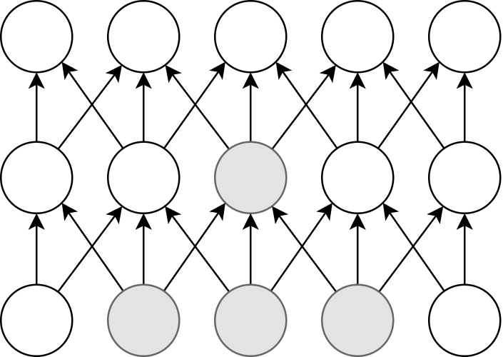

[[sec_scientific_computing]]
== Scientific computing and machine learning in the cloud

In the modern age of computing, computational simulation and big data analysis are the major driving force of scientific and engineering research.
The cloud is the best place to perform these large-scale computations.
In Part II, which starts with this section, you will experience how to run scientific computation on the cloud through several hands-on experiences.
As a specific subject of scientific computing, here we will focus on machine learning (deep learning).

In this book, we will use the
https://pytorch.org/[PyTorch]
library to implement deep learning algorithms, but no knowledge of deep learning or PyTorch is required.
The lecture focuses on **why and how to run deep learning in the cloud**, so we will not go into the details of the deep learning algorithm itself.
Interested readers are refered to other books for the theory and implementation of deep neural network (column below).

.Deep learning textbooks
****
For those who want to study deep learning theory and implementation, we would like to recommend the following textbooks.
Although the basic concepts and theories of deep learning are universal, this field is constantly evolving, so be sure to keep up to date with the latest information.

* https://www.deeplearningbook.org/[Deep Learning (Ian Goodfellow, Yoshua Bengio and Aaron Courville)]
+
This is a good introductory book if you want to learn the theoretical aspects of deep learning (although, it was published several years ago and does not cover the latest topics).
You can read it for free on the web.
This is a book for theoreticians, as it hardly discusses implementation.

* https://www.oreilly.co.jp/books/9784873117584/[Deep Learning from Scratch (Koki Saito)]
+
A series of three books in total, published in Japanese and several other languages.
This is the definitive introductory book on deep learning, with a good balance of theory and implementation.

* https://d2l.ai/[Dive into Deep Learning (Aston Zhang, Zachary C. Lipton, Mu Li, and Alexander J. Smola)]
+
A book that teaches the basics of deep learning to the latest algorithms through implementation.
This is a huge book with over 1000 pages, which is freely available on the web.
If you can read through this book, you will have no trouble in implementing deep learning algorithms.
****

=== Why use the cloud for machine learning?

The third AI boom started around 2010, and consequently machine learning is attracting a lot of attention not only in academic research but also in social and business contexts.
In particular, algorithms based on multi-layered neural networks, known as **deep learning**, have revolutionized image recognition and natural language processing by achieving remarkably higher performance than previous algorithms.

The core feature of deep learning is its large number of parameters.
As the layers become deeper, the number of weight parameters connecting the neurons between the layers increases.
For example, the latest language model,
https://arxiv.org/abs/2005.14165[GPT-3],
contains as many as **175 billion** parameters.
With such a vast number of parameters, deep learning can achieve high expressive power and generalization performance.

Not only GPT-3, but also recent neural networks that achieve SOTA (State-of-the-Art) performance frequently contain parameters in the order of millions or billions.
Naturally, training such a huge neural network is computationally expensive.
As a result, it is not uncommon to see cases where the training takes more than a full day with a single workstation.
With the rapid development of deep learning, the key to maximize research and business productivity is how to optimize the neural network with high throughput.
The cloud is a very effective means to solve such problems!
As we have seen in <<sec_first_ec2>>, the cloud can be used to dynamically launch a large number of instances, and execute computations in parallel.
In addition, there are specially designed chips (e.g. GPUs) optimized for deep learning operations to accelerate the computation.
By using the cloud, you gain access to inexhaustible supply of such specialized computing chips.
In fact, it was reported that the training of GPT-3 was performed using Microsoft's cloud, although the details have not been disclosed.

[TIP]
====
The details of the computational resources used in GPT-3 project are not disclosed in the paper, but there is an interesting discussion at
https://lambdalabs.com/blog/demystifying-gpt-3/[Lambda's blog]
(Lambda is a cloud service specializing in machine learning).

According to the article, it would take 342 years and $4.6 million in cloud fees to train 175 billion parameters if a single GPU (NVIDIA V100) was used.
The GPT-3 team was able to complete the training in a realistic amount of time by distributing the processing across multiple GPUs, but it is clear that this level of modeling can only be achieved by pushing the limits of cloud technology.
====

=== Accelerating deep learning by GPU

Here we will briefly talk about **Graphics Processing Unit** or **GPU**, which serves as an indispensable technology for deep learning.

As the name suggests, a GPU is originally a dedicated computing chip for producing computer graphics.
In contrast to a **CPU (Central Processing Unit)** which is capable of general computation, a GPU is designed specifically for graphics operations.
It can be found in familiar game consoles such as XBox and PS5, as well as in high-end notebook and desktop computers.
In computer graphics, millions of pixels arranged on a screen need to be updated at video rates (30 fps) or higher.
To handle this task, a single GPU chip contain hundreds to thousands of cores, each with relatively small computing power (<<gpu_architecture>>), and processes the pixels on the screen in parallel to achieve real-time rendering.

[[gpu_architecture]]
.GPU architecture (Image source: https://devblogs.nvidia.com/nvidia-turing-architecture-in-depth/)
image::imgs/gpu_architecture.jpg[cdk output, 500, align="center"]

Although GPUs were originally developed for the purpose of computer graphics, since around 2010, some advanced programmers and engineers started to use GPU's high parallel computing power for calculations other than graphics, such as scientific computations.
This idea is called **General-purpose computing on GPU** or **GPGPU**.
Due to its chip design, GPGPU is suitable for simple and regular operations such as matrix operations, and can achieve much higher speed than CPUs.
Currently, GPGPU is employed in many fields such as molecular dynamics, weather simulation, and machine learning.

The operation that occurs most frequently in deep learning is the **convolution** operation, which transfers the output of neurons to the neurons in the next layer (<<fig:convolution>>).
Convolution is exactly the kind of operations that GPUs are good at, and by using GPUs instead of CPUs, learning can be dramatically accelerated, up to several hundred times.

[[fig:convolution]]
.Convolution in neural network

Thus, GPUs are indispensable for machine learning calculations.
However, they are quite expensive.
For example, NVIDIA's Tesla V100 chip, designed specifically for scientific computing and machine learning, is priced at about one million yen (ten thousand dollars).
One million yen is quite a large investment just to start a machine learning project.
The good news is, if you use the cloud, you can use GPUs with zero initial cost!

To use GPUs in AWS, you need to select an EC2 instance type equipped with GPUs, such as `P2`, `P3`, `G3`, and `G4` instance family.
<<table_gpu_instances>> lists representative GPU-equipped instance types as of this writing.

[[table_gpu_instances]]
[cols="1,1,1,1,1,1,1", options="header"]
.EC2 GPU instances
|===
|Instance
|GPUs
|GPU model
|GPU Mem (GiB)
|vCPU
|Mem (GiB)
|Price per hour ($)

|p3.2xlarge
|1
|NVIDIA V100
|16
|8
|61
|3.06

|p3n.16xlarge
|8
|NVIDIA V100
|128
|64
|488
|24.48

|p2.xlarge
|1
|NVIDIA K80
|12
|4
|61
|0.9

|g4dn.xlarge
|1
|NVIDIA T4
|16
|4
|16
|0.526

|===

As you can see from <<table_gpu_instances>>, the price of GPU instances is higher than the CPU-only instances.
Also note that older generation GPUs (K80 compared to V100) are offered at a lower price.
The number of GPUs per instance can be selected from one to a maximum of eight.

The cheapest GPU instance type is `g4dn.xlarge`, which is equipped with a low-cost and energy-efficient NVIDIA T4 chip.
In the hands-on session in the later chapters, we will use this instance to perform deep learning calculations.

[NOTE]
====
The prices in <<table_gpu_instances>> are for `us-east-1`.
The pricing differs slightly depending on the region.
====

[NOTE]
====
The cost for `p3.2xlarge` instance with a single V100 chip is $3.06 per hour.
Considering that a V100 chip is sold for about 1 million yen, if you use it for more than 3000 hours (= 124 days), then it becomes more economical to buy a V100 by yourself than to use the cloud.
(Actually, if you prepare the V100 on your own, you need not only the V100 but also the CPU, RAM, network equipment, and electricity, so the total cost would be even higher than 1 million yen.)
====

