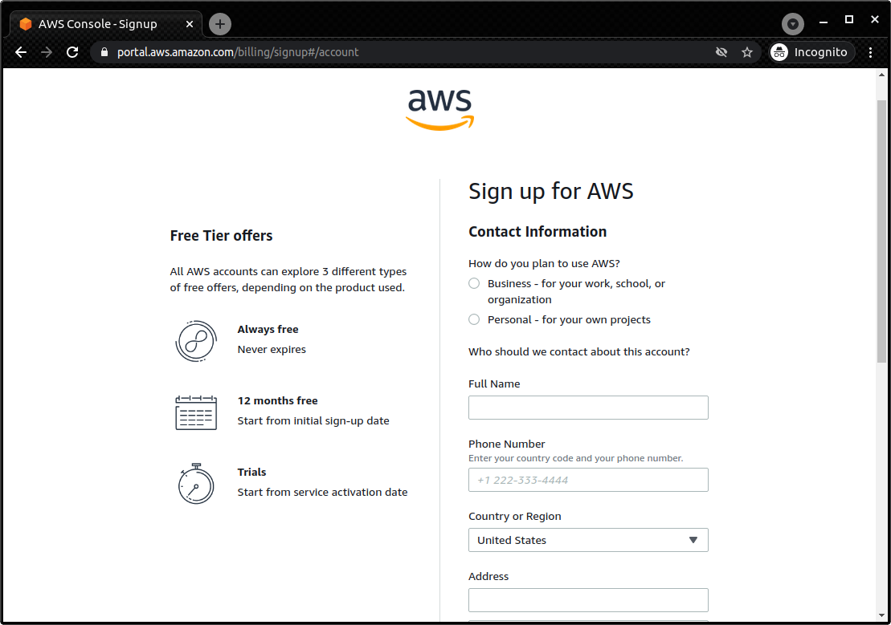
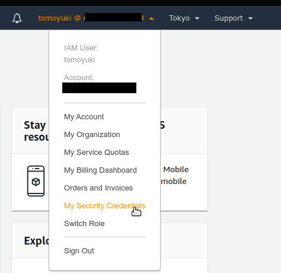
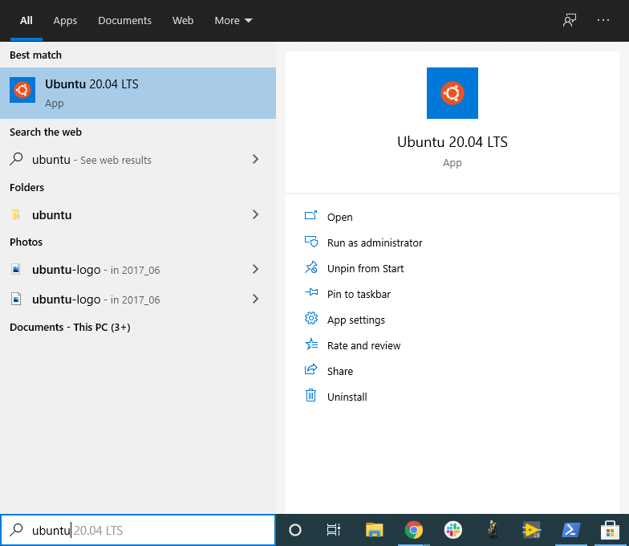

[[sec:appendix_settingup]]
== Appendix: 環境構築

本書を読み進めるにあたって，ハンズオンのプログラムを実行するための環境を自分のローカルマシンにセットアップしなければならない．
ここでは， AWS やコマンドラインの初心者を想定して，本章で必要なソフトウェアやライブラリのインストールなどを簡単に解説する．
以下に簡単な目次を示そう．
既に環境構築が済んでいる場合は適宜読み飛ばしていただき，関係のある箇所のみ目を通せば良い．

* AWS アカウントの取得 (<<sec:create_aws_account>>)
* AWS シークレットキーの作成 (<<aws_secrets>>)
* AWS CLI のインストール (<<aws_cli_install>>)
* AWS CDK のインストール (<<aws_cdk_install>>)
* WSL のインストール (<<sec:install_wsl>>)
* Docker のインストール (<<sec:install_docker>>)
* Python venv クイックガイド (<<venv_quick_guide>>)
* ハンズオン実行用の Docker image の使い方 (<<sec_handson_docker>>)

本書で何度か繰り返し述べているが，
本書のハンズオンを実行するための
https://hub.docker.com/repository/docker/tomomano/labc[Docker image]
を提供している．
これを用いると， AWS CLI/CDK や Python の設定などをスキップできるので， Docker の使用方法を知っている読者には便利だろう．

[[sec:create_aws_account]]
=== AWS アカウントの取得

本書で提供するハンズオンを実際に自分で試すには，読者自身で AWS のアカウントの作成をする必要がある．
詳しいアカウントの作成の手順は https://aws.amazon.com/jp/register-flow/[公式のドキュメンテーション] に書かれているので，そちらも参照していただきたい．
以下の手順に従ってアカウントの作成を行う．

まず，ウェブブラウザから https://aws.amazon.com/console/[AWS コンソール] にアクセスし，右上の `Create an AWS Account` をクリックする
(<<fig:aws-signup-1>> でピンクの箱で囲った部分)．

[[fig:aws-signup-1]]
.サインアップ (1): AWS コンソールにアクセス
image::imgs/signup-1.png[signup-1, 500, align="center"]

次に，遷移した先のページでメールアドレスとパスワードなどの登録を行う (<<fig:aws-signup-3>>)．

[[fig:aws-signup-3]]
.サインアップ (2): メールアドレス・パスワードなどの登録．
image::imgs/signup-3.png[signup-3, 500, align="center"]

続いて，住所や電話番号などを訊かれるので，すべて入力しよう (<<fig:aws-signup-4>>)．

[[fig:aws-signup-4]]
.サインアップ (3): 住所・電話番号の入力

次に，クレジットカードの情報の登録を求められる (<<fig:aws-signup-5>>)．
個人で AWS を利用する場合は，利用料金の請求はクレジットカードを経由して行われる．
クレジットカードの登録なしには AWS を使い始めることはできないことに注意．

[[fig:aws-signup-5]]
.サインアップ (4): クレジットカードの登録
image::imgs/signup-5.png[signup-5, 500, align="center"]

次の画面では，携帯電話の SMS またはボイスメッセージを利用した本人確認が求められる (<<fig:aws-signup-6>>)．
希望の認証方法を選択し，自分の携帯電話番号を入力しよう．

[[fig:aws-signup-6]]
.サインアップ (5): 携帯電話による本人確認
image::imgs/signup-6.png[signup-6, 500, align="center"]

無事に本人確認が完了すると，最後にサポートプランの選択を求められる (<<fig:aws-signup-8>>)．
無料の Basic support を選択しておけば問題ない．

[[fig:aws-signup-8]]
.サインアップ (6): サポートプランの選択
image::imgs/signup-8.png[signup-8, 500, align="center"]

以上のステップにより，アカウントの作成が完了する (<<fig:aws-signup-9>>)．
早速ログインをして， AWS コンソールにアクセスできるか確認しておこう．

[[fig:aws-signup-9]]
.サインアップ (7): アカウントの作成が完了した
image::imgs/signup-9.png[signup-9, 500, align="center"]

[[aws_secrets]]
=== AWS のシークレットキーの作成

AWS シークレットキーとは， AWS CLI や AWS CDK から AWS の API を操作するときに，ユーザー認証を行うための鍵のことである．
AWS CLI/CDK を使うには，最初にシークレットキーを発行する必要がある．
AWS シークレットキーの詳細は https://docs.aws.amazon.com/general/latest/gr/aws-sec-cred-types.html[公式ドキュメンテーション] を参照．

. AWS コンソールにログインする．
. 画面右上のアカウント名をクリックし，表示されるプルダウンメニューから "My Security Credentials" を選択 (<<fig:aws_secret_key_1>>)
. "Access keys for CLI, SDK, & API access" の下にある "Create accesss key" のボタンをクリックする (<<fig:aws_secret_key_2>>)
. 表示された Access key ID, Secret access key を記録しておく (画面を閉じると以降は表示されない)．
. 鍵を忘れてしまった場合などは，同じ手順で再発行が可能である．
. 発行したシークレットキーは， `~/.aws/credentials` のファイルに書き込むか，環境変数に設定するなどして使う (詳しくは <<aws_cli_install>>)．

[[fig:aws_secret_key_1]]
.AWS シークレットキーの発行1

[[fig:aws_secret_key_2]]
.AWS シークレットキーの発行2
image::imgs/aws_secret_key_2.png[aws_secret_key_2, 700, align="center"]

[WARNING]
====
**AWS Educate Starter Account** を用いている場合は，次の手順でシークレットキーを確認する．

- AWS Educate のコンソール画面から， `vocareum` のコンソールに移動する (<<fig:vocareum_console>>)．
- `Account Details` をクリックし，続いて `AWS CLI: Show` をクリックする．
- `aws_access_key_id`, `aws_secret_access_key`, `aws_session_token` が表示される (<<fig:vocareum_secret>>)．
ここで表示された内容を `~/.aws/credentials` にコピーする (<<aws_cli_install>> 参照)．
`aws_session_token` の箇所も漏らさずコピーすること．
- 続いて， `~/.aws/config` というファイルを用意し，次の内容を書き込む．
現時点では AWS Starter Account は `us-east-1` リージョンでしか利用できないためである．
[source, bash]
----
[default]
region = us-east-1
output = json
----
- 上記の説明ではプロファイル名が `default` となっていたが，これは自分の好きな名前に変更してもよい．
`default` 以外の名前を使用する場合は，コマンドを実行するときにプロファイル名を指定する必要がある (詳しくは <<aws_cli_install>>)．

[[fig:vocareum_console]]
.vocareum コンソール
image::imgs/vocareum_console.png[vocareum console, 700, align="center"]

[[fig:vocareum_secret]]
.vocareum から AWS シークレットキーの発行
image::imgs/vocareum_secret.png[vocareum secret, 700, align="center"]
====

[[aws_cli_install]]
=== AWS CLI のインストール

読者のために，執筆時点におけるインストールの手順 (Linux 向け) を簡単に記述する．
将来のバージョンでは変更される可能性があるので，常に https://docs.aws.amazon.com/cli/latest/userguide/install-cliv2.html[公式のドキュメンテーション] で最新の情報をチェックすることを忘れずに．

[source, bash]
----
$ curl "https://awscli.amazonaws.com/awscli-exe-linux-x86_64.zip" -o "awscliv2.zip"
$ unzip awscliv2.zip
$ sudo ./aws/install
----

インストールできたか確認するため，次のコマンドを打ってバージョン情報が出力されることを確認する．

[source, bash]
----
$ aws --version
----

インストールができたら，次のコマンドにより初期設定を行う
(https://docs.aws.amazon.com/cli/latest/userguide/cli-chap-configure.html[参照])．

[source, bash]
----
$ aws configure
----

コマンドを実行すると， `AWS Access Key ID`, `AWS Secret Access Key` を入力するよう指示される．
シークレットキーの発行については <<aws_secrets>> を参照．
コマンドは加えて，`Default region name` を訊いてくる．
ここには自分の好きな地域 (例えば `ap-northeast-1` =東京リージョン) を指定すればよい．
最後の `Default output format` は `json` としておくとよい．

このコマンドを完了すると， `~/.aws/credentials` と `~/.aws/config` という名前のファイルが生成されているはずである．
念のため， `cat` コマンドを使って中身を確認してみるとよい．

[source, bash]
----
$ cat ~/.aws/credentials
[default]
aws_access_key_id = XXXXXXXXXXXXXXXXXX
aws_secret_access_key = YYYYYYYYYYYYYYYYYYY

$ cat ~/.aws/config
[default]
region = ap-northeast-1
output = json
----

`~/.aws/credentials` には認証鍵の情報が， `~/.aws/config` には AWS CLI の設定が記録されている．

デフォルトでは， `[default]` という名前でプロファイルが保存される．
いくつかのプロファイルを使い分けたければ， default の例に従って，たとえば `[myprofile]` などという名前でプロファイルを追加すればよい．

AWS CLI でコマンドを打つときに，プロファイルを使い分けるには，

[source, bash]
----
$ aws s3 ls --profile myprofile
----

のように， `--profile` というオプションをつけてコマンドを実行する．

いちいち `--profile` オプションをつけるのが面倒だと感じる場合は， `AWS_PROFILE` という環境変数を設定するとよい．

[source, bash]
----
$ export AWS_PROFILE=myprofile
----

あるいは，認証情報などを環境変数に設定するテクニックもある．

[source, bash]
----
export AWS_ACCESS_KEY_ID=XXXXXX
export AWS_SECRET_ACCESS_KEY=YYYYYY
export AWS_DEFAULT_REGION=ap-northeast-1
----

これらの環境変数は， `~/.aws/credentials` よりも高い優先度をもつので，環境変数が設定されていればそちらの情報が使用される
(https://docs.aws.amazon.com/cli/latest/userguide/cli-chap-configure.html[参照])．

[WARNING]
====
**AWS Educate Starter Account** は `us-east-1` のリージョンのみ利用可能である (執筆時点での情報)．
よって， AWS Educate Starter Account を使用している場合は， default region を `us-east-1` に設定する必要がある．
====

[[aws_cdk_install]]
=== AWS CDK のインストール

読者のために，執筆時点におけるインストールの手順 (Linux 向け) を簡単に記述する．
将来のバージョンでは変更される可能性があるので，常に https://docs.aws.amazon.com/cdk/latest/guide/getting_started.html[公式のドキュメンテーション] で最新の情報をチェックすることを忘れずに．

Node.js がインストールされていれば，基本的に次のコマンドを実行すればよい．

[source, bash]
----
$ sudo npm install -g aws-cdk
----

[NOTE]
====
本書のハンズオンはAWS CDK version 1.100.0 で開発した．
CDK は開発途上のライブラリなので，将来的にAPIが変更される可能性がある．
APIの変更によりエラーが生じた場合は， version 1.100.0 を使用することを推奨する．

[source, bash]
----
$ npm install -g aws-cdk@1.100
----
====

インストールできたか確認するため，次のコマンドを打って正しくバージョンが表示されることを確認する．

[source, bash]
----
$ cdk --version
----

インストールができたら，次のコマンドによりAWS側の初期設定を行う．
これは一度実行すればOK．

[source, bash]
----
$ cdk bootstrap
----

[NOTE]
====
`cdk bootstrap` を実行するときは，AWSの認証情報とリージョンが正しく設定されていることを確認する．
デフォルトでは `~/.aws/config` にあるデフォルトのプロファイルが使用される．
デフォルト以外のプロファイルを用いるときは <<aws_cli_install>> で紹介したテクニックを使って切り替える．
====

[NOTE]
====
AWS CDK の認証情報の設定は AWS CLI と基本的に同じである．詳しくは <<aws_cli_install>> を参照．
====

[[sec:install_wsl]]
=== WSL のインストール

本書のハンズオンではコマンドラインから AWS CLI のコマンドを実行したり， Python で書かれたプログラムを実行する．
コマンドは基本的に UNIX のターミナルを想定して書かれている．
Linux や Mac のユーザーは OS に標準搭載されているターミナルを用いれば良い．
Windows を利用している読者は，
https://docs.microsoft.com/en-us/windows/wsl/[Windows Subsystem for Linux (WSL)]
を利用することで，仮想の Linux 環境を構築することを推奨する．
https://www.cygwin.com/[Cygwin]
などのほかの Linux をエミュレートするツールでも構わないが，本書のプログラムは WSL でのみ動作確認を行っている．

WSL とは， Windows の OS 上で Linux の仮想環境を起動するための，マイクロソフト社が公式で提供しているソフトウェアである．
Ubuntu など希望の Linux distribution が選択でき，基本的にすべての Linux 向けに作られたプログラム・ソフトウェアを使用することができる．

執筆時点では
https://docs.microsoft.com/en-us/windows/wsl/compare-versions#whats-new-in-wsl-2[WSL 2]
が最新版として提供されているので，以下では WSL 2 のインストール手順を簡単に説明する．
細かな詳細などは，
https://docs.microsoft.com/en-us/windows/wsl/install-win10[公式ドキュメンテーション]
を参照のこと．

前提として，使用される OS は Windows 10 (Pro または Home エディション) でなければならない．
さらに，使用している Windows 10のバージョンがWSLに対応するバージョンであるかを確認する．
X64 のシステムでは Version 1903, Build 18362 以上でなければならない．
バージョンが対応していない場合は、 Windows のアップデートを行う．

まず最初に， Administrator 権限で PowerShell を起動する (<<fig:powershell>>)．
左下の Windows メニューの検索バーに `powershell` と入力すると， PowerShell のプログラムが見つかるはずである，
これを右クリックし、 `Run as administrator` を選択し起動する．

[[fig:powershell]]
.管理者権限での PowerShell の起動
image::imgs/wsl/powershell.png[powershell, 500, align="center"]

PowerShell が起動したら、次のコマンドを実行する．

[source, bash]
----
dism.exe /online /enable-feature /featurename:Microsoft-Windows-Subsystem-Linux /all /norestart
----

実行して、“The operation completed successfully.” と出力されるのを確認する．
これで WSL が enable される．

次に，先ほどと同じ Administrator 権限で開いた PowerShell で次のコマンドを実行する。

[source, bash]
----
dism.exe /online /enable-feature /featurename:VirtualMachinePlatform /all /norestart
----

実行して， “The operation completed successfully.” と出力されるのを確認する．
これが確認出来たら、一度コンピュータを再起動する．

続いて， Linux kernel update package を次のリンクからダウンロードする．
https://wslstorestorage.blob.core.windows.net/wslblob/wsl_update_x64.msi

ダウンロードしたファイルをダブルクリックして実行する．
ダイアローグに従ってインストールを完了させる．

そうしたら，再び PowerShell を開き次のコマンドを実行する。

[source, bash]
----
wsl --set-default-version 2
----

最後に、自分の好みの Linux distribution をインストールする．
ここでは Ubuntu 20.04 をインストールしよう．

Microsoft store のアプリを起動し，検索バーに `Ubuntu` と入力する．
Ubuntu 20.04 LTS という項目が見つかるはずなので，それを開き， “Get” ボタンをクリックする (<<fig:microsoft_store>>)．
しばらく待つと， Ubuntu 20.04 のインストールが完了する．

[[fig:microsoft_store]]
.Microsoft store から Ubuntu 20.04 をインストール
image::imgs/wsl/microsoft_store.png[microsoft_store, 500, align="center"]

Ubuntu 20.04 を初回に起動すると，初期設定が自動で開始され，数分待つことになる．
初期設定が終わると，ユーザー名・パスワードを設定するようプロンプトが出るので，プロンプトに従い入力する．

これで WSL2 のインストールが完了した．
早速 WSL2 を起動してみよう．
左下の Windows メニューの検索バーに `Ubuntu` と入力すると， Ubuntu 20.04 のプログラムが見つかるはずである (<<fig:ubuntu>>)．
クリックして起動しよう．

[[fig:ubuntu]]
.Ubuntu 20.04 の起動

すると，ターミナルの黒い画面が立ち上がるだろう (<<fig:wsl_window>>)．
`ls`, `top` などのコマンドを打ってみて， WSL がきちんと動作していることを確認しよう．

[[fig:wsl_window]]
.WSL の起動画面
image::imgs/wsl/wsl_window.png[wsl_window, 500, align="center"]

オプションとして，
https://docs.microsoft.com/en-us/windows/terminal/get-started[Windows Terminal]
というマイクロソフトから提供されているツールを使うと，より快適に WSL を使用することができる．
興味のある読者はこちらのインストールも推奨する．

[[sec:install_docker]]
=== Docker のインストール

Docker のインストールの方法は OS によって異なる．

Mac ユーザーは， Docker Desktop をインストールする．
インストールの方法は，
https://docs.docker.com/docker-for-mac/install/[Docker のウェブサイト]
から， Mac 版の Docker Desktop をダウンロードし，ダウンロードされたファイルをダブルクリックし， `Applications` のフォルダーにドラッグするだけで良い．
詳細は
https://docs.docker.com/docker-for-mac/install/[公式ドキュメンテーション]
を参照のこと．

Windows ユーザーは， WSL に Docker をインストールすることを推奨する．
その場合，インストールの手順は Linux のものと基本的に同一である．

Linux ユーザー (特に Ubuntu ユーザー) については，インストールの方法はいくつかのアプローチがある．
https://docs.docker.com/engine/install/ubuntu/[公式ドキュメンテーション]
にいくつかのインストールの方法が示されているので，詳しい情報はそちらを参照いただきたい．

最も簡単な方法は， Docker が公式で提供しているインストールスクリプトを用いる方法である．
この場合，次のコマンドを実行することで Docker がインストールされる．

[source, bash]
----
$ curl -fsSL https://get.docker.com -o get-docker.sh
$ sudo sh get-docker.sh
----

デフォルトのインストールでは， root ユーザーのみが `docker` コマンドを使用できる設定になっている．
従って，コマンドには毎回 `sudo` を付け加える必要がある．
これが面倒だと感じる場合は，次のステップにより，使用するユーザーを `docker` というグループに追加する (詳細は
https://docs.docker.com/engine/install/linux-postinstall/#manage-docker-as-a-non-root-user[公式ドキュメンテーション "Post-installation steps for Linux"]
を参照)．

まず最初に， `docker` という名前にグループを追加する．
インストールによっては，既に `docker` グループが作れらている場合もある．

[source, bash]
----
$ sudo groupadd docker
----

次に，現在使用しているユーザーを `docker` グループに加える．

[source, bash]
----
$ sudo usermod -aG docker $USER
----

ここまでできたら，一度ログアウトし，再度ログインする．
これによって，グループの変更がターミナルのセッションに反映される．

設定が正しくできているかを確認するため，次のコマンドを実行してみる．

[source, bash]
----
$ docker run hello-world
----

`sudo` なしでコンテナが実行できたならば，設定は完了である．

[[venv_quick_guide]]
=== Python `venv` クイックガイド

他人からもらったプログラムで， numpy や scipy のバージョンが違う！などの理由で，プログラムが動かない，という経験をしたことがある人は多いのではないだろうか．
もし，自分の計算機の中に一つしか Python 環境がないとすると，プロジェクトを切り替えるごとに正しいバージョンをインストールし直さなければならず，これは大変な手間である．

コードのシェアをよりスムーズにするためには，ライブラリのバージョンはプロジェクトごとに管理されるべきである．
それを可能にするのが Python 仮想環境とよばれるツールであり， https://docs.python.org/3/tutorial/venv.html[venv], https://github.com/pyenv/pyenv[pyenv], https://docs.conda.io/en/latest/[conda] などがよく使われる．

そのなかでも， `venv` は Python に標準搭載されているのでとても便利である．
`pyenv` や `conda` は，別途インストールの必要があるが，それぞれの長所もある．

`venv` を使って仮想環境を作成するには，

[source, bash]
----
$ python -m venv .env
----

と実行する．
これにより `.env/` というディレクトリが作られ，このディレクトリに依存するライブラリが保存されることになる．

この新たな仮想環境を起動するには

[source, bash]
----
$ source .env/bin/activate
----

と実行する．

シェルのプロンプトに `(.env)` という文字が追加されていることを確認しよう (<<fig_venv_prompt>>)．
これが， "いまあなたは venv の中にいますよ" というしるしになる．

[[fig_venv_prompt]]
.venv を起動したときのプロンプト
image::imgs/venv_shell.png[venv shell, 500, align="center"]

仮想環境を起動すると，それ以降実行する `pip` コマンドは， `.env/` 以下にインストールされる．このようにして，プロジェクトごとに使うライブラリのバージョンを切り分けることができる．

Python では `requirements.txt` というファイルに依存ライブラリを記述するのが一般的な慣例である．他人からもらったプログラムに， `requirements.txt` が定義されていれば，

[source, bash]
----
$ pip install -r requirements.txt
----

と実行することで，必要なライブラリをインストールし，瞬時に Python 環境を再現することができる．

[NOTE]
====
venv による仮想環境を保存するディレクトリの名前は任意に選べることができるが， `.env` という名前を用いるのが一般的である．
====

[[sec_handson_docker]]
=== ハンズオン実行用の Docker image の使い方

ハンズオンを実行するために必要な， Node.js, Python, AWS CDK などがインストールされた Docker image を用意した．
これを使用することで，自分のローカルマシンに諸々をインストールする必要なく，すぐにハンズオンのコードが実行できる．

[WARNING]
====
ハンズオンのいくつかのコマンドは Docker の外 = ローカルマシンのリアル環境で実行されなければならない．
それらについてはハンズオンの該当箇所に注意書きとして記してある．
====

Docker Image は https://hub.docker.com/repository/docker/tomomano/labc[Docker Hub] においてある．
Docker Image のビルドファイルは GitHub の
https://github.com/tomomano/learn-aws-by-coding/blob/main/docker/Dockerfile[/docker/Dockerfile]
にある．

次のコマンドで container を起動する．

[source, bash]
----
$ docker run -it tomomano/labc:latest
----

初回にコマンドを実行したときのみ， image が Docker Hub からダウンロード (pull) される．
二回目以降はローカルにダウンロードされた image が使用される．

container が起動すると，次のようなインタラクティブシェルが表示されるはずである (起動時に `-it` のオプションをつけたのがポイントである)．

[source]
----
root@aws-handson:~$
----

この状態で `ls` コマンドを打つと， `handson/` というディレクトリがあるはずである．
ここに `cd` する．

[souce, bash]
----
$ cd handson
----

すると，各ハンズオンごとのディレクトリが見つかるはずである．

あとは，ハンズオンごとにディレクトリを移動し，ハンズオンごとの virtualenv を作成し，スタックのデプロイを行えばよい (<<sec_handson_ec2_run>> など参照)．
ハンズオンごとに使用する依存ライブラリが異なるので，それぞれのハンズオンごとに virtualenv を作成するという設計になっている．

AWS の認証情報を設定することも忘れずに．
<<aws_cli_install>> で記述したように， `AWS_ACCESS_KEY_ID` などの環境変数を設定するのが簡単な方法である．
あるいは，**ローカルマシンの** `~/.aws/credentials` に認証情報が書き込まれているなら，このディレクトリを container に**マウント**することで，同じ認証ファイルを container 内部から参照することが可能である．
この選択肢を取る場合は，次のコマンドで container を起動する．

[source, bash]
----
$ docker run -it -v ~/.aws:/root/.aws:ro docker.pkg.github.com/tomomano/learn-aws-by-coding/labc:latest
----

これにより，ローカルマシンの `~/.aws` を container の `/root/.aws` にマウントすることができる．
最後の `:ro` は read-only を意味する．
大切な認証ファイルが誤って書き換えられてしまわないように， read-only のフラグをつけることをおすすめする．

[TIP]
====
`/root/` が container 環境におけるホームディレクトリである．
ここで紹介した認証ファイルをマウントするテクニックは， SSH 鍵を container に渡すときなどにも使える．
====

