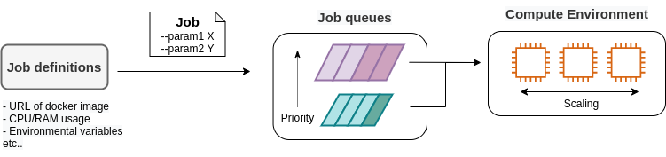
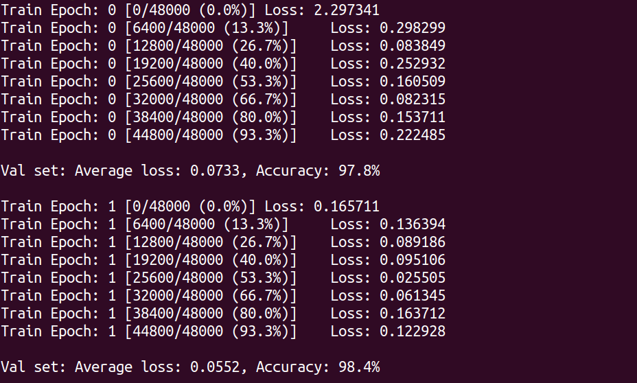
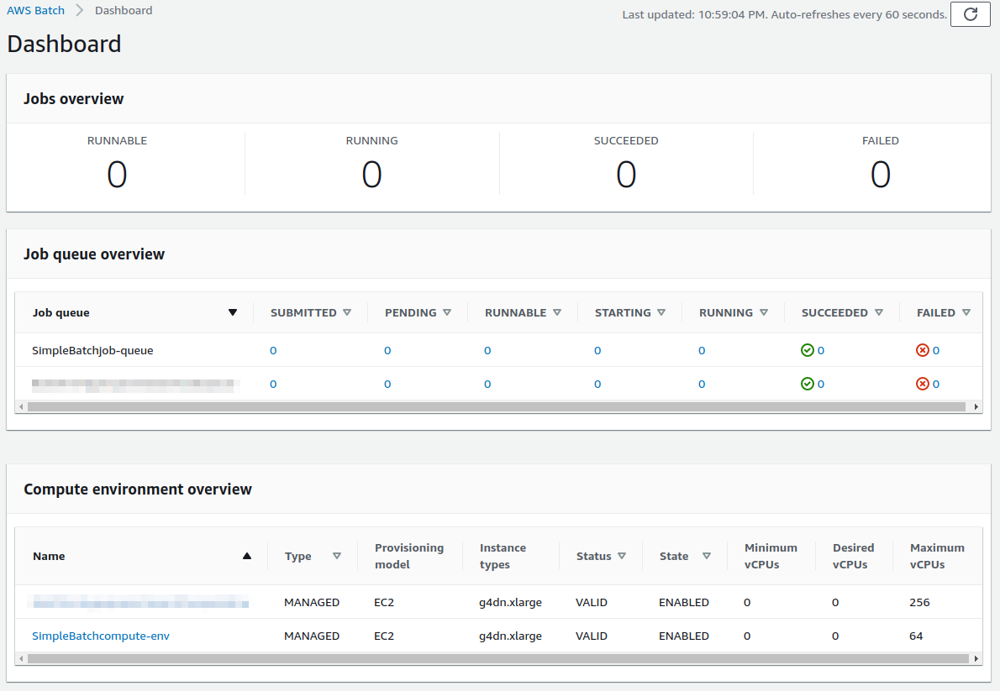
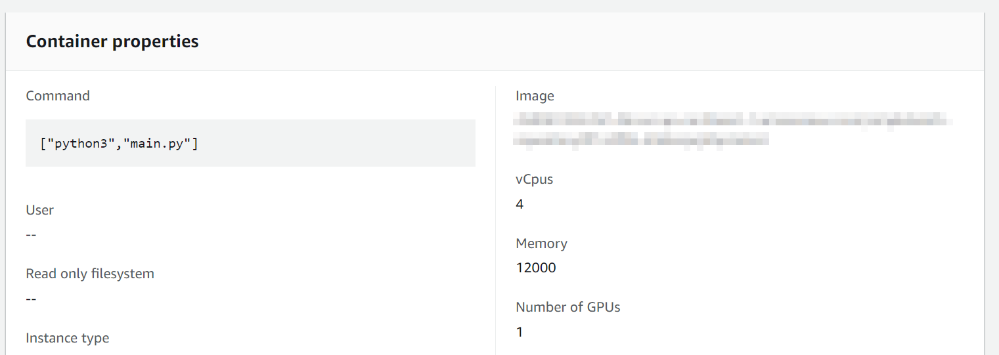
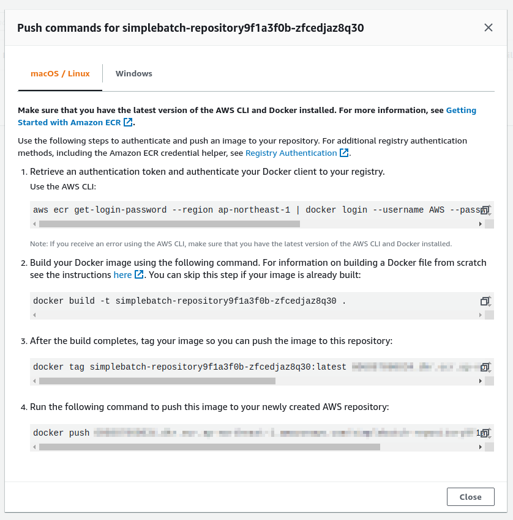
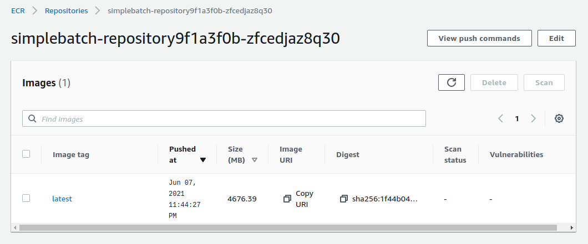
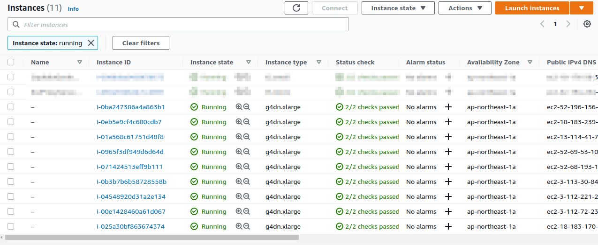
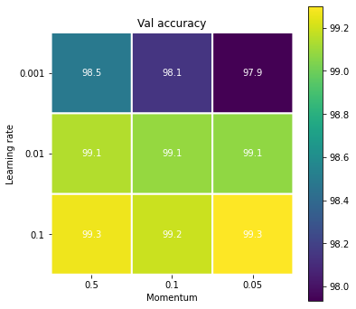
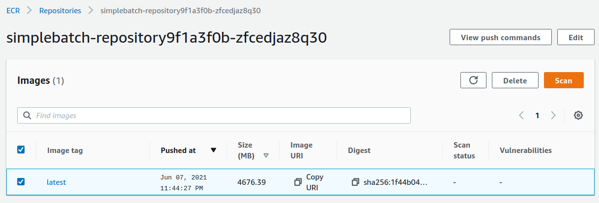
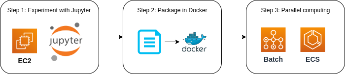

[[sec_aws_batch]]
== Hands-on #4: AWS Batch を使って機械学習のハイパーパラメータサーチを並列化する

ハンズオン第三回では， ECS と Fargate を使って自動質問回答システムを構築した．
シンプルながらも，複数の質問が送られた場合には並列にジョブが実行され，ユーザーに答えが返されるシステムを作ることができた．
ここでは，すでに学習済みの言語モデルを用いてアプリケーションを構築した．
しかし，一般的に言って，機械学習のワークフローでは自分で作ったモデルを訓練することが最初のステップにあるはずである．
そこで，ハンズオン第四回では，クラウドを用いて機械学習の訓練を並列化・高速化することを考える．

本ハンズオンでは深層学習におけるハイパーパラメータ最適化を取り上げる．
ハイパーパラメータとは，勾配降下法によって最適化されるニューラルネットのパラメータの外にあるパラメータのことであり，具体的にはモデルの層の幅・深さなどネットワークのアーキテクチャに関わるもの，学習率やモメンタムなどパラメータの更新則に関わるものなどが含まる．
深層学習においてハイパーパラメータの調整はとても重要なタスクである．
しかしながら，ハイパーパラメータを調整するには，少しずつ条件を変えながら何度もニューラルネットを学習させる必要があり，多くの計算時間がかかる．
研究・開発においては，スループットよくたくさんのモデルの可能性を探索することが生産性を決める重要なファクターであり，ハイパーパラメータ探索を高速に解くという問題は極めて関心が高い．
本ハンズオンでは，クラウドの強力な計算リソースを利用して並列的にニューラルネットの訓練を実行することで，この問題を解く方法を学んでいこう．

=== Auto scaling groups (ASG)

ハンズオンに入っていく前に， **Auto scaling groups (ASG)** とよばれる EC2 の概念を知っておく必要がある．

ECS の概要を示した <<ecs_overview>> を振り返って見てほしい．
前章 (<<sec_fargate_qabot>>) でも説明したが， ECS のクラスターで計算を担う実体としては EC2 と Fargate を指定することができる．
Fargate については前章で記述した．
Fargate を用いると，自在にスケールする計算環境をとても簡単な設定で構築することができた．
しかし， GPU を利用することができないなど，いくつかの制約があった．
EC2 を使用した計算環境を指定することで，プログラミングの複雑度は増すが， GPU やその他のより高度かつ複雑な設定を伴ったクラスターを構築することができる．

EC2 クラスターには **ASG** と呼ばれるサービスが配置される．
ASG は複数の EC2 インスタンスをロジカルな単位でグループ化することでクラスターを構成する．
ASG はクラスター内に新しいインスタンスを起動する，あるいは不要になったインスタンスを停止するなどのスケーリングを担う．
ASG で重要な概念として， **desired capacity**, **minimum capacity**, **maximum capacity** というパラメータがある．
minimum capacity， maximum capacity は，それぞれクラスター内に配置できるインスタンスの数の最小値・最大値を指定するパラメータである．
前者は，クラスターに負荷がかかっていない場合でもアイドリング状態にあるインスタンスを維持することで，急に負荷が増大した時などのバッファーとして作用することができる．
後者は，負荷が急に増えたときに，過剰な数のインスタンスが起動する事態を防ぎ，経済的なコストの上限を定める役割を果たす．

desired capacity が，その時々でシステムが要求するインスタンスの数を指定する．
desired capacity は，例えば24時間のリズムに合わせてインスタンスの数を増減させる (昼は多く夜は少なくなど) などの決まったスケジュールに基づいた設定を適用することができる．
あるいはクラスター全体にかかっている負荷に応じて， desired capacity を動的に制御することも可能である．
どのような基準でクラスターのスケーリングを行うかを定めるルールのことを，**スケーリングポリシー**とよぶ．
たとえば，クラスター全体の稼働率 (負荷) を常に 80% に維持する，などのスケーリングポリシーが想定できる．
この場合，クラスター全体の負荷が80%を下回ったときにはクラスターからインスタンスが削除され，80%を超える (あるいは超えると予測される) 場合はインスタンスを追加する，という操作が ASG によって自動的に行われる．

上記のようなパラメータを検討し，ユーザーは ASG を作成する．
ASG を作成したのち， ECS との連携をプログラムしてあげることで， ECS を介して ASG による EC2 クラスターにタスクを投入することが可能になる．

=== AWS Batch

.AWS Batch のアイコン
image::imgs/aws_logos/Batch.png[Batch, 100]

先に説明したように， ECS と ASG を組み合わせることで，所望の計算クラスターを構築することが可能である．
しかしながら， ECS と ASG にはかなり込み入った設定が必要であり，初心者にとっても経験者にとってもなかなか面倒なプログラミングが要求される．
そこで， ECS と ASG によるクラスターの設計を自動化してくれるサービスが提供されている．
それが **AWS Batch** である．

AWS Batch はその名のとおりバッチ (Batch) 化されたジョブ (入力データだけが異なる独立した演算が繰り返し実行されること) を想定している．
多くの科学計算や機械学習がバッチ計算に当てはまる．
たとえば，初期値のパラメータを変えて複数のシミュレーションを走らせる，といったケースだ．
AWS Batch を用いることの利点は，クラスターのスケーリングやジョブの割り振りはすべて自動で実行され，
ユーザーはクラウドの舞台裏の詳細を気にすることなく，大量のジョブを投入できるシステムが手に入る点である．
が，知識として背後では ECS/ASG/EC2 の三つ巴が協調して動作しているという点は知っておいてほしい．

AWS Batch では，ジョブの投入・管理をスムーズに行うため，次のような概念が定義されている (<<fig_batch_concept>>)．
まず， **ジョブ (Job)** というのが，AWS Batch によって実行される一つの計算の単位である．
**Job definitions** とはジョブの内容を定義するものであり，これには実行されるべき Docker のイメージのアドレスや，割り当てる CPU・RAM の容量，環境変数などの設定が含まれる．
Job definition に基づいて個々のジョブが実行される．
ジョブが実行されると，ジョブは **Job queues** に入る．
Job queues とは，実行待ち状態にあるジョブの列のことであり，時間的に最も先頭に投入されたジョブが最初に実行される．
また，複数の queue を配置し， queue ごとに priority (優先度) を設定することが可能であり， priority の高い queue に溜まったジョブが優先的に実行される
(筆者はこれをディズニーランドの"ファストパス"を連想して捉えている)．
**Compute environment** とは，先述したクラスターとほぼ同義の概念であり，計算が実行される場所 (EC2 や Fargate からなるクラスター) を指す．
Compute environment には，使用する EC2 のインスタンスタイプや同時に起動するインスタンス数の上限などの簡易なスケーリングポリシーが指定されている．
Job queues は Compute environment の空き状況を監視しており， それに応じてジョブを Compute environment に投下する．

以上が AWS Batch を使用するうえで理解しておかなければならない概念であるが，くどくど言葉で説明してもなかなかピンとこないだろう．
ここからは，実際に自分で手を動かしながら学んでいこう．

[[fig_batch_concept]]
.AWS Batch の主要な概念

[TIP]
====
**EC2 or Fargate?**

ECS でクラスターを構成する際，計算を実行する場として EC2 と Fargate の二つの選択肢があることを説明した．
それぞれ長所と短所を抱えているのだが，どのような場合にどちらを使うべきだろうか？
それを検討するため，まずは <<tab:ec2_vs_fargate>> を見てみよう．
これはEC2 と Fargate の特徴をまとめたものである．
説明の都合上，大幅な粗視化が行われている点は留意していただきたい．

[[tab:ec2_vs_fargate]]
[cols="1,1,1", options="header"]
.EC2 vs Fargate
|===
|
|EC2
|Fargate

|Compute capacity
|Medium to large
|Small to medium

|GPU
|Yes
|No

|Launch speed
|Slow
|Fast

|Task placement flexibility
|Low
|High

|Programming complexity
|High
|Low
|===

これまでに見てきたように， EC2 は最大の CPU 数・メモリーサイズが大きかったり， GPU を利用できたりするなど，単一のインスタンスでの計算能力は高い．
対して， Fargate は単一インスタンスの最大 CPU 数は4コアが上限である．
その一方で，インスタンスの起動に要する時間は Fargate のほうが圧倒的に早く，より俊敏にクラスターのスケーリングを行うことができる．
また，タスクをクラスターに投入する際のフレキシビリティも Fargate のほうが高い．
フレキシビリティというのは，例えば一つのインスタンスで2つ以上のコンテナを走らせる，などの状況である．
単位 CPU あたりで処理されるタスクの数を最大化する際には，このような設計がしばしば採用される．
プログラミングの複雑さという観点からは， Fargate のほうが一般的にシンプルな実装になる．

このように， EC2 と Fargate は互いに相補的な特性を有しており，アプリケーションによって最適な計算環境は検討される必要がある．
また，EC2 と Fargate を両方用いたハイブリッドクラスターというのも定義可能であり，そのような選択肢もしばしば用いられる．
====

=== 準備

ハンズオンのソースコードは GitHub の
https://github.com/tomomano/learn-aws-by-coding/tree/main/handson/aws-batch[handson/aws-batch]
にある．

本ハンズオンの実行には，第一回ハンズオンで説明した準備 (<<handson_01_prep>>) が整っていることを前提とする．
また， Docker が自身のローカルマシンにインストール済みであることも必要である．

[WARNING]
====
このハンズオンは， `g4dn.xlarge` タイプの EC2 インスタンスを使うので，アメリカ東部 (`us-east-1`) リージョンでは 0.526 $/hour のコストが発生する．
東京 (`ap-northeast-1`) を選択した場合は 0.71 $/hour のコストが発生する．
====

[WARNING]
====
<<sec:jupyter_and_deep_learning_setup>> でも注意したが，このハンズオンを始める前に G タイプインスタンスの起動上限を AWS コンソールの EC2 管理画面から確認しよう．
もし上限が0になっていた場合は，上限緩和の申請を行う必要がある．
<<sec:aws_batch_code>> にも関連した情報を記載しているので，併せて参照されたい．
====

=== MNIST 手書き文字認識 (再訪)

今回のハンズオンでは，機械学習のハイパーパラメータ調整を取り上げると冒頭で述べた．
その最もシンプルな例題として， <<sec_mnist_using_jupyter>> で扱った MNIST 手書き文字認識の問題を再度取り上げよう．
<<sec_mnist_using_jupyter>> では，適当にチョイスしたハイパーパラメータを用いてモデルの訓練を行った．
ここで使用したプログラムのハイパーパラメータとしては，確率的勾配降下法 (SGD) における学習率やモメンタムが含まれる．
コードでいうと，次の行が該当する．

[source, python]
----
optimizer = optim.SGD(model.parameters(), lr=0.01, momentum=0.5)
----

ここで使用された 学習率 (`lr=0.01`) やモメンタム (`momentum=0.5`) は恣意的に選択された値であり，これがベストな数値であるのかはわからない．
たまたまこのチョイスが最適であるかもしれないし，もっと高い精度を出すハイパーパラメータの組が存在するかもしれない．
この問題に答えるため，ハイパーパラメータサーチを行おう．
今回は，最もシンプルなアプローチとして，**グリッドサーチ**によるハイパーパラメータサーチを行おう．

.ハイパーパラメータの最適化について
****
機械学習のハイパーパラメータの最適化には大きく３つのアプローチが挙げられる．
グリッドサーチ，ランダムサーチ，そしてベイズ最適化による方法である．

グリッドサーチとは，ハイパーパラメータの組をある範囲の中で可能な組み合わせをすべて計算し，最適なパラメータの組を見出す方法である．
最もシンプルかつ確実な方法であるが，すべての組み合わせの可能性を愚直に計算するので計算コストが大きい．

ランダムサーチ法とは，ハイパーパラメータの組をある範囲の中でランダムに抽出し，大量に試行されたランダムな組の中から最適なパラメータの組を見出す方法である．
すべての可能性を網羅的に探索できるわけではないが，調整すべきパラメータの数が多数ある場合に，グリッドサーチよりも効率的に広い探索空間をカバーすることができる．

ベイズ最適化を用いた方法では，過去の探索結果から次にどの組み合わせを探索すべきかという指標を計算し，次に探索するパラメータを決定する．
これにより，理論的にはグリッドサーチやランダムサーチ法よりも少ない試行回数で最適なパラメータにたどり着くことができる．

並列化の観点でいうと，グリッドサーチとランダムサーチは各ハイパーパラメータの組の計算は独立に実行することができるため並列化が容易である．
このように独立したジョブとして分割・並列化可能な問題を Embarrassingly parallel な問題とよぶ (直訳すると"恥ずかしいほど並列化可能な問題"，ということになる)．
Embarrassingly parallel な問題はクラウドの強力な計算リソースを用いることで，非常なシンプルな実装で解くことができる．
この章ではこのようなタイプの並列計算を取り上げる．

一方，ベイズ最適化による方法は，過去の結果をもとに次の探索が決定されるので，並列化はそれほど単純ではない．
最近では https://optuna.org/[optuna] などのハイパーパラメータ探索のためのライブラリが発達しており，ベイズ最適化の数理的な処理を自動で実行してくれるので便利である．
これらのライブラリを使うと，もし一台のコンピュータ (ノード) の中に複数の GPU が存在する場合は，並列に計算を実行することができる．
しかしながら，一台のノードにとどまらず，複数のノードをまたいだ並列化は，高度なプログラミングテクニックが必要とされるだけでなく，ノード間の接続様式などクラウドのアーキテクチャにも深く依存するものである．
本書ではここまで高度なクラウドの使用方法には立ち入らない．
****

まずは，本ハンズオンで使用する Docker イメージをローカルで実行してみよう．

Docker イメージのソースコードは
https://github.com/tomomano/learn-aws-by-coding/blob/main/handson/aws-batch/docker[handson/aws-batch/docker]
にある．
基本的に <<sec_mnist_using_jupyter>> のハンズオンを元にし，本ハンズオン専用の軽微な変更が施してある．
興味のある読者はソースコードも含めて読んでいただきたい．

練習として，この Docker イメージを手元でビルドするところからはじめてみよう．
`Dockerfile` が保存されているディレクトリに移動し， `mymnist` という名前 (Tag) をつけてビルドを実行する．

[source, bash]
----
$ cd handson/aws-batch/docker
$ docker build -t mymnist .
----

[WARNING]
====
`docker build` でエラーが出たときは次の可能性を疑ってほしい．
ビルドの中で， MNIST の画像データセットを http://yann.lecun.com/exdb/mnist/ からダウンロードするのだが，ダウンロード先のサーバーがしばしばダウンしている．
世界中の機械学習ユーザーがアクセスするので，これはしばしば発生するようである．
サーバーがダウンしているとビルドも失敗してしまう．
エラーメッセージにそれらしい文言が含まれていたら，この可能性を疑おう．
====

[NOTE]
====
手元でビルドするかわりに， Docker Hub から pull することも可能である．
その場合は次のコマンドを実行する．

[source, bash]
----
$ docker pull tomomano/mymnist:latest
----
====

イメージの準備ができたら，次のコマンドでコンテナを起動し， MNIST の学習を実行する．．

[source, bash]
----
$ docker run mymnist --lr 0.1 --momentum 0.5 --epochs 10
----

このコマンドを実行すると，指定したハイパーパラメータ (`--lr` で与えられる学習率と `--momentum` で与えられるモメンタム) を使ってニューラルネットの最適化が始まる．
学習を行う最大のエポック数は `--epochs` パラメータで指定する．
<<sec_jupyter_and_deep_learning>> のハンズオンで見たような， Loss の低下がコマンドライン上に出力されるだろう (<<fig_mnist_log_output>>)．

[[fig_mnist_log_output]]
.Docker を実行した際の出力

上に示したコマンドを使うと，計算は CPU を使って実行される．
もし，ローカルの計算機に GPU が備わっており， https://github.com/NVIDIA/nvidia-docker[nvidia-docker] の設定が済んでいるならば，
次のコマンドにより GPU を使って計算を実行できる．

[source, bash]
----
$ docker run --gpus all mymnist --lr 0.1 --momentum 0.5 --epochs 10
----

このコマンドでは，`--gpus all` というパラメータが加わった．

CPU/GPU どちらで実行した場合でも，エポックを重ねるにつれて訓練データ (Train データ) の Loss は単調に減少していくのが見て取れるだろう．
一方，**検証データ (Validation データ) の Loss および Accuracy は，ある程度まで減少した後，それ以上性能が向上しない**ことに気がつくだろう．
これを実際にプロットしてみると <<fig_loss_epoch_profile>> のようになるはずである．

[[fig_loss_epoch_profile]]
.(左) Train/Validation データそれぞれの Loss のエポックごとの変化． (右) Validation データの Accuracy のエポックごとの変化
image::imgs/aws_batch/loss_epoch_profile.png[loss epochs, 600, align="center"]

これは**オーバーフィッティング**とよばれる現象で，ニューラルネットが訓練データに過度に最適化され，訓練データの外のデータに対しての精度 (汎化性能) が向上していないことを示している．
このような場合の対処法として， **Early stopping** とよばれるテクニックが知られている．
Early stopping とは，検証データの Loss を追跡し，それが減少から増加に転じるエポックで学習をうち止め，そのエポックでのウェイトパラメータを採用する，というものである．
本ハンズオンでも， Early stopping によって訓練の終了を判断し，モデルの性能評価を行っていく．

[TIP]
====
MNIST 手書き文字データセットでは，訓練データとして 60,000 枚，テストデータとして 10,000 枚の画像が与えられている．
本ハンズオンで使用するコードでは，訓練データのうち 80% の 48,000 枚を訓練データとして使用し，残り 20% の 12,000 枚を検証データとして用いている．
詳しくはソースコードを参照のこと．
====

[[sec:aws_batch_code]]
=== アプリケーションの説明

このハンズオンで作成するアプリケーションの概要を <<fig_batch_architecture>> に示す．

[[fig_batch_architecture]]
.アプリケーションのアーキテクチャ
image::imgs/aws_batch/architecture.png[architecture, 600, align="center"]

簡単にまとめると，次のような設計である．

* クライアントは，あるハイパーパラメータの組を指定して Batch にジョブを提出する
* Batch はジョブを受け取ると， EC2 からなるクラスターで計算を実行する
* クラスター内では `g4dn.xlarge` インスタンスが起動する
* Docker イメージは， AWS 内に用意された ECR (Elastic Container Registry) から取得される
* 複数のジョブが投下された場合は，その数だけのインスタンスが起動し並列に実行される
* 各ジョブによる計算の結果は S3 に保存される
* 最後にクライアントは S3 から結果をダウンロードし，最適なハイパーパラメータの組を決定する

それでは，プログラムのソースコードを見てみよう
(https://github.com/tomomano/learn-aws-by-coding/blob/main/handson/aws-batch/app.py[handson/aws-batch/app.py])．

[source, python, linenums]
----
class SimpleBatch(core.Stack):

    def __init__(self, scope: core.App, name: str, **kwargs) -> None:
        super().__init__(scope, name, **kwargs)

        # <1>
        bucket = s3.Bucket(
            self, "bucket",
            removal_policy=core.RemovalPolicy.DESTROY,
            auto_delete_objects=True,
        )

        vpc = ec2.Vpc(
            self, "vpc",
            # other parameters...
        )

        # <2>
        managed_env = batch.ComputeEnvironment(
            self, "managed-env",
            compute_resources=batch.ComputeResources(
                vpc=vpc,
                allocation_strategy=batch.AllocationStrategy.BEST_FIT,
                desiredv_cpus=0,
                maxv_cpus=64,
                minv_cpus=0,
                instance_types=[
                    ec2.InstanceType("g4dn.xlarge")
                ],
            ),
            managed=True,
            compute_environment_name=self.stack_name + "compute-env"
        )

        # <3>
        job_queue = batch.JobQueue(
            self, "job-queue",
            compute_environments=[
                batch.JobQueueComputeEnvironment(
                    compute_environment=managed_env,
                    order=100
                )
            ],
            job_queue_name=self.stack_name + "job-queue"
        )

        # <4>
        job_role = iam.Role(
            self, "job-role",
            assumed_by=iam.CompositePrincipal(
                iam.ServicePrincipal("ecs-tasks.amazonaws.com")
            )
        )
        # allow read and write access to S3 bucket
        bucket.grant_read_write(job_role)

        # <5>
        repo = ecr.Repository(
            self, "repository",
            removal_policy=core.RemovalPolicy.DESTROY,
        )

        # <6>
        job_def = batch.JobDefinition(
            self, "job-definition",
            container=batch.JobDefinitionContainer(
                image=ecs.ContainerImage.from_ecr_repository(repo),
                command=["python3", "main.py"],
                vcpus=4,
                gpu_count=1,
                memory_limit_mib=12000,
                job_role=job_role,
                environment={
                    "BUCKET_NAME": bucket.bucket_name
                }
            ),
            job_definition_name=self.stack_name + "job-definition",
            timeout=core.Duration.hours(2),
        )
----

<1> で，計算結果を保存するための S3 バケットを用意している
<2> で， Compute environment を定義している．
ここでは `g4dn.xlarge` のインスタンスタイプを使用するとし，最大の vCPU 使用数は 64 と指定している．
また，最小の vCPU は 0 である．
今回は，負荷がかかっていないときにアイドリング状態にあるインスタンスを用意する利点は全くないので，ここは0にするのが望ましい．
<3> で， <2> で作成した Compute environment と紐付いた Job queue を定義している．
<4> で， Job が計算結果を S3 に書き込むことができるよう， IAM ロールを定義している．
(IAM とはリソースがもつ権限を管理する仕組みである．詳しくは <<sec:bashoutter_iam>> を参照)
<5> では， Docker image を配置するための ECR を定義している．
<6> で Job definition を作成している．
ここでは，4 vCPU， 12000 MB (=12GB) の RAM を使用するように指定している．
また，今後必要となる環境変数 (`BUCKET_NAME`) を設定している．
さらに， <4> で作った IAM を付与している．

[TIP]
====
`g4dn.xlarge` は 1台あたり 4 vCPU が割り当てられている．
このプログラムでは Compute environment の maximum vCPUs を 64 と指定しているので，最大で 16 台のインスタンスが同時に起動することになる．
ここで maxium vCPUs を64に限定しているのは，なんらかのミスで意図せぬジョブを大量にクラスターに投入してしまった事態で，高額の AWS 利用料金が発生するのを防ぐためである．
もし，自分のアプリケーションで必要と判断したならば自己責任において64よりも大きな数を設定して構わない．

ここで注意が一点ある．
AWS では各アカウントごとに EC2 で起動できるインスタンスの上限が設定されている．
この上限は AWS コンソールにログインし， EC2コンソールの左側メニューバーの `Limits` をクリックすることで確認できる (<<fig_ec2_limits>>)．
`g4dn.xlarge` (EC2 の区分でいうと G ファミリーに属する) の制限を確認するには， `Running On-Demand All G instances` という名前の項目を見る．
ここにある数字が， AWS によって課されたアカウントの上限であり，この上限を超えたインスタンスを起動することはできない．
もし，自分の用途に対して上限が低すぎる場合は，上限の緩和申請を行うことができる．
詳しくは https://docs.aws.amazon.com/AWSEC2/latest/UserGuide/ec2-resource-limits.html[公式ドキュメンテーション "Amazon EC2 service quotas"] を参照のこと．

[[fig_ec2_limits]]
.EC2コンソールから各種の上限を確認する
image::imgs/aws_batch/ec2_limits.png[EC2 limits, 700, align="center"]
====

=== スタックのデプロイ

スタックの中身が理解できたところで，早速スタックをデプロイしてみよう．

デプロイの手順は，これまでのハンズオンとほとんど共通である． 
ここでは，コマンドのみ列挙する (# で始まる行はコメントである)．
シークレットキーの設定も忘れずに (<<aws_cli_install>>)．

[source, bash]
----
# プロジェクトのディレクトリに移動
$ cd handson/aws-batch

# venv を作成し，依存ライブラリのインストールを行う
$ python3 -m venv .env
$ source .env/bin/activate
$ pip install -r requirements.txt

# デプロイを実行
$ cdk deploy
----

デプロイのコマンドが無事に実行されたことが確認できたら，AWS コンソールにログインして，デプロイされたスタックを確認してみよう．
コンソールの検索バーで `batch` と入力し， AWS Batch の管理画面を開く (<<fig_batch_console>>)．

[[fig_batch_console]]
.AWSBatch のコンソール画面 (ダッシュボード)

まず目を向けてほしいのが，画面の一番下にある Compute environment overview の中の `SimpleBatchcompute-env` という名前の項目だ．
Compute environment とは，先ほど述べたとおり，計算が実行される環境 (クラスターと読み替えてもよい) である．
プログラムで指定したとおり， `g4dn.xlarge` が実際に使用されるインスタンスタイプとして表示されている．
また， `Minimum vCPUs` が0，`Maximum vCPUs` が 64 と設定されていることも見て取れる．
加えて，この時点では一つもジョブが走っていないので， `Desired vCPUs` は0になっている．
より詳細な Compute environment の情報を閲覧したい場合は，名前をクリックすることで詳細画面が開く．

次に，Job queue overview にある `SimpleBatch-queue` という項目に注目してほしい．
ここでは実行待ちのジョブ・実行中のジョブ・実行が完了したジョブを一覧で確認することができる．
`PENDING`, `RUNNING`, `SUCCEEDED`, `FAILED` などのカラムがあることが確認できる．ジョブが進行するにつれて，ジョブの状態がこのカラムにしたがって遷移していく．
後でジョブを実際にサブミットしたときに戻ってこよう．

最後に，今回作成した Job definition を確認しよう．
左側のメニューから　`Job definitions` を選択し，次の画面で `SimpleBatchjob-definition` という項目を見つけて開く．
ここから Job definition の詳細を閲覧することができる (Figure 8-8)．
中でも重要な情報としては，　`cVPUs`, `Memory`, `CPU` がそれぞれ Docker に割り当てられる vCPU・メモリー・ GPU の量を規定している．
また， `Image` と書いてあるところに，ジョブで使用される Docker イメージが指定されている．
ここでは， ECR のレポジトリを参照している．
現時点ではこの ECR は空である．
次のステップとして，この ECR にイメージを配置する作業を行おう．

[[fig:batch_job_definition]]
.AWS Batch から Job definition を確認

[[sec:aws_batch_deploy_docker_on_ecr]]
=== Docker image を ECR に配置する

さて， Batch がジョブを実行するには，どこか指定された場所から Docker イメージをダウンロード (pull) してくる必要がある．
前回のハンズオン (<<sec_fargate_qabot>>) では，公開設定にしてある Docker Hub からイメージを pull してきた．
今回のハンズオンでは， AWS から提供されているレジストリである **ECR (Elastic Container Registry)** に image を配置するという設計を採用する．
ECR を利用する利点は，自分だけがアクセスすることのできるプライベートなイメージの置き場所を用意できる点である．
Batch は ECR からイメージを pull してくることで，タスクを実行する (<<fig_batch_architecture>>)．

スタックのソースコードでいうと，次の箇所が ECR を定義している．

[source, python]
----
# <1>
repo = ecr.Repository(
    self, "repository",
    removal_policy=core.RemovalPolicy.DESTROY,
)

job_def = batch.JobDefinition(
    self, "job-definition",
    container=batch.JobDefinitionContainer(
        image=ecs.ContainerImage.from_ecr_repository(repo), # <2>
        ...
    ),
    ...
)
----
<1> で，新規の ECR を作成している．
<2> で Job definition を定義する中で，イメージを <1> で作った ECR から取得するように指定している．
これと同時に， Job definition には ECR へのアクセス権限が IAM を通じて自動的に付与される．

さて，スタックをデプロイした時点では， ECR は空っぽである．
ここに自分のアプリケーションで使う Docker イメージを push してあげる必要がある．

そのために，まずは AWS コンソールから ECR の画面を開こう (検索バーに `Elastic Container Registry` と入力すると出てくる)．
`Private` というタブを選択すると， `simplebatch-repositoryXXXXXX` という名前のレポジトリが見つかるだろう (<<fig_ecr_console1>>)．

[[fig_ecr_console1]]
.ECR のコンソール画面
image::imgs/aws_batch/ecr_console1.png[ecr console, 700, align="center"]

次に，このレポジトリの名前をクリックするとレポジトリの詳細画面に遷移する．
そうしたら，画面右上にある `View push commands` というボタンをクリックする．
すると <<fig_ecr_push_command>> のようなポップアップ画面が立ち上がる．

[[fig_ecr_push_command]]
.ECR への push コマンド

このポップアップ画面で表示されている四つのコマンドを順番に実行していくことで，手元の Docker イメージを ECR に push することができる．
**push を実行する前に， AWS の認証情報が設定されている**ことを確認しよう．
そのうえで，ハンズオンのソースコードの中にある **`docker/` という名前のディレクトリに移動**する．
そうしたら，ポップアップ画面で表示されたコマンドを上から順に実行していく．

[NOTE]
====
ポップアップで表示されるコマンドの2つめを見てみると `docker build -t XXXXX .` となっている．
最後の `.` が重要で，これは __現在のディレクトリにある Dockerfile を使ってイメージをビルドせよ__ という意味である．
このような理由で， `Dockerfile` が置いてあるディレクトリに移動する必要がある．
====

四つ目のコマンドは，数GBあるイメージを ECR にアップロードするので少し時間がかかるかもしれないが，これが完了するとめでたくイメージが ECR に配置されたことになる．
もう一度 ECR のコンソールを見てみると，確かにイメージが配置されていることが確認できる (<<fig_ecr_console2>>)．
これで，AWS Batch を使ってジョブを実行させるための最後の準備が完了した．

[[fig_ecr_console2]]
.ECR へ image の配置が完了した

[TIP]
====
今回のハンズオンで紹介するアプリケーションは， Docker イメージを置き換えることで，ユーザー自身の計算ジョブを実行することが可能である．
<<sec:batch_development_and_debug>> のコラムに手順を紹介しているので，興味のある読者は参照していただきたい．
====

=== 単一のジョブを実行する

さて，ここからは実際に AWS Batch にジョブを投入する方法を見ていこう．

ハンズオンのディレクトリの `notebook/` というディレクトリの中に，
https://github.com/tomomano/learn-aws-by-coding/blob/main/handson/aws-batch/notebook/run_single.ipynb[run_single.ipynb]
というファイルが見つかるはずである (`.ipynb` は Jupyter notebook のファイル形式)．
これを Jupyter notebook から開こう．

今回のハンズオンでは， `venv` による仮想環境の中に Jupyter notebook もインストール済みである．
なので，ローカルマシンから以下のコマンドで Jupyter notebook を立ち上げる．

[source, bash]
----
# .env の仮想環境にいることを確認
(.env) $ cd notebook
(.env) $ jupyter notebook
----

Jupyter notebook が起動したら， `run_single.ipynb` を開く．

最初の [1], [2], [3] 番のセルは，ジョブをサブミットするための関数 (`submit_job()`) を定義している．

[source, python, linenums]
----
# [1]
import boto3
import argparse

# [2]
# AWS 認証ヘルパー ...省略...

# [3]
def submit_job(lr:float, momentum:float, epochs:int, profile_name="default"):
    if profile_name is None:
        session = boto3.Session()
    else:
        session = boto3.Session(profile_name=profile_name)
    client = session.client("batch")

    title = "lr" + str(lr).replace(".", "") + "_m" + str(momentum).replace(".", "")
    resp = client.submit_job(
        jobName=title,
        jobQueue="SimpleBatchjob-queue",
        jobDefinition="SimpleBatchjob-definition",
        containerOverrides={
            "command": ["--lr", str(lr),
                        "--momentum", str(momentum),
                        "--epochs", str(epochs),
                        "--uploadS3", "true"]
        }
    )
    print("Job submitted!")
    print("job name", resp["jobName"], "job ID", resp["jobId"])
----

`submit_job()` 関数について簡単に説明しよう．
<<sec_run_mnist_docker_local>> で， MNIST の Docker をローカルで実行したとき，次のようなコマンドを使用した．

[source, bash]
----
$ docker run -it mymnist --lr 0.1 --momentum 0.5 --epochs 10
----

ここで， `--lr 0.1 --momentum 0.5 --epochs 10` の部分が，コンテナに渡されるコマンドである．

AWS Batch でジョブを実行する際も，`ContainerOverrides` の `command` というパラメータを使用することで，コンテナに渡されるコマンドを指定することができる．
コードでは以下の部分が該当する．

[source, python, linenums]
----
containerOverrides={
    "command": ["--lr", str(lr),
                "--momentum", str(momentum),
                "--epochs", str(epochs),
                "--uploadS3", "true"]
}
----

続いて， [4] 番のセルに移ろう．
ここでは，上記の `submit_job()` 関数を用いて， 学習率 = 0.01, モメンタム=0.1, エポック数=100 を指定したジョブを投入する．

[source, python]
----
# [4]
submit_job(0.01, 0.1, 100)
----

[WARNING]
====
AWS の認証情報は， Jupyter notebook の内部から再度定義する必要がある．
これを手助けするため， notebook の [2] 番のセル (デフォルトではすべてコメントアウトされている) を用意した．
これを使うにはコメントアウトを解除すればよい．
このセルを実行すると， AWS の認証情報を入力する対話的なプロンプトが表示される．
プロンプトに従って aws secret key などを入力することで， (Jupyter のセッションに固有な) 環境変数に AWS の認証情報が記録される．

もう一つの認証方法として， `sumit_job()` 関数に `profile_name` というパラメータを用意した．
もし `~/.aws/credentials` に認証情報が書き込まれているのならば (詳しくは <<aws_cli_install>>)， `profile_name` に使用したいプロファイルの名前を渡すだけで，
認証を行うことができる．

慣れている読者は後者のほうが便利であると感じるだろう．
====

[4] 番のセルを実行したら，ジョブが実際に投入されたかどうかを AWS コンソールから確認してみよう．
AWS Batch の管理コンソールを開くと， <<fig_batch_running_job>> のような画面が表示されるだろう．

[[fig_batch_running_job]]
.AWS Batch でジョブが実行されている様子
image::imgs/aws_batch/batch_running_job.png[batch running job, 700, align="center"]

<<fig_batch_running_job>> で赤で囲った箇所に注目してほしい．
一つのジョブが投入されると，それは `SUBMITTED` という状態を経て `RUNNABLE` という状態に遷移する．
`RUNNABLE` とは， ジョブを実行するためのインスタンスが Compute environment に不足しているため，新たなインスタンスが起動されるのを待っている状態に相当する．
インスタンスの準備が整うと，ジョブの状態は `STARTING` を経て `RUNNING` に至る．

次に，ジョブのステータスが `RUNNING` のときの Compute environment の `Desired vCPU` を見てみよう (<<fig_batch_running_job>> で紫で囲った箇所)．
ここで 4 と表示されているのは， `g4dn.xlarge` インスタンス一つ分の vCPU の数である．
ジョブの投入に応じて，それを実行するのに最低限必要な EC2 インスタンスが起動されたことが確認できる
(興味のある人は， EC2 コンソールも同時に覗いてみるとよい)．

しばらく経つと，ジョブの状態は `RUNNING` から `SUCCEEDED` (あるいは何らかの理由でエラーが発生したときには `FAILED`) に遷移する．
今回のハンズオンで使っている MNIST の学習はだいたい 10 分くらいで完了するはずである．
ジョブの状態が `SUCCEEDED` になるまで見届けよう．

ジョブが完了すると，学習の結果 (エポックごとの Loss と Accuracy を記録した CSV ファイル) は S3 に保存される．
AWS コンソールからこれを確認しよう．

S3 のコンソールに行くと `simplebatch-bucketXXXX` (XXXX の部分はユーザーによって異なる) という名前のバケットが見つかるはずである．
これをクリックして中身を見てみると， `metrics_lr0.0100_m0.1000.csv` という名前の CSV があることが確認できるだろう (<<fig_s3_saved_file>>)．
これが， 学習率 = 0.01, モメンタム = 0.1 として学習を行ったときの結果である．

[[fig_s3_saved_file]]
.ジョブの実行結果は S3 に保存される
image::imgs/aws_batch/s3_saved_file.png[s3 saved file, 700, align="center"]

さて，ここで `run_single.ipynb` に戻ってこよう．
[5] から [7] 番のセルでは，学習結果の CSV ファイルのダウンロードを行っている．

[source, python, linenums]
----
# [5]
import pandas as pd
import io
from matplotlib import pyplot as plt

# [6]
def read_table_from_s3(bucket_name, key, profile_name=None):
    if profile_name is None:
        session = boto3.Session()
    else:
        session = boto3.Session(profile_name=profile_name)
    s3 = session.resource("s3")
    bucket = s3.Bucket(bucket_name)
    
    obj = bucket.Object(key).get().get("Body")
    df = pd.read_csv(obj)
    
    return df

# [7]
bucket_name = "simplebatch-bucket43879c71-mbqaltx441fu"
df = read_table_from_s3(
    bucket_name,
    "metrics_lr0.0100_m0.1000.csv"
)
----

[6] で S3 から CSV データをダウンロードし， pandas の `DataFrame` オブジェクトとしてロードする関数を定義している (<<sec_boto3_dojo>> でこのあたりのデータ操作は詳しく触れる)．
[7] を実行する際， `bucket_name` という変数の値を，**自分自身のバケットの名前に置き換える**ことに注意しよう
(先ほど S3 コンソールから確認した `simplebatch-bucketXXXX` のことである)．

続いて， [9] 番のセルで， CSV のデータをプロットしている (<<fig_loss_epoch_profile2>>)．
ローカルで実行したときと同じように， AWS Batch を用いて MNIST モデルを訓練することに成功した！

[source, python, linenums]
----
# [9]
fig, (ax1, ax2) = plt.subplots(1,2, figsize=(9,4))
x = [i for i in range(df.shape[0])]
ax1.plot(x, df["train_loss"], label="Train")
ax1.plot(x, df["val_loss"], label="Val")
ax2.plot(x, df["val_accuracy"])

ax1.set_xlabel("Epochs")
ax1.set_ylabel("Loss")
ax1.legend()

ax2.set_xlabel("Epochs")
ax2.set_ylabel("Accuracy")

print("Best loss:", df["val_loss"].min())
print("Best loss epoch:", df["val_loss"].argmin())
print("Best accuracy:", df["val_accuracy"].max())
print("Best accuracy epoch:", df["val_accuracy"].argmax())
----

[[fig_loss_epoch_profile2]]
.AWS Batch で行った MNIST モデルの学習の結果
image::imgs/aws_batch/loss_epoch_profile2.png[loss_epoch_profile2, 600, align="center"]

[[sec:batch_parallel_jobs]]
=== 並列に複数の Job を実行する

さて，ここからが最後の仕上げである．
ここまでのハンズオンで構築した AWS Batch のシステムを使って，ハイパーパラメータサーチを実際に行おう．

先ほど実行した `run_single.ipynb` と同じディレクトリにある `run_sweep.ipynb` を開く．

セル [1], [2], [3] は `run_single.ipynb` と同一である．

[source, python, linenums]
----
# [1]
import boto3
import argparse

# [2]
# AWS 認証ヘルパー ...省略...

# [3]
def submit_job(lr:float, momentum:float, epochs:int, profile_name=None):
    # ...省略...
----

セル [4] の for ループを使って，グリッド状にハイパーパラメータの組み合わせを用意し， batch にジョブを投入している．
ここでは 3x3=9個のジョブを作成した．

[source, python, linenums]
----
# [4]
for lr in [0.1, 0.01, 0.001]:
    for m in [0.5, 0.1, 0.05]:
        submit_job(lr, m, 100)
----

セル [4] を実行したら， Batch のコンソールを開こう．
先ほどと同様に，ジョブのステータスは `SUBMITTED` > `RUNNABLE` > `STARTING` > `RUNNING` と移り変わっていくことがわかるだろう．
最終的に 9 個のジョブがすべて `RUNNING` の状態になることを確認しよう (<<fig_batch_many_parallel_jobs>>)．
また，このとき Compute environment の `Desired vCPUs` は 4x9=36 となっていることを確認しよう (<<fig_batch_many_parallel_jobs>>)．

[[fig_batch_many_parallel_jobs]]
.複数のジョブを同時投入したときの Batch コンソール
image::imgs/aws_batch/batch_many_parallel_jobs.png[batch many parallel jobs, 700, align="center"]

次に，Batch のコンソールの左側のメニューから `Jobs` をクリックしてみよう．
ここでは，実行中のジョブの一覧が確認することができる (<<fig_batch_parallel_job_list>>)．
ジョブのステータスでフィルタリングをすることも可能である．
9個のジョブがどれも `RUNNING` 状態にあることが確認できるだろう．

[[fig_batch_parallel_job_list]]
.複数のジョブを同時投入したときの Job 一覧
image::imgs/aws_batch/batch_parallel_job_list.png[batch many parallel jobs, 700, align="center"]

今度は EC2 コンソールを見てみよう．
左のメニューから `Instances` を選択すると， <<fig_ec2_instances_list>> に示すような起動中のインスタンスの一覧が表示される．
`g4dn.xlarge` が 9 台稼働しているのが確認できる．
Batch がジョブの投下に合わせて必要な数のインスタンスを起動してくれたのだ！

[[fig_ec2_instances_list]]
.複数のジョブを同時投入したときの EC2 インスタンスの一覧

ここまで確認できたら，それぞれの Job が終了するまでしばらく待とう (だいたい 10-15 分くらいで終わる)．
すべてのジョブが終了すると，ダッシュボードの `SUCCEEDED` が 9 となっているはずだ．
また， Compute environment の `Desired vCPUs` も 0 に落ちていることを確認しよう．
最後に EC2 コンソールに行って，すべての g4dn インスタンスが停止していることを確認しよう．

以上から， AWS Batch を使うことで，**ジョブの投入に応じて自動的に EC2 インスタンスが起動され，ジョブの完了とともに，ただちにインスタンスの停止が行われる**一連の挙動を観察することができた．
一つのジョブの完了におよそ10分の時間がかかるので，9個のハイパーパラメータの組を逐次的に計算していた場合は90分の時間を要することになる．
AWS Batch を使ってこれらの計算を並列に実行することで，ジョブ一個分の計算時間 (=10分) ですべての計算を終えることができた！

さて，再び `run_sweep.ipynb` に戻ってこよう．
[5] 以降のセルでは，グリッドサーチの結果を可視化している．

[source, python, linenums]
----
# [5]
import pandas as pd
import numpy as np
import io
from matplotlib import pyplot as plt

# [6]
def read_table_from_s3(bucket_name, key, profile_name=None):
    if profile_name is None:
        session = boto3.Session()
    else:
        session = boto3.Session(profile_name=profile_name)
    s3 = session.resource("s3")
    bucket = s3.Bucket(bucket_name)
    
    obj = bucket.Object(key).get().get("Body")
    df = pd.read_csv(obj)
    
    return df

# [7]
grid = np.zeros((3,3))
for (i, lr) in enumerate([0.1, 0.01, 0.001]):
    for (j, m) in enumerate([0.5, 0.1, 0.05]):
        key = f"metrics_lr{lr:0.4f}_m{m:0.4f}.csv"
        df = read_table_from_s3("simplebatch-bucket43879c71-mbqaltx441fu", key)
        grid[i,j] = df["val_accuracy"].max()

# [8]
fig, ax = plt.subplots(figsize=(6,6))
ax.set_aspect('equal')

c = ax.pcolor(grid, edgecolors='w', linewidths=2)

for i in range(3):
    for j in range(3):
        text = ax.text(j+0.5, i+0.5, f"{grid[i, j]:0.1f}",
                       ha="center", va="center", color="w")
----

最終的に出力されるプロットが <<fig_grid_search_result>> である．

[[fig_grid_search_result]]
.ハイパーパラメータのグリッドサーチの結果

このプロットから，差は僅かであるが，学習率が 0.1 のときに精度は最大となることがわかる．
また，学習率 0.1 のときはモメンタムを変えても大きな差は生じないことが見て取れる．

[TIP]
====
今回のパラメータサーチは勉強用に極めて単純化されたものである点は承知いただきたい．

たとえば，今回は学習率が 0.1 が最も良いとされたが，それは訓練のエポックを 100 に限定しているからかもしれない．
学習率が低いとその分訓練に必要なエポック数も多くなる．
訓練のエポック数をもっと増やせばまた違った結果が観察される可能性はある．

また，今回は MNIST の訓練データ 60,000 枚のうち， 48,000 枚を訓練データ，残り 12,000 枚を検証データとして用いた．
この分割は乱数を固定してランダムに行ったが，もしこの分割によるデータのバイアスを気にするならば，分割の乱数を変えて複数回モデルの評価を行う (**k-fold cross-validation**) 方法も，より精緻なアプローチとして考えられる．
====

以上のようにして， CNN を用いた MNIST 分類モデルのハイパーパラメータの最適化の一連の流れを体験した．
AWS Batch を利用することで，比較的少ないプログラミングで，動的に EC2 クラスターを制御し，並列にジョブを処理するシステムが構築できた．
ここまで EC2 を使いこなすことができれば，多くの問題を自力で解くことが可能になるだろう！

[[sec:batch_destroy_app]]
=== スタックの削除

これにて，本ハンズオンは終了である．最後にスタックを削除しよう．
今回のスタックを削除するにあたり，ECR に配置された Docker のイメージは手動で削除されなければならない
(これをしないと， `cdk destroy` を実行したときにエラーになってしまう．
これは CloudFormation の仕様なので従うしかない)．

ECR の Docker image を削除するには， ECR のコンソールに行き，イメージが配置されたレポジトリを開く．
そして，画面右上の `DELETE` ボタンを押して削除する (<<fig_delete_ecr>>)．

[[fig_delete_ecr]]
.ECR から Docker image を削除する

あるいは， AWS CLI から同様の操作を行うには，以下のコマンドを用いる (`XXXX` は自分の ECR レポジトリ名に置き換える)．

[source, bash]
----
$ aws ecr batch-delete-image --repository-name XXXX --image-ids imageTag=latest
----

image の削除が完了したうえで，次のコマンドでスタックを削除する．

[source, bash]
----
$ cdk destroy
----

<<sec:batch_development_and_debug>>
=== クラウドを用いた機械学習アプリケーションの開発とデバッグ

本章で紹介したハンズオンでは， AWS Batch を使用することでニューラルネットの学習を複数並列に実行し，高速化を実現した．
本章の最後の話題として，クラウドを用いた機械学習アプリケーションの開発とデバッグの方法について述べよう．

ローカルに GPU を搭載した強力なマシンがなく，クラウドを利用する予算が確保されているのであれば， <<fig:cloud_development>> のような開発のスキームが理想的であると考える．
最初の段階では， <<sec_jupyter_and_deep_learning>> で見たような方法で， GPU 搭載型の EC2 インスタンスを作成し， Jupyter notebook などのインタラクティブな環境で様々なモデルを試し実験を行う．
Jupyter である程度アプリケーションが完成してきたタイミングで，作成したアプリケーションを Docker イメージにパッケージングする．
そして， EC2 上で `docker run` を行い，作成したイメージがバグなく動作するか確認を行う．
その次に，ハイパーパラメータの最適化などのチューニングを， <<sec_aws_batch>> のハンズオンで学んだ AWS Batch などの計算システムを利用して行う．
よい深層学習モデルが完成したら，仕上げに大規模データへの推論処理を行うシステムを <<sec_fargate_qabot>> を参考に構築する．

実際，本書ではこの流れに沿って演習を進めてきた．
MNIST タスクを解くモデルを，最初 Jupyter notebook を使用して実験し，そのコードをほとんどそのまま Docker にパッケージし， AWS Batch を用いてハイパーパラメータサーチを行った．
このサイクルを繰り返すことで，クラウドを最大限に活用した機械学習アプリケーションの開発を進めることができる．

本章のハンズオンで提供しているプログラムは， ECR に配置するイメージを入れ替えることで，任意のアプリケーションを AWS Batch を通じて実行することができる．
興味のある読者は，コラムを参考に自身の機械学習アプリケーションの開発に挑戦していただきたい．

[[fig:cloud_development]]
.クラウドを活用した機械学習アプリケーションの開発フロー

=== 小括

ここまでが，本書第二部の内容である．
第一部に引き続き盛りだくさんの内容であったが，ついてこれたであろうか？

第二部ではまず最初に，深層学習の計算をクラウドで実行するため， GPU 搭載型の EC2 インスタンスの起動について解説した．
さらに，ハンズオンでは，クラウドに起動した仮想サーバーを使って MNIST 文字認識タスクを解くニューラルネットを訓練した (<<sec_jupyter_and_deep_learning>>)．

また，より大規模な機械学習アプリケーションを作るための手段として， Docker と ECS によるクラスターの初歩を説明した (<<sec_docker_introduction>>)．
その応用として，英語で与えられた文章問題への回答を自動で生成するボットをクラウドに展開した (<<sec_fargate_qabot>>)．
タスクの投入に応じて動的に計算リソースが作成・削除される様子を実際に体験できただろう．

さらに， <<sec_aws_batch>> では AWS Batch を用いてニューラルネットの学習を並列に実行する方法を紹介した．
ここで紹介した方法は，ミニマムであるが，計算機システムを大規模化していくためのエッセンスが網羅されている．
これらのハンズオン体験から，クラウド技術を応用してどのように現実世界の問題を解いていくのか，なんとなくイメージが伝わっただろうか？

本書の第三部では，さらにレベルアップし，サーバーレスアーキテクチャという最新のクラウドの設計手法について解説する．
その応用として，ハンズオンでは簡単な SNS サービスをゼロから実装する．
引き続きクラウドの最先端の世界を楽しんでいこう！

