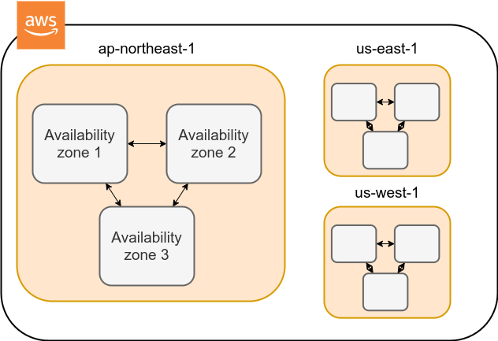
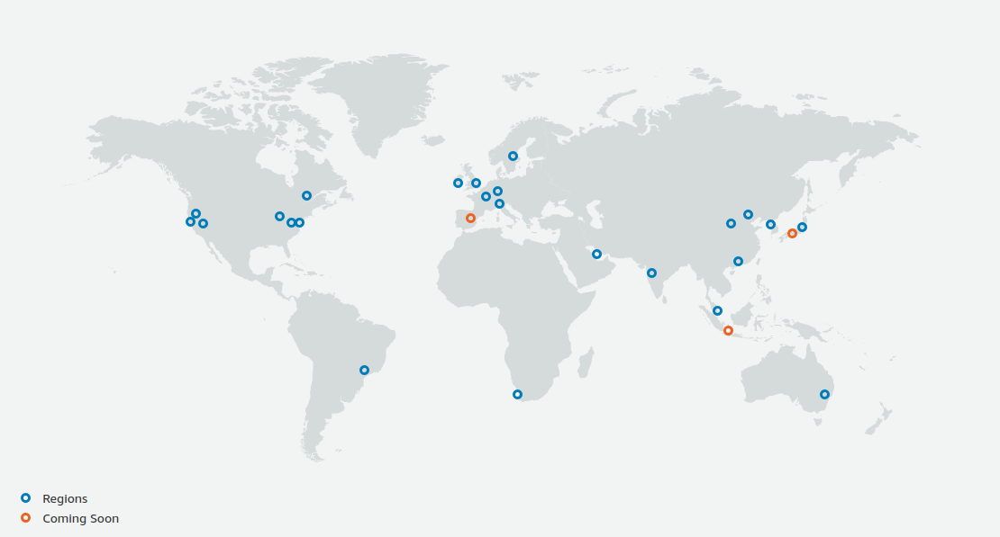
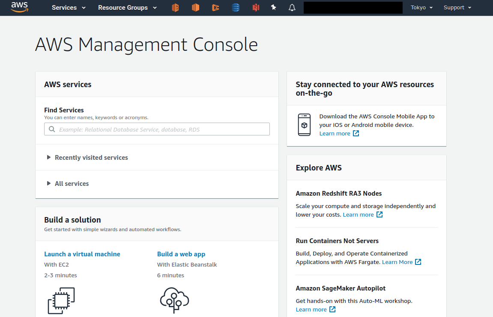

== AWS入門

=== AWSとは？

本講義では，クラウドの実践を行うプラットフォームとして， AWS を用いる．
実践にあたって，最低限必要な AWS の知識を本章では解説しよう．

https://aws.amazon.com[AWS (Amazon Web Service)] はAmazon社が提供する総合的なクラウドプラットフォームである．
AWSはAmazonが持つ膨大な計算リソースを貸し出すクラウドサービスとして，2006年に誕生した．
2018年では，クラウドプロバイダーとして最大のマーケットシェア(約33%)を保持している (https://www.canalys.com/newsroom/cloud-market-share-q4-2018-and-full-year-2018[参照])．
Netflix, Slackをはじめとした多くのウェブ関連のサービスで，一部または全てのサーバーリソースがAWSから提供されているとのことである．
よって，知らないうちにAWSの恩恵にあずかっている人も少なくないはずだ．

最大のシェアをもつだけに，とても幅広い機能・サービスが提供されており，科学・エンジニアリングの研究用途としても頻繁に用いられるようになってきている．

=== AWSの機能・サービス

<<fig_aws_services>> は，執筆時点においてAWSで提供されている主要な機能・サービスの一覧である．

[[fig_aws_services]]
.AWSで提供されている主要なサービス一覧
image::imgs/aws_services.png[AWS services, 350, align="center"]

計算，ストレージ，データベース，ネットワーク，セキュリティなど，クラウドの構築に必要な様々な要素が**独立したコンポーネント**として提供されている．基本的に，これらを組み合わせることでひとつのクラウドシステムができあがる．

また，機械学習・音声認識・AR/VRなど，特定のアプリケーションにパッケージ済みのサービスも提供されている．これらを合計すると全部で176個のサービスが提供されているとのことである (https://dev.classmethod.jp/articles/aws-summary-2020/[参照])．

AWSの初心者は，この大量のサービスの数に圧倒され，どこから手をつけたらよいのかわからなくなる，という状況に陥りがちである．だが実のところ，基本的な構成要素はそのうちの数個のみに限られる．他の機能の多くは，基本の要素を組み合わせ，特定のアプリケーションとしてAWSがパッケージとして用意したものである．なので，基本要素となる機能の使い方を知れば，AWSのおおよそのリソースを使いこなすことが可能になる．

=== AWSでクラウドを作るときの基本となる部品

==== 計算

image:imgs/aws_logos/EC2.png[S3, 40, role="left"]
**EC2 (Elastic Compute Cloud)**
様々なスペックの仮想マシンを作成し，計算を実行することができる．
クラウドの最も基本となる構成要素である．

image:imgs/aws_logos/Lambda.png[S3, 40, role="left"]
**Lambda**
Function as a Service (FaaS)と呼ばれる，小さな計算を**サーバーなし**で実行するためのサービス．Serverless architecutre の章で詳しく解説する．

==== ストレージ

image:imgs/aws_logos/EBS.png[S3, 40, role="left"]
**EBS (Elastic Block Store)**
EC2にアタッチすることのできる仮想データドライブ．
いわゆる"普通の"(一般的なOSで使われている)ファイルシステムを思い浮かべてくれたらよい．

image:imgs/aws_logos/S3.png[S3, 40, role="left"]
**S3 (Simple Storage Service)**
Object Storage と呼ばれる，APIを使ってデータの読み書きを行う，いうなれば”クラウド・ネイティブ”なデータの格納システムである．
Serverless architecutre の章で詳しく解説する．

==== データベース

image:imgs/aws_logos/DynamoDB.png[S3, 40, role="left"]
**DynamoDB**
NoSQL型のデータベースサービス (知っている人は `mongoDB` などを思い浮かべたらよい)．
Serverless architecutre の章で詳しく解説する．

==== ネットワーク

image:imgs/aws_logos/VPC.png[S3, 40, role="left"]
**VPC(Virtual Private Cloud)**
AWS上に仮想ネットワーク環境を作成し，仮想サーバー間の接続を定義したり，外部からのアクセスなどを管理する．
EC2はVPCの内部に配置されなければならない．

=== Region と Availability Zone

AWSを使用する際の重要な概念として， `Region` と `Availability Zone (AZ)` がある (<<fig_aws_regions_and_azs>>)．

[[fig_aws_regions_and_azs]]
.AWSにおける Region と Availability Zones

`Region` とは，データセンターの所在地のことである．
執筆時点において，AWSは世界の24の国と地域でデータセンターを所有している．
<<fig_aws_regions>> は2020/05時点で利用できるRegionの世界地図を示している．
**インターネットの接続などの観点から，地理的に一番近いRegionを使用するのが一般的によいとされる．**
日本では東京にデータセンターがある．また大阪リージョンも2021年に提供開始予定とのことである．
各Regionには固有のIDがついており，例えば東京は `ap-northeast-1`, 米国オハイオ州は `us-east-2`，などと定義されている．

[[fig_aws_regions]]
.Regions in AWS(出典: https://aws.amazon.com/about-aws/global-infrastructure/)

AWSコンソールにログインすると，画面右上のメニューバーでリージョンを選択することができる(<<fig_aws_console_regions>>)．
EC2, S3 などのAWSのリソースは，リージョンごとに完全に独立である．
したがって，**リソースを新たにデプロイする時，あるいはデプロイ済みのリソースを閲覧するときは，コンソールのリージョンが正しく設定されているか，確認する必要がある**．
ウェブビジネスを展開する場合などは，世界の各地にクラウドを展開する必要があるが，個人的な研究用途として用いる場合は，最寄りのリージョン(i.e. 東京)を使えば基本的に問題ない．

[TIP]
====
EC2 の利用料など，リージョン間で価格設定が若干異なる場合があり，最も価格が安く設定されているリージョンを選択する，というのも重要な視点である．
====

[[fig_aws_console_regions]]
.AWSコンソールでリージョンを選択
image::imgs/aws_regions2.png[AWS console select regions, 600, align="center"]

`Avaialibity Zone (AZ)` とは，Region 内で地理的に隔離されたデータセンターのことである．
それぞれのリージョンは2個以上のAZを有しており，もしひとつのAZで火災や停電などが起きた場合でも，他のAZがその障害をカバーすることができる．
また，AZ間は高速なAWS専用ネットワーク回線で結ばれているため，AZ間のデータ転送は極めて早い．
AZは，ネットのビジネスなどでサーバーダウンが許容されない場合などに注意すべき概念であり，個人的な用途で使う限りにおいてはあまり深く考慮する必要はない．言葉の意味だけ知っておけば十分である．

.Further reading
****
* https://docs.aws.amazon.com/AWSEC2/latest/UserGuide/using-regions-availability-zones.html[AWS documentation "Regions, Availability Zones, and Local Zones"]
****

=== AWSでのクラウドの開発

AWSのクラウドの全体像がわかってきたところで，次のトピックとして，どのようにしてAWS上にクラウドの開発を行い，展開していくかについての概略を解説をしよう．

AWSのリソースを追加・編集・削除などの操作を実行するには，**コンソールを用いる**方法と，**APIを用いる方法**の，二つの経路がある．

==== コンソール画面からリソースを操作する

AWSのアカウントにログインすると，まず最初に表示されるのが**AWSコンソール**である (<<aws_console_window>>)．

[[aws_console_window]]
.AWSマネージメントコンソール画面

コンソールを使うことで，EC2のインスタンスを立ち上げたり，S3のデータを追加・削除したり，ログを閲覧したりなど，あらゆるAWS上のあらゆるリソースの操作をGUI (Graphical User Interface) を使って実行することができる．
**初めて触る機能をポチポチと試したり，デバッグを行うときなどにとても便利である**．

コンソールはさらっと機能を試したり，開発中のクラウドのデバッグをするときには便利なのであるが，実際にクラウドの開発をする場面でこれを直接いじることはあまりない．むしろ，次に紹介するAPIを使用して，プログラムとしてクラウドのリソースを記述することで開発を行うのが一般的である．
そのような理由で，本講義ではAWSコンソールを使ったAWSの使い方はあまり触れない．AWSのドキュメンテーションには，たくさんの
https://aws.amazon.com/getting-started/hands-on/[チュートリアル]
が用意されており，コンソール画面から様々な操作を行う方法が記述されているので，興味がある読者はそちらを参照されたい．

==== APIからリソースを操作する

**API (Application Programming Interface)** を使うことで，コマンドをAWSに送信し，クラウドのリソースの操作をすることができる．
APIとは，簡単に言えばAWSが公開しているコマンドの一覧であり，`GET`, `POST`, `DELETE` などの **REST API** から構成されている．
が，直接REST APIを入力するのは面倒であるので，その手間を解消するための様々なツールが提供されている．

https://docs.aws.amazon.com/cli/latest/index.html[AWS CLI]
は，UNIXのコンソールからAWS APIを送信するためのCLI (Command Line Interface) である．

CLIに加えて，いろいろなプログラミング言語での SDK (Software Development Kit) が提供されている．以下に一例を挙げる．

* Python => https://boto3.amazonaws.com/v1/documentation/api/latest/index.html[boto3]
* Ruby => https://aws.amazon.com/sdk-for-ruby/[AWS SDK for Ruby]
* node.js => https://aws.amazon.com/sdk-for-node-js/[AWS SDK for Node.js]

具体的なAPIの使用例を見てみよう．

S3に新しい保存領域(バケットと呼ばれる)を追加したいとしよう．
AWS CLI を使った場合は，以下のようなコマンドを打てばよい．

[source,bash]
----
$ aws s3 mb s3://my-bucket --region ap-northeast-1
----

上記のコマンドは， `my-bucket` という名前のバケットを， `ap-northeast-1` のregionに作成する．

Pythonから上記と同じ操作を実行するには， `boto3` ライブラリを使って，以下のようなスクリプトを実行する．

[source, python, linenums]
----
import boto3

s3_client = boto3.client("s3", region_name="ap-northeast-1")
s3_client.create_bucket(Bucket="my-bucket")
----

もう一つ例をあげよう．

新しいEC2のインスタンス(インスタンスとは，起動状態にある仮想サーバーの意味である)を起動するには，以下のようなコマンドを打てば良い．

[source, bash]
----
$ aws ec2 run-instances --image-id ami-xxxxxxxx --count 1 --instance-type t2.micro --key-name MyKeyPair --security-group-ids sg-903004f8 --subnet-id subnet-6e7f829e
----

上記のコマンドにより，
https://aws.amazon.com/ec2/instance-types/t2/[t2.micro]
というタイプ (1CPU, 1.0GB RAM) のインスタンスが起動する．
ここではその他のパラメータの詳細の説明は省略する(第一回ハンズオンで詳しく解説)．

Pythonから上記と同じ操作を実行するには，以下のようなスクリプトを使う．

[source, python, linenums]
----
import boto3

ec2_client = boto3.client("ec2")
ec2_client.run_instances(
    ImageId="ami-xxxxxxxxx",
    MinCount=1, 
	MaxCount=1,
	KeyName="MyKeyPair",
	InstanceType="t2.micro",
    SecurityGroupIds=["sg-903004f8"],
    SubnetId="subnet-6e7f829e",
)
----

以上の具体例を通じて，APIによるクラウドのリソースの操作のイメージがつかめてきただろうか？
コマンド一つで，新しい仮想サーバーを起動したり，データの保存領域を追加したり，任意の操作を実行することができるわけである．
基本的に，このようなコマンドを複数組み合わせていくことで，自分の望むCPU・RAM・ネットワーク・ストレージが備わった計算環境をを構築することができる．もちろん，逆の操作(リソースの削除)もAPIを使って実行できる．

==== ミニ・ハンズオン: AWS CLI を使ってみよう

ここでは，ミニ・ハンズオンとして，AWS CLI を実際に使ってみる．
AWS CLI は先述の通り， AWS 上の任意のリソースの操作が可能であるが，ここでは一番シンプルな，**S3を使ったファイルの読み書きを実践する** (EC2の操作は少し複雑なので，第一回ハンズオンで行う)．
`aws s3` コマンドの詳しい使い方は https://docs.aws.amazon.com/cli/latest/reference/s3/index.html#cli-aws-s3[公式ドキュメンテーション]を参照．

[NOTE]
====
AWS CLI のインストールについては， <<aws_cli_install>> を参照．
====

[WARNING]
====
以下に紹介するハンズオンは，基本的に https://aws.amazon.com/free/?all-free-tier.sort-by=item.additionalFields.SortRank&all-free-tier.sort-order=asc[S3 の無料枠] の範囲内で実行することができる．
====

[WARNING]
====
以下のコマンドを実行する前に，AWSの認証情報が正しく設定されていることを確認する．
これには `~/.aws/credentials` のファイルに設定が書き込まれているか，環境変数 (`AWS_ACCESS_KEY_ID`, `AWS_SECRET_ACCESS_KEY`, `AWS_DEFAULT_REGION`) が定義されている必要がある．
詳しくは <<aws_cli_install>> を参照．
====

まず最初に，S3にデータの格納領域 (`Bucket` と呼ばれる．一般的なOSでの"ドライブ"に相当する) を作成するところから始めよう．

[source, bash]
----
$ bucketName="mybucket-$(openssl rand -hex 12)"
$ echo $bucketName
$ aws s3 mb "s3://${bucketName}"
----

S3のバケットの名前は，AWS全体でにユニークでなければならないことから，上ではランダムな文字列を含んだバケットの名前を生成し，`bucketName` という変数に格納している．

次に，バケットの一覧を取得してみよう．
[source, bash]
----
$ aws s3 ls

2020-06-07 23:45:44 mybucket-c6f93855550a72b5b66f5efe
----

先ほど作成したバケットがリストにあることを確認できる．

[NOTE]
====
本書のノーテーションとして，コマンドラインに入力するコマンドは，それがコマンドであると明示する目的で先頭に `$` がつけてある． `$` はコマンドをコピー&ペーストするときは除かなければならない．逆に，コマンドの出力は `$` なしで表示されている．
====

次に，バケットにファイルをアップロードする．

[source, bash]
----
$ echo "Hello world!" > hello_world.txt
$ aws s3 cp hello_world.txt "s3://${bucketName}/hello_world.txt"
----

上では `hello_world.txt` というダミーのファイルを作成して，それをアップロードした．

それでは，バケットの中にあるファイルの一覧を取得してみる．

[source, bash]
----
$ aws s3 ls "s3://${bucketName}" --human-readable

2020-06-07 23:54:19   13 Bytes hello_world.txt
----

先ほどアップロードしたファイルがたしかに存在することがわかる．

最後に，使い終わったバケットを削除する．

[source, bash]
----
$ aws s3 rb "s3://${bucketName}" --force
----

デフォルトでは，バケットは空でないと削除できない．空でないバケットを強制的に削除するには `--force` のオプションを付ける．

以上のように，AWS CLI を使って，S3のバケットの操作を実行することができた．
EC2やLambda, DynamoDBなどについても同様に AWS CLI を使ってあらゆる操作を実行することができる．

=== CloudFormation と AWS CDK

==== CloudFormation による Infrastructure as Code (IaC)

前節で述べたように，AWS API を使うことでクラウドの**あらゆる**リソースの作成・管理が可能である．よって，原理上は，APIのコマンドを組み合わせていくことで，自分の作りたいクラウドを設計することができる．

しかし，ここで実用上考慮しなければならない点がひとつある．AWS API には大きく分けて，**リソースを操作する**コマンドと，**タスクを実行する**コマンドがあることである (<<fig_aws_iac>>)．

[[fig_aws_iac]]
.AWS APIはリソースを操作するコマンドとタスクを実行するコマンドに大きく分けられる．リソースを記述・管理するのに使われるのが， CloudFormation と CDK である．
image::imgs/iac.png[AWS console, 500, align="center"]

**リソースを操作する**とは，EC2のインスタンスを起動したり，S3の保存領域(バケット)をしたり，データベースに新たなテーブルを追加する，などの**静的なリソースを準備する** 操作を指す．
"ハコ"を作る操作と呼んでもよいだろう．
このようなコマンドは，**クラウドのデプロイ時にのみ，一度だけ実行されればよい**．

**タスクを実行するコマンド** とは， EC2 のインスタンスにジョブを投入したり， S3 のバケットにデータを読み書きするなどの操作を指す．
これは，EC2やS3などのリソース ("ハコ") を前提として，その内部で実行されるべき計算を記述するものである．
前者に比べてこちらは**動的な操作**を担当する，と捉えることもできる．

そのような観点から，**インフラを記述するプログラム**と**タスクを実行するプログラム**はある程度分けて管理されるべきである．クラウドの開発は，クラウドの(静的な)リソースを記述するプログラムを作成するステップと，インフラ上で動く動的な操作を行うプログラムを作成するステップの，二段階に分けて考えることができる．

AWSでのリソースを管理するための仕組みが， https://aws.amazon.com/cloudformation/[CloudFormation] である．
CloudFormation とは，CloudFormationのシンタックスに従ったテキストにより，AWSのインフラを記述するものである．
CloudFormation を使って，例えば，EC2のインスタンスをどれくらいのスペックで，何個起動するか，インスタンス間はどのようなネットワークで結び，どのようなアクセス権限を付与するか，などのリソースの定義を逐次的に記述することができる．
一度CloudFormation ファイルが出来上がれば，それにしたがったクラウド・インフラをコマンド一つでAWS上に展開することができる．
また，CloudFormation ファイルを交換することで，全く同一のクラウド環境を他者が簡単に再現することも可能になる．
このように，本来は物理的な実体のあるハードウェアを，プログラムによって記述し，管理するという考え方を，**Infrastructure as Code (IaC)**と呼ぶ．

CloudFormation を記述するには，基本的に **JSON** (JavaScript Object Notation) と呼ばれるフォーマットを使う．以下は，JSONで記述された CloudFormation ファイルの一例 (抜粋) である．

[source, json, linenums]
----
"Resources" : {
  ...    
  "WebServer": {
    "Type" : "AWS::EC2::Instance",
    "Properties": {
      "ImageId" : { "Fn::FindInMap" : [ "AWSRegionArch2AMI", { "Ref" : "AWS::Region" },
                        { "Fn::FindInMap" : [ "AWSInstanceType2Arch", { "Ref" : "InstanceType" }, "Arch" ] } ] },
      "InstanceType"   : { "Ref" : "InstanceType" },
      "SecurityGroups" : [ {"Ref" : "WebServerSecurityGroup"} ],
      "KeyName"        : { "Ref" : "KeyName" },
      "UserData" : { "Fn::Base64" : { "Fn::Join" : ["", [
                     "#!/bin/bash -xe\n",
                     "yum update -y aws-cfn-bootstrap\n",

                     "/opt/aws/bin/cfn-init -v ",
                     "         --stack ", { "Ref" : "AWS::StackName" },
                     "         --resource WebServer ",
                     "         --configsets wordpress_install ",
                     "         --region ", { "Ref" : "AWS::Region" }, "\n",

                     "/opt/aws/bin/cfn-signal -e $? ",
                     "         --stack ", { "Ref" : "AWS::StackName" },
                     "         --resource WebServer ",
                     "         --region ", { "Ref" : "AWS::Region" }, "\n"
      ]]}}
    },
    ...
  },
  ...    
},
----

ここでは， "WebServer" という名前のつけられた EC2 インスタンスを定義している．かなり長大で複雑な記述であるが，これによって所望のスペック・OSをもつEC2インスタンスを自動的に生成することが可能になる．

==== AWS CDK

前節で紹介した CloudFormation は，見てわかるとおり大変記述が複雑であり，またそれのどれか一つにでも誤りがあってはいけない．
また，基本的に"テキスト"を書いていくことになるので，プログラミング言語で使うような便利な変数やクラスといった概念が使えない　(厳密には，変数に相当するような機能は存在する)．
また，記述の多くの部分は繰り返しが多く，自動化できる部分も多い．

そのような悩みを解決してくれるのが， https://aws.amazon.com/cdk/[AWS Cloud Development Kit (CDK)] である．
**CDKは Python などのプログラミング言語を使って CloudFormation を自動的に生成してくれるツールである．**
CDK は2019年にリリースされたばかりの比較的新しいツールで，日々改良が進められている (https://github.com/aws/aws-cdk/releases[GitHub レポジトリ] のリリースを見ればその開発のスピードの速さがわかるだろう)．
CDK は TypeScript (JavaScript), Python, Java など複数の言語でサポートされている．

CDKを使うことで，CloudFormation に相当するクラウドリソースの記述を，より親しみのあるプログラミング言語を使って行うことができる．かつ，典型的なリソース操作に関してはパラメータの多くの部分を自動で決定してくれるので，記述しなければならない量もかなり削減される．

以下に Python を使った CDK のコードの一例 (抜粋) を示す．

[source, python, linenums]
----
from aws_cdk import (
    core,
    aws_ec2 as ec2,
)

class MyFirstEc2(core.Stack):

    def __init__(self, scope, name, **kwargs):
        super().__init__(scope, name, **kwargs)

        vpc = ec2.Vpc(
            ... # some parameters
        )

        sg = ec2.SecurityGroup(
            ... # some parameters
        )

        host = ec2.Instance(
            self, "MyGreatEc2",
            instance_type=ec2.InstanceType("t2.micro"),
            machine_image=ec2.MachineImage.latest_amazon_linux(),
            vpc=vpc,
            ...
        )
----

上記のようなコードから，CloudFormationファイルを自動生成することができる．とても煩雑だったCloudFormationファイルに比べて，Python を使うことで格段に短く，わかりやすく記述できることができるのがわかるだろう．

本講義では，ハンズオンでCDKを使ってクラウド開発の体験をしてもらう．

.Further reading
****
* https://github.com/aws-samples/aws-cdk-examples[AWS CDK Examples]: CDKのexample project が多数紹介されている．ここにある例をテンプレートに自分の開発を進めると良い．
****

