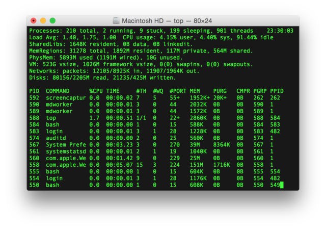

[[chap_cloud_basics]]
== クラウド概論

=== クラウドとは？

image::imgs/cloud_word_art.png[Cloud, 400, align="center"]

クラウドとはなにか？
クラウドという言葉は，それ自身がとても広い意味を持つので，厳密な定義付けを行うことは難しい．

学術的な意味でのクラウドの定義づけをするとしたら，NIST(米国・国立標準技術研究所) による https://csrc.nist.gov/publications/detail/sp/800-145/final[The NIST Definition of Cloud Computing] が引用されることが多い．
これによると，クラウドとは以下の要件が満たされたハードウェア/ソフトウェアの総体のことをいう．

* **On-demand self-service**
利用者のリクエストに応じて計算資源が自動的に割り当てられる．
* **Broad network access**
利用者はネットワークを通じてクラウドにアクセスできる．
* **Resource pooling**
クラウドプロバイダーは，所有する計算資源を分割することで複数の利用者に計算資源を割り当てる．
* **Rapid elasticity**
利用者のリクエストに応じて，迅速に計算資源の拡大あるいは縮小を行うことができる．
* **Measured service**
計算資源の利用量を計測・監視することができる．

...と，いわれても抽象的でよくわからないかもしれない．もう少し具体的な話をする．

個人が所有する計算機で， CPU をアップグレードしようと思ったら，物理的に筐体を開け，CPUソケットを露出させ，新しいCPUに交換する必要があるだろう．
あるいは，ストレージがいっぱいになってしまったら，古いディスクを抜き取り，新しいディスクを挿入する必要がある．
計算機の場所を移動させたときには，新しい部屋の LAN ケーブルを差し込まないとネットワークには接続できない．

クラウドでは，これらの操作が**プログラムからのコマンドによって実行できる**．
CPUが1000個欲しいと思ったらならば，そのようにクラウドプロバイダーにリクエストを送れば良い．
すると，数分もしないうちに 1000 CPUの計算資源が割り当てられる．
ストレージを1TBから10TBに拡張しようと思ったならば，そのようにコマンドを送ればよい (これは，Google Drive や Dropbox などのサービスなどで馴染みのある人も多いだろう)．
計算資源を使い終わったら，そのことをプロバイダーに伝えれば，割り当て分はすぐさま削除される．
クラウドプロバイダーは，使った計算資源の量を正確にモニタリングしており，その量をもとに利用料金の計算が行われる．

このように，クラウドの本質は物理的なハードウェアの仮想化・抽象化であり，利用者はコマンドを通じて，**まるでソフトウェアの一部かのように，物理的なハードウェアの管理・運用を行うことができる**．もちろん，背後では，データセンターに置かれた膨大な数の計算機が大量の電力を消費しながら稼働している．クラウドプロバイダーはデータセンターの計算資源を上手にやりくりし，ソフトウェアとしてのインターフェースをユーザーに提供することで，このような仮想化・抽象化を達成しているわけである．クラウドプロバイダーの視点からすると，大勢のユーザーに計算機を貸し出し，データセンターの稼働率を常時100%に近づけることで，利益率の最大化を図っているのである．

著者の言葉で，クラウドの重要な特性を定義するならば，以下のようになる．

[quote]
クラウドとは計算機ハードウェアの抽象化である．つまり，物理的なハードウェアをソフトウェアの一部かのように自在に操作・拡大・接続することを可能にする技術である．

=== なぜクラウドを使うのか？

上述のように，クラウドとはプログラムを通じて自由に計算資源を操作することのできる計算環境である．
ここでは，リアルなローカル計算環境と比べて，なぜクラウドを使うと良いことがあるのかについて述べたい．

1. **自由にサーバーのサイズをスケールできる**
+
なにか新しいプロジェクトを始めるとき，あらかじめ必要なサーバーのスペックを知るのは難しい．
いきなり大きなサーバーを買うのはリスクが高い．
一方で，小さすぎるサーバーでは，後のアップグレードが面倒である．
クラウドを利用すれば，プロジェクトを進めながら，必要な分だけの計算資源を確保することができる．
2. **自分でサーバーをメンテナンスする必要がない**
+
悲しいことに，コンピュータとは古くなるものである．最近の技術の進歩の速度からすると，5年も経てば，もはや当時の最新コンピューターも化石と同じである．
5年ごとにサーバーを入れ替えるのは相当な手間である．
またサーバーの停電や故障など不意の障害への対応も必要である．
クラウドでは，そのようなインフラの整備やメンテナンスはプロバイダーが自動でやってくれるので，ユーザーが心配する必要がない．
3. **初期コスト0**
+
自前の計算環境とクラウドの，経済的なコストのイメージを示したのが <<cloud_economic_curve>> である．
クラウドを利用する場合の初期コストは基本的に0である．
その後，使った利用量に応じてコストが増大していく．
一方，自前の計算環境では，大きな初期コストが生じる．
その分，初期投資後のコストの増加は，電気利用料やサーバー維持費などに留まるため，クラウドを利用した場合よりも傾きは小さくなる．
自前の計算機では，ある一定期間後，サーバーのアップグレードなどによる支出が生じることがある．
一方，クラウドを利用する場合は，そのような非連続なコストの増大は基本的に生じない．
クラウドのコストのカーブが，自前計算環境のコストのカーブの下にある範囲においては，クラウドを使うことは経済的なコスト削減につながる．
+

[[cloud_economic_curve]]
.クラウドと自前計算機環境の経済的コストの比較
image::imgs/cloud_cost.png[Cost, 500, align="center"]

特に，**1.**の点は研究の場面では重要であると筆者は感じる．
研究をやっていて，四六時中計算を走らせ続けるという場合は少ない．
むしろ，新しいアルゴリズムが完成したとき・新しいデータが届いたとき，集中的・突発的に計算タスクが増大することが多いだろう．
そういったときに，フレキシブルに計算力を増強させることができるのは，クラウドを使う大きなメリットである．

ここまでクラウドを使うメリットを述べたが，逆に，デメリットというのも当然存在する．

1. **クラウドは賢く使わないといけない**
+
<<cloud_economic_curve>> で示したコストのカーブにあるとおり，使い方によっては自前の計算環境のほうがコスト的に有利な場面は存在しうる．
クラウドを利用する際は，使い終わった計算資源はすぐに削除するなど，利用者が賢く管理を行う必要があり，これを怠ると思いもしない額の請求が届く可能性がある．
2. **セキュリティ**
+
クラウドは，インターネットを通じて世界のどこからでもアクセスできる状態にあり，セキュリティ管理を怠ると簡単にハッキングの対象となりうる．
ハッキングを受けると，情報流出だけでなく，経済的な損失を被る可能性がある．
3. **ラーニングカーブ**
+
上記のように，コスト・セキュリティなど，クラウドを利用する際に留意しなければならない点は多い．
賢くクラウドを使うには，十分なクラウドの理解が必要であり，そのラーニングカーブを乗り越える必要がある．

=== どうやってクラウドを使うのか？

大学や研究機関では，その機関の構成員向けの大規模計算機サーバーが運用されていることが多い．
このような，特定の組織・団体の内部のみで使用されるクラウドを，プライベートクラウド (private cloud) と呼ぶ．

一方，商用のサービスとしてのクラウドも，現在は多くの企業から提供されている．
このような，一般の顧客に向けたクラウドサービスのことを，パブリッククラウド (public cloud) と呼ぶ．
有名なクラウドプラットフォームの例を挙げると， Google社が提供する https://cloud.google.com/[Google Cloud Platform (GCP)]， Microsoft 社が提供する https://azure.microsoft.com[Azure]， Amazon 社が提供する https://aws.amazon.com[Amazon Web Service (AWS)] などがある．

プライベートクラウドは，組織の構成員ならば無料もしくは極めて割安のコストで計算を実行できる．
しかし，使用できる計算資源の量は，研究提案の申請により決定される場合が多く，柔軟性に欠ける場合もある．
パブリッククラウドを利用する場合は，プロバイダーの設定した利用料金を支払うことになるが，計算リソースはほとんど上限なく使用することが可能である．

.コラム: Terminal の語源
****
Mac/Linuxなどでコマンドを入力するときに使用する，あの黒い画面のことを Terminal と呼んだりする．
この言葉の語源をご存知だろうか？

この言葉の語源は，コンピュータが誕生して間もない頃の時代に遡る．その頃のコンピュータというと，何千何万のという数の真空管が接続された，会議室一個分くらいのサイズのマシンであった．そのような高価でメンテが大変な機材であるから，当然みんなでシェアして使うことが前提となる．ユーザーがコンピュータにアクセスするため，マシンからは何本かのケーブルが伸び，それぞれにキーボードとスクリーンが接続されていた... これを **Terminal** と呼んでいたのである．人々は，代わる代わるTerminalの前に座って，計算機との対話を行っていた．

時代は流れ，WindowsやMacなどのいわゆるパーソナルコンピュータの出現により，コンピュータはみんなで共有するものではなく，個人が所有するものになった．

最近のクラウドの台頭は，みんなで大きなコンピュータをシェアするという，最初のコンピュータの使われ方に原点回帰していると捉えることもできる．一方で，スマートフォンやウェアラブルなどのエッジデバイスの普及も盛んであり，個人が複数の"小さな"コンピュータを所有する，という流れも同時に進行しているのである．
****
