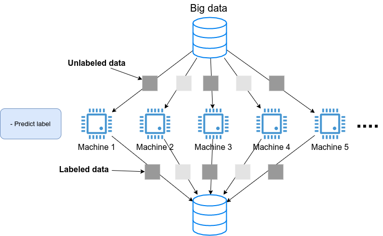
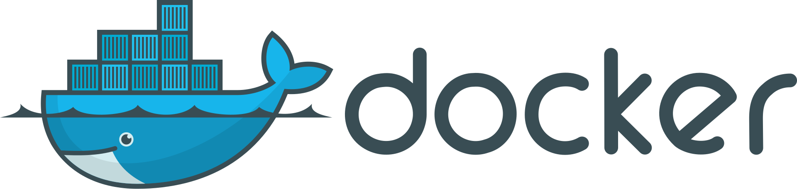

== Docker 入門

<<sec_scientific_computing>>，<<sec_handson02>> にわたって， AWS 上に仮想サーバーを立ち上げ，深層学習のプログラムを走らせる方法を紹介してきた．
ここまでは，**単一のサーバー**を立ち上げ，それに SSH でログインをして，コマンドを叩くことで計算を行ってきた．
いわば，__パーソナルコンピュータの延長__のような形でクラウドを使ってきたわけである．

このような，インターネットのどこからでもアクセスできるパーソナルコンピュータとしてのクラウドという使い方も，もちろん便利であるし，いろいろな応用の可能性がある．
しかし，これだけではクラウドの本当の価値は十分に発揮されていないと言うべきだろう．
<<chap_cloud_basics>> で述べたように，現代的なクラウドの一番の強みは自由に計算機の規模を拡大できることにある．
すなわち，**多数のサーバーを同時に起動し，複数のジョブを分散並列的に実行させることで大量のデータを処理してこそ，クラウドの本領が発揮される**のである．

本章からはじまる3章を使って，クラウドを使うことでどのように大規模な計算システムを構築しビッグデータの解析に立ち向かうのか，その片鱗をお見せしたい．
特に，前章で扱った深層学習を，どのようにビッグデータに適用していくかという点に焦点を絞って議論していきたい．
そのための前準備として，本章では https://www.docker.com/[Docker] と呼ばれる計算機環境の仮想化ソフトウェアを紹介する．
現代のクラウドは Docker なしには成り立たないといっても過言ではないだろう．
クラウドに限らず，ローカルで行う計算処理にも Docker は大変便利である．
クラウドからは少し話が離れるが，しっかりと理解して前に進んでもらいたい．

=== 機械学習の大規模化
先ほどから"計算システムの大規模化"と繰り返し唱えているが，それは具体的にはどのようなものを指しているのか？
ここでは大規模データを処理するための計算機システムを，機械学習を例にとって見てみよう．

<<sec_scientific_computing>> で紹介した https://github.com/openai/gpt-3[GPT-3] のような，超巨大な数のパラメータを有する深層学習モデルを学習させたいとしよう．
そのような計算を行いたい場合，一つのサーバーでは計算力が到底足りない．
したがって，典型的には <<big_dnn_training>> に示すような計算システムの設計がなされる．
すなわち，大量の教師データを，小さなチャンクとして複数のマシンに分散し，並列的にニューラルネットのパラメータを最適化していくという構造である．

[[big_dnn_training]]
.複数の計算機を使った大規模な深層学習モデルの訓練
image::imgs/big_dnn_training.png[big_dnn_training, 700, align="center"]

あるいは，学習済みのモデルを大量のデータに適用し，解析を行いたいとしよう．
例えば， SNS のプラットフォームで大量の画像が与えられて，それぞれの写真に何が写っているのかをラベルづけする，などのアプリケーションを想定できる．
そのような場合は， <<big_dnn_inference>> のようなアーキテクチャが考えられるだろう．
すなわち，大量のデータを複数のマシンで分割し，それぞれのマシンで推論の計算を行うというような構造である．

[[big_dnn_inference]]
.複数の計算機を使った大規模なディープラーニングモデルの学習

このような複数の計算機を同時に走らせるようなアプリケーションをクラウド上で実現するには，どのようにすればよいのだろうか？

ひとつ重要なポイントとして， <<big_dnn_training>> や <<big_dnn_inference>> で起動している複数のマシンは，**基本的に全く同一のOS・計算環境を有している**点である．
ここで，個人のコンピュータでやるようなインストールの操作を，各マシンで行うこともできるが，それは大変な手間であるし，メンテナンスも面倒だろう．
すなわち，大規模な計算システムを構築するには，**簡単に計算環境を複製できるような仕組み**が必要であるということがわかる．

そのような目的を実現するために使われるのが， https://www.docker.com/[Docker] と呼ばれるソフトウェアである．

=== Docker とは

.Docker のロゴ

Docker とは， **コンテナ (Container)** と呼ばれる仮想環境下で，ホストOSとは独立した別の計算環境を走らせるためのソフトウェアである．
Docker を使うことで， OS を含めた全てのプログラムをコンパクトにパッケージングすることが可能になる (パッケージされたひとつの計算環境のことを **イメージ (Image) **と呼ぶ)．
Dockerを使うことで，クラウドのサーバー上に瞬時に計算環境を複製することが可能になり，上で見たような複数の計算機を同時に走らせるためのシステムが実現できる．

Docker は2013年に Solomon Hykes らを中心に開発され，以降爆発的に普及し，クラウドコンピューティングだけでなく，機械学習・科学計算の文脈などで，欠かすことのできないソフトウェアとなった．
概念としては， Docker は仮想マシン (Virtual machine; VM) にとても近い．
ここでは， VM との対比をしながら，Docker とはなにかを簡単に説明しよう．

仮想マシン(VM) とは，ホストとなるマシンの上に，仮想化されたOSを走らせる技術である (<<docker_vs_vm>>)．
VM には **ハイパーバイザー (Hypervisor)** と呼ばれるレイヤーが存在する．
Hypervisor はまず，物理的な計算機リソース (CPU, RAM, network など) を分割し，仮想化する．
例えば， ホストマシンに物理的なCPUが4コアあるとして，ハイパーバイザーはそれを (2,2) 個の組に仮想的に分割することができる．
VM 上で起動する OS には，ハイパーバイザーによって仮想化されたハードウェアが割り当てられる．
VM 上で起動する OS は基本的に完全に独立であり，例えば OS-A は OS-B に割り当てられたCPUやメモリー領域にアクセスすることはできない．
VM を作成するための有名なソフトウェアとしては， https://www.vmware.com/[VMware]， https://www.virtualbox.org/[VirtualBox]， https://xenproject.org/[Xen] などがある．
また，これまで触ってきた EC2 も，基本的に VM 技術を使うことで所望のスペックを持った仮想マシンがユーザーに提示される．

Docker も， VM と同様に，仮想化された OS をホストのOS上に走らせるための技術である．
VM に対し， Docker ではハードウェアレベルの仮想化は行われておらず，すべての**仮想化はソフトウェアレベルで実現されている** (<<docker_vs_vm>>)．
Docker で走る仮想 OS は，**多くの部分をホストのOSに依存しており，結果として非常にコンパクトである**．
その結果， Docker で仮想 OS を起動するために要する時間は， VM に比べて圧倒的に早い．
また， パッケージ化された環境 (=image) のサイズも完全なOSに比べ圧倒的に小さくなるので，ネットワークを通じたやり取りが非常に高速化される点も重要である．
加えて， VM のいくつかの実装では，メタル (仮想化マシンに対して，物理的なハードウェア上で直接起動する場合のこと) と比べ，ハイパーバイザーレイヤでのオーバーヘッドなどにより性能が低下することが知られているが， Docker ではメタルとほぼ同様の性能を引き出すことができるとされている．

その他， VM との相違点などはたくさんあるのだが，ここではこれ以上詳細には立ち入らない．
大事なのは， **Docker とはとてもコンパクトかつハイパフォーマンスな仮想計算環境を作るツールである**，という点である．
その手軽さゆえに，2013年の登場以降，クラウドシステムでの利用が急速に増加し，現代のクラウドでは欠くことのできない中心的な技術になっている．

[[docker_vs_vm]]
.Docker と VM の比較 (画像出典: https://www.docker.com/blog/containers-replacing-virtual-machines/)
image::imgs/docker_vs_vm.png[docker_vs_vm, 700, align="center"]

=== Docker チュートリアル

Docker とはなにかを理解するためには，実際に触って動かしてみるのが一番有効な手立てである．
ここでは， Docker の簡単なチュートリアルを行っていく．

Docker のインストールについては， <<environments>> および https://docs.docker.com/engine/install/[公式のドキュメンテーション] を参照してもらいたい．
Docker のインストールが完了している前提で，以下は話を進めるものとする．

==== Image をダウンロード

パッケージ化された Docker の仮想環境 (**Image** と呼ぶ) は， https://hub.docker.com/[Docker Hub] からダウンロードできる．
Docker Hub には，個人や企業・団体が作成した Docker Image が集められており， GitHub などと同じ感覚で，オープンな形で公開されている．

例えば， Ubuntu の Image は https://hub.docker.com/_/ubuntu[このリンク] で公開されており， `pull` コマンドを使うことでローカルにダウンロードすることができる．

[source, bash]
----
$ docker pull ubuntu:18.04
----

ここで，イメージ名の `:` (コロン) 以降に続く文字列を **タグ (tag)** と呼び，主にバージョンを指定するなどの目的で使われる．

[TIP]
====
`pull` コマンドはデフォルトでは Docker Hub でイメージを検索し，ダウンロードを行う．
Docker image を公開するためのデータベース (registry と呼ぶ) は Docker Hub だけではなく，例えば GitLab や GitHub は独自の registry 機能を提供しているし，個人のサーバーで registry を立ち上げることも可能である．
Docker Hub 以外の registry から pull するには， `myregistry.local:5000/testing/test-image` のように，イメージ名の先頭につける形で registry のアドレス (とオプションとしてポート番号) を指定すればよい．
====

==== Image を起動

Pull してきた Image を起動するには， `run` コマンドを使う．

[source, bash]
----
$ docker run -it ubuntu:18.04
----

ここで， `-it` とは，インタラクティブな shell のセッションを開始するために必要なオプションである．

上のコマンドを実行すると，仮想化された Ubuntu が起動され，コマンドラインからコマンドが打ち込めるようになる (<<docker_shell>>)．

[[docker_shell]]
.Docker を使って ubuntu:18.04 イメージを起動
image::imgs/docker_shell.png[docker_shell, 600, align="center"]

上で使った `ubuntu:18.04` のイメージは は，空の Ubuntu OS だが，既にプログラムがインストール済みのものもある．
これは， <<sec_handson02>> でみた DLAMI と概念として似ている．
たとえば， pytorch がインストール済みの Image は https://hub.docker.com/r/pytorch/pytorch/[こちら] で公開されている．

これを起動してみよう．

[source. bash]
----
$ docker run -it pytorch/pytorch
----

[NOTE]
====
`docker run` を実行したとき，ローカルに該当する Image がない場合は，自動的に Docker Hub からダウンロードされる
====

pytorch の container が起動したら， Python のシェルを立ち上げて， pytorch をインポートしてみよう．

[source, bash]
----
$ python3
Python 3.7.7 (default, May  7 2020, 21:25:33)
[GCC 7.3.0] :: Anaconda, Inc. on linux
Type "help", "copyright", "credits" or "license" for more information.
>>> import torch
>>> torch.cuda.is_available()
False
----

このように， Docker を使うことで簡単に特定のOS・プログラムの入った計算環境を再現することが可能になる．

==== 自分だけの Image を作る

自分の使うソフトウェア・ライブラリがインストールされた，自分だけの Image を作ることも可能である．

例えば， https://gitlab.com/tomomano/intro-aws/container_registry[本講義で提供している docker image] には， Python, Node.js, AWS CLI, AWS CDK などのソフトウェアがインストール済みであり，ダウンロードしてくるだけですぐにハンズオンのプログラムが実行できるようになっている．

カスタムの docker image を作るには， `Dockerfile` という名前のついたファイルを用意し，その中にどんなプログラムをインストールするかなどを記述していく．

具体例として，本講義で提供している Docker image のレシピを見てみよう (https://github.com/tomomano/intro-aws-2021/blob/main/docker/Dockerfile[/docker/Dockerfile])．

[source, docker]
----
FROM node:12

# <1>
RUN cd /opt \
    && curl -q "https://www.python.org/ftp/python/3.7.6/Python-3.7.6.tgz" -o Python-3.7.6.tgz \
    && tar -xzf Python-3.7.6.tgz \
    && cd Python-3.7.6 \
    && ./configure --enable-optimizations \
    && make install

RUN cd /opt \
    && curl "https://awscli.amazonaws.com/awscli-exe-linux-x86_64.zip" -o "awscliv2.zip" \
    && unzip awscliv2.zip \
    && ./aws/install

# <2>
RUN npm install -g aws-cdk@1.105

# Make command line prettier...
RUN echo "alias ls='ls --color=auto'" >> /root/.bashrc
RUN echo "PS1='${debian_chroot:+($debian_chroot)}\[\033[01;32m\]\u@aws-handson\[\033[00m\]:\[\033[01;34m\]\w\[\033[00m\]\$ '" >> /root/.bashrc

RUN mkdir -p /root/.ssh
WORKDIR /root
ENTRYPOINT ["/bin/bash"]
----

`Dockerfile` の中身の説明は特に行わないが，例えば上のコードで <1> で示したところは， Python 3.7 のインストールを実行している．
また， <2> で示したところは， AWS CDK のインストールを行っていることがわかるだろう．
このように，リアルな OS で行うのと同じ流れでインストールのコマンドを逐一記述していくことで，自分だけの Docker image を作成することができる．
一度 image を作成すれば，それを他人に渡すことで，他者も同一の計算環境を簡単に再構成することができる．

"ぼくの環境ではそのプログラム走ったのにな..." というのは，プログラミング初心者ではよく耳にする会話だが， docker を使いこなせばそのような心配とは無縁である．
そのような意味で，クラウド以外の場面でも， Docker の有用性・汎用性は極めて高い．

.Is Docker alone?
****
コンテナを用いた仮想計算環境ツールとして Docker を紹介したが， 他に選択肢はないのか？
よくぞ聞いてくれた！
Docker の登場以降，複数のコンテナベースの仮想環境ツールが開発されてきた．
いずれのツールも，概念や API については Docker と共通するものが多いが，Docker にはない独自の特徴を提供している．
ここではその中でも有名ないくつかを紹介しよう．

https://github.com/hpcng/singularity[Singularity] は科学計算や HPC (High Performance Computing) の分野で人気の高いコンテナプラットフォームである．
Singularity では大学・研究機関の HPC クラスターでの運用に適したような設計が施されている．
例えば， Docker は基本的には root 権限で実行されるのに対し， Singularity はユーザー権限 (コマンドを実行したユーザー自身) でプログラムが実行される．
root 権限での実行は Web サーバーのように個人・企業がある特定のサービスのために運用するサーバーでは問題ないが，多数のユーザーが多様な目的で計算を実行する HPC クラスターでは問題となる．
また，Singularity は独自のイメージの作成方法・エコシステムを持っているが， Docker イメージを Singularity のイメージに変換し実行する機能も有している．

https://github.com/containers/podman[podman] は Red Hat 社によって開発されたもう一つのコンテナプラットフォームである．
podman は基本的に Docker と同一のコマンドを採用しているが，実装は Red Hat によってスクラッチから行われた．
podman では， Singularity と同様にユーザー権限でのプログラムの実行を可能であり，クラウドおよび HPC の両方の環境に対応するコンテナプラットフォームを目指して作られた．
また，その名前にある通り pod と呼ばれる独自の概念が導入されている．

著者の個人的な意見としては，現時点では Docker をマスターしておけば当面は困ることはないと考えるが，興味のある読者はぜひこれらのツールも試してみてはいかがだろうか？
****

=== Elastic Container Service (ECS)

.ECS のロゴ
image::imgs/aws_logos/ECS.png[ECS, 100]

以上で説明したように， Docker を使うことで仮想計算環境を簡単に複製・起動することが可能になる．
本章の最後の話題として， AWS 上で Docker を使った計算システムを構築する方法を解説しよう．

**Elastic Container Service (ECS)** とは， Docker を使った計算機クラスターを AWS 上に作成するためのツールである．
ECS の概要を示したのが <<ecs_overview>> である．

ECS は，タスク (Task) と呼ばれる単位で管理された計算ジョブを受け付ける．
システムにタスクが投入されると，ECS はまず最初にタスクで指定された Docker イメージを外部レジストリからダウンロードしてくる．
外部レジストリとしては， DockerHub や AWS 独自の Docker レジストリである **ECR (Elastic Container Registry)** を指定することができる．

ECS の次の重要な役割はタスクの配置である．
予め定義されたクラスター内で，計算負荷が小さい仮想インスタンスを選び出し，そこに Docker イメージを配置することで指定された計算タスクが開始される．
"計算負荷が小さい仮想インスタンスを選び出す" と言ったが，具体的にどのような戦略・ポリシーでこの選択を行うかは，ユーザーの指定したパラメータに従う．

またクラスターのスケーリングもECSにおける重要な概念である．
スケーリングとは，クラスター内のインスタンスの計算負荷をモニタリングし，計算負荷に応じてインスタンスの起動・停止を行う操作を指す．
クラスター全体の計算負荷が指定された閾値 (例えば80%の稼働率) を超えていた場合，新たな仮想インスタンスをクラスター内に立ち上げる操作を scale-out (スケールアウト) と呼び，
負荷が減った場合に不要なインスタンスを停止する操作を scale-in (スケールイン) と呼ぶ．
クラスターのスケーリングは， ECS が他の AWS のサービスと連携することで実現される．
具体的には， EC2 の **Auto scaling group (ASG)** や **Fargate** の２つの選択肢が多くの場合選択される．
**ASG** については <<sec_aws_batch>>, Fargate については <<sec_fargate_qabot>> でより詳細に解説する．

これら一連のタスクの管理を， ECS は自動でやってくれる．
クラスターのスケーリングやタスクの配置に関してのパラメータを一度指定してしまえば，ユーザーは (ほとんどなにも考えずに) 大量のジョブを投入することができる．
クラスターのスケーリングによってジョブの量にちょうど十分なだけのインスタンスが起動し，ジョブが完了した後は不要なインスタンスはインスタンスすべて停止される．

さて，ここまで少し説明的な話が続いてしまったが，次章からは早速 Docker と AWS を使って大規模な並列計算システムを構築する

[[ecs_overview]]
.ECS の概要
image::imgs/ecs.png[ecs, 500, align="center"]
