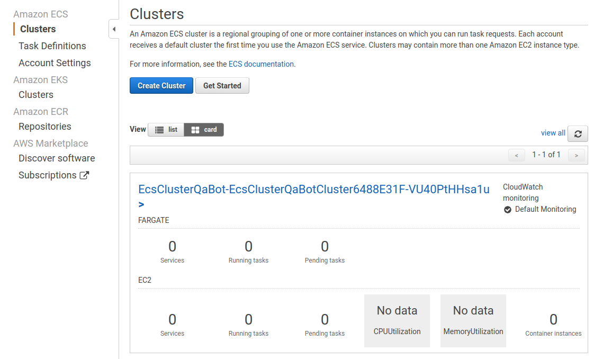
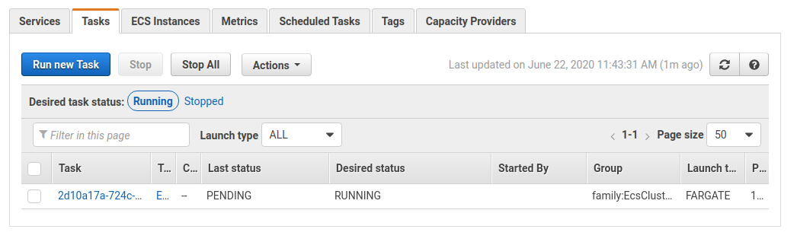
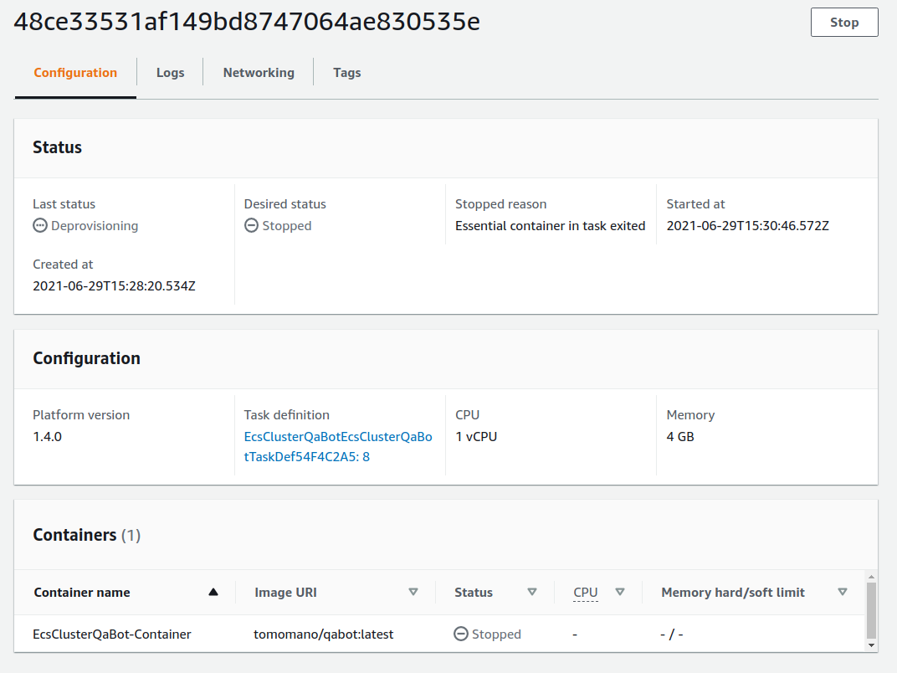
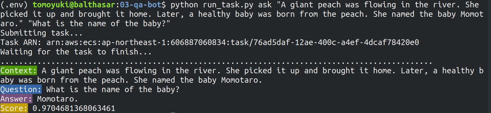

[[sec_fargate_qabot]]
== Hands-on #3: AWSで自動質問回答ボットを走らせる

ハンズオン第三回では，前章で学んだ Docker と ECS を使うことで，大規模化可能な機械学習システムの最もシンプルなものを実装する．

具体的には， Transformer と呼ばれるディープラーニングのモデルを使った自然言語処理を利用することで，
英語で与えられた質問への回答を自動で生成するボットを作成してみる．
特に，何百何千もの質問に同時に対応できるように，単一のサーバーに展開するのではなく，リクエストに応じて複数のサーバーを自動的に起動し，並列でジョブを実行させるシステムを設計する．
まさに，初歩的ながら， Siri・Alexa・Google assistant のようなシステムを作り上げるのである！

ハンズオンのソースコードはこちらのリンクにある => https://github.com/tomomano/intro-aws-2021/tree/main/handson/qa-bot

[TIP]
====
通常の機械学習のワークフローでは，モデルの訓練 => 推論 (データへの適用) が基本的な流れである．
しかしながら， GPU を使ったモデルの訓練はやや難易度が高いため，次章 (<<sec_aws_batch>>) で取り扱う．
本章は，クラウド上でのクラスターの構築・タスクの管理などの概念に慣れるため，よりシンプルな実装で実現できる推論計算の並列化を紹介する．
====

[WARNING]
====
このハンズオンでは 1CPU/4GB RAM の Fargate インスタンスを使用する．
計算の実行には 0.025 $/hour のコストが発生することに注意．
====

=== Fargate

.Fargate のロゴ
image::imgs/aws_logos/Fargate.png[Fargate, 100]

ハンズオンに入っていく前に， **Fargate** という AWS の機能を知っておく必要がある．

ECS の概要を示した <<ecs_overview>> をもう一度見てみよう．
この図で， ECS の管理下にあるクラスターが示されているが，このクラスターの中で計算を行う実体としては二つの選択肢がある．
**EC2 あるいは Fargate** のいずれかである．
EC2 を用いた場合は，先の章で説明したような流れでインスタンスが起動し，計算が実行される．
しかし， EC2 クラスターの作成・管理は技術的な難易度がやや高いので，次章 (<<sec_aws_batch>>) で説明することにする．

Fargate とは， **ECS での利用に特化**して設計された，**コンテナを使用した計算タスク**を走らせるための仕組みである．
計算を走らせるという点では EC2 と役割は似ているが， Fargate は EC2 インスタンスのような物理的実体は持たない．
ECS の利用に専用設計がされているがために， ECS のクラスターとして Fargate を選択すると，とても簡単な設定・プログラムで，非常にパワフルかつスケーラブルな計算システムを構築することができる．
(クラスターのスケーリングが容易な分，Fargate にはいくつかの制限が伴う．
例えば GPU を用いた計算は Fargate ではできない．)

Fargate では， EC2 と同様に CPU とメモリーのサイズを必要な分だけ指定できる．
執筆時点では， CPU は 0.25 - 4 コア， RAM は 0.5 - 30 GB の間で選択することができる (https://docs.aws.amazon.com/AmazonECS/latest/developerguide/AWS_Fargate.html[公式ドキュメンテーション参照])．

以上が Fargate の概要であったが，くどくど言葉で説明してもなかなかピンとこないだろう．
ここからは実際に手を動かしながら， ECS と Fargate を使った並列タスクの処理の仕方を学んでいこう．

[TIP]
====
厳密には， ECS に付与するクラスターには EC2 と Fargate のハイブリッドを使用することも可能である．
====

[TIP]
====
"Fargate は EC2 インスタンスのような物理的実体は持たない"，と上に書いたが，少し語弊があるかもしれない．
Fargate も，データセンターのどこかの CPU 上で起動するので，物理的な実体はどこかには必ず存在する．
しかし，EC2 インスタンスと違って，例えば SSH でログインすることは基本的に想定されていないし，なにかのソフトウェアをインストールしたりなどの概念も存在しない (基本的に Docker を介してすべてのプログラムが実行される)．
その意味で "物理的実体を持たない" と表現したのである．
実は， Fargate は <<sec_serverless>> で紹介する， serverless architecture の重要な構成要素の一つである．
====

=== 準備

本ハンズオンの実行には，第一回ハンズオンで説明した準備 (<<handson_01_prep>>) が整っていることを前提とする．
それ以外に必要な準備はない．

=== Transformer を用いた question-answering プログラム

このハンズオンで開発する，自動質問回答システムをより具体的に定義しよう．
次のような文脈 (context) と質問 (question) が与えられた状況を想定する．

----
context: Albert Einstein (14 March 1879 – 18 April 1955) was a German-born theoretical physicist who developed the theory of relativity, one of the two pillars of modern physics (alongside quantum mechanics). His work is also known for its influence on the philosophy of science. He is best known to the general public for his mass–energy equivalence formula E = mc2, which has been dubbed \"the world's most famous equation\". He received the 1921 Nobel Prize in Physics \"for his services to theoretical physics, and especially for his discovery of the law of the photoelectric effect\", a pivotal step in the development of quantum theory.

question: In what year did Einstein win the Nobel prize?
----

今回作成する自動回答システムは，このような問題に対して， context に含まれる文字列から正解となる言葉を見つけ出すものとする．
上の問題では，次のような回答を返すべきである．

----
answer: 1921
----

人間にとっては，このような文章を理解することは容易であるが，コンピュータにそれをやらせることはなかなか難しいことは容易に想像ができるだろう．
しかし，近年の深層学習を使った自然言語処理の進歩は著しく，上で示したような例題などは，極めて高い正答率で回答できるモデルを作ることができる．

今回は， https://github.com/huggingface/transformers[huggingface/transformers] で公開されている学習済みの言語モデルを利用することで，上で定義した問題を解く Q&A ボットを作る．
この Q&A ボットは https://en.wikipedia.org/wiki/Transformer_(machine_learning_model)[Transformer]
と呼ばれるモデルを使った自然言語処理に支えられえている (<<transformer_architecture>>)．
このプログラムを， Docker にパッケージしたものが https://gitlab.com/tomomano/intro-aws/container_registry/ に `handson03` という名前で用意してある．
クラウドの設計に入る前に，まずはこのプログラムを単体で動かしてみよう．

なお，今回は学習済みのモデルを用いているので，私達が行うのは，与えられた入力をモデルに投げて予測を行う (推論) のみである．
推論の演算は， CPU だけでも十分高速に行うことができるので，コストの削減と，よりシンプルにシステムを設計をする目的で，このハンズオンでは GPU は利用しない．
一般的に， ニューラルネットは学習のほうが圧倒的に計算コストが大きく，そのような場合に GPU はより威力を発揮する．

[[transformer_architecture]]
.Transformer モデルアーキテクチャ (画像出典: https://arxiv.org/abs/1706.03762[Vaswani+ 2017])
image::imgs/transformer.png[transformer, 400, align="center"]

次のコマンドで，今回使う Docker image を ローカルにダウンロード (pull) してこよう．

[source, bash]
----
$ docker pull registry.gitlab.com/tomomano/intro-aws/handson03:latest
----

pull できたら，早速この Docker に質問を投げかけてみよう．

[source, bash]
----
$ context="Albert Einstein (14 March 1879 – 18 April 1955) was a German-born theoretical physicist who developed the theory of relativity, one of the two pillars of modern physics (alongside quantum mechanics). His work is also known for its influence on the philosophy of science. He is best known to the general public for his mass–energy equivalence formula E = mc2, which has been dubbed \"the world's most famous equation\". He received the 1921 Nobel Prize in Physics \"for his services to theoretical physics, and especially for his discovery of the law of the photoelectric effect\", a pivotal step in the development of quantum theory."
$ question="In what year did Einstein win the Nobel prize ?"
$ docker run registry.gitlab.com/tomomano/intro-aws/handson03:latest "${context}" "${question}" foo --no_save
----

今回用意した Docker image は，第一引数に context となる文字列を，第二引数に question に相当する文字列を受けつける．
第三引数，第四引数については，クラウドに展開するときの実装上の都合なので，今は気にしなくてよい．

上のコマンドを実行すると，以下のような出力が得られるはずである．

----
{'score': 0.9881729286683587, 'start': 437, 'end': 441, 'answer': '1921'}
----

"score" は正解の自信度を表す数字で， [0,1] の範囲で与えられる．
"start", "end" は， context 中の何文字目が正解に相当するかを示しており， "answer" が正解と予測された文字列である．

1921 年という，正しい答えが返ってきていることに注目してほしい．

もう少し難しい質問を投げかけてみよう．

[source, bash]
----
$ question="Why did Einstein win the Nobel prize ?"
$ docker run registry.gitlab.com/tomomano/intro-aws/handson03:latest "${context}" "${question}" foo --no_save
----

出力：

----
{'score': 0.5235594527494207, 'start': 470, 'end': 506, 'answer': 'his services to theoretical physics,'}
----

今度は， score が 0.52 と，少し自信がないようだが，それでも正しい答えにたどりつけていることがわかる．

このように， ディープラーニングに支えられた言語モデルを用いることで，なかなかに賢い Q-A ボットを実現できていることがわかる．
以降では，このプログラムをクラウドに展開することで，大量の質問に自動で対応できるようなシステムを設計していく．

[TIP]
====
今回使用する Question & Answering システムには， DistilBERT という Transformer を基にした言語モデルが用いられている．
興味のある読者は， https://arxiv.org/abs/1910.01108[原著論文] を参照してもらいたい．
また， huggingface/transformers の DistilBert についてのドキュメンテーションは https://huggingface.co/transformers/model_doc/distilbert.html[こちら]．
====

[TIP]
====
https://github.com/huggingface/transformers[huggingface/transformers] には，様々な最新の言語モデルが実装されている．
解けるタスクも， question-answering だけでなく，翻訳や要約など複数用意されている．
興味のある読者は， https://huggingface.co/transformers/index.html[ドキュメンテーション] を参照．
====

[TIP]
====
今回提供する Docker のソースコードは https://github.com/tomomano/intro-aws-2021/tree/main/handson/qa-bot/docker にある．
====

=== アプリケーションの説明

このハンズオンで作成するアプリケーションの概要を <<handson_03_architecture>> に示す．

[[handson_03_architecture]]
.ハンズオン#3で作製するアプリケーションのアーキテクチャ
image::imgs/handson-03/handson-03-architecture.png[hands-on 03 architecture, 600, align="center"]

簡単にまとめると，以下のような設計である．

* クライアントは，質問を AWS 上のアプリケーションに送信する．
* 質問のタスクは ECS によって処理される．
* ECS は， GitLab container registry から， Docker image をダウンロードする．
* 次に，ECS はクラスター内に新たな仮想インスタンスを立ち上げ，ダウンロードされた Docker image をこの新規インスタンスに配置する．
** このとき，ひとつの質問に対し一つの仮想インスタンスを立ち上げることで，複数の質問を並列的に処理できるようにする．
* ジョブが実行される．
* ジョブの実行結果 (質問への回答) は， データベース (DynamoDB) に書き込まれる．
* 最後に，クライアントは DynamoDB から質問への回答を読み取る．

それでは，プログラムのソースコードを見てみよう (https://gitlab.com/tomomano/intro-aws/-/tree/master/handson/03-qa-bot/app.py[/handson/03-qa-bot/app.py])．

[source, python, linenums]
----
class EcsClusterQaBot(core.Stack):

    def __init__(self, scope: core.App, name: str, **kwargs) -> None:
        super().__init__(scope, name, **kwargs)

        # <1>
        # dynamoDB table to store questions and answers
        table = dynamodb.Table(
            self, "EcsClusterQaBot-Table",
            partition_key=dynamodb.Attribute(
                name="item_id", type=dynamodb.AttributeType.STRING
            ),
            billing_mode=dynamodb.BillingMode.PAY_PER_REQUEST,
            removal_policy=core.RemovalPolicy.DESTROY
        )

        # <2>
        vpc = ec2.Vpc(
            self, "EcsClusterQaBot-Vpc",
            max_azs=1,
        )

        # <3>
        cluster = ecs.Cluster(
            self, "EcsClusterQaBot-Cluster",
            vpc=vpc,
        )

        # <4>
        taskdef = ecs.FargateTaskDefinition(
            self, "EcsClusterQaBot-TaskDef",
            cpu=1024, # 1 CPU
            memory_limit_mib=4096, # 4GB RAM
        )

        # grant permissions
        table.grant_read_write_data(taskdef.task_role)
        taskdef.add_to_task_role_policy(
            iam.PolicyStatement(
                effect=iam.Effect.ALLOW,
                resources=["*"],
                actions=["ssm:GetParameter"]
            )
        )

        # <5>
        container = taskdef.add_container(
            "EcsClusterQaBot-Container",
            image=ecs.ContainerImage.from_registry(
                "registry.gitlab.com/tomomano/intro-aws/handson03:latest"
            ),
        )
----
<1> ここでは，回答の結果を書き込むためのデータベースを用意している． DynamoDB については， Serverless architecture の章で扱うので，今は気にしなくてよい．
<2> ここでは，ハンズオン #1, #2 で行ったのと同様に， VPC を定義している．
<3> ここで， ECS のクラスター (cluster) を定義している．
クラスターとは，仮想サーバーのプールのことであり，クラスターの中に複数の仮想インスタンスを配置する．
<4> ここで，実行するタスクを定義している (task definition)．
<5> ここで， タスクの実行で使用する Docker image を定義している．

==== ECS と Fargate

ECS と Fargate の部分について，コードをくわしく見てみてみよう．

[source, python, linenums]
----
cluster = ecs.Cluster(
    self, "EcsClusterQaBot-Cluster",
    vpc=vpc,
)

taskdef = ecs.FargateTaskDefinition(
    self, "EcsClusterQaBot-TaskDef",
    cpu=1024, # 1 CPU
    memory_limit_mib=4096, # 4GB RAM
)

container = taskdef.add_container(
    "EcsClusterQaBot-Container",
    image=ecs.ContainerImage.from_registry(
        "registry.gitlab.com/tomomano/intro-aws/handson03:latest"
    ),
)
----

`cluster =` の箇所で，空の ECS クラスターを定義している．

次に， `taskdef=ecs.FargateTaskDefinition` の箇所で， Fargate インスタンスを使ったタスクを定義しており，特にここでは 1 CPU, 4GB RAM というマシンスペックを指定している．
また，このようにして定義されたタスクは，デフォルトで1タスクにつき1インスタンスが使用される．

最後に， `container =` の箇所で，タスクの実行でで使用する Docker image を定義している．
ここでは， GitLab container registry に置いてある image をダウンロードしてくるよう指定している．

このようにわずか数行のコードであるが，これだけで上で説明したような，タスクのスケジューリングなどが自動で実行される．

[TIP]
====
上のコードで `cpu=1024` と指定されているのに注目してほしい．
これは CPU ユニットと呼ばれる数で， 以下の換算表に従って仮想CPU (virtual CPU; vCPU) が割り当てられる．
1024 が 1 CPU に相当する．
0.25 や 0.5 vCPU などの数字は，それぞれ実効的に 1/4, 1/2 の CPU 時間が割り当てられることを意味する．
また， CPU ユニットによって使用できるメモリー量も変わってくる．
例えば， 1024 CPU ユニットを選択した場合は， 2 から 8 GB の範囲でのみメモリー量を指定することができる．
最新の情報は https://docs.aws.amazon.com/AmazonECS/latest/developerguide/AWS_Fargate.html[公式ドキュメンテーション] を参照のこと．

.CPU　ユニットと 指定可能なメモリー量の換算表
[cols="1,1"]
|===
|CPU ユニット
|メモリーの値

|256 (.25 vCPU)
|0.5 GB, 1 GB, 2 GB

|512 (.5 vCPU)
|1 GB, 2 GB, 3 GB, 4 GB

|1024 (1 vCPU)
|2 GB, 3 GB, 4 GB, 5 GB, 6 GB, 7 GB, 8 GB

|2048 (2 vCPU)
|Between 4 GB and 16 GB in 1-GB increments

|4096 (4 vCPU)
|Between 8 GB and 30 GB in 1-GB increments
|===

====

=== スタックのデプロイ

スタックの中身が理解できたところで，早速スタックをデプロイしてみよう．

デプロイの手順は，これまでのハンズオンとほとんど共通である．
SSH によるログインの必要がないので，むしろ単純なくらいである．
ここでは，コマンドのみ列挙する (`#` で始まる行はコメントである)．
それぞれの意味を忘れてしまった場合は，ハンズオン1, 2に戻って復習していただきたい．

[source, bash]
----
# プロジェクトのディレクトリに移動
$ cd intro-aws/handson/03-qa-bot

# venv を作成し，依存ライブラリのインストールを行う
$ python3 -m venv .env
$ source .env/bin/activate
$ pip install -r requirements.txt

# AWS の認証情報をセットする
# 自分自身の認証情報に置き換えること！
export AWS_ACCESS_KEY_ID=XXXXXX
export AWS_SECRET_ACCESS_KEY=YYYYYY
export AWS_DEFAULT_REGION=ap-northeast-1

# デプロイを実行
$ cdk deploy
----

デプロイのコマンドが無事に実行されれば， <<handson_03_cdk_output>> のような出力が得られるはずである．

[[handson_03_cdk_output]]
.CDKデプロイ実行後の出力
image::imgs/handson-03/cdk_output.png[cdk output, 700, align="center"]

AWS コンソールにログインして，デプロイされたスタックを確認してみよう．
コンソールから，ECS のページに行くと <<handson_03_ecs_console>> のような画面が表示されるはずである．

Cluster というのが，先ほど説明したとおり，複数の仮想インスタンスを束ねる一つの単位である．
この時点ではひとつもタスクが走っていないので，タスクの数字はすべて0になっている．
この画面にはまたすぐ戻ってくるので，開いたままにしておこう．

[[handson_03_ecs_console]]
.ECS コンソール画面

=== タスクの実行

それでは，早速，質問を実行してみよう．

ECS にタスクを投入するのはやや複雑なので，タスクの投入を簡単にするプログラム (`run_task.py`) を用意した (https://gitlab.com/tomomano/intro-aws/-/tree/master/handson/03-qa-bot/run_task.py[/handson/03-qa-bot/run_task.py])．

次のようなコマンドで，ECSクラスターに新しい質問を投入することができる．

[source, bash]
----
$ python run_task.py ask "A giant peach was flowing in the river. She picked it up and brought it home. Later, a healthy baby was born from the peach. She named the baby Momotaro." "What is the name of the baby?"
----

[WARNING]
====
`run_task.py` を実行するには， 環境変数によって AWS の認証情報が設定されていることが前提である．
====

"ask" の引数に続き，文脈 (context) と質問を引数として渡している．

上のコマンドを実行すると， "Waiting for the task to finish..." と出力が表示され，回答を得るまでしばらく待たされることになる．
この間， AWS では， ECS がタスクを受理し，新しい Fargate のインスタンスを起動し， Docker image をそのインスタンスに配置する，という一連の処理がなされている．
AWS コンソールから，この一連の様子をモニタリングしてみよう．

先ほどの ECS コンソール画面にもどり，クラスターの名前をクリックすることで，クラスターの詳細画面を開く．
次に， "Tasks" という名前のタブがあるので，それを開く (<<ecs_task_monitoring>>)．
すると，実行中のタスクの一覧が表示されるだろう．

[[ecs_task_monitoring]]
.ECS のタスクの実行状況をモニタリング

<<ecs_task_monitoring>> で見て取れるように， "Desired status = RUNNING", "Last status = PENDING" となっていることから，この時点では，タスクを実行するための準備している段階である，ということがわかる．
Fargate のインスタンスを起動し， Docker image を配置するまでおよそ1-2分の時間がかかる．

しばらく待つうちに， Status が "RUNNING" に遷移し，計算が始まる．
計算が終わると， Status は "STOPPED" に遷移し， ECS によって Fargate インスタンスは自動的にシャットダウンされる．

<<ecs_task_monitoring>> の画面から， "Task" の列にあるタスクIDクリックすることで，タスクの詳細画面を開いてみよう (<<ecs_task_detail>>)．
"Launch type = FARGATE", "Last status = STOPPED" など，タスクの情報が表示されている．
また， "Logs" のタブを開くことで， container の吐き出した実行ログを閲覧することができる．

[[ecs_task_detail]]
.質問タスクの実行結果

さて， `run_task.py` を実行したコマンドラインに戻ってきてみると， <<ask_question_output>> のような出力が得られているはずである．
"Momotaro" という正しい回答が返ってきている！

[[ask_question_output]]
.質問タスクの実行結果

=== タスクの同時実行

さて，先ほどはたった一つの質問を投入したわけだが，今回設計したアプリケーションは， ECS と Fargate を使うことで同時にたくさんの質問を処理することができる．
実際に，たくさんの質問を一度に投入してみよう．

`run_task.py` に `ask_many` というオプションを付けることで，複数の質問を一度に送信できる．
質問の内容は https://gitlab.com/tomomano/intro-aws/-/tree/master/handson/03-qa-bot/problems.json[/handson/03-qa-bot/problems.json] に定義されている．

次のようなコマンドを実行しよう．

[source, bash]
----
$ python run_task.py ask_many
----

このコマンドを実行した後で，先ほどの ECS コンソールに行き，タスクの一覧を見てみよう (<<ecs_many_tasks>>)．
複数の Fargate インスタンスが起動され，タスクが並列に実行されているのがわかる．

[[ecs_many_tasks]]
.複数の質問タスクを同時に投入する
image::imgs/handson-03/ecs_many_tasks.png[ecs_many_tasks, 700, align="center"]

すべてのタスクのステータスが "STOPPED" になったことを確認した上で，質問への回答を取得しよう．
それには，次のコマンドを実行すれば良い．

[source, bash]
----
$ python run_task.py list_answers
----

結果として， <<ask_many_output>> のような出力が得られるだろう．
それなりに複雑な文章問題に対し，高い正答率で回答できていることがわかるだろう．

[[ask_many_output]]
.`$ python run_task.py list_answers` の実行結果
image::imgs/handson-03/ask_many_output.png[ask_many_output, 700, align="center"]

おめでとう！
ここまでついてこれた読者は，とても初歩的ながらも，ディープラーニングによる言語モデルを使って自動で質問への回答を生成するシステムを創り上げることができた！
それも，数百の質問にも同時に対応できるような，とても高いスケーラビリティーを持ったシステムである！

[NOTE]
====
`run_task.py` で質問を投入し続けると，回答を記録しているデータベースにどんどんエントリーが溜まっていく．
これらのエントリーをすべて消去するには，次のコマンドを使う．

[source, bash]
----
$ python run_task.py clear
----

====

=== スタックの削除

これにて，第三回ハンズオンは終了である．最後にスタックを削除しよう．

スタックを削除するには，次のコマンドを実行すればよい．

[source, bash]
----
$ cdk destroy
----

=== 講義第二回目のまとめ

ここまでが，第二回目の講義の内容である．第一回に引き続き盛りだくさんの内容であったが，ついてこれたであろうか？

第二回では，ディープラーニングの計算をクラウドで実行するため， GPU 搭載型の EC2 インスタンスの起動について解説した．
その際， CUDA や PyTorch などのディープラーニング使うソフトウェアのインストールの手間を省くため， DLAMI を利用した．
さらに，ハンズオン第二回では，クラウドで起動した仮想サーバーを使って， MNIST 文字認識タスクを解くニューラルネットを学習させた．

また，より大規模な機械学習アプリケーションを作るための手段として， Docker と ECS による動的に計算リソースが管理されるクラスターの作り方の初歩を説明した．
その応用として，英語で与えられた文章問題への回答を自動で生成するボットをクラウドに展開した．

もちろん，この講義で紹介したプログラムはごく初歩的なものなので，現実的な問題を解くためにはプログラムのいろいろな側面を精緻化していく必要がある．
しかしながら，このような技術を応用することでどのようにして現実世界の問題を解くのか，なんとなくイメージが伝わっただろうか？

第三回では，さらにレベルアップし， Serverless architecture という最新のクラウドの設計方法について解説する．
その応用として，簡単な SNS サービスをゼロから実装する予定である．
お楽しみに！
