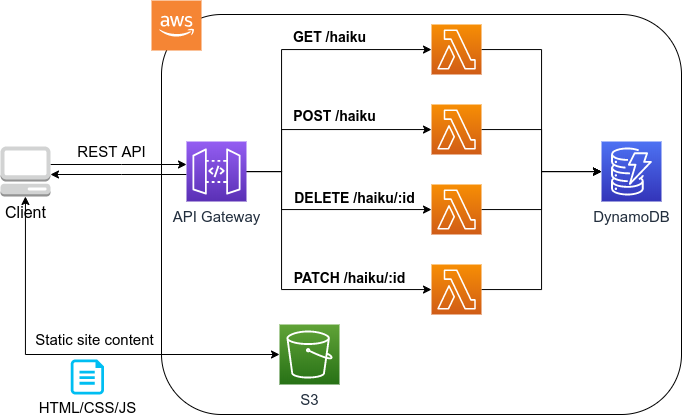

[[sec_bashoutter]]
== Hands-on #5: Bashoutter

さて，最後のハンズオンとなる第六回では，これまで学んできたサーバーレスクラウドの技術を使って，簡単なウェブサービスを作ってみよう．
具体的には，人々が自分の作った俳句を投稿するSNSサービス (**Bashoutter** と名付ける) を作成してみよう．
これまでの講義の集大成として，コードの長さとしては最も長くなっているが，頑張ってついてきてもらいたい．
最終的には， <<handson_05_bashoutter>> のような，ミニマルではあるがとても現代風な SNS サイトが完成する！

ハンズオンのソースコードは https://github.com/tomomano/learn-aws-by-coding/tree/main/handson/bashoutter[こちらのリンク] に置いてある．

[WARNING]
====
このハンズオンは，基本的に https://aws.amazon.com/free/?all-free-tier.sort-by=item.additionalFields.SortRank&all-free-tier.sort-order=asc[AWS の無料枠] の範囲内で実行することができる．
====

[[handson_05_bashoutter]]
.ハンズオン#5で作製する SNS アプリケーション "Bashoutter"
image::imgs/handson-05/bashoutter.png[bashoutter, 700, align="center"]

=== 準備

本ハンズオンの実行には，第一回ハンズオンで説明した準備 (<<handson_01_prep>>) が整っていることを前提とする．それ以外に必要な準備はない．

=== アプリケーションの説明

==== API

今回のアプリケーションでは，人々からの俳句の投稿を受け付けたり，投稿された俳句の一覧を取得する，といった機能を実装したい．
この機能を実現するための最小限の設計として， <<tab_handson_05_api>> に示すような４つの REST API を今回は実装する．

[[tab_handson_05_api]]
[cols="1,1"]
.Hands-on #5 で実装するAPI
|===
|`GET /haiku`
|俳句の一覧を取得する

|`POST /haiku`
|新しい俳句を投稿する

|`PATCH /haiku/{item_id}`
|`{item_id}` で指定された俳句にお気に入り票を一つ入れる

|`DELETE /haiku/{item_id}`
|`{item_id}` で指定された俳句を削除する
|===

それぞれのAPIのパラメータおよび返り値の詳細は，ハンズオンのソースコードの中の https://github.com/tomomano/learn-aws-by-coding/blob/main/handson/bashoutter/specs/swagger.yml[swagger.yml] に定義してある．

[TIP]
====
**Open API Specification** (OAS; 少し以前は Swagger Specification と呼ばれていた) は， REST API のための記述フォーマットである．
OAS に従って API の仕様が記述されていると，簡単にドキュメンテーションを生成したり，クライアントアプリケーションを自動生成することができる．
https://gitlab.com/tomomano/intro-aws/-/blob/master/handson/05-bashoutter/specs/swagger.yml[今回用意したAPI仕様] も， OAS に従って書いてあるので，非常に見やすいドキュメンテーションを瞬時に生成することができる．
詳しくは https://swagger.io/docs/specification/about/[このページ] などを参照．
====

==== アプリケーションアーキテクチャ

このハンズオンで作成するアプリケーションの概要を <<handson_05_architecture>> に示す．

[[handson_05_architecture]]
.ハンズオン#5で作製するアプリケーションのアーキテクチャ

簡単にまとめると，以下のような設計である．

* クライアントからの API リクエストは， **API Gateway** (後述)にまず送信され， API の URI で指定された Lambda 関数へ転送される．
* それぞれの API のパス (リソース) ごとに独立した Lambda を用意する．
* 俳句の情報 (作者，本文，投稿日時など) を記録するためのデータベース (DynamoDB) を用意する．
* 各 Lambda 関数には， DynamoDB へのアクセス権を付与する．
* 最後に，ウェブブラウザからコンテンツを表示できるよう， ウェブページの静的コンテンツを配信するための S3 バケットを用意する．クライアントはこの S3 バケットにアクセスすることで HTML/CSS/JS などのコンテンツを取得する．

それでは，プログラムのソースコードを見てみよう (https://github.com/tomomano/learn-aws-by-coding/blob/main/handson/bashoutter/app.py[/handson/bashoutter/app.py])．

[source, python, linenums]
----
class Bashoutter(core.Stack):

    def __init__(self, scope: core.App, name: str, **kwargs) -> None:
        super().__init__(scope, name, **kwargs)

        # <1>
        # dynamoDB table to store haiku
        table = ddb.Table(
            self, "Bashoutter-Table",
            partition_key=ddb.Attribute(
                name="item_id",
                type=ddb.AttributeType.STRING
            ),
            billing_mode=ddb.BillingMode.PAY_PER_REQUEST,
            removal_policy=core.RemovalPolicy.DESTROY
        )

        # <2>
        bucket = s3.Bucket(
            self, "Bashoutter-Bucket",
            website_index_document="index.html",
            public_read_access=True,
            removal_policy=core.RemovalPolicy.DESTROY
        )
        s3_deploy.BucketDeployment(
            self, "BucketDeployment",
            destination_bucket=bucket,
            sources=[s3_deploy.Source.asset("./gui/dist")],
            retain_on_delete=False,
        )

        common_params = {
            "runtime": _lambda.Runtime.PYTHON_3_7,
            "environment": {
                "TABLE_NAME": table.table_name
            }
        }

        # <3>
        # define Lambda functions
        get_haiku_lambda = _lambda.Function(
            self, "GetHaiku",
            code=_lambda.Code.from_asset("api"),
            handler="api.get_haiku",
            memory_size=512,
            **common_params,
        )
        post_haiku_lambda = _lambda.Function(
            self, "PostHaiku",
            code=_lambda.Code.from_asset("api"),
            handler="api.post_haiku",
            **common_params,
        )
        patch_haiku_lambda = _lambda.Function(
            self, "PatchHaiku",
            code=_lambda.Code.from_asset("api"),
            handler="api.patch_haiku",
            **common_params,
        )
        delete_haiku_lambda = _lambda.Function(
            self, "DeleteHaiku",
            code=_lambda.Code.from_asset("api"),
            handler="api.delete_haiku",
            **common_params,
        )

        # <4>
        # grant permissions
        table.grant_read_data(get_haiku_lambda)
        table.grant_read_write_data(post_haiku_lambda)
        table.grant_read_write_data(patch_haiku_lambda)
        table.grant_read_write_data(delete_haiku_lambda)

        # <5>
        # define API Gateway
        api = apigw.RestApi(
            self, "BashoutterApi",
            default_cors_preflight_options=apigw.CorsOptions(
                allow_origins=apigw.Cors.ALL_ORIGINS,
                allow_methods=apigw.Cors.ALL_METHODS,
            )
        )

        haiku = api.root.add_resource("haiku")
        haiku.add_method(
            "GET",
            apigw.LambdaIntegration(get_haiku_lambda)
        )
        haiku.add_method(
            "POST",
            apigw.LambdaIntegration(post_haiku_lambda)
        )

        haiku_item_id = haiku.add_resource("{item_id}")
        haiku_item_id.add_method(
            "PATCH",
            apigw.LambdaIntegration(patch_haiku_lambda)
        )
        haiku_item_id.add_method(
            "DELETE",
            apigw.LambdaIntegration(delete_haiku_lambda)
        )
----
<1> ここで，俳句の情報を記録しておくための DynamoDB テーブルを定義している．
<2> 続いて，静的コンテンツを配信するための S3 バケットを用意している．
また，スタックのデプロイ時に，必要なファイル群を自動的にアップロードするような設定を行っている．
<3> 続いて，それぞれの API で実行される Lambda 関数を定義している．
関数は Python3.7 で書かれており，コードは
https://github.com/tomomano/learn-aws-by-coding/blob/main/handson/bashoutter/api/api.py[/handson/bashoutter/api/api.py]
にある．
<4> 次に，2で定義された Lambda 関数に対し，データベースへの読み書きのアクセス権限を付与している．
<5> ここで，API Gateway により，各APIパスとそこで実行されるべき Lambda 関数を紐付けている．

それぞれについて，もう少し詳しく説明しよう．

==== Public access mode の S3 バケット

S3 のバケットを作成しているコードを見てみよう．

[source, python, linenums]
----
bucket = s3.Bucket(
    self, "Bashoutter-Bucket",
    website_index_document="index.html",
    public_read_access=True,
    removal_policy=core.RemovalPolicy.DESTROY
)
----

ここで注目してほしいのは `public_read_access=True` の部分だ．

前章で， S3 について説明を行った時には触れなかったが， S3 には **Public access mode** という機能がある．
Public access mode をオンにしておくと，バケットの中のファイルは基本的にすべて認証無しで (i.e. インターネット上の誰でも) 閲覧できるようになる．
この設定は，一般公開されているウェブサイトの静的なコンテンツを置いておくのに最適であり，多くのサーバーレスによるウェブサービスでこのような設計が行われる．
public access mode を設定しておくと， `http://XXXX.s3-website-ap-northeast-1.amazonaws.com/` のような固有の URL がバケットに対して付与される．
そして，クライアントがこの URL にアクセスをすると，バケットの中にある `index.html` がクライアントに返され，ページがロードされる
(どのファイルが返されるかは， `website_index_document="index.html"` の部分で設定している．)

[TIP]
====
より本格的なウェブページを運用する際には， public access mode の S3 バケットに， https://aws.amazon.com/cloudfront/[CloudFront] という機能を追加することが一般的である．

CloudFront はいくつかの役割を担っているのだが，最も重要な機能が **Content Delivery Nework (CDN)** である．
CDN とは，頻繁にアクセスされるデータをメモリーなどの高速記録媒体にキャッシュしておくことで，クライアントがより高速にデータをダウンロードすることを可能にする仕組みである．
また，世界各地のデータセンターにそのようなキャッシュを配置することで，クライアントと地理的に最も近いデータセンターからデータを配信する，というような設定も可能である．

また，CloudFront を配置することで， HTTPS 通信を設定することができる
(逆に言うと， S3 単体では HTTP 通信しか行うことができない)．
現代的なウェブサービスでは，秘匿情報を扱う扱わないに関わらず， HTTPS を用いることが標準となっている．

今回のハンズオンでは説明の簡略化のため CloudFront の設定を行わなかったが，興味のある読者は以下のリンクのプログラムが参考になるだろう．

* https://github.com/aws-samples/aws-cdk-examples/tree/master/typescript/static-site
====

[TIP]
====
今回の S3 バケットには， AWS によって付与されたランダムな URL がついている．
これを． `example.com` のような自分のドメインでホストしたければ， AWS によって付与された URL を自分のドメインの DNS レコードに追加すればよい．
====

Public access mode の S3 バケットを作成した後，バケットの中に配置するウェブサイトコンテンツを，以下のコードによりアップロードしている．

[source, python, linenums]
----
s3_deploy.BucketDeployment(
    self, "BucketDeployment",
    destination_bucket=bucket,
    sources=[s3_deploy.Source.asset("./gui/dist")],
    retain_on_delete=False,
)
----

上のコードの意味は， `./gui/dist` のディレクトリの中にあるファイルをバケットに配置せよ，と言っている．
`./gui/dist` にはビルド済みのウェブサイトの静的コンテンツ (HTML/CSS/JavaScript) が入っている．
今回は GUI の説明は特に行わないが，コードは
https://github.com/tomomano/learn-aws-by-coding/tree/main/handson/bashoutter/gui[/handson/bashoutter/gui]
のディレクトリの中にある．
興味のある読者は中身を確認してみるとよい．

[TIP]
====
今回のウェブサイトは https://vuejs.org/[Vue.js] と https://vuetifyjs.com/[Vuetify] という UI フレームワークを使って作成した．
Vue を使うことで， Single page application (SPA) の技術でウェブサイトの画面がレンダリングされる．
====

==== API のハンドラ関数

API リクエストが来たときに，リクエストされた処理を行う関数のことを特にハンドラ (handler) 関数と呼ぶ．
`GET /haiku` の API に対してのハンドラ関数を定義している部分を見てみよう．

[source, python, linenums]
----
get_haiku_lambda = _lambda.Function(
    self, "GetHaiku",
    code=_lambda.Code.from_asset("api"),
    handler="api.get_haiku",
    memory_size=512,
    **common_params
)
----

`code=_lambda.Code.from_asset("api"), handler="api.get_haiku"`
簡単なところから見ていくと， `memory_size=512` の箇所でメモリーの使用量を512MBに指定している．
また， `code=_lambda.Code.from_asset("api")` によって外部のディレクトリ (`api/`) を参照せよと指定しており，
`handler="api.get_haiku"` のところで `api.py` というファイルの `get_haiku()` という関数をハンドラ関数として実行せよ，と定義している．
次に，ハンドラ関数として使用されている `get_haiku()` のコードを見てみよう (https://github.com/tomomano/learn-aws-by-coding/blob/main/handson/bashoutter/api/api.py[/handson/bashoutter/api/api.py])．

[source, python, linenums]
----
ddb = boto3.resource("dynamodb")
table = ddb.Table(os.environ["TABLE_NAME"])

def get_haiku(event, context):
    """
    handler for GET /haiku
    """
    try:
        response = table.scan()

        status_code = 200
        resp = response.get("Items")
    except Exception as e:
        status_code = 500
        resp = {"description": f"Internal server error. {str(e)}"}
    return {
        "statusCode": status_code,
        "headers": HEADERS,
        "body": json.dumps(resp, cls=DecimalEncoder)
    }
----

`response = table.scan()` で，俳句の格納された DynamoDB テーブルから，全ての要素を取り出している．
もしなにもエラーが起きなければステータスコード200が返され，もしなにかエラーが起こればステータスコード500が返されるようになっている．

上記のような操作を，他の API についても繰り返すことで，すべての API のハンドラ関数が定義されている．

[TIP]
====
`GET /haiku` のハンドラ関数で， `response = table.scan()` という部分があるが，実はこれは最善の書き方ではない．
DynamoDB の `scan()` メソッドは，最大で 1MB までのデータしか返さない．
データベースのサイズが大きく， 1MB 以上のデータがある場合には，再帰的に `scan()` メソッドを呼ぶ必要がある．
詳しくは https://boto3.amazonaws.com/v1/documentation/api/latest/reference/services/dynamodb.html#DynamoDB.Table.scan[boto3 ドキュメンテーション] を参照．
====

==== AWS における権限の管理 (IAM)

以下の部分のコードに注目してほしい．

[source, python, linenums]
----
table.grant_read_data(get_haiku_lambda)
table.grant_read_write_data(post_haiku_lambda)
table.grant_read_write_data(patch_haiku_lambda)
table.grant_read_write_data(delete_haiku_lambda)
----

これまでは説明の簡略化のため敢えて触れてこなかったが， AWS には https://aws.amazon.com/iam/[IAM (Identity and Access Management)] という重要な概念がある．
IAM は基本的に，あるリソースが他のリソースに対してどのような権限を持っているか，を規定するものである．
Lambdaは，デフォルトの状態では他のリソースにアクセスする権限をなにも有していない．
したがって， Lambda 関数が DynamoDB のデータを読み書きするためには，それを許可するような IAM が Lambda 関数に付与されていなければならない．

CDK による `dynamodb.Table` オブジェクトには `grant_read_write_data()` という便利なメソッドが備わっており，アクセスを許可したい Lambda 関数を引数としてこのメソッドを呼ぶことで，データベースへの読み書きを許可する IAM を付与することができる．

[NOTE]
====
各リソースに付与する IAM は，**必要最低限の権限を与えるにとどめる**というのが基本方針である．
これにより，セキュリティを向上させるだけでなく，意図していないプログラムからのデータベースへの読み書きを防止するという点で，バグを未然に防ぐことができる．

そのような理由により，上のコードでは `GET` のハンドラー関数に対しては `grant_read_data()` によって， read 権限のみを付与している．
====

==== API Gateway

https://aws.amazon.com/api-gateway/[API Gateway] とは， API の"入り口"として，APIのリクエストパスに従って Lambda 関数などに接続を行うという機能を担う．
このような API のリソースパスに応じて接続先を振り分けるようなサーバーを**ルーター**，あるいは**リバースプロキシ**と呼んだりする．
従来的には，ルーターにはそれ専用の仮想サーバーが置かれることが一般的であった．
しかし， API Gateway はサーバーレスなルーターとして，固定されたサーバーを配置することなく， API のリクエストが来たときのみ起動し，API のルーティングを実行する．
サーバーレスであることの当然の帰結として，アクセスの件数が増大した時にはそれにルーティングの処理能力を自動で増やしす機能も備わっている．

API Gateway を配置することで，大量　(1秒間に数千から数万件) の API リクエストに対応することのできるシステムを容易に構築することができる．
API Gateway の料金は <<tab_handson_05_apigateway_price>> のように設定されている．
また，無料利用枠により，月ごとに100万件までのリクエストは0円で使用できる．

[[tab_handson_05_apigateway_price]]
[cols="1,1", options="header"]
.API Gateway の利用料金設定 (https://aws.amazon.com/api-gateway/pricing/[参照])
|===
|Number of Requests (per month)
|Price (per million)

|First 333 million
|$4.25

|Next 667 million
|$3.53

|Next 19 billion
|$3.00
|Over 20 billion
|$1.91
|===

ソースコードの該当箇所を見てみよう．

[source, python, linenums]
----
api = apigw.RestApi(
    self, "BashoutterApi",
    default_cors_preflight_options=apigw.CorsOptions(
        allow_origins=apigw.Cors.ALL_ORIGINS,
        allow_methods=apigw.Cors.ALL_METHODS,
    )
)

haiku = api.root.add_resource("haiku")
haiku.add_method(
    "GET",
    apigw.LambdaIntegration(get_haiku_lambda)
)
haiku.add_method(
    "POST",
    apigw.LambdaIntegration(post_haiku_lambda)
)

haiku_item_id = haiku.add_resource("{item_id}")
haiku_item_id.add_method(
    "PATCH",
    apigw.LambdaIntegration(patch_haiku_lambda)
)
haiku_item_id.add_method(
    "DELETE",
    apigw.LambdaIntegration(delete_haiku_lambda)
)
----

* `api = apigw.RestApi()` により，空の API Gateway を作成している．
* 次に， `api.root.add_resource()` のメソッドを呼ぶことで， `/haiku` という API パスを追加している．
* 続いて， `add_method()` を呼ぶことで， `GET`, `POST` のメソッドを `/haiku` のパスに定義している．
* さらに， `haiku.add_resource("{item_id}")` により， `/haiku/{item_id}` という API パスを追加している．
* 最後に， `add_method()` を呼ぶことにより， `PATCH`, `DELETE` のメソッドを `/haiku/{item_id}` のパスに定義している．

このように， API Gateway の使い方は非常にシンプルで，逐次的に API パスとそこで実行されるメソッド・Lambda を記述していくだけでよい．

[TIP]
====
上記のプログラムで 新規 API を作成すると， ランダムな URL がその API のエンドポイントとして割り当てられる．
これを． `api.example.com` のような自分のドメインでホストしたければ， AWS によって付与された URL を自分のドメインの DNS レコードに追加すればよい．
====

[TIP]
====
API Gateway で新規 API を作成したとき， `default_cors_preflight_options=` というパラメータで https://developer.mozilla.org/en-US/docs/Web/HTTP/CORS[Cross Origin Resource Sharing (CORS)] の設定を行っている．
これは，ブラウザで走る Web アプリケーションと API を接続する際に必要な設定である．
興味のある読者は各自 CORS について調べてもらいたい．
====

=== アプリケーションのデプロイ

アプリケーションの中身が理解できたところで，早速デプロイを行ってみよう．

デプロイの手順は，これまでのハンズオンとほとんど共通である．
ここでは，コマンドのみ列挙する (`#` で始まる行はコメントである)．
シークレットキーの設定も忘れずに (<<aws_cli_install>>)．

[source, bash]
----
# プロジェクトのディレクトリに移動
$ cd intro-aws/handson/05-bashoutter

# venv を作成し，依存ライブラリのインストールを行う
$ python3 -m venv .env
$ source .env/bin/activate
$ pip install -r requirements.txt

# デプロイを実行
$ cdk deploy
----

デプロイのコマンドが無事に実行されれば， <<handson_05_cdk_output>> のような出力が得られるはずである．
ここで表示されている `Bashoutter.BashoutterApiEndpoint = XXXX`, `Bashoutter.BucketUrl = YYYY` の二つ文字列は次に使うのでメモしておこう．

[[handson_05_cdk_output]]
.CDKデプロイ実行後の出力
image::imgs/handson-05/cdk_output.png[cdk output, 700, align="center"]

[TIP]
====
上記のデプロイで得られた API のエンドポイントは API Gateway によりランダムに作成されたアドレスである．
このアドレスを DNS に登録することで，自分の管理するドメイン名 (例: api.example.com) と結びつけることが可能である．
====

AWS コンソールにログインして，デプロイされたスタックを確認してみよう．

まずは，コンソールから API Gateway のページに行く．
すると， <<handson_05_apigw_console_list>> のような画面が表示され，デプロイ済みの API エンドポイントの一覧が確認できる．

[[handson_05_apigw_console_list]]
.API Gateway コンソール画面 (1)
image::imgs/handson-05/apigw_console_list.png[apigw_console_list, 700, align="center"]

今回デプロイした "BashoutterApi" という名前の API をクリックすることで <<handson_05_apigw_console_detail>> のような画面に遷移し，詳細情報を閲覧できる．
`GET /haiku`, `POST /haiku` などが定義されていることが確認できる．

それぞれのメソッドをクリックすると，そのメソッドの詳細情報を確認できる．
API Gateway は，上で説明したルーティングの機能だけでなく，認証機能などを追加することも可能である．
このハンズオンでは特にこれらの機能は使用しないが， "Method Request" と書いてある項目などがそれに相当する．
次に， <<handson_05_apigw_console_detail>> で画面右端の赤色で囲った部分に，この API で呼ばれる Lambda 関数が指定されていることに注目しよう．
関数名をクリックと，該当する Lambda のコンソールに遷移し，関数の中身を閲覧することが可能である．

[[handson_05_apigw_console_detail]]
.API Gateway コンソール画面 (2)
image::imgs/handson-05/apigw_console_detail.png[apigw_console_detail, 700, align="center"]

次に， S3 のコンソール画面に移ってみよう．
"bashouter-XXXXX" という名前のバケットが見つかるはずである (<<handson_05_s3_console>>)．

[[handson_05_s3_console]]
.S3 コンソール画面
image::imgs/handson-05/s3_console.png[s3_console, 700, align="center"]

バケットの名前をクリックすることで，バケットの中身を確認してみよう．
`index.html` のほか， `css/`, `js/` などのディレクトリがあるのが確認できるだろう (<<handson_05_s3_contents>>)．
これらが，ウェブページの"枠"を定義している静的コンテンツである．

[[handson_05_s3_contents]]
.S3 バケットの中身
image::imgs/handson-05/s3_contents.png[s3_contents, 700, align="center"]

=== API リクエストを送信する

それでは，デプロイしたアプリケーションに対し，実際に API リクエストを送信してみよう
(S3 にあるGUIの方は一旦おいておく．今回のアプリケーションでより本質的なのは API の方だからである)．

ここではコマンドラインから HTTP API リクエストを送信するためのシンプルなHTTPクライアントである https://httpie.org/[HTTPie] を使ってみよう．
HTTPie は，スタックをデプロイするときに Python 仮想環境 (venv) を作成した際，一緒にインストールされている．
念のためインストールがうまくいっているか確認するには，コマンドラインに `http` と打ってみる．
ヘルプのメッセージが出力されたら準備OKである．

まず最初に，先ほどデプロイを実行した際に得られた API のエンドポイントの URL (`Bashoutter.BashoutterApiEndpoint = XXXX` で得られた `XXXX` の文字列) をコマンドラインの変数に設定しておく．

[source, bash]
----
$ export ENDPOINT_URL="https://OOOO.execute-api.ap-northeast-1.amazonaws.com/prod/"
----

[WARNING]
====
上のコマンドで，URLは自分のデプロイしたスタックのURLに置き換える．
====

次に，俳句の一覧を取得するため， `GET /haiku` の API を送信してみよう．

[source, bash]
----
$ http GET "${ENDPOINT_URL}/haiku"
----

現時点では，まだだれも俳句を投稿していないので，空の配列 (`[]`) が返ってくる．

それでは次に，俳句を投稿してみよう．

[source, bash]
----
$ http POST "${ENDPOINT_URL}/haiku" \
username="松尾芭蕉" \
first="閑さや" \
second="岩にしみ入る" \
third="蝉の声"
----

以下のような出力が得られるだろう．

----
HTTP/1.1 201 Created
Connection: keep-alive
Content-Length: 49
Content-Type: application/json
....
{
    "description": "Successfully added a new haiku"
}
----

新しい俳句を投稿することに成功したようである．
本当に俳句が追加されたか，再び GET リクエストを呼ぶことで確認してみよう．

[source, bash]
----
$ http GET "${ENDPOINT_URL}/haiku"

HTTP/1.1 200 OK
Connection: keep-alive
Content-Length: 258
Content-Type: application/json
...
[
    {
        "created_at": "2020-07-06T02:46:04+00:00",
        "first": "閑さや",
        "item_id": "7e91c5e4d7ad47909e0ac14c8bbab05b",
        "likes": 0.0,
        "second": "岩にしみ入る",
        "third": "蝉の声",
        "username": "松尾芭蕉"
    }
]
----

素晴らしい！

次に， `PATCH /haiku/{item_id}` を呼ぶことでこの俳句にいいねを追加してみよう．
上のコマンドで取得した俳句の `item_id` を，下のコマンドの `XXXX` 

[source, bash]
----
$ http PATCH "${ENDPOINT_URL}/haiku/XXXX"
----

再び GET リクエストを送ることで，いいね (`likes`) が1増えたことを確認しよう．

[source, bash]
----
$ http GET "${ENDPOINT_URL}/haiku"
...
[
    {
        ...
        "likes": 1.0,
        ...
    }
]
----

最後に， DELETE リクエストを送ることで俳句をデータベースから削除しよう．
`XXXX` は `item_id` の値で置き換えた上で以下のコマンドを実行する．

[source, bash]
----
$ http DELETE "${ENDPOINT_URL}/haiku/XXXX"
----

再び GET リクエストを送ることで，返り値が空 (`[]`) になっていることを確認しよう．

以上のように， SNS に必要な基本的な API がきちんと動作していることが確認できた．

=== 大量の API リクエストをシミュレートする

さて，前節ではマニュアルでひとつづづ俳句を投稿した．
多数のユーザーがいるような SNS では，一秒間に数千件以上の投稿がされている．
今回はサーバーレスアーキテクチャを採用したことで，そのような瞬間的な大量アクセスにも容易に対応できるようなシステムが自動的に構築されている．
このポイントを実証するため，ここでは大量の API が送信された状況をシミュレートしてみよう．

https://github.com/tomomano/learn-aws-by-coding/blob/main/handson/bashoutter/client.py[/handson/bashoutter/client.py]
に，大量のAPIリクエストをシミュレートするためのプログラムが書かれている．
このプログラムを使用すると， `POST /haiku` の API リクエストを指定された回数だけ実行することができる．

テストとして， API を300回送ってみよう．
以下のコマンドを実行する．

[source, bash]
----
$ python client.py $ENDPOINT_URL post_many 300
----

数秒のうちに実行が完了するだろう．
これがもし，単一のサーバーからなる API だったとしたら，このような大量のリクエストの処理にはもっと時間がかかっただろう．
最悪の場合には，サーバーダウンにもつながっていたかもしれない．
従って，今回作成したサーバーレスアプリケーションは，とてもシンプルながらも一秒間に数百件の処理を行えるような，スケーラブルなクラウドシステムであることがわかる．
サーバーレスでクラウドを設計することの利点を垣間見ることができただろうか？

[TIP]
====
上記のコマンドにより，大量の俳句を投稿するとデータベースに無駄なデータがどんどん溜まってしまう．
データベースを完全に空にするには，以下のコマンドを使用する．

[source, bash]
----
$ python client.py $ENDPOINT_URL clear_database
----
====

=== Bashoutter GUI を動かしてみる

前節ではコマンドラインから API を送信する演習を行った．
ウェブアプリケーションでは，これらの API はウェブブラウザ上のウェブページから送信され，コンテンツが表示されている (<<fig:web_server>> 参照)．
最後に， API が GUI と統合されるとどうなるのか，見てみよう．

デプロイを実行したときにコマンドラインで出力された， `Bashoutter.BucketUrl=` で与えられた URL を確認しよう (<<handson_05_cdk_output>>)．
これは，先述したとおり， Public access mode の S3 バケットの URL である．

ウェブブラウザを開き，アドレスバーに S3 の URL を入力しへアクセスしてみよう．
すると， <<handson_05_bashoutter_2>> のようなページが表示されるはずである．

[[handson_05_bashoutter_2]]
."Bashoutter" の GUI 画面
image::imgs/handson-05/bashoutter_2.png[bashoutter, 700, align="center"]

ページが表示されたら，一番上の "API Endpoint URL" と書いてあるテキストボックスに，今回デプロイした **API Gateway の URL を入力**する
(今回のアプリケーションでは，API Gateway の URL はランダムに割り当てられるのでこのような GUI の仕様になっている)．
そうしたら，画面の "REFRESH" と書いてあるボタンを押してみよう．
データベースに俳句が登録済みであれば，俳句の一覧が表示されるはずである．
各俳句の左下にあるハートのアイコンをクリックすることで， "like" の票を入れることができる．

新しい俳句を投稿するには，五七五と投稿者の名前を入力して， "POST" を押す．
"POST" を押した後は，再び "REFRESH" ボタンを押すことで最新の俳句のリストをデータベースから取得する．

今回は，どうやって GUI を作成したかは触れないが，基本的にページの背後では `GET /haiku`, `POST /haiku` などの API がクラウドに送信されることで，コンテンツが表示されている．
興味のある読者は GUI のソースコードも読んでみるとよい (https://github.com/tomomano/learn-aws-by-coding/tree/main/handson/bashoutter/gui[/handson/bashoutter/gui/])．

=== アプリケーションの削除

これにて，今回のハンズオンは終了である．
最後にスタックを削除しよう．

[source, bash]
----
$ cdk destroy
----

[WARNING]
====
CDK のバージョンによっては S3 のバケットが空でないと， `cdk destroy` がエラーを出力する場合がある．
この場合はスタックを削除する前に， S3 バケットの中身をすべて削除しなければならない．

コンソールから実行するには， S3 コンソールに行き，バケットの中身を開いた上で，全てのファイルを選択し， "Actions" -> "Delete" を実行すれば良い．

コマンドラインから実行するには， 次のコマンドを使う．
<BUCKET NAME> のところは，自分の バケットの名前 ("BashoutterBucketXXXX" というパターンの名前がついているはずである) に置き換えることを忘れずに．

[source, bash]
----
$ aws s3 rm <BUCKET NAME> --recursive
----
====

=== 小括

ここまでが，本書第三部の内容であった．

第三部では，クラウドの応用として，一般の人に使ってもらうようなウェブアプリケーション・データベースをどのようにして作るのか，という点に焦点を当てて，説明を行った．
その中で，従来的なクラウドシステムの設計と，ここ数年の最新の設計方法であるサーバーレスアーキテクチャについて解説した．
<<sec_intro_serverless>> では， AWS でのサーバーレスの実践として， Lambda, S3, DynamoDB のハンズオンを行った．
最後に， <<sec_bashoutter>> では，これらの技術を統合することで，完全サーバーレスなウェブアプリケーション "Bashoutter" を作成した．

これらの演習を通じて，世の中のウェブサービスがどのようにして出来上がっているのか，少し理解が深まっただろうか？
また，そのようなウェブアプリケーションを自分が作りたいと思ったとき，今回のハンズオンがその出発点となることができたならば幸いである．

