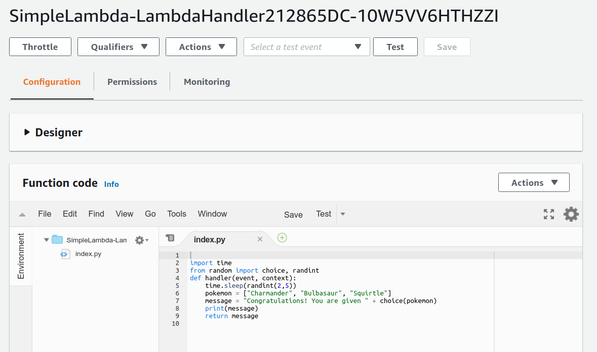

== Hands-on #5: サーバーレス入門

前章ではサーバーレスアーキテクチャの概要の説明を行った．
今回のハンズオンでは，サーバーレスクラウドを実際に動かしながら，具体的な使用方法を学んでいこう．

今回のハンズオンで触れるのは以下の3つである．
それぞれについて，短いチュートリアルを用意してある．

* Lambda: サーバーレスの計算エンジン
* DynamoDB: サーバーレス・データベース
* S3: サーバーレス・ストレージ

=== Lambda ハンズオン

まず最初に， Lambda を実際に動かしてみよう．
以下では， AWS CDK を利用してとてもシンプルな Lambda の関数を作成する．

ハンズオンのソースコードは https://github.com/tomomano/learn-aws-by-coding/tree/main/handson/serverless/lambda[こちらのリンク] に置いてある．

[WARNING]
====
このハンズオンは，基本的に https://aws.amazon.com/free/?all-free-tier.sort-by=item.additionalFields.SortRank&all-free-tier.sort-order=asc[AWS Lambda の無料枠] の範囲内で実行することができる．
====

https://github.com/tomomano/learn-aws-by-coding/tree/main/handson/serverless/lambda/app.py[app.py] にデプロイするプログラムが書かれている．
中身を見てみよう．

[source, python, linenums]
----
# <1>
FUNC = """
import time
from random import choice, randint
def handler(event, context):
    time.sleep(randint(2,5))
    pokemon = ["Charmander", "Bulbasaur", "Squirtle"]
    message = "Congratulations! You are given " + choice(pokemon)
    print(message)
    return message
"""

class SimpleLambda(core.Stack):

    def __init__(self, scope: core.App, name: str, **kwargs) -> None:
        super().__init__(scope, name, **kwargs)

        # <2>
        handler = _lambda.Function(
            self, 'LambdaHandler',
            runtime=_lambda.Runtime.PYTHON_3_7,
            code=_lambda.Code.from_inline(FUNC),
            handler="index.handler",
            memory_size=128,
            timeout=core.Duration.seconds(10),
            dead_letter_queue_enabled=True,
        )
----
<1> ここで， Lambda で実行されるべき関数を定義している．
これは非常に単純な関数で，2-5秒のランダムな時間スリープした後，["Charmander", "Bulbasaur", "Squirtle"] のいずれかの文字列をランダムに返す
(これらは初代ポケットモンスターのゲームでオーキド博士にもらうヒトカゲ・フシギダネ・ゼニガメのことだ)．
<2> 次に， Lambda に <1> で書いた関数を配置している．
パラメータの意味は，文字通りの意味なので特に難しくはないが，以下に解説する．
* `runtime=_lambda.Runtime.PYTHON_3_7`:
ここでは， Python3.7 を使って上記で定義された関数を実行せよ，と指定している．
Python3.7 の他に， Node.js, Java, Ruby, Go などの言語を指定することが可能である．
* `code=_lambda.Code.from_inline(FUNC)`:
実行されるべき関数が書かれたコードを指定する．
ここでは， `FUNC=...` で定義した文字列を渡しているが，文字列以外にもファイルのパスを渡すことも可能である．
* `handler="index.handler"`:
これは，コードの中にいくつかのサブ関数が含まれているときに，メインとサブを区別するためのパラメータである．
`handler` という名前の関数をメイン関数として実行せよ，という意味である．
* `memory_size=128`:
メモリーは 128MB を最大で使用することを指定している．
* `timeout=core.Duration.seconds(10)`
タイムアウト時間を10秒に設定している．
10秒以内に関数の実行が終了しなかった場合，エラーが返される．
* `dead_letter_queue_enabled=True`:
アドバンストな設定なので説明は省略する．

上記のプログラムを実行することで， Lambda 関数がクラウド上に作成される．
早速デプロイしてみよう．

==== デプロイ

デプロイの手順は，これまでのハンズオンとほとんど共通である．
ここでは，コマンドのみ列挙する (`#` で始まる行はコメントである)．
それぞれの意味を忘れてしまった場合は，ハンズオン1, 2に戻って復習していただきたい．
シークレットキーの設定も忘れずに (<<aws_cli_install>>)．

[source, bash]
----
# プロジェクトのディレクトリに移動
$ cd handson/serverless/lambda

# venv を作成し，依存ライブラリのインストールを行う
$ python3 -m venv .env
$ source .env/bin/activate
$ pip install -r requirements.txt

# デプロイを実行
$ cdk deploy
----

デプロイのコマンドが無事に実行されれば， <<handson_04_lambda_cdk_output>> のような出力が得られるはずである．
ここで表示されている `SimpleLambda.FunctionName = XXXX` の XXXX の文字列は後で使うのでメモしておこう．

[[handson_04_lambda_cdk_output]]
.CDKデプロイ実行後の出力
image::imgs/handson-04/handson_04_lambda_cdk_output.png[cdk output, 700, align="center"]

AWS コンソールにログインして，デプロイされたスタックを確認してみよう．
コンソールから，Lambda のページに行くと <<handson_04_lambda_console_func_list>> のような画面から Lambda の関数の一覧が確認できる．

[[handson_04_lambda_console_func_list]]
.Lambda コンソール - 関数の一覧
image::imgs/handson-04/lambda_console_func_list.png[cdk output, 700, align="center"]

今回のアプリケーションで作成したのが `SimpleLambda-YYYY` という名前のついた関数だ．
関数の名前をクリックして，詳細を見てみる．
すると <<handson_04_lambda_console_func_detail>> のような画面が表示されるはずだ．
先ほどプログラムの中で定義したPythonの関数がエディターから確認することができる．
また，下の方にスクロールすると，関数の各種設定も確認することができる．

[[handson_04_lambda_console_func_detail]]
.Lambda コンソール - 関数の詳細

[TIP]
====
Lambda で実行されるコードは， Lambda のコンソール画面 (<<handson_04_lambda_console_func_detail>>) のエディターで編集することもできる．

デバッグをする時などは，こちらを直接いじる方が早い場合もある．
その場合は， CDK のコードに行った編集を反映させなおすことを忘れずに．
====

==== Lambda 関数の実行

それでは，作成した Lambda 関数を実際に実行 (invoke) してみよう．
AWS の API を使うことで，関数の実行をスタートすることができる．
今回は， https://github.com/tomomano/learn-aws-by-coding/blob/main/handson/serverless/lambda/invoke_one.py[invoke_one.py] に関数を実行するための簡単なプログラムを提供している．
興味のある読者はコードを読んでもらいたい．

以下のコマンドで，Lambda の関数を実行する．
コマンドの `XXXX` の部分はは，先ほどデプロイしたときに `SimpleLambda.FunctionName = XXXX` で得られた XXXX の文字列で置換する．

[source, bash]
----
$ python invoke_one.py XXXX
----

すると， `"Congratulations! You are given Squirtle"` という出力が得られるはずだ．
とてもシンプルではあるが，クラウド上で先ほどの関数が走り，乱数が生成された上で，ポケモンが選択されて出力が返されている．
上のコマンドを何度か打ってみて，実行のごとに違うポケモンが返されることを確認しよう．

さて，上のコマンドは，一度につき一回の関数を実行したわけであるが， Lambda の本領は一度に大量のタスクを同時に実行できる点である．
そこで，今度は一度に100個のタスクを同時に送信してみよう．

以下のコマンドを実行する．
XXXX の部分は上と同様に置き換える．
第二引数の `100` は 100個のタスクを投入せよ，という意味である．

[source, bash]
----
$ python invoke_many.py XXXX 100
----

すると以下のような出力が得られるはずだ．

[source, bash]
----
....................................................................................................
Submitted 100 tasks to Lambda!
----

実際に，100 個のタスクが同時に実行されていることを確認しよう．
<<handson_04_lambda_console_func_detail>> の画面に戻り， "Monitoring" というタブがあるので，それをクリックする．
すると， <<handson_04_lambda_console_monitoring>> のようなグラフが表示されるだろう．

[[handson_04_lambda_console_monitoring]]
.Lambda コンソール - 関数の実行のモニタリング
image::imgs/handson-04/lambda_console_monitoring.png[lambda_console_monitoring, 700, align="center"]

[WARNING]
====
<<handson_04_lambda_console_monitoring>> のグラフの更新には数分かかることがあるので，なにも表示されない場合は少し待つ．
====

<<handson_04_lambda_console_monitoring>> で "Invocations" が関数が何度実行されたかを意味している．
たしかに100回実行されていることがわかる．
さらに， "Concurrent executions" が何個のタスクが同時に行われたかを示している．
ここでは 96 となっていることから，96個のタスクが並列的に実行されたことを意味している
(これが 100 とならないのは，タスクの開始のコマンドが送られたのが完全には同タイミングではないことに起因する)．

このように，非常にシンプルではあるが， Lambda を使うことで，同時並列的に処理を実行することのできるクラウドシステムを簡単に作ることができた．

もしこのようなことを従来的な serverful なクラウドで行おうとした場合，クラスターのスケーリングなど多くのコードを書くことに加えて，いろいろなパラメータを調節する必要がある．

[TIP]
====
興味がある人は，一気に1000個などのジョブを投入してみると良い．
Lambda はそのような大量のリクエストにも対応することができることが確認できるだろう．
が，あまりやりすぎると Lambda の無料利用枠を超えて料金が発生してしまうので注意．
====

==== スタックの削除

最後にスタックを削除しよう．

スタックを削除するには，次のコマンドを実行すればよい．

[source, bash]
----
$ cdk destroy
----

=== DynamoDB ハンズオン

続いて， DynamoDB の簡単なチュートリアルをやってみよう．
ここでは，新しい DynamoDB のテーブルを作成し，そしてそこにデータの読み書きを行ってみる．

ハンズオンのソースコードは https://github.com/tomomano/learn-aws-by-coding/tree/main/handson/serverless/dynamodb[こちらのリンク] に置いてある．

[WARNING]
====
このハンズオンは，基本的に https://aws.amazon.com/free/?all-free-tier.sort-by=item.additionalFields.SortRank&all-free-tier.sort-order=asc[AWS DynamoDB の無料枠] の範囲内で実行することができる．
====

https://gitlab.com/tomomano/intro-aws/-/tree/master/handson/04-serverless/dynamodb/app.py[app.py] にデプロイするプログラムが書かれている．
中身を見てみよう．

[source, python, linenums]
----
class SimpleDynamoDb(core.Stack):
    def __init__(self, scope: core.App, name: str, **kwargs) -> None:
        super().__init__(scope, name, **kwargs)

        table = ddb.Table(
            self, "SimpleTable",
            partition_key=ddb.Attribute(
                name="item_id",
                type=ddb.AttributeType.STRING
            ),
            billing_mode=ddb.BillingMode.PAY_PER_REQUEST,
            removal_policy=core.RemovalPolicy.DESTROY
        )
----

以上のコードで，最低限の設定がなされた空の DynamoDB テーブルを作成することができる．
それぞれのパラメータの意味を簡単に解説しよう．

* `partition_key`:
全ての DynamoDB テーブルには Partition Key が定義されていなければならない．
Partition key とは，テーブル内のレコードごとに固有のIDのことである．
同一の Partition key を持った要素はテーブルの中に一つしか存在することはできない．
また， Partition key が定義されていない要素はテーブルの中に存在することはできない．
ここでは，Partition key に `item_id` という名前をつけている．
* `billing_mode`:
`ddb.BillingMode.PAY_PER_REQUEST` を基本的に選択しておけばよい
* `removal_policy`:
省略

==== デプロイ

デプロイの手順は，これまでのハンズオンとほとんど共通である．
ここでは，コマンドのみ列挙する (`#` で始まる行はコメントである)．
それぞれの意味を忘れてしまった場合は，ハンズオン1, 2に戻って復習していただきたい．

[source, bash]
----
# プロジェクトのディレクトリに移動
$ cd intro-aws/handson/04-serverless/dynamodb

# venv を作成し，依存ライブラリのインストールを行う
$ python3 -m venv .env
$ source .env/bin/activate
$ pip install -r requirements.txt

# AWS の認証情報をセットする
# 自分自身の認証情報に置き換えること！
export AWS_ACCESS_KEY_ID=XXXXXX
export AWS_SECRET_ACCESS_KEY=YYYYYY
export AWS_DEFAULT_REGION=ap-northeast-1

# デプロイを実行
$ cdk deploy
----

デプロイのコマンドが無事に実行されれば， <<handson_04_dynamodb_cdk_output>> のような出力が得られるはずである．
ここで表示されている `SimpleDynamoDb.TableName = XXXX` の XXXX の文字列は後で使うのでメモしておこう．

[[handson_04_dynamodb_cdk_output]]
.CDKデプロイ実行後の出力
image::imgs/handson-04/handson_04_dynamodb_cdk_output.png[cdk output, 700, align="center"]

AWS コンソールにログインして，デプロイされたスタックを確認してみよう．
コンソールから， DynamoDB のページに行き，左のメニューバーから "Tables" を選択する．
すると， <<handson_04_dynamodb_table_list>> のような画面からテーブルの一覧が確認できる．

[[handson_04_dynamodb_table_list]]
.CDKデプロイ実行後の出力
image::imgs/handson-04/dynamodb_table_list.png[cdk output, 700, align="center"]

今回のアプリケーションで作成したのが SimpleDynamoDb-YYYY という名前のついたテーブルだ．
テーブルの名前をクリックして，詳細を見てみる．
すると <<handson_04_dynamodb_table_detail>> のような画面が表示されるはずだ．
"Items" のタブをクリックすると，テーブルの中のレコードを確認することができる．
現時点ではなにもデータを書き込んでいないので，空である．

[[handson_04_dynamodb_table_detail]]
.CDKデプロイ実行後の出力
image::imgs/handson-04/dynamodb_table_detail.png[cdk output, 700, align="center"]

==== データの読み書き

それでは，上で作ったテーブルを使ってデータの読み書きを実践してみよう．
ここでは Python と https://boto3.amazonaws.com/v1/documentation/api/latest/index.html[boto3] ライブラリを用いた方法を紹介する．

まず最初に， boto3 ライブラリを用意する．
次に，テーブルの名前から `Table` オブジェクトを作成する．
"XXXX" の部分を自分がデプロイしたテーブルの名前 (<<handson_04_dynamodb_cdk_output>>) に置き換えた上で，以下のコードを実行しよう．

[source, python, linenums]
----
import boto3
ddb = boto3.resource('dynamodb')

table = ddb.Table("XXXX")
----

新しいデータを書き込むには次のコードを実行する．

[source, python, linenums]
----
table.put_item(
   Item={
       'item_id': 'bec7c265-46e2-4065-91d8-80b2e8dcc9c2',
       'first_name': 'John',
       'last_name': 'Doe',
       'age': 25,
    }
)
----

テーブルの中のデータを，そのデータの Partition key を使って読み出すには，次のコードを実行する．

[source, python, linenums]
----
table.get_item(
   Key={"item_id": 'bec7c265-46e2-4065-91d8-80b2e8dcc9c2'}
).get("Item")
----

テーブルの中にあるデータを全て読み出したければ以下のコードを実行する．

[source, python, linenums]
----
table.scan().get("Items")
----

==== 大量のデータの読み書き

DynamoDB の利点は，最初に述べた通り，負荷に応じて自在にその処理能力を拡大できる点である．

そこで，ここでは一度に大量のデータを書き込む場合をシミュレートしてみよう．
https://gitlab.com/tomomano/intro-aws/-/tree/master/handson/04-serverless/dynamodb/batch_rw.py[batch_rw.py] に，一度に大量の書き込みを実行するためのプログラムが書いてある．

次のコマンドを実行してみよう (XXXX は自分のテーブルの名前に置き換える)．

[source, bash]
----
$ python batch_rw.py XXXX write 1000
----

このコマンドを実行することで，ランダムなデータが1000個データベースに書き込まれる．

さらに，データベースの検索をかけてみよう．
今回書き込んだデータには `age` という属性に1から50のランダムな整数が割り当てられている．
`age` が2以下であるような要素だけを拾ってくるには，以下のコマンドを実行すればよい．

[source, bash]
----
$ python batch_rw.py XXXX search_under_age 2
----

